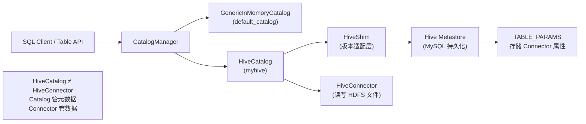

# HiveCatalog 集成与元数据持久化

> 验证版本：Flink 1.9–1.20（集成演进文章）

## 来源
- [Apache Flink 与 Apache Hive 的集成](../文章/done-Apache Flink 与 Apache Hive 的集成.md)（Flink 1.9/1.10 架构设计，阿里 Flink Forward）
- [从零开始学Flink：Flink SQL 元数据持久化实战](../文章/done-从零开始学Flink：Flink SQL 元数据持久化实战.md)（Flink 1.20 实战教程）
- [Flink SQL篇，SQL实操、Flink Hive、CEP、CDC、GateWay](../文章/done-Flink SQL篇，SQL实操、Flink Hive、CEP、CDC、GateWay.md)（面试题汇总，补充 HiveCatalog 结构）

## 核心问题
Flink SQL 默认把表元数据存在内存里（Session 结束即失），生产环境如何实现 DDL 持久化、跨 Session 共享？HiveCatalog 与 HiveConnector 是什么关系，又与 JdbcCatalog 有何本质区别？

## 判断准则

### Catalog 类型对比

| Catalog 类型 | 存储后端 | 元数据生命周期 | 适用场景 |
|---|---|---|---|
| GenericInMemoryCatalog | JVM 内存 | Session 结束销毁 | 本地调试、临时查询 |
| HiveCatalog | Hive Metastore (HMS) | 持久化，重启后仍存在 | 生产实时数仓、跨 Session 共享 |
| JdbcCatalog | 物理关系型数据库 | 只能映射已有物理表 | 读写 MySQL/PG 等已有表结构 |

### HiveCatalog 核心特性
- 存储后端复用 HMS，通过 HiveShim 处理 Hive 大版本不兼容
- **不只存 Hive 表**：任何 Connector（Kafka、JDBC、HBase）的 DDL 都可以存入，因为 HMS 的 `TABLE_PARAMS` 键值对结构天然支持任意扩展属性
- 与 HiveShim 层对应，支持 Hive 1.0.0 ~ 3.1.x 版本

### 为什么 JdbcCatalog 不能存 Kafka 表元数据
- JdbcCatalog 要求远程 DB 里有真实物理表，且无法存储 `topic`、`bootstrap.servers` 等非标准属性
- HiveCatalog 的 `TABLE_PARAMS` 是键值对，序列化任意属性均可

### 注册与使用（Flink SQL Client）
```sql
-- 注册 HiveCatalog
CREATE CATALOG myhive WITH (
  'type'            = 'hive',
  'default-database'= 'default',
  'hive-conf-dir'   = '/path/to/client-hive-site.xml'
);

-- 切换到 HiveCatalog（必须执行，否则仍写内存 Catalog）
USE CATALOG myhive;

-- 此后 CREATE TABLE 会持久化到 HMS
CREATE TABLE kafka_orders (...) WITH ('connector' = 'kafka', ...);
```

### 依赖配置要点
- 需要 `flink-sql-connector-hive-<hive-version>_<scala-version>-<flink-version>.jar`
- 即使不读写 HDFS，也需要 Hadoop 基础库（`hadoop-client-api` + `hadoop-client-runtime`）
- 客户端 `hive-site.xml` 与 Metastore 服务端配置分开：客户端需指定 `thrift://localhost:9083`，不能直接复用服务端配置（服务端通常监听 `0.0.0.0`）

### Hive 方言（Hive Dialect）
- Flink 1.11 引入 `HiveModule`，可在 Flink SQL 中调用 Hive 内置函数（~200+ 个）
- `HiveModule` 加载顺序决定同名函数优先级：先加载的 Module 优先

### 版本演进关键节点

| 版本 | 里程碑 |
|---|---|
| 1.9 | HiveCatalog 首发（试用），仅支持读分区表，不支持写分区表，不支持 INSERT OVERWRITE |
| 1.10 | 读写静态/动态分区、INSERT OVERWRITE、更多 DDL、调用 Hive 内置函数 |
| 1.11 | 实时写 Hive（StreamingFileSink + 分区提交），HiveModule，真正实现流批一体 |
| 1.20 | 与 HMS 的集成已成熟，建议使用官方 Shaded Connector |

## 认知偏差
| 常见错误认知 | 正确理解 |
|---|---|
| HiveCatalog = 只能读写 Hive 表 | HiveCatalog 是元数据存储机制；任意 Connector（Kafka/JDBC 等）的表元数据都可以存入 |
| HiveConnector = HiveCatalog | HiveCatalog 负责元数据，HiveConnector 负责读写 Hive HDFS 数据，两者独立，可分别使用 |
| USE CATALOG 可以省略 | 不切换 Catalog 则 DDL 仍写入内存 Catalog，持久化无效 |
| 集成 Hive 只需要 Hive Connector jar | 还需要 Hadoop 基础库；版本兼容性矩阵必须对齐 |
| Flink 1.9 就可以写 Hive 分区表 | 1.9 只支持读分区表；写分区表从 1.10 起支持 |

## 架构/流程图



## 待验证缺口
- Docker 环境下 Hive Metastore 重建容器时 Schema 初始化与已有数据冲突的完整处理流程
- `flink-sql-connector-hive` Shaded 包与手动引入 `flink-connector-hive` + Hadoop 依赖的冲突矩阵
- Hive 3.x Metastore 在 Flink 1.20 下的实测兼容性
- HiveCatalog 在 Kubernetes 集群下配置 `hive-conf-dir` 的最佳实践
