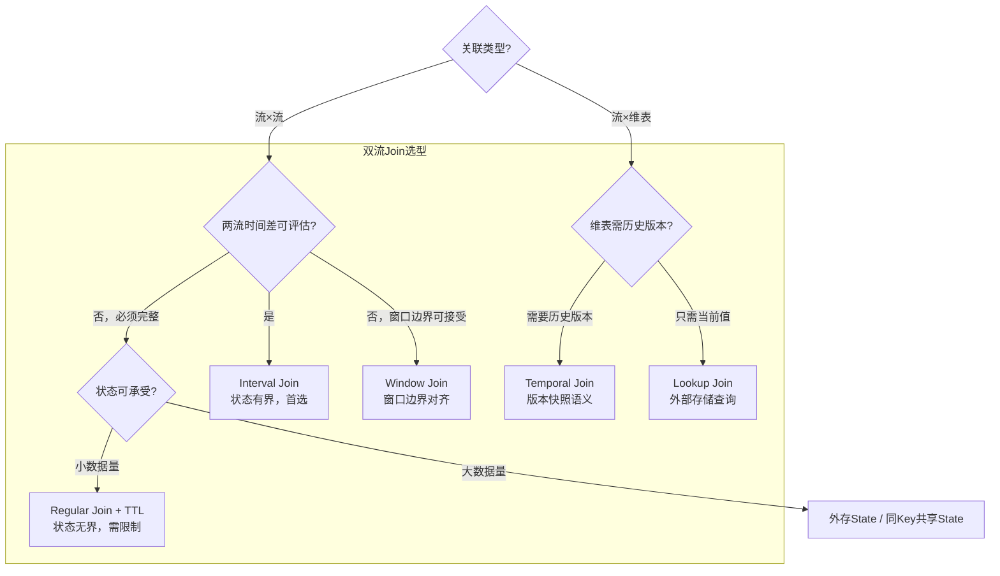

# Join 技术全景（Regular / Interval / Temporal / Lookup / Window Join）

## 来源
- [Flink技术实践-FlinkSQL Join技术全解](../文章/done-Flink技术实践-FlinkSQL Join技术全解.md)
- [Flink 对线面试官（五）：2w 字详述双流 Join 3 种解决方案 + 2 种优化方案](../文章/done-Flink 对线面试官（五）：2w 字详述双流 Join 3 种解决方案 + 2 种优化方案.md)
- [从原理到实战：Flink Regular Join 如何玩转海量数据流？](../文章/done-从原理到实战：Flink Regular Join 如何玩转海量数据流？.md)
- [基于Flink Interval Join实现游戏对战实时判定系统](../文章/done-基于Flink Interval Join实现游戏对战实时判定系统.md)
- [5种常见的Flink维表Join方案](../文章/done-5种常见的Flink维表Join方案.md)

## 核心问题
流处理 Join 不是批处理 Join 的简单移植。无界流的数据无法全量预知，核心问题是：**何时输出结果、状态保留多久、维度版本如何对齐**。不同 Join 类型对这三个问题给出了不同的权衡答案。

## 判断准则

### 五种 Join 的关键特征对比

| 类型 | 关联对象 | 状态 | 时间依赖 | 结果语义 | 推荐场景 |
|---|---|---|---|---|---|
| Regular Join | 流 × 流 | 无界（必须配 TTL） | 无 | 最终一致 + 回撤 | 小数据量/完整性优先/配置表关联 |
| Interval Join | 流 × 流 | 有界（自动清理） | 强依赖时间区间 | 窗口内一致 | 行为流关联（曝光-点击/订单-支付） |
| Window Join | 流 × 流 | 有界（窗口关闭释放） | 强依赖窗口边界 | 窗口内一致 | 窗口内关联率高且可容忍边界丢失 |
| Temporal Join | 流 × 版本维表 | 可控（维版本历史） | 强依赖事件时间 | 版本一致 | 汇率/价格/历史维度回溯 |
| Lookup Join | 流 × 外部维表 | 近乎无状态 | 可选（处理时间） | 外部系统一致 | 实时维度补充（Redis/MySQL/HBase） |

### 选型决策路径

```
问题：这是流×流，还是流×维表？
├─ 流×维表
│   ├─ 维表需要历史版本一致性（下单时的商品价格）？→ Temporal Join（事件时间）
│   └─ 维表是外部存储（Redis/MySQL）且接受当前值？→ Lookup Join
└─ 流×流
    ├─ 能确定两流数据的时间偏差范围？→ Interval Join（首选）
    ├─ 窗口内关联率高且可容忍边界误差？→ Window Join
    └─ 必须保障数据完整性且流量可控？→ Regular Join + TTL
```

### Regular Join 的回撤行为（生产必知）

Regular Join 基于 Retract 机制，输出消息序列如下：

- **Inner Join**：两端都到达才输出 `+[L, R]`
- **Left Join**：左流先到输出 `+[L, null]` → 右流到达后输出 `-[L, null]` + `+[L, R]`
- **Full Join**：任意一端到达都输出，对端到来时回撤之前的半结果再输出匹配结果

**重要边界**：下游 Sink 必须支持回撤（upsert/retract）；多层 Regular Join 会指数级放大回撤消息量。

### Interval Join 的时间区间设计方法

区间大小不是拍脑袋定的，推荐用离线数据验证：

```
用离线历史数据计算两流时间戳之差的分布：
- 差值在 Δt 以内的占 99%？→ 将区间设为 Δt
- 超过区间的数据量 × 业务容忍率 = 可接受的误差率
```

例：曝光-点击延迟在 4 分钟以内的占 99.5%，则 `BETWEEN -4 MINUTES AND 4 MINUTES` 可保障 0.5% 误差率。

### Window Join vs Interval Join 的本质区别

- **Window Join**：两流共用同一个时间窗口（如同一个 5 分钟 Tumble 窗口），边界对齐；窗口边缘的数据（0:59 曝光 + 1:01 点击）会丢失关联。
- **Interval Join**：以一条流的每条数据为基准，关联另一条流前后 N 分钟的数据；没有固定边界，时间更灵活。

生产环境中 Window Join 较少使用，Interval Join 更常见。

### 大状态双流 Join 的两种降级优化

当 Regular Join 状态过大时，两种降级路径：

1. **同 Key 共享 State（DataStream API）**：用 `connect` + `KeyedCoProcessFunction` 将两流数据存入同一 MapState，同 key 数据只存一份，并可自定义清理逻辑（比如曝光被关联后即删除）。
2. **外存 State（Redis）**：完全绕开 Flink State，将数据写入 Redis HashMap，Flink 作业轻量化；适合 State 不可清理（金融审计）或两流时间差极大（跨天）的场景。

也可组合使用：**Interval Join + Redis 兜底**，区间内由 Flink 关联，区间外的数据由 Redis 提供。

## 认知偏差

| 常见错误认知 | 正确理解 |
|---|---|
| Regular Join 比 Interval Join 数据质量更好 | Regular Join 数据完整性高，但状态无限增长；Interval Join 有时间边界，超范围数据会丢，是主动的取舍而非缺陷 |
| Lookup Join 有状态 | Lookup Join 本质是每条流数据到来时查询外部存储，Flink 端几乎无状态（可选本地缓存，但不是 Flink managed state） |
| Temporal Join 和 Lookup Join 语法一样（FOR SYSTEM_TIME AS OF） | 语法相似但语义不同：Temporal Join 关联的是历史版本快照（需要版本表），Lookup Join 关联的是当前或处理时间的最新值 |
| Window Join 的 outer 语义用 .join() 实现 | `.join()` 只支持 inner join；outer 语义需用 `coGroup` 算子自定义，或在 SQL 层用 Window TVF 语法（Flink 1.14+）|
| 流式 Join 一定不如批处理准确 | Regular Join 对已接收数据范围内是完全准确的，批处理的"全集"也因数据漂移存在误差 |

## 架构/流程图



## 待验证缺口
- Regular Join 在 Flink SQL 中 `table.exec.state.ttl` 设置过短导致关联丢失时，是否有监控指标可以感知？
- Temporal Join 的"版本表"（Versioned Table）具体需要什么格式的 CDC 数据？和普通 Kafka Source 有何区别？
- Window TVF 语法下的 Full Join 在生产中的性能表现是否有实测数据？
- 同 Key 共享 State 方案在 Flink SQL 中是否有等价实现，还是只能在 DataStream API？
