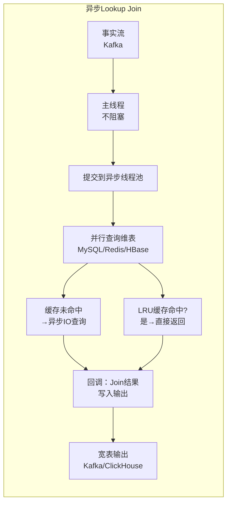

# Lookup Join 维表关联实践（异步/预加载/广播/TPS 对比）

> 验证版本：Flink 1.13+（AsyncDataStream 特性稳定）

## 来源
- [5种常见的Flink维表Join方案](../文章/done-5种常见的Flink维表Join方案.md)
- [大数据flink面试系列-异步 Lookup Join 生成实时宽表：设计思路 + Flink API 全量实现](../文章/done-大数据flink面试系列-异步 Lookup Join 生成实时宽表：设计思路 + Flink API 全量实现.md)
- [flink lookup join tps 测试 hbase mysql starrocks](../文章/done-flink lookup join tps 测试 hbase mysql starrocks.md)
- [Flink技术实践-FlinkSQL Join技术全解](../文章/done-Flink技术实践-FlinkSQL Join技术全解.md)

## 核心问题
维表关联有五种方案，每种在数据量、更新延迟、吞吐、实现复杂度上的取舍不同。错误选型导致的问题：维表过大放内存 OOM；同步查询阻塞主线程拖垮吞吐；广播占用每个并发内存导致资源浪费。

## 判断准则

### 五种维表方案对比

| 方案 | 维表大小 | 更新及时性 | 实现难度 | 吞吐能力 | 适用场景 |
|---|---|---|---|---|---|
| 热存储同步查询 | 不限 | 高（实时读） | 低 | 低（主线程阻塞） | 极低 QPS 场景或 POC |
| 热存储异步查询 | 不限 | 高（实时读） | 中 | 高（异步并行） | 大表高吞吐宽表构建 |
| 预加载维表（open() 加载内存） | 小 | 低（启动一次，定时刷新有延迟） | 低 | 最高（纯内存） | 小型、低频更新的配置表 |
| 广播维表（Broadcast State） | 小 | 高（流式更新即时生效） | 中 | 高 | 小型、变更需要实时广播的规则表 |
| Temporal Table / Lookup Join（SQL） | 不限 | 中（依赖维表更新延迟） | 低（SQL 原生） | 中（IO 决定） | Flink SQL 场景首选 |

### 异步 Lookup Join 的关键设计原则

异步查询相比同步查询吞吐提升 5~10 倍，核心机制：

```
主线程  → 提交查询请求到异步线程池 → 继续处理下一条数据（不阻塞）
异步线程 → 并行查询维表（MySQL/Redis/HBase）
回调函数 → 维表结果返回后与事实数据 Join → 输出宽表
```

**DataStream API 关键参数**：

| 参数 | 推荐值 | 说明 |
|---|---|---|
| 异步线程池大小 | 32~200 | 按 QPS 调整 |
| 异步查询超时时间 | 1~3 秒 | 略大于维表 RT |
| 每函数最大并发请求数 | 100~500 | 控制单函数并发 |
| LRU 缓存容量/TTL | 10 万行/60 秒 | 按更新频率调整 |
| MySQL 连接池大小 | 20~50 | 避免连接耗尽 |

**输出模式选择**：
- `UNORDERED`：吞吐更高，适合无顺序依赖的宽表输出
- `ORDERED`：保留事件顺序，吞吐略低

### TPS 实测数据（99 万维表，3 台 64G 16 核）

| 维表存储 | 并行度 | 缓存配置 | TPS |
|---|---|---|---|
| HBase | 1 | 10 万行/10 分钟 TTL + 异步 | ~2.5 万/秒 |
| HBase | 3 | 同上 | ~6 万/秒 |
| MySQL | 1 | 10 万行/10 分钟 TTL | ~3600/秒 |
| MySQL | 3+ | 同上 | 无明显提升（已达 MySQL 瓶颈） |
| StarRocks | 1 | - | ~200/秒（不适合做 Lookup 维表） |

**结论**：
- HBase 适合大表、高吞吐的维表查询；3 并行度可达 6 万 TPS
- MySQL 一个并行度即达性能瓶颈（~3600 TPS），增加并行度无效
- StarRocks 不适合作为 Lookup 维表（OLAP 引擎，并发查询能力弱）
- Redis（无测试数据）：高性能 KV 场景首选，实际 TPS 预期高于 HBase

### Lookup Join SQL 写法要点

```sql
-- FOR SYSTEM_TIME AS OF 是 Lookup Join 的标志语法
-- process_time 必须是处理时间属性（proctime()）
SELECT a.*, b.sex, b.age
FROM user_log a
LEFT JOIN user_dim FOR SYSTEM_TIME AS OF a.process_time AS b
  ON a.user_id = b.user_id;
```

**开启异步查询（Flink SQL DDL 配置）**：
```sql
CREATE TABLE hbase_dim (
  user_id STRING,
  f ROW<sex STRING, age INT>
) WITH (
  'connector' = 'hbase-2.2',
  'lookup.cache.max-rows' = '100000',
  'lookup.cache.ttl' = '10 minute',
  'lookup.async' = 'true'  -- 关键：开启异步
);
```

### 广播维表的边界条件

广播维表（Broadcast State）的核心价值是维表变更可以实时生效，但有资源成本：

- **内存成本**：广播 = 每个并发全量复制一份。并发 100、维表 100MB → 占用 10GB 内存
- **适用上限**：维表通常不超过几十 MB；维表变更需要实时下发到所有并发
- **实现方式**：`DataStream.broadcast(stateDescriptor)` + `BroadcastProcessFunction`
- **多广播流问题**：`connect` 算子只能连接两条流；需要广播多条流时，用面向对象思路将多条广播流实体向上转型为父类，connect 后再向下转型处理

### 维表选型决策

```
问题：维表大小和更新频率？
├─ 维表很小（几 MB）且更新频率低 → 预加载到内存（open() 方法）
├─ 维表很小且需要实时更新 → 广播维表（Broadcast State）
├─ 维表较大，高频查询，Key-Value 结构 → Redis（异步 Lettuce 客户端）
├─ 维表很大，行式存储，需要复杂查询 → HBase（异步，并行度 3+ 可达 6W TPS）
└─ 维表需要 SQL 原生支持 → Flink SQL Lookup Join + lookup.async=true
   ├─ 关联当前最新值 → 处理时间 Lookup Join
   └─ 关联历史版本（如下单时的价格）→ 事件时间 Temporal Join（需版本表）
```

## 认知偏差

| 常见错误认知 | 正确理解 |
|---|---|
| Lookup Join 是 Flink SQL 特有，DataStream 没有等价实现 | DataStream 的 `AsyncDataStream.unorderedWait()` + 自定义 `RichAsyncFunction` 是更灵活的等价方案，生产中更常用 |
| 广播维表可以处理任意大小的维表 | 广播会在每个并发复制全量数据，维表越大、并发越高，内存消耗越大；只适合小维表 |
| MySQL 维表加了缓存就能支撑高 TPS | MySQL 在约 3600 TPS 时单并发达到瓶颈；增加 Flink 并行度不能线性提升 MySQL 吞吐 |
| StarRocks 可以替代 HBase 做维表 | StarRocks 是 OLAP 引擎，并发点查能力弱（~200 TPS），不适合高频 Lookup 场景 |
| 同步查询与异步查询只是代码写法不同 | 同步查询阻塞主线程，吞吐严重受限于维表 RT；异步查询通过非阻塞并行，吞吐提升 5~10 倍 |
| 缓存 TTL 越长越好（减少查询次数） | TTL 过长会导致维表更新后旧数据仍被使用（脏数据）；需要根据维表更新频率和业务容忍度权衡 |

## 架构/流程图



## 待验证缺口
- Redis 作为 Lookup 维表的实测 TPS（Lettuce 异步客户端），与 HBase 的对比数据
- `lookup.async=true` 在 Flink SQL 中是否所有 Connector 都支持（HBase/MySQL/Redis Connector 各自的支持情况）
- 广播维表在 Checkpoint 恢复后，广播状态的重建方式和耗时
- 多维表串行异步 Join（3 个 AsyncDataStream 串联）的端到端延迟影响有多大

## 重新蒸馏补充（2026-06-18）

| 来源 | 认知增量 | 处理 |
|---|---|---|
| [[03_数据工程与数仓/0303_实时计算/030301_Flink/文章/done-Redis篇-（Flink+Redis&Redis）典型应用场景集合（一）]] | 补充该主题的生产案例、机制边界或排重样例。 | 重新判断后补入目标知识产物 |
