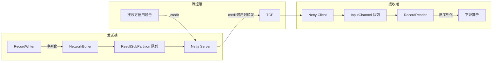

# Network Stack 网络堆栈

## 来源
- [全网最全Flink网络堆栈探索](../文章/done-全网最全Flink网络堆栈探索.md)

## 核心问题
Flink 任务间数据如何高效传输？反压是如何产生的，基于信用的流控如何解决 TCP 多路复用导致的 head-of-line blocking？

## 判断准则

### 逻辑视图三要素

| 要素 | 选项 |
|---|---|
| 输出类型（ResultPartitionType） | Pipelined（流式，有界/无界）/ Blocking（完整结果才下发）|
| 调度类型 | Eager（全部同时）/ Next-stage-on-first-output（有首个输出即启动下游）/ Next-stage-on-complete（全部完成才启动下游）|
| 传输类型 | 高吞吐（缓冲区满后发送）/ 低延迟（缓冲区超时触发发送）|

**约束**：输出类型和调度类型紧密绑定，只有特定组合有效。

### 物理传输与 TCP 复用

- 不同 TM 之间每个（远程）网络连接获得独立 TCP 通道
- **同一 TM 上不同子任务到同一目标 TM 的连接复用单个 TCP 通道**
- 每个子任务的结果称为 `ResultPartition`，按逻辑通道分为 `ResultSubpartition`

缓冲区上限公式：
```
channels * buffers-per-channel + floating-buffers-per-gate
```

### 没有流控时的反压传播（问题）

发送端缓冲池耗尽 → 生产者阻塞。接收端无空闲缓冲区 → 停止从 TCP 通道读取 → **阻塞该 TCP 通道上所有逻辑连接**（包括未反压的其他通道）。这是 head-of-line blocking 问题。

### Credit-Based 流量控制（Flink 1.5+）

**核心思想**：接收方提前声明可用缓冲数（信用），发送方只在有信用时发送。

**两类缓冲区**：
- **独占缓冲区（Exclusive Buffers）**：每个远程输入通道专属
- **浮动缓冲区（Floating Buffers）**：本地缓冲池共享，可供任意输入通道使用

**流程**：
1. 接收方宣告可用信用（`credit`，1 缓冲区 = 1 信用）
2. 发送方只在 credit > 0 时将缓冲区转发到 Netty 层，每发一个 credit -1
3. 发送方同时发送 **backlog 大小**（当前子分区队列中等待的缓冲数）
4. 接收方根据 backlog 申请浮动缓冲区加速处理

**解决 head-of-line blocking**：反压仅作用于单个逻辑通道，不阻塞 TCP 通道上其他逻辑通道。

**对 Checkpoint 的改善**：流控后"线上"数据量可控，Checkpoint Barrier 不需要等大量已入 Netty 缓冲的数据处理完。

### 缓冲区刷新到 Netty 的三种触发

1. **缓冲区写满**：RecordWriter 序列化记录填满缓冲区，通知 Netty 消费
2. **缓冲区超时**：`OutputFlusher` 定期刷新（由 `setBufferTimeout` 控制，默认 100ms），是低延迟的上限保障
3. **特殊事件**：Checkpoint Barrier、分区结束事件，立即触发刷新

**注意**：OutputFlusher 的通知 Netty 不是强保证，有背压时不生效。

### 延迟 vs 吞吐权衡

Flink 1.5+ 改进后，即使 `bufferTimeout=1ms`（低延迟配置）也能达到默认超时（100ms）最大吞吐的约 75%。

| bufferTimeout | 延迟 | 吞吐 |
|---|---|---|
| 0（每条记录刷新）| 最低 | 最低 |
| 1ms | 低 | 约75%最大吞吐 |
| 100ms（默认）| 最高 | 最高 |

### 网络层内存配置

- `buffers-per-channel`：独占缓冲区数（信用分配单位）
- `floating-buffers-per-gate`：浮动缓冲区数
- Buffer 大小：默认 32KiB（`taskmanager.memory.segment-size`）

## 认知偏差

| 常见错误认知 | 正确理解 |
|---|---|
| TM 间每对子任务都有独立 TCP 连接 | 同一 TM 到另一 TM 的所有连接复用一个 TCP 通道，通过逻辑通道多路复用 |
| 增大缓冲区超时一定能提升吞吐 | 1.5+ 后 1ms 超时已能达到 75% 最大吞吐，过大的超时仅在高延迟场景才有明显收益 |
| 反压只影响当前慢的算子 | 没有流控时，反压通过 TCP 通道传导会影响该通道上所有非反压的逻辑连接 |
| 信用流控增加了通信开销必然降低性能 | 通告消息有成本（尤其 SSL），但消除了 head-of-line blocking，总体利用率提升 |
| Checkpoint Barrier 需要等所有缓冲数据处理完 | 信用流控减少"线上"数据量，Barrier 可以更快推进 |

## 架构/流程图



## 待验证缺口
- Flink 1.17+ 是否有进一步的网络层优化（如 FLIP-216 等）
- 实际测试中 `buffers-per-channel` 调大对低并发高吞吐场景的具体收益
