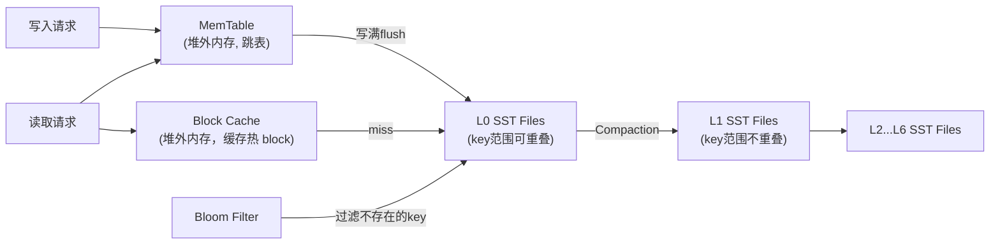
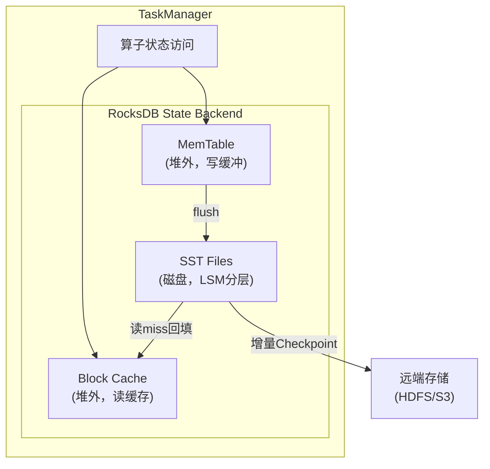

# RocksDB 深度调优

## 来源
- [Flink RocksDB 状态后端深度调优](../文章/done-Flink%20RocksDB%20状态后端深度调优.md)
- [精准调优！Flink内存模型详解与RocksDB调优指南](../文章/done-精准调优！Flink内存模型详解与RocksDB调优指南.md)
- [实时数仓的状态管理RocksDB：几百GB的状态到底怎么存？](../文章/done-实时数仓的状态管理RocksDB：几百GB的状态到底怎么存？.md)
- [腾讯面试：Flink100G大状态如何优化？有哪些参数可以调整？](../文章/done-腾讯面试：Flink100G大状态如何优化？有哪些参数可以调整？.md)
- [Flink 实践 _ 字节跳动使用 Flink State 的经验分享](../文章/done-Flink%20实践%20_%20字节跳动使用%20Flink%20State%20的经验分享.md)

## 核心问题
RocksDB 默认配置面对 10GB+ 状态时为何出现吞吐骤降、Checkpoint 超时、OOM 等问题？应按什么优先级调整哪些参数？

## RocksDB 在 Flink 中的数据结构

| 结构 | 位置 | 作用 | 调优方向 |
|---|---|---|---|
| MemTable（WriteBuffer） | JVM 堆外内存 | 接收写入，达到阈值 flush 到磁盘 | 增大减少 flush 频率 |
| Block Cache | JVM 堆外内存 | 缓存 SST 块，加速读取 | 增大提升读命中率（目标>70%） |
| SST Files | 磁盘 | 持久化数据，LSM 分层压缩 | 配置压缩算法和层级 |
| Bloom Filter | 内存 | 快速判断 key 是否在某 SST 文件 | 默认关闭，需手动开启 |



## LSM Tree 核心 Trade-off

**写放大**：一条数据经 Compaction 被反复读取和写回，实际磁盘写入量 ÷ 应用写入量可达几十倍。

**读放大**：同一 key 的多个版本散落在不同层级 SST 文件，最坏情况要逐层扫描。

**三个加速器降低读放大**：
1. Bloom Filter：过滤掉90%+不含目标 key 的 SST 文件
2. Block Cache：热点数据块驻留内存，避免磁盘IO
3. 索引与布隆过滤器缓存：常驻内存，避免每次读磁盘

## 判断准则

### 调优优先级（从高到低）

1. **开启增量 Checkpoint**（状态 > 10GB 必须）
2. **开启托管内存统一管理**（`memory.managed=true`），防 OOM
3. **增大 Block Cache** 到 1-2GB+（目标命中率 > 70%）
4. **增大 MemTable** 到 256MB+，减少 flush 频率
5. **开启 Bloom Filter**，减少无效磁盘读
6. **多磁盘分散 IO**（`localdir` 配置多路径）
7. **分层压缩**（L0/L1 用 LZ4，底层用 ZSTD）
8. **配置状态 TTL**，定期清理过期数据

### 关键配置参数速查

```yaml
# flink-conf.yaml

# 1. 托管内存（优先开启）
state.backend.rocksdb.memory.managed: true
taskmanager.memory.managed.size: 4g          # 按状态规模调整

# 2. Block Cache（读多写少场景配置60-70%托管内存）
state.backend.rocksdb.block.cache-size: 2048m

# 3. MemTable
state.backend.rocksdb.write-buffer-size: 256m     # 单个 MemTable 大小（默认64MB）
state.backend.rocksdb.max-write-buffer-number: 3  # MemTable 数量（默认2）

# 4. 多磁盘 IO 分散
state.backend.rocksdb.localdir: /data/disk1/flink,/data/disk2/flink,/data/disk3/flink

# 5. 写缓冲比例（当 memory.managed=true 时）
state.backend.rocksdb.memory.write-buffer-ratio: 0.4  # 40% 给 MemTable，60% 给 Block Cache
```

### RocksDB 自定义选项（通过 RocksDBOptionsFactory）

```java
public class OptimizedRocksDBOptionsFactory implements ConfigurableRocksDBOptionsFactory {

    @Override
    public DBOptions createDBOptions(DBOptions currentOptions,
                                     Collection<AutoCloseable> handlesToClose) {
        return currentOptions
            .setMaxBackgroundJobs(8)         // 后台 Compaction 线程数（默认2，增加可降低积压）
            .setMaxSubcompactions(4)         // 单次 Compaction 子任务数
            .setAvoidFlushDuringRecovery(true);  // 恢复时跳过 flush（加速恢复）
    }

    @Override
    public ColumnFamilyOptions createColumnOptions(ColumnFamilyOptions currentOptions,
                                                    Collection<AutoCloseable> handlesToClose) {
        BloomFilter bloomFilter = new BloomFilter(10, false);
        handlesToClose.add(bloomFilter);

        return currentOptions
            .setCompactionStyle(CompactionStyle.LEVEL)     // Level 压缩（读密集推荐）
            .setLevel0FileNumCompactionTrigger(4)          // L0 文件数触发 Compaction 阈值
            .setLevel0SlowdownWritesTrigger(20)            // 触发写入减速
            .setLevel0StopWritesTrigger(36)                // 触发写入停止（严重警告）
            .setCompressionType(CompressionType.LZ4_COMPRESSION)        // L0/L1 LZ4
            .setBottommostCompressionType(CompressionType.ZSTD_COMPRESSION) // 底层 ZSTD
            .setBlockBasedTableConfig(
                new BlockBasedTableConfig()
                    .setBlockSize(32 * 1024)                // 32KB（默认4KB，提升顺序读）
                    .setCacheIndexAndFilterBlocks(true)     // 索引和过滤器进 Block Cache
                    .setPinL0FilterAndIndexBlocksInCache(true)  // L0 常驻 Cache
                    .setFilterPolicy(bloomFilter)
            );
    }
}
```

### 压缩策略选型

| 压缩算法 | CPU 开销 | 压缩率 | 场景推荐 |
|---|---|---|---|
| LZ4 | 低 | 中 | L0/L1（高频读写层）**推荐** |
| Snappy | 低 | 中 | 通用场景（RocksDB 默认） |
| ZSTD | 中 | 高 | 底层 L2+（冷数据）**推荐** |
| NO_COMPRESSION | 无 | 无 | CPU 敏感、大 state 稀疏场景（用磁盘换 CPU） |

**字节跳动实践**：大状态稀疏场景（双流 Join、模型拼接）关闭底层 Compaction 压缩 + 在接口层用 Zstd 压缩。CPU 均值降低约 15%，峰值降低约 25%，磁盘占用不变。适用条件：key 数量大且分布稀疏、缓存命中率低、TTL 短。

## Compaction 问题诊断

**症状识别：**
- 日志出现 `"Compaction too slow"` / `"L0 file limit"` / `"Write Stall"`
- `rocksdb.compaction.pending` > 10
- `rocksdb.is.write.stopped` > 0（严重警告，写入停止）
- 吞吐突然下降 50%+

**解法：**
- 增大 `setMaxBackgroundJobs`（从2增到8）
- 调整 L0 触发阈值（`Level0FileNumCompactionTrigger`）
- 检查磁盘 IO 是否成瓶颈（考虑多磁盘）

**字节跳动经验**：当单个算子 RocksDB 实例大小超过 15GB 时，Compaction 会明显更频繁，容易出现 Write Stall。需提前关注。

## 序列化开销陷阱

RocksDB State 的 Key 和 Value 都需要序列化/反序列化。复杂对象（如 RoaringBitmap）MB 级别对象序列化可达秒级，严重影响性能。

**优化手段：**
- 精简 State 中存储的数据结构，去除不必要字段
- 通过 `StateDescriptor` 自定义 Serializer
- 在 KryoSerializer 中显式注册 PB/Thrift Serializer
- 避免重复 State 操作（`mapState.contains` + `mapState.get` 会产生两次序列化）

## 关键监控指标

```
# 命中率（目标 > 70%）
flink_taskmanager_job_task_operator_KVStateHitsCounter
flink_taskmanager_job_task_operator_KVStateMissCounter
rocksdb.block.cache.hit.rate   # 目标 > 0.85

# Compaction 状态
rocksdb.compaction.pending         # 待 Compaction 文件数（> 10 需关注）
rocksdb.is.write.stopped           # 写入停止（严重警告）
rocksdb.actual.delayed.write.rate  # 写入减速（> 0 说明 Compaction 落后）

# Checkpoint
Checkpoint_Duration                # 完成时间（应小于间隔）
```

## 认知偏差

| 常见错误认知 | 正确理解 |
|---|---|
| Block Cache 和 MemTable 越大越好 | 超出托管内存会 OOM；需配合 `memory.managed=true` 让 Flink 统一管理 |
| 压缩可以随意关闭 | 关闭底层压缩后磁盘 IO 会大幅增加；应根据 CPU vs IO 瓶颈判断 |
| Bloom Filter 默认已开启 | RocksDB 默认**不**开启 Bloom Filter，需手动配置 |
| Compaction 线程越多越好 | 建议设置为 CPU 核心数的 50%，避免和业务线程竞争 |
| 增量 Checkpoint 恢复更快 | 扩缩容场景下，增量 CP 恢复涉及多组 RocksDB 合并 + 大量 Compaction，写放大严重；此时从 Savepoint（全量）恢复反而更快 |

## 架构/流程图


基于原文描述重建

## 待验证缺口
- 字节跳动的"接口层 Zstd 压缩 + 关闭底层压缩"方案，在 ListState 上不支持，实际工程中如何处理 ListState 场景？
- `setMaxBackgroundJobs` 增加后对 Checkpoint 期间 CPU 尖峰的影响？
- 在 Flink 1.18+ `memory.managed=true` 模式下，手动设置 `block.cache-size` 和 `write-buffer-size` 是否仍然生效还是会被托管内存覆盖？
