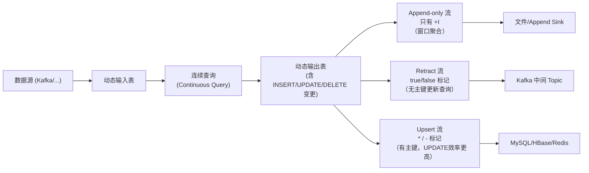

# SQL Changelog 与回撤流（Retract Stream）机制

## 来源
- [1w+ 字深入解读 Flink SQL 实现流处理的核心技术！](../文章/done-1w+ 字深入解读 Flink SQL 实现流处理的核心技术！.md)
- [为什么你的Flink SQL结果总不对？回撤流（Retract Stream）机制全解析](../文章/done-为什么你的Flink SQL结果总不对？回撤流（Retract Stream）机制全解析.md)
- [Flink SQL 知其所以然（二十九）：Deduplication去重 & 获取最新状态操作](../文章/done-Flink SQL 知其所以然（二十九）：Deduplication去重 & 获取最新状态操作.md)

## 核心问题
Flink SQL 的聚合结果为什么会出现负数或错误值？下游 Kafka/Print Sink 里为什么有 `-U` / `false` 前缀的消息？Deduplication 用事件时间排序时为什么有回撤数据？

## 判断准则

### RowKind / Changelog 消息类型

| RowKind | 符号标记 | 含义 |
|---|---|---|
| INSERT | +I | 插入一条新记录 |
| UPDATE_BEFORE | -U | 更新前的旧值（回撤） |
| UPDATE_AFTER | +U | 更新后的新值 |
| DELETE | -D | 删除一条记录 |

### 三种流模式

| 模式 | 消息类型 | 前提条件 | 典型场景 |
|---|---|---|---|
| Append-only 流 | 只有 +I | 查询只有 INSERT | 窗口聚合、无更新的流处理 |
| Retract 流 | true/+ 和 false/- | 无主键要求 | 无主键 Join、多级聚合、Kafka 中间 Topic |
| Upsert 流 | * (upsert) 和 - (delete) | 必须有主键 | MySQL/HBase/Redis 等支持 UPSERT 的 Sink |

### 动态表变更 → 流编码规则

#### Retract 流编码
| 动态表变更 | Retract 流编码 |
|---|---|
| INSERT | 发送 `(true, newRow)` |
| DELETE | 发送 `(false, oldRow)` |
| UPDATE | 发送 `(false, oldRow)` + `(true, newRow)` |

注意：回撤消息（false）**必须在新增消息（true）之前**发送，否则结果错误。

#### Upsert 流编码
| 动态表变更 | Upsert 流编码 |
|---|---|
| INSERT | 发送 `*(newRow)`（upsert message） |
| UPDATE | 发送 `*(newRow)`（upsert message，一条即可） |
| DELETE | 发送 `-(key)`（delete message） |

**Upsert 流优势**：UPDATE 只发一条消息，而 Retract 发两条（-oldRow, +newRow），吞吐更高，但必须有主键。

### Retract 流与 Upsert 流对比示例

以 `SELECT pId, SUM(income) FROM source GROUP BY pId` 为例，5 行输入数据：

- Retract 流总共产生 **7 条消息**（含 2 次 -/+ 对）
- Upsert 流总共只有 **5 条消息**（更新直接覆盖）

**选型准则**：如果下游支持主键 UPSERT，优先选 Upsert 流（效率更高）；否则用 Retract 流。

### Deduplication 去重与回撤的关系

Deduplication 语法（ROW_NUMBER + WHERE rownum=1 + 时间属性排序）是专用去重优化算子，比 TopN 算子性能更好。

**是否会产生回撤流，取决于排序字段和方向：**

| 排序方式 | 是否有回撤 | 原因 |
|---|---|---|
| ORDER BY 事件时间 DESC | 有回撤 | 可能来更大的事件时间 |
| ORDER BY 事件时间 ASC | 有回撤 | 可能来更小的事件时间（乱序） |
| ORDER BY 处理时间 DESC | 有回撤 | 可能来更大的处理时间 |
| ORDER BY 处理时间 ASC | **无回撤** | 处理时间单调递增，不可能有更小的 |

**结论**：只有 `ORDER BY proctime ASC` 的 Deduplication 才能保证 Append-only 输出（无回撤）。计算 DAU 取每人第一条日志时应用此模式。

### Deduplication 运行机制

1. 事件时间语义：到来数据时间戳 > 状态中记录的时间戳 → 撤回旧结果，发送新结果；否则丢弃
2. 处理时间 ASC 语义：key 下第一条直接发往下游；后续直接丢弃（无需回撤）

### 典型场景选型

| 场景 | 推荐模式 |
|---|---|
| 非窗口聚合 → 再聚合 | Retract |
| 无主键的复杂 Join | Retract |
| Regular Join（双流 Join） | Retract |
| DISTINCT 聚合 | Retract |
| 写入 Kafka 中间 Topic | Retract（需消费方处理消息标记） |
| 写入 MySQL/HBase 等 | Upsert 优先 |
| 窗口聚合写 Sink | Append-only |

### 配置实践

```sql
-- 开启 Mini-Batch（高频更新场景必开，减少回撤消息量）
SET 'table.exec.mini-batch.enabled' = 'true';
SET 'table.exec.mini-batch.allow-latency' = '5s';
SET 'table.exec.mini-batch.size' = '5000';

-- 合理设置 State TTL（TTL 过小会导致回撤丢失，结果错误）
SET 'table.exec.state.ttl' = '3600000';  -- 1 小时
```

### Table API 获取回撤流（代码参考）

```java
// Flink 1.14+ 推荐方式
DataStream<Row> changelogStream = tEnv.toChangelogStream(result);
changelogStream.process(new ProcessFunction<Row, String>() {
    @Override
    public void processElement(Row row, Context ctx, Collector<String> out) {
        switch (row.getKind()) {
            case INSERT:        // +I
            case UPDATE_AFTER:  // +U
                out.collect("ACC: " + row);  break;
            case UPDATE_BEFORE: // -U
            case DELETE:        // -D
                out.collect("RET: " + row);  break;
        }
    }
});

// 旧版（1.13 及之前）
DataStream<Tuple2<Boolean, Row>> retractStream = tEnv.toRetractStream(result, Row.class);
// true = accumulate, false = retract
```

## 认知偏差

| 常见错误认知 | 正确理解 |
|---|---|
| Flink SQL 聚合结果只有 INSERT | 非窗口聚合产生更新查询，会有 -U/+U 消息 |
| Retract 流就是 Upsert 流 | Retract 无需主键，UPDATE 编码为两条消息；Upsert 需主键，UPDATE 一条消息 |
| 下游 Sink 只需处理 +I 消息 | Append-only Sink（如 CSV）放在回撤流下游会写入 retract 消息，导致结果错误 |
| Deduplication 一定没有回撤 | 只有 ORDER BY proctime ASC 才无回撤；其他排序方式都有 |
| TTL 设越短越省状态 | TTL 过短会导致回撤消息对应的旧状态已清理，无法正确撤回，结果错误 |
| 回撤流必须配合 UPSERT Sink | Kafka 等不支持 UPSERT 的 Sink 也能用，消费方需自行处理 true/false 标记 |

## 架构/流程图



## 待验证缺口
- Deduplication 在事件时间乱序到达时，撤回消息的具体时机（watermark 推进前后）
- Upsert 流下游消费 Kafka 时，如何正确消费 * 和 - 消息的编码格式
- Mini-Batch 对 Retract 消息量的实测减少幅度
