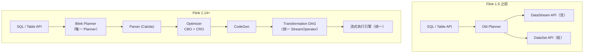

# SQL Planner 架构演变与执行计划生成

> 验证版本：Flink 1.9 ~ 1.14+

## 来源
- [Flink Table API & SQL Planner 演变](../文章/done-Flink Table API & SQL Planner 演变.md)
- [1w+ 字深入解读 Flink SQL 实现流处理的核心技术！](../文章/done-1w+ 字深入解读 Flink SQL 实现流处理的核心技术！.md)
- [Flink SQL语法 和 Flink Streaming API 函数的对应关系是怎么样的？](../文章/done-Flink SQL语法 和 Flink Streaming API 函数的对应关系是怎么样的？.md)

## 核心问题
Old Planner 和 Blink Planner 有什么区别？Flink SQL 是如何从 SQL 语句变成底层算子的？SQL 操作和 DataStream API 是什么对应关系？

## 判断准则

### Planner 演变时间线

| 版本 | 默认 Planner | 状态 |
|---|---|---|
| 1.9 | Old Planner（Flink Planner） | Blink Planner 未完全集成 |
| 1.10 | Blink Planner（SQL Client） | Table API 仍默认 Old |
| 1.11 | Blink Planner（全部） | Old Planner 仍在支持 |
| 1.13 | Blink Planner | Old Planner 标记 Deprecated |
| 1.14 | Blink Planner（唯一） | Old Planner 代码全部移除 |

**1.14+ 无需也不能再指定 Planner，只有 Blink（现称"默认 Planner"）。**

### Old Planner vs Blink Planner 核心差异

| 维度 | Old Planner | Blink Planner |
|---|---|---|
| 流批模型 | 独立两套（DataStream / DataSet） | 统一（Transformation API） |
| 优化策略 | 流批分离，优化逻辑基本不复用 | 流批共享大量代码，CBO+CRO 更全面 |
| 新功能 | 无 | 维表 JOIN、TopN、MiniBatch、流式去重、数据倾斜优化 |
| 批处理基础 | DataSet API | 有界 DataStream（bounded stream） |

### SQL → 执行计划的处理链路

```
SQL 文本
  ↓ Parser (Calcite)       解析为 AST
  ↓ Validator              语义校验
  ↓ Optimizer (CBO/CRO)    生成逻辑/物理执行计划
  ↓ CodeGen                生成算子代码
  ↓ Transformation DAG     Flink Runtime 识别的 DAG
  ↓ StreamGraph / JobGraph
  ↓ 集群调度执行
```

### SQL 语法与 DataStream API 对应关系

| Flink SQL 操作 | 对应的 DataStream API 实现 |
|---|---|
| `SELECT` 投影/计算 | `map` / `flatMap` |
| `WHERE` 过滤 | `filter` |
| `GROUP BY` + 窗口 | `keyBy` + `window` + `reduce`/`aggregate` |
| `GROUP BY`（无窗口持续聚合） | `keyBy` + `ProcessFunction` + `ValueState`/`MapState` |
| `JOIN`（Window Join） | `intervalJoin` |
| `JOIN`（Temporal Table Join） | `keyed ProcessFunction` + 版本化状态 或 Async I/O |
| `OVER` 窗口 | `keyBy` + `ProcessFunction` + 时间窗口状态管理 |
| `INSERT INTO` | `addSink` |
| `UNION ALL` | `union` |
| `DISTINCT` / Deduplication | `keyBy` + 状态去重 |

### 流处理与批处理的本质差异

- 批处理：输入有界，执行时能访问完整数据，输出静态结果
- 流处理：输入无界，每次计算得到中间结果，持续等待新数据
- Flink 的解决方案：**动态表（Dynamic Table）** + **连续查询（Continuous Query）**

### 动态表与连续查询

- 动态表：对实时流的表抽象，随时间不断变化
- 连续查询：对动态表的持续不停止的查询，每次数据更新都触发结果更新（视图实时更新技术 Eager View Maintenance）
- 底层：通过 changelog stream 维护动态表，将 INSERT/UPDATE/DELETE 编码为消息流

### 查询类型区分

| 查询类型 | 特征 | 例子 |
|---|---|---|
| 追加查询（Append Query） | 输出只有 INSERT，结果不更新 | 窗口聚合（窗口一旦关闭结果不变） |
| 更新查询（Update Query） | 输出有 INSERT + UPDATE，中间结果持续更新 | 无界 GROUP BY 累积聚合 |

## 认知偏差

| 常见错误认知 | 正确理解 |
|---|---|
| Blink Planner 是 Flink 原来的 Planner 改进版 | Blink Planner 来自阿里 Blink 分支，1.9 引入，1.14 成为唯一 Planner |
| Old Planner 和 Blink Planner 语义完全一致 | "两个查询处理器之间的语义和功能大部分是一致的，但并未完全对齐" |
| Flink SQL 不会有状态 | SQL 底层生成的算子大多是有状态的（聚合、Join 等），状态由 Planner 自动推导并插入 |
| 无窗口 GROUP BY 不能在流上使用 | 可以用，但输出是更新查询（有 retract），需要下游能处理 changelog |
| Flink SQL 与 DataStream API 是两套引擎 | Flink SQL 底层就是 DataStream，通过 Calcite + Planner + CodeGen 翻译 |
| DataSet API 是批处理推荐方式 | DataSet API 已废弃，1.14+ 批处理也用 DataStream（bounded stream）|

## 架构/流程图



## 待验证缺口
- Blink Planner 的 CBO 优化具体包含哪些规则，社区版和阿里云版差异多大
- `compilePlan` / `translatePlan` 的具体调用链（需要读源码）
- Flink 2.x 对 Planner 有无进一步架构调整
