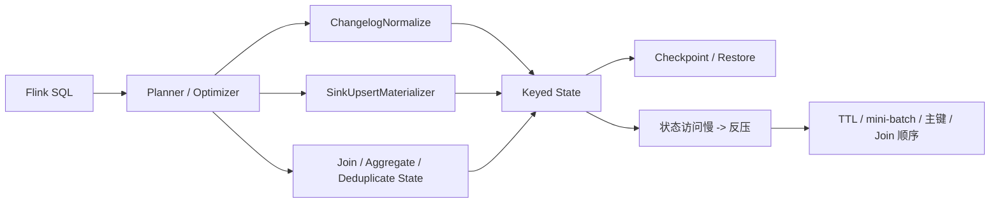

# Flink SQL 大状态作业调优

## 来源

- [Flink⼤状态作业调优实践指南：Flink SQL 作业篇](<../文章/done-Flink⼤状态作业调优实践指南：Flink SQL 作业篇.md>)

## 图片处理

| 图片 | 类型 | 是否保留 | 理由 | 处理方式 |
|---|---|---|---|---|
| ChangelogNormalize 状态更新图 | 机制图 | 原图缺失 | 说明 CDC 去重状态如何产生 | 标记缺失，Mermaid 重建 |
| SinkUpsertMaterializer 拓扑图 | 流程图 | 原图缺失 | 用于确认优化器是否插入状态算子 | 标记缺失 |

## 一句话结论

这篇文章值得精读：它把 Flink SQL 大状态问题从“参数调优”校准为“SQL 语义和优化器为什么生成状态算子，以及如何减少不必要状态”。

## 用户相关性判断

| 项 | 内容 |
|---|---|
| 用户当前认知层级 | Flink / Flink SQL L2-L3 draft |
| 认知成熟度 | draft |
| 阅读投入建议 | 精读 |
| 阅读投入理由 | 直接补 Flink SQL 状态产生机制和大状态调优方法，但依赖阿里云 VVR 版本特性，实践前需校准社区版本 |
| 对用户的新信息 | ChangelogNormalize、SinkUpsertMaterializer、LookupJoin 等状态算子可能由优化器自动插入，不是 SQL 表面语法能直接看出来 |
| 问题指纹 | Flink SQL + 状态算子 + ChangelogNormalize/SinkUpsertMaterializer/TTL/mini-batch/Join 顺序 + 大状态反压调优 |
| 排重判断 | 新建 |
| 置信度 | 高 |

## 认知校准点

| 校准点 | 文章观点/信息 | 与用户认知或价值观的关系 | 处理建议 |
|---|---|---|---|
| 大状态要先看执行计划 | 状态可能来自优化器自动插入的 Normalize/Materializer | 纠偏：不要先改资源参数 | 写入 Flink index |
| 状态算子有正确性职责 | ChangelogNormalize/SinkUpsertMaterializer 是为去重、顺序和 upsert 语义兜底 | 补充语义边界 | 不能盲目关闭 |
| TTL 不是越短越好 | 晚到数据或 Join 生命周期不匹配会导致结果错误 | 与 State TTL 文章互相校准 | 必须按业务生命周期设定 |
| 阿里云 VVR 特性要降权 | `JOIN_STATE_TTL`、智能分析等可能不是社区通用能力 | 防止把厂商能力当通用 Flink | 标记版本/发行版边界 |

## 冲突点

| 冲突类型 | 具体表现 | 影响 | 处理 |
|---|---|---|---|
| 图片缺失 | 多处提到“如下图/图示”，本地没有图 | 影响机制理解 | Mermaid 重建核心链路 |
| 版本/发行版边界 | 文章混合社区 Flink、阿里云 VVR-8.0.x 特性 | 实践迁移风险 | 写入待验证 |
| 证据不足 | 资源从 700CU 降到 200-300CU 依赖具体作业 | 不能泛化收益 | 只保留优化方向 |
| 实践判定偏宽 | 有 SQL 配置和案例，但缺完整执行计划、指标和环境 | 不能直接判实践 | 降为精读 |

## 待吸收点

| 分级 | 内容 | 为什么值得吸收 | 后续动作 |
|---|---|---|---|
| 理解 | Flink SQL 状态算子分为优化器推导和 SQL 操作产生两类 | 建立大状态排查入口 | 写入 Flink 纵向模块 |
| 理解 | ChangelogNormalize 和 SinkUpsertMaterializer 是 upsert/changelog 正确性保护 | 防止盲目删算子 | 与 CDC 关联 |
| 记住 | 大状态调优顺序：确认状态来源 -> 避免不必要状态 -> 降低访问频次 -> 控制生命周期 -> 优化执行计划 | 可复用排障准则 | 写入报告 |
| 记住 | TTL、mini-batch、主键设计、Join 顺序分别解决不同维度 | 防止把所有问题都归为资源不够 | 后续补实验 |
| 实践 | 选一个 Flink SQL 作业，保存执行计划、状态大小、checkpoint duration、backpressure 指标再改配置 | 可形成验证闭环 | 待实验 |

## 已知可跳过

| 内容 | 跳过理由 |
|---|---|
| Flink SQL 会隐藏底层复杂性 | 已知基础 |
| 厂商活动和产品宣传 | 不进入知识点 |
| 无环境的性能收益数字 | 只作为方向，不作为准则 |

## 实践门槛

| 门槛 | 判断 | 证据 |
|---|---|---|
| 可运行 | 部分 | 有 SQL 配置和 Hint 示例 |
| 可验证 | 部分 | 有状态大小和 CU 案例，但缺完整环境 |
| 可排障 | 部分 | 有诊断方向，但缺具体 Web UI/指标截图 |
| 可迁移 | 是 | 方法可迁移，参数需按版本确认 |
| 结论 | 降为精读 | 需要真实作业执行计划和指标才能实践 |

## 归类判断

| 项 | 内容 |
|---|---|
| 技术本体 | Flink SQL 是 Flink 的声明式流批计算入口 |
| 文章主问题 | Flink SQL 大状态如何产生、诊断和调优 |
| 使用场景 | CDC、Upsert Sink、Regular Join、聚合、去重、Lookup Join |
| 关键词干扰 | 阿里云实时计算、VVR、CU、活动 |
| 最终归类 | 数据工程与数仓 / 实时计算 / Flink |
| 归类理由 | 主问题是 Flink SQL 状态算子和大状态调优，不是云产品使用教程 |

## 纵向理解

| 维度 | 判断 |
|---|---|
| 全局架构 | SQL -> Planner/Optimizer -> 状态算子 -> State Backend -> Checkpoint -> 下游 Sink |
| 本文位置 | 只讲 Flink SQL 大状态，不讲 DataStream 细节 |
| 核心机制 | 优化器插入状态算子、TTL 控制生命周期、mini-batch 降低访问频次、执行计划优化减少状态规模 |
| 使用链路 | 查看执行计划 -> 定位状态算子 -> 判断正确性职责 -> 设置 TTL/mini-batch/主键/Join 顺序 -> 对比指标 |
| 前置条件 | 有执行计划、状态指标、Checkpoint 指标和业务生命周期判断 |
| 边界 | 不解决硬件 I/O 瓶颈、RocksDB 底层调优和下游写入慢 |

## Mermaid 重建

## 横向对标

| 对标技术 | 实现方式 | 优势 | 劣势 | 适合场景 |
|---|---|---|---|---|
| TTL | 限制状态生命周期 | 直接减状态 | 可能影响正确性 | 生命周期明确的状态 |
| mini-batch | 攒批降低状态读写频次 | 提升吞吐 | 增加延迟 | 分钟级可接受更新 |
| 执行计划优化 | 避免不必要状态算子或选择更优 state 实现 | 从源头降状态 | 需要理解 SQL 语义 | Flink SQL 大状态 |
| 加资源 | 增加并行度/资源 | 见效快 | 不解决状态膨胀根因 | 临时缓解 |

## 后续追查

- 关键词：ChangelogNormalize、SinkUpsertMaterializer、table.exec.state.ttl、JOIN_STATE_TTL、mini-batch、Flink SQL state。
- 相关技术：Flink State TTL、Flink CDC、Flink Regular Join、State Backend、反压排查。
- 需要补读的文章：DataStream 大状态篇、Flink SQL 执行计划、当前社区版本 mini-batch/TTL 支持情况。

## 重新蒸馏补充（2026-06-18）

| 来源 | 认知增量 | 处理 |
|---|---|---|
| [[03_数据工程与数仓/0303_实时计算/030301_Flink/文章/done-Flink SQL资源优化：并行度与状态后端配置技巧]] | 补充该主题的生产案例、机制边界或排重样例。 | 重新判断后补入目标知识产物 |
