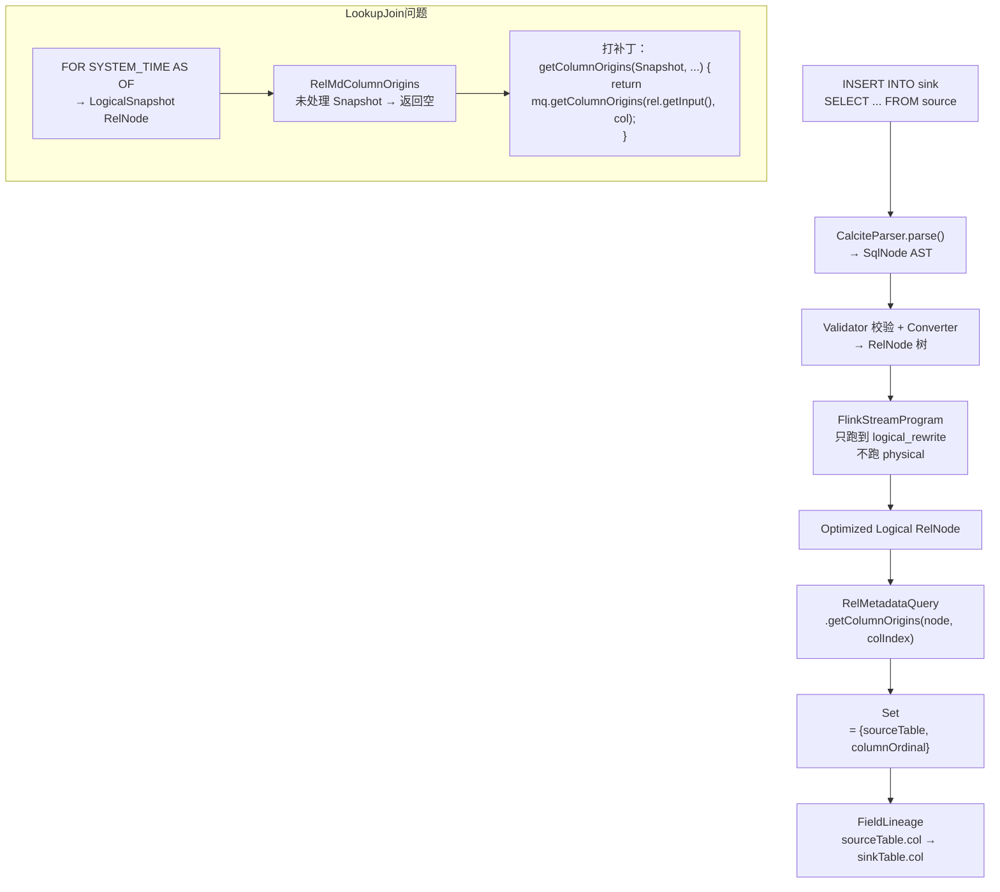

# SQL 字段血缘提取

> 验证版本：Flink 1.14.4（含 Calcite 1.26.0）

## 来源
- [Flink 血缘 | Flink SQL 字段血缘解决方案及源码](../文章/done-Flink 血缘 _ Flink SQL 字段血缘解决方案及源码.md)
- [深度好文！FlinkSQL字段血缘解决方案及源码](../文章/done-深度好文！FlinkSQL字段血缘解决方案及源码.md)
- [Flink SQL 的数据脱敏解决方案](../文章/done-Flink SQL 的数据脱敏解决方案.md)（同一作者，基于同一 CalciteParser 机制延伸）

## 核心问题
如何从 Flink SQL 的 INSERT 语句中自动提取字段级血缘关系（source_table.col → target_table.col）？默认实现为何无法处理 Lookup Join？解决 Lookup Join 血缘丢失有哪些技术路径？

## 判断准则

### 血缘提取核心路径

三步提取法：
1. **Parse → RelNode**：调用 `tableEnv.getParser().parse(sql)` → 取 `CatalogSinkModifyOperation.getChild().getCalciteTree()` 得到 RelNode
2. **只优化到 Logical Plan**：裁剪 `FlinkStreamProgram` 的 `time_indicator`、`physical`、`physical_rewrite` 阶段，只跑到 `logical_rewrite`
3. **查列源**：`RelMetadataQuery.getColumnOrigins(RelNode, columnIndex)` 返回 `Set<RelColumnOrigin>`，从中提取 sourceTable + sourceColumn

### 为什么只优化到 Logical Plan
- Physical Plan 会把 RelNode 转为执行算子，破坏原始列关系
- `logical_rewrite` 后的 Flink Logical RelNode 仍保留列映射信息，可通过 `getColumnOrigins` 遍历

### Lookup Join 血缘丢失根因
- Lookup Join 的 `FOR SYSTEM_TIME AS OF proc_time` 语法被 Parser 解析为 `SqlSnapshot`，Validator 转为 `LogicalSnapshot`
- Calcite 的 `RelMdColumnOrigins` Handler 类没有处理 `Snapshot` 类型的 RelNode，直接返回空
- 结果：维表所有字段的血缘都被丢失

### 两种修复路径

| 路径 | 方式 | 优缺点 |
|---|---|---|
| 修改 Calcite 源码 | 给 `RelMdColumnOrigins` 添加 `getColumnOrigins(Snapshot, ...)` 方法，重新编译 Calcite + Flink | 彻底，但需维护 fork，版本升级时要跟进 |
| Javassist 字节码注入 | 运行时动态向 `RelMdColumnOrigins` 插入该方法 | 无需重新打包，兼容性依赖 Javassist，代码更隐晦 |

两种方式的修复逻辑相同：
```java
public Set<RelColumnOrigin> getColumnOrigins(Snapshot rel,
        RelMetadataQuery mq, int iOutputColumn) {
    return mq.getColumnOrigins(rel.getInput(), iOutputColumn);
}
```

### 数据脱敏的延伸场景（同一机制）
- 血缘提取在 `RelNode` 层；数据脱敏改写在更上游的 `SqlNode` 层（`CalciteParser.parse()` 之后）
- 脱敏思路：自定义 `SqlBasicVisitor` 遍历 AST 中所有 `SqlSelect`，找到有脱敏策略的字段，把 `FROM table` 替换为子查询 `(SELECT ..., CAST(mask(col) AS TYPE) AS col FROM table) AS alias`
- 两者都是**不修改 SQL 执行引擎，只在编译链路的特定层注入逻辑**的模式

### 关键 API 调用链（Flink 1.14）
```java
// Step 1
List<Operation> ops = tableEnv.getParser().parse(sql);
CatalogSinkModifyOperation sinkOp = (CatalogSinkModifyOperation) ops.get(0);
RelNode oriRelNode = ((PlannerQueryOperation) sinkOp.getChild()).getCalciteTree();

// Step 2: 使用裁剪后的 FlinkStreamProgramWithoutPhysical
RelNode optRelNode = flinkChainedProgram.optimize(oriRelNode, streamOptimizeContext);

// Step 3
RelMetadataQuery mq = optRelNode.getCluster().getMetadataQuery();
Set<RelColumnOrigin> origins = mq.getColumnOrigins(optRelNode, columnIndex);
```

## 认知偏差
| 常见错误认知 | 正确理解 |
|---|---|
| 直接解析 SQL 文本就能提取血缘 | SQL 文本解析只能得到 AST；真正追踪字段来源需要经过 Validate + Convert，利用 RelMetadataQuery |
| 血缘提取要执行完整优化 | 只需要 Logical Plan（到 logical_rewrite），执行 Physical 优化会改变 RelNode 结构导致血缘丢失 |
| Lookup Join 血缘正常 | 默认实现 Lookup Join 维表字段血缘全部丢失，必须打补丁 |
| Javassist 注入是 "hack" 不可用于生产 | 业界广泛使用（如 SkyWalking），只要锁定 Calcite 版本并做回归测试即可 |
| 脱敏和血缘是同一套机制 | 血缘在 RelNode 层，脱敏改写在 SqlNode 层；实现层次不同，但都不修改执行引擎 |

## 架构/流程图



## 待验证缺口
- Flink 1.16+ 是否已官方修复 Lookup Join 血缘问题（作者注：1.16 文章提到改写了 SQL 执行流程）
- `FlinkStreamProgramWithoutPhysical` 在 Flink 1.17+ 的 API 变化（内部类经常重构）
- 字段经过 UDF 转换后（如 `DATE_FORMAT(birthday, 'yyyyMMdd')`），`getColumnOrigins` 是否能追踪到原始列（根据测试结果：能，返回的是参与计算的所有源列）
- 多级嵌套子查询血缘正确性
