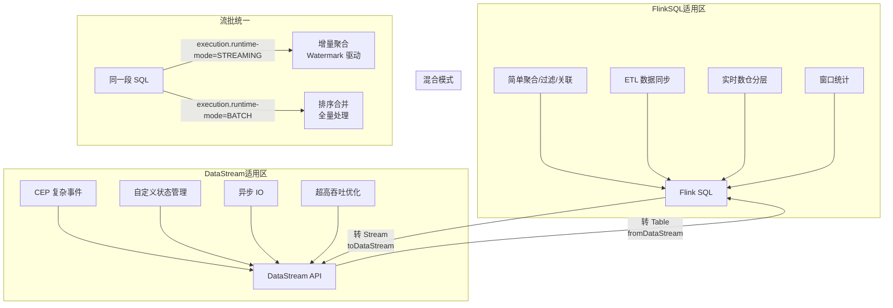

# SQL 流批统一与混合编程选型

## 来源
- [Flink高频问题-Flink SQL 如何实现流批统一？有什么优势？](../文章/done-Flink高频问题-Flink SQL 如何实现流批统一？有什么优势？.md)
- [Flink高频问题-Flink SQL 与 DataStream API 区别？何时选择哪种？](../文章/done-Flink高频问题-Flink SQL 与 DataStream API 区别？何时选择哪种？.md)
- [克服Flink SQL限制的混合API方法](../文章/done-克服Flink SQL限制的混合API方法.md)

## 核心问题
Flink SQL 和 DataStream API 什么时候选哪个？流批统一怎么切换模式？SQL 遇到限制（错误处理/类型映射）时如何用混合 API 绕过？

## 判断准则

### 流批统一的核心原理

"将批处理视为有限流（bounded stream）"：
- 无界流（Kafka）→ 流模式：增量聚合、Watermark 驱动、持续输出
- 有界流（Hive/文件）→ 批模式：排序合并聚合、全量处理完后输出
- 同一段 SQL 代码，切换 `execution.runtime-mode` 即可

**执行模式切换**：
```sql
-- 批模式
SET 'execution.runtime-mode' = 'BATCH';
-- 流模式（默认）
SET 'execution.runtime-mode' = 'STREAMING';
-- 自动模式（Flink 自动判断数据源有界性）
SET 'execution.runtime-mode' = 'AUTO';
```

### Flink SQL vs DataStream API 选型决策表

| 对比维度 | DataStream API | Flink SQL |
|---|---|---|
| 抽象层级 | 低阶过程式（"怎么做"） | 高阶声明式（"要什么"） |
| 开发效率 | 低：手动写算子/状态/窗口 | 高：SQL 简洁，Planner 自动优化 |
| 灵活性 | 极高：自定义状态、触发器、CEP | 中：复杂逻辑需 UDF/UDTF，受 SQL 语法限制 |
| 性能优化 | 手动优化（合并算子、并行度） | 自动优化（谓词下推、聚合重排、Join 重分区） |
| 状态管理 | 手动（StateDescriptor、TTL） | 自动（DDL 配置 TTL 参数） |
| 调试难度 | 高：需看算子/状态/Watermark | 低：EXPLAIN 查看执行计划 |
| 适用人群 | Java/Scala 工程师，深度定制 | 数据分析师、ETL 工程师，SQL 技术栈 |

### 选型三步决策法

1. **看业务复杂度**
   - 简单逻辑（过滤/聚合/关联/固定窗口）→ Flink SQL
   - 复杂逻辑（自定义状态/CEP/动态窗口/异步 IO）→ DataStream API

2. **看团队技术栈**
   - SQL 为主，无 Java/Scala 开发能力 → Flink SQL
   - Java/Scala 工程师，需底层控制 → DataStream API

3. **看迭代与性能需求**
   - 快速迭代，需求频繁变更 → Flink SQL
   - 极致性能，超高吞吐 → DataStream API

### 优先选 Flink SQL 的典型场景
- 实时数仓 ODS/DWD/DWS 层建设
- 数据过滤/清洗/聚合/维表关联
- ETL：Kafka → MySQL/Hive
- 团队以 SQL 技术栈为主
- 需求频繁变更，快速迭代

### 优先选 DataStream API 的典型场景
- 自定义状态（MapState 行为序列、ListState 历史订单）
- 自定义窗口/触发器（业务规则驱动的动态窗口）
- 复杂事件处理 CEP（Flink CEP 库仅 DataStream 支持）
- 异步 IO（HTTP 接口调用、外部数据库）
- 自定义 Source/Sink（物联网协议、私有消息队列）
- 超高吞吐极致优化

### Flink SQL 的两类典型限制

1. **错误处理限制（DLQ 场景）**
   - Flink SQL Kafka Connector 遇到反序列化错误时快速失败并重启
   - 无法跳过坏记录（不支持 skip-on-error）
   - 作业会陷入重启循环，必须手动干预
   - **解法**：DataStream 层先做模式验证，坏记录通过 SideOutput 转到 DLQ Topic，干净数据转换为 Table 给 SQL 处理

2. **数据类型映射限制（Avro 场景）**
   - Avro Enum 类型在 Flink SQL 中被映射为 String，写回 Kafka 时序列化失败
   - Avro TimestampMicros（微秒精度）不支持，只能按 BIGINT 处理，Flink SQL 时间戳精度最高 3（毫秒）
   - **解法**：SQL 处理完后 `toDataStream()` 转回 DataStream，用 `RichMapFunction` 手动做 Row → GenericRecord 映射，再写 Kafka

### 混合编程模式

**模式 1：DataStream 预处理 → 转 Table → SQL 处理**
```java
// 1. DataStream 读 Kafka，验证 Avro 模式，坏记录走 DLQ SideOutput
SingleOutputStreamOperator<Tuple2<String, GenericRecord>> validatedStream =
    rawStream.process(new SchemaValidationFunction(dlqEnabled, deserializer));
// 2. 转为 Table
Table t = tableEnv.fromDataStream(rowStream, schemaBuilder.build());
tableEnv.createTemporaryView("InputTable", t);
// 3. SQL 处理
tableEnv.sqlQuery(sqlQuery);
```

**模式 2：SQL 处理 → 转回 DataStream → 自定义 Sink**
```java
// SQL 处理完后
DataStream<Row> rows = tableEnv.toDataStream(result);
// 自定义 Row → GenericRecord 映射，处理 Enum/TimestampMicros
DataStream<GenericRecord> records = rows.map(new AvroRowMapper(avroSchemaString));
// 写 Kafka Sink
records.sinkTo(kafkaSink);
```

**模式 3：DataStream CEP 检测 → 转 Table → SQL 聚合统计**
```java
DataStream<RiskAlert> riskStream = CEP.pattern(...);
tableEnv.createTemporaryView("risk_alerts", riskStream, ...);
Table resultTable = tableEnv.sqlQuery("SELECT user_id, COUNT(*) ...");
```

## 认知偏差

| 常见错误认知 | 正确理解 |
|---|---|
| 流批统一只是切换一个参数 | 底层涉及执行计划不同（增量聚合 vs 排序合并）、状态使用逻辑不同（持久化 vs 临时）、时间处理不同（Watermark vs 无 Watermark） |
| DataSet API 是批处理的正确姿势 | DataSet API 已废弃，1.14+ 批处理也用 DataStream（bounded stream） |
| Flink SQL 不支持复杂场景 | SQL 有限制，但通过混合编程可以在 SQL 外包裹 DataStream 层补足 |
| SQL → DataStream 转换损耗大 | 两者底层共享执行引擎，转换操作本身轻量，主要损耗在序列化/反序列化 |
| 选了 Flink SQL 就不能用 DataStream | 两者可以在同一作业内混合，互相转换 |
| Flink SQL 遇到错误只能重启 | 在 SQL 处理前加一层 DataStream 做错误处理（DLQ），可避免作业重启 |

## 架构/流程图



## 待验证缺口
- `execution.runtime-mode=AUTO` 的自动判断逻辑（何种情况会判错）
- 混合编程时，DataStream 转 Table 后 checkpoint 的语义边界
- Avro TimestampMicros 的 Flink SQL 支持是否在 Flink 2.x 有改善

## 重新蒸馏补充（2026-06-18）

| 来源 | 认知增量 | 处理 |
|---|---|---|
| [[03_数据工程与数仓/0303_实时计算/030301_Flink/文章/done-Flink 绝配 Kafka：实时数仓的终极架构深度解析]] | 补充该主题的生产案例、机制边界或排重样例。 | 重新判断后补入目标知识产物 |
| [[03_数据工程与数仓/0303_实时计算/030301_Flink/文章/done-FlinkSQL实时数仓SOP流程（一）]] | 补充该主题的生产案例、机制边界或排重样例。 | 重新判断后补入目标知识产物 |
| [[03_数据工程与数仓/0303_实时计算/030301_Flink/文章/done-阿里云实时计算 Flink 版 x Hologres_ 构建企业级一站式实时数仓]] | 补充该主题的生产案例、机制边界或排重样例。 | 重新判断后补入目标知识产物 |
