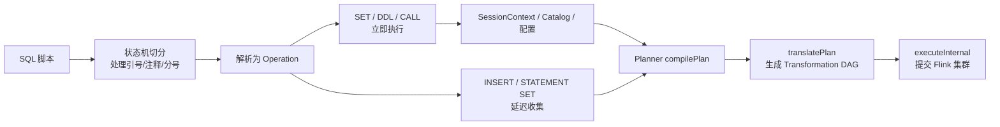

# Flink SQL 脚本化提交与 Application 模式适配

## 来源

- [[03_数据工程与数仓/0303_实时计算/030301_Flink/文章/done-Flink 实时数仓开发实战：像 Hive 那样用 Flink SQL|Flink 实时数仓开发实战：像 Hive 那样用 Flink SQL]]

## 图片处理

| 图片 | 类型 | 是否保留 | 理由 | 处理方式 |
|---|---|---|---|---|
| `../文章/Flink_实时数仓开发实战_像_Hive_那样用_Flink_SQL_assets/img_001.jpg` | 执行链路图 | 保留 | 说明 Flink 2.x 脚本部署从 SQL Gateway 到 JobManager 端执行的完整链路 | 保留原图锚点 |
| `../文章/Flink_实时数仓开发实战_像_Hive_那样用_Flink_SQL_assets/img_002.jpg` | 对比图 | 保留 | 对比官方 Flink 2.x 方案与 1.20 兼容方案的差异 | 保留原图锚点 |
| `../文章/Flink_实时数仓开发实战_像_Hive_那样用_Flink_SQL_assets/img_003.jpg` | 流程图 | 保留 | 说明 Multi-Statement SQL 的切分、分派、统一提交三阶段 | 保留原图锚点，并用 Mermaid 重建核心逻辑 |

## 一句话结论

这篇文章值得精读：它把 Flink SQL 从“会写查询和调状态”推进到“如何像离线数仓脚本一样，把实时 SQL 作业文件化、版本化、校验、提交和治理”。

## 用户相关性判断

| 项 | 内容 |
|---|---|
| 用户当前认知层级 | Flink / Flink SQL L2-L3 draft |
| 认知成熟度 | draft |
| 阅读投入建议 | 精读 |
| 阅读投入理由 | 它补的是 Flink SQL 作业生命周期治理入口，不是已有的状态、窗口、Join、Checkpoint 运行时机制 |
| 对用户的新信息 | Flink SQL 脚本化提交的关键不只是多语句解析，而是 SQL 会话、DDL/DML 执行顺序、Planner 编译、Application Mode 环境适配和 CI/CD 治理 |
| 问题指纹 | Flink SQL + Multi-Statement 脚本 + SQL Gateway 内部链路 + Application Mode + 作业提交治理 + 1.20/2.x 版本边界 |
| 排重判断 | 新建；区别于 `FlinkSQL大状态作业调优`，本文主问题是提交形态和作业治理 |
| 置信度 | 中高；文章正文完整，技术链路清晰，但“所有环境/所有模式”覆盖面需要实测 |

## 认知校准点

| 校准点 | 文章观点/信息 | 与用户认知或价值观的关系 | 处理建议 |
|---|---|---|---|
| Flink SQL 的生产痛点不只是执行语义 | SQL Client `-f` 接近 Hive，但受 Standalone/Session 模式限制；生产更需要 Application / Per-job 类隔离 | 补齐用户在 Flink SQL 作业治理层的认知缺口 | 写入 Flink index |
| “像 Hive 一样”指工程范式，不是语法兼容 | `.sql` 文件进入 Git、Code Review、版本管理、CI 校验，才是 Hive 式体验的核心 | 与用户离线数仓脚本治理经验强相关 | 作为可复用准则保留 |
| SQL Gateway 不只是服务，也包含可复用的 SQL 执行链路 | `SessionContext / OperationExecutor / Planner` 构成 SQL 解析、验证、编译、执行基础 | 纠偏：不要把 Gateway 只理解成远程服务进程 | 后续看 SQL Gateway 源码时优先验证 |
| Flink 2.x 能力和 Flink 1.20 兼容方案要分开看 | 官方 2.x 方向支持脚本部署到 Application Mode；文章方案是将类似能力下放到 1.20 LTS | 防止把兼容改造误读成 1.20 原生能力 | 标注版本边界 |
| 多语句 SQL 不能简单按分号拆 | 需要处理引号、注释、DDL 副作用、DML 编译顺序和 `STATEMENT SET` | 纠偏低质量自研方案 | 沉淀为实现准则 |

## 冲突点

| 冲突类型 | 具体表现 | 影响 | 处理 |
|---|---|---|---|
| 证据不足 | 文章称适用于任意资源环境、任意部署模式，但没有完整兼容矩阵 | 不能直接作为生产结论 | 实践前补 YARN/Kubernetes/Application/Session 矩阵 |
| 版本边界 | 同时讨论 Flink 1.20 LTS、Flink 2.x、FLIP-480 和自建兼容层 | 容易误解为官方 1.20 原生支持 | 明确标为 1.20 兼容改造方案 |
| 依赖与类加载风险 | 复用 `flink-sql-gateway` 内部类，涉及 SPI、ClassLoader、依赖 jar | 版本升级可能破坏兼容性 | 必须锁版本并加回归用例 |
| 实践证据不足 | 有开源项目和命令，但缺用户本地环境验证 | 不能直接判实践 | 降为精读，后续小实验 |

## 待吸收点

| 分级 | 内容 | 为什么值得吸收 | 后续动作 |
|---|---|---|---|
| 理解 | Flink SQL 脚本化提交链路：SQL 脚本 -> 切分 -> DDL 立即执行 -> DML 收集 -> `compilePlan` -> `translatePlan` -> `executeInternal` | 补齐 SQL 文本到 Flink 作业的纵向链路 | 写入 Flink 纵向模块 |
| 理解 | `SessionContext / OperationExecutor / Planner` 是保持 Flink SQL 语义兼容的关键 | 自研时不能绕开社区 SQL 语义链路 | 后续读源码验证 |
| 记住 | DDL 立即执行、DML 延迟统一编译，是多语句 SQL 脚本执行的核心顺序 | 决定 Catalog 对象、配置和最终 Job 图是否一致 | 作为实现准则保留 |
| 记住 | Flink SQL 脚本化的价值是作业治理：文件化、版本管理、Code Review、参数外置、干运行校验、CI/CD | 连接离线数仓治理和实时数仓治理 | 后续做模板 |
| 实践 | 用最小 datagen/print SQL 验证 `flink-sql-bootstrap` 在本地或测试集群的提交链路 | 可验证兼容性和失败模式 | 待实验 |

## 已知可跳过

| 内容 | 跳过理由 |
|---|---|
| Hive `hive -f` 的基础体验 | 用户已熟悉离线数仓脚本化价值 |
| SQL Client 交互式入门 | 不改变用户判断 |
| Word Count 示例本身 | 只用于证明可运行，不是核心机制 |
| “大厂实践”“丝滑体验”等表述 | 营销和经验背景，不进入核心准则 |

## 实践门槛

| 门槛 | 判断 | 证据 |
|---|---|---|
| 可运行 | 部分 | 有 `flink run ... --script-file` 命令、开源项目和示例 SQL |
| 可验证 | 部分 | 有 `--validate` 思路，但缺本地版本、集群模式、依赖矩阵和验收指标 |
| 可排障 | 不足 | 文章没有形成类加载、依赖冲突、Catalog、UDF、Connector、提交失败的排障矩阵 |
| 可迁移 | 是 | 可迁移到实时数仓 SQL 作业模板和 CI/CD 治理 |
| 结论 | 降为精读 | 实践前先做最小作业和部署模式矩阵验证 |

## 归类判断

| 项 | 内容 |
|---|---|
| 技术本体 | Flink SQL 是 Flink 的声明式流批计算入口；本文聚焦其脚本化提交和 Application Mode 适配 |
| 文章主问题 | 如何让 Flink 1.20 LTS 也具备类似 Flink 2.x 的 Multi-Statement SQL 脚本提交能力 |
| 使用场景 | 实时数仓 SQL 作业文件化、版本管理、自动校验、生产提交 |
| 关键词干扰 | Hive、SQL Gateway、CI/CD、细粒度资源配置 |
| 最终归类 | 数据工程与数仓 / 实时计算 / Flink |
| 归类理由 | 主问题是 Flink SQL 作业提交与实时数仓治理，不是离线 Hive，也不是通用 CI/CD 工具 |

## 技术定位

| 项 | 内容 |
|---|---|
| 技术类型 | Flink SQL 作业提交模式 / 工程化适配方案 |
| 所属领域 | 数据工程与数仓 |
| 二级类目 | 实时计算 |
| 全局架构位置 | 位于 SQL 开发产物和 Flink 集群提交之间，连接脚本、Planner、Application 环境和作业执行 |
| 涉及模块 | SQL Gateway、SQL Client、Table Planner、SessionContext、OperationExecutor、Application Mode、CI/CD |
| 解决问题 | 让多条 DDL/DML 组成的 SQL 脚本以生产隔离模式提交，而不是依赖交互式 SQL Client 或手写 Java 包装 |
| 原文局限 | 缺少完整部署模式验证矩阵、失败案例、依赖冲突处理和生产指标 |
| 我的结论 | 以后关注；适合沉淀为实时 SQL 作业治理入口，实践前必须做最小验证 |

## 纵向理解

| 维度 | 判断 |
|---|---|
| 全局架构 | SQL 脚本 -> 脚本读取 -> 多语句切分 -> Operation 解析 -> DDL/CALL/SET 立即执行 -> DML 收集 -> Planner 编译 -> Transformation DAG -> 集群执行 |
| 本文位置 | 只讲 Flink SQL 脚本提交和 Application Mode 适配，不讲状态算子调优、Checkpoint 排障或 Connector 一致性 |
| 核心机制 | 复用 SQL Gateway 内部解析/执行链路，避免自己重建 SQL 语义；通过兼容层适配 Flink 1.20 |
| 使用链路 | 编写 `.sql` -> 参数外置 -> `--validate` 干运行 -> `flink run` 提交 bootstrap jar -> 观察作业生成和运行 |
| 前置条件 | 明确 Flink 版本、部署模式、依赖 jar、Catalog/UDF/Connector、SQL 方言和权限 |
| 边界 | 不解决 SQL 语义正确性、状态膨胀、下游写入慢、端到端一致性和资源细粒度配置本身 |

## Mermaid 重建

## 横向对标

| 对标技术 | 实现方式 | 优势 | 劣势 | 适合场景 |
|---|---|---|---|---|
| SQL Client 交互模式 | 启动 SQL Client 后逐条执行 | 调试方便 | DDL/DML 割裂，不利于版本化和自动化 | 探索、排查、临时查询 |
| SQL Client `-f` | 读取 SQL 文件执行 | 接近 Hive 脚本体验 | 部署模式受限，生产隔离不足 | 简单脚本、Session/Standalone 场景 |
| SQL Gateway 服务 | 远程服务接收 SQL 请求 | 适合平台化、多客户端、统一入口 | 需要常驻服务和平台接入 | SQL 平台、Notebook、多租户查询 |
| `flink run + bootstrap jar` | 将脚本执行器作为 Flink Application 提交 | 更接近作业隔离和 CI/CD | 需要维护兼容层、依赖、类加载和版本适配 | 实时数仓 SQL 作业生产提交 |
| Java 包装 SQL | 代码内逐条 `executeSql` | 可控、容易接入工程代码 | SQL 文件化和治理体验差 | 少量固定 SQL 或强代码控制场景 |

## 后续追查

- 关键词：FLIP-480、FLIP-316、Flink SQL Gateway、SqlDriver、ScriptRunner、ScriptExecutor、SessionContext、OperationExecutor、Application Mode、Multi-Statement SQL、StatementSet、`compilePlan`、`translatePlan`。
- 需要补读的文章：Flink 2.x SQL Gateway 官方脚本部署文档、Flink 1.20 SQL Client 文档、`flink-sql-bootstrap` README 和源码。
- 待补实验：用 datagen/print 构造最小 SQL，分别验证 Local、YARN/Kubernetes、Session/Application 模式；加入 UDF、Catalog、Connector 依赖和 `STATEMENT SET`；记录提交失败、依赖冲突、SQL 校验失败和作业生成结果。

## 重新蒸馏补充（2026-06-18）

| 来源 | 认知增量 | 处理 |
|---|---|---|
| [[03_数据工程与数仓/0303_实时计算/030301_Flink/文章/done-Flink-脚本启动任务调度流程图？-你知道吗？]] | 补充该主题的生产案例、机制边界或排重样例。 | 重新判断后补入目标知识产物 |
