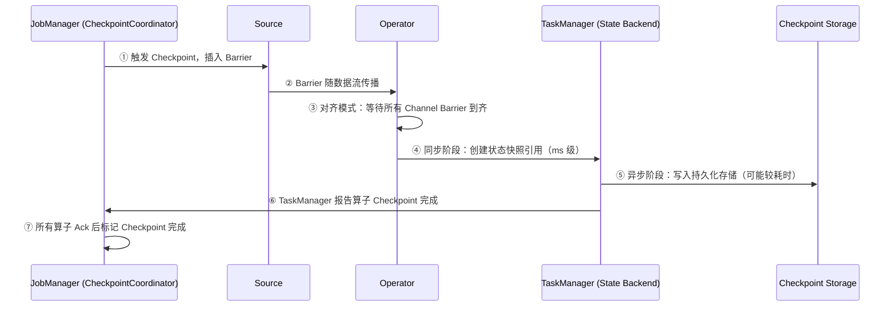

# StateBackend 与 CheckpointStorage 解耦

> 验证版本：Flink 1.13+

## 来源
- [告别混淆！一文讲透 Flink State Backend 与 Checkpoint Storage](../文章/done-告别混淆！一文讲透%20Flink%20State%20Backend%20与%20Checkpoint%20Storage.md)
- [面试|深入理解Flink State](../文章/done-面试_深入理解Flink%20State.md)

## 核心问题
1.13 之前 StateBackend 同时负责"运行时状态存哪里"和"Checkpoint 备份到哪里"两件事，导致 FsStateBackend 名字带 Fs 但运行时用的是堆内存这类命名混乱。1.13+ 将两者正式解耦，分别由 StateBackend 和 CheckpointStorage 独立负责。

## 判断准则

### 两个概念的职责边界

| 概念 | 职责 | 决定什么 |
|---|---|---|
| State Backend | 运行时状态的存储介质与访问方式 | 状态在 TaskManager 里放内存还是磁盘 |
| Checkpoint Storage | Checkpoint 快照的持久化位置 | 备份数据写去哪里（JM 内存 or 文件系统） |

### 旧版命名到新版组合的映射

| 旧版（< 1.13，已废弃） | 新版等价组合（>= 1.13） |
|---|---|
| MemoryStateBackend | HashMapStateBackend + JobManagerCheckpointStorage |
| FsStateBackend | HashMapStateBackend + FileSystemCheckpointStorage |
| RocksDBStateBackend | EmbeddedRocksDBStateBackend + FileSystemCheckpointStorage |

### 四种组合矩阵

| 组合 | State Backend | Checkpoint Storage | 适用性 |
|---|---|---|---|
| A | HashMapStateBackend | JobManagerCheckpointStorage | 仅开发/测试 |
| B | HashMapStateBackend | FileSystemCheckpointStorage | 生产推荐（中小状态） |
| C | EmbeddedRocksDBStateBackend | JobManagerCheckpointStorage | 不推荐（无实际意义） |
| D | EmbeddedRocksDBStateBackend | FileSystemCheckpointStorage | 生产推荐（大状态） |

### 两种 State Backend 对比

| 维度 | HashMapStateBackend | EmbeddedRocksDBStateBackend |
|---|---|---|
| 存储介质 | JVM 堆内存 | 本地磁盘（RocksDB） |
| 访问速度 | 极快（直接内存访问） | 较慢（序列化 + 磁盘 I/O） |
| 状态规模 | 受限于堆内存（GB 级） | 受限于磁盘（TB 级） |
| 增量 Checkpoint | 不支持 | 支持 |
| 内存管理 | JVM GC | Flink Managed Memory |
| 典型吞吐量影响 | 影响小 | 约降低 30%~50% |
| 适用场景 | 小状态、高吞吐 | 大状态、超大 Key 数量 |

### 两种 Checkpoint Storage 对比

| | JobManagerCheckpointStorage | FileSystemCheckpointStorage |
|---|---|---|
| 存储位置 | JobManager 堆内存 | 分布式文件系统（HDFS/S3） |
| 单状态上限 | 默认 5 MB | 无限制 |
| 持久性 | JM 崩溃则丢失 | 高可用 |
| 适用场景 | 本地开发/测试 | 生产环境唯一推荐 |

### Checkpoint 完整流程（7步）



### 生产推荐配置（大状态高可用）

```yaml
# State Backend
state.backend: rocksdb
state.backend.incremental: true
state.backend.rocksdb.localdir: /data1/flink/rocksdb,/data2/flink/rocksdb
state.backend.rocksdb.memory.managed: true
state.backend.rocksdb.predefined-options: FLASH_SSD_OPTIMIZED

# Checkpoint Storage
state.checkpoint-storage: filesystem
state.checkpoints.dir: hdfs:///flink/checkpoints
state.savepoints.dir: hdfs:///flink/savepoints

# Checkpoint 行为
execution.checkpointing.interval: 2min
execution.checkpointing.mode: EXACTLY_ONCE
execution.checkpointing.timeout: 10min
execution.checkpointing.min-pause: 1min
execution.checkpointing.max-concurrent-checkpoints: 1

# 保留策略
state.checkpoints.num-retained: 3

# 内存配置
taskmanager.memory.managed.fraction: 0.4
```

## 认知偏差

| 常见错误认知 | 正确理解 |
|---|---|
| FsStateBackend 运行时把状态放文件系统 | 运行时仍在 TaskManager 堆内存，只是 Checkpoint 时写文件系统 |
| StateBackend 和 CheckpointStorage 是同一个东西 | 1.13+ 正式解耦，两者独立配置 |
| RocksDB 能解决 Checkpoint 存储问题 | RocksDB 只决定运行时状态在哪，Checkpoint 存储还需配 FileSystemCheckpointStorage |
| 换 StateBackend 不影响 Checkpoint 位置 | 两者解耦后可以独立变更，但 C 组合（RocksDB + JobManagerStorage）无实际意义 |
| JobManagerCheckpointStorage 可用于生产 | 生产绝不应使用，JM 崩溃则 Checkpoint 全部丢失，且单状态 5MB 上限极受限 |

## 待验证缺口
- EmbeddedRocksDBStateBackend 在不同 `predefined-options` 下（SPINNING_DISK_OPTIMIZED vs FLASH_SSD_OPTIMIZED）的实际 Checkpoint 耗时差异
- 增量 Checkpoint 文件积累过多后的清理策略和存储放大比例
- HashMapStateBackend 的全量 Checkpoint 在状态超过 2GB 时的实际耗时测量
