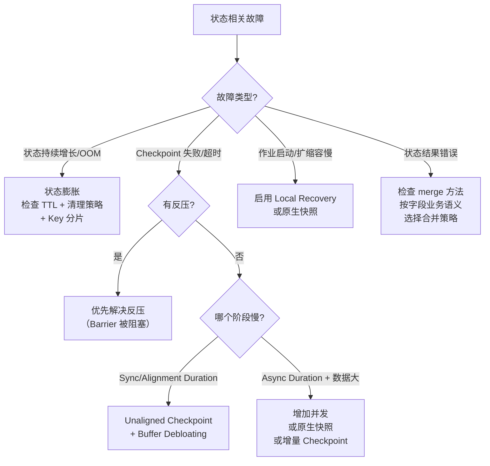

# Flink 状态使用陷阱与排障模式

## 来源
- [Flink技术实践-90%都会踩的状态坑](../文章/done-Flink技术实践-90%25都会踩的状态坑.md)
- [Flink⼤状态作业调优实践指南：状态报错与启停慢篇](../文章/done-Flink⼤状态作业调优实践指南：状态报错与启停慢篇.md)
- [flink生产问题思考-数据乱序导致状态错误？—— merge 方法的正确实现](../文章/done-flink生产问题思考-数据乱序导致状态错误？——%20merge%20方法的正确实现.md)

## 核心问题
有状态 Flink 作业的生产故障 80% 与状态管理不当有关。本知识点覆盖三类高频陷阱：状态膨胀与清理、Checkpoint 超时与启停慢、乱序数据下的状态 merge 语义错误。

## 判断准则

### 一、状态膨胀排查路径

**触发信号**：作业延迟飙升 + TaskManager 内存持续增长 + 可能触发 OOM 重启

**核心根因三件套**：
1. 未设置 State TTL，历史数据无限堆积（长尾 Key 尤甚）
2. 未做 Key 分片，部分 TaskManager 承担过多 Key（状态倾斜）
3. 窗口触发后状态未清理（需显式配置 `allowedLateness`）

**处置清单**：

```java
// 必须：设置 TTL + 后台清理（非阻塞）
StateTtlConfig ttlConfig = StateTtlConfig
    .newBuilder(Time.hours(24))
    .setUpdateType(StateTtlConfig.UpdateType.OnCreateAndWrite)
    .setStateVisibility(StateTtlConfig.StateVisibility.NeverReturnExpired)
    .enableCleanupInBackground()          // 后台线程定期清理，不阻塞数据处理
    .cleanupFullSnapshot()                // 全量快照时清理（非增量 Checkpoint 场景）
    .cleanupIncrementalCleanup(100)       // 每处理 100 条检查一次过期状态
    .build();

// 窗口状态清理：显式设置允许延迟，超时后自动清理
stream.window(TumblingEventTimeWindows.of(Time.minutes(1)))
      .allowedLateness(Time.seconds(10));
```

**监控阈值**：单 TaskManager 状态量超 10GB 触发告警。

### 二、Checkpoint 超时诊断决策树

**诊断入口**：Flink UI → 作业探查 → Checkpoints → Checkpoints 历史

```
Checkpoint 超时
│
├─ 先检查反压：有反压 → 优先解决反压（反压会阻塞 Barrier 传播）
│
├─ Sync Duration / Alignment Duration 过长
│   └─ 根因：Barrier 对齐慢，同步阶段卡
│   └─ 方案：使用 Unaligned Checkpoint + Buffer Debloating
│
└─ Async Duration 过长 且 Checkpointed Data Size 较大
    └─ 根因：状态上传慢（异步阶段）
    └─ 方案①：增加并发（减小单并发状态量）
    └─ 方案②：使用原生快照（Native Savepoint，速度趋近 Checkpoint）
    └─ 方案③：确认已开启 RocksDB 增量 Checkpoint
```

**Checkpoint 参数基准（中大型状态场景）**：

```java
env.enableCheckpointing(60_000);                    // 间隔 1 min
checkpointConfig.setCheckpointTimeout(300_000);     // 超时 5 min（建议 1.5-2x 平均耗时）
checkpointConfig.setMinPauseBetweenCheckpoints(500);
checkpointConfig.setMaxConcurrentCheckpoints(2);    // 最大并发 Checkpoint 数
```

### 三、作业启停慢排障路径

**触发信号**：作业长时间停留在初始化阶段，线程栈显示在等待状态存储（下载/重建）。

**诊断工具**：线程转储、火焰图 → 查看是否长时间阻塞在状态存储操作。

**优化方案对比**：

| 方案 | 配置 | 适用场景 | 注意事项 |
|---|---|---|---|
| Local Recovery | `state.backend.local-recovery: true` | Failover 或动态参数更新后的自动恢复 | 手动停止重启无效；多占本地磁盘 |
| 原生快照（Native Savepoint） | 创建快照时选择"原生格式" | 手动维护（扩缩容/版本升级）前的快照 | 不保证跨大版本兼容 |

### 四、乱序数据下的 merge 语义陷阱

**核心判断**：数据乱序本身不会导致状态错误，但 merge 方法逻辑错误会。不同字段需要不同合并策略。

**字段合并策略速查表**：

| 业务语义 | 合并策略 | 示例字段 |
|---|---|---|
| 事件只发生一次，取真实时间 | 取最早（min） | 发件时间、首次签收时间、退件时间 |
| 最终状态（最后结果才有效） | 取最晚（max） | 到件时间、车辆扫描时间 |
| 版本号 / 序列号 | 只增不减（单调递增） | version、offset |
| 一旦设置不再变更 | 有值则锁定（first-write-wins） | 终态标记、终止标志 |
| 布尔标志（只有正向） | 有则标记（OR 语义） | 退件标志、转寄标志 |

**正确的 merge 实现模板**：

```java
public void merge(WaybillState update) {
    if (update == null) return;

    // 取最早（首次发件时间）
    if (update.sendScantime != null) {
        if (this.sendScantime == null ||
            compareTime(update.sendScantime, this.sendScantime) < 0) {
            this.sendScantime = update.sendScantime;
        }
    }

    // 取最晚（最终到件时间）
    if (update.arrivalScantime != null) {
        if (this.arrivalScantime == null ||
            compareTime(update.arrivalScantime, this.arrivalScantime) > 0) {
            this.arrivalScantime = update.arrivalScantime;
        }
    }

    // 版本号只能递增
    if (update.version > this.version) {
        this.version = update.version;
    }

    // 终态一旦到达不再改变
    if (update.finalStatus != null && this.finalStatus == null) {
        this.finalStatus = update.finalStatus;
    }
}
```

**设计 merge 方法的检查清单**：
1. 这个字段的业务含义是什么（是首次还是最终？）
2. 应该取最早还是最晚？
3. 如何处理 null 值（null 不应覆盖有效值）？
4. 如何保证幂等性（相同数据多次 merge 结果一致）？
5. 是否有单元测试覆盖乱序到达场景？

### 五、RocksDB 性能调优关键参数

**触发信号**：磁盘 IO 持续 90%+、吞吐从 10 万/秒降至 2 万/秒。

**核心调优三要素**：内存分配 → 压缩策略 → 写缓冲

```java
EmbeddedRocksDBStateBackend rocksDB = new EmbeddedRocksDBStateBackend();
RocksDBMemoryConfiguration memCfg = new RocksDBMemoryConfiguration();
memCfg.setTotalMemory(MemorySize.ofMebiBytes(8192));  // TM 内存的 40-60%
memCfg.setBlockCacheSize(MemorySize.ofMebiBytes(4096)); // 热点状态缓存
memCfg.setWriteBufferSize(MemorySize.ofMebiBytes(512));
memCfg.setWriteBufferCount(3);
rocksDB.setRocksDBMemoryConfiguration(memCfg);
// 压缩策略：LZ4 兼顾压缩比和速度
```

## 认知偏差

| 常见错误认知 | 正确理解 |
|---|---|
| 设置了 TTL 就不会有状态膨胀 | 仅设置 TTL 不够，必须同时配置清理策略（后台清理/快照清理/增量清理） |
| Checkpoint 超时就调大 timeout | 应先看是同步阶段慢还是异步阶段慢，根因不同方案不同 |
| 数据乱序会导致状态错误 | 乱序本身不导致错误，错的是 merge 逻辑（简单覆盖而非按业务语义合并） |
| 反压时 Checkpoint 失败是存储问题 | 反压导致 Barrier 无法及时传播，应先解决反压再看 Checkpoint |
| Local Recovery 对所有重启场景都有效 | 只对 Failover 和动态参数更新生效，手动停止重启无法利用本地缓存 |
| RocksDB 内存越大越好 | 过大会挤占其他组件内存，建议 TM 内存的 40-60%，且需与 Block Cache 和 Write Buffer 合理分配 |

## 架构/流程图



## 待验证缺口
- `cleanupIncrementalCleanup(100)` 中的 100 是每处理 100 条记录还是每 100ms 检查一次，实际清理频率如何
- Unaligned Checkpoint 在 exactly-once 语义下的正确性边界（是否有已知场景会引入不一致）
- 状态倾斜时 Key 分片（`hashCode % N`）是否真正解决了问题，还是只均匀分配了物理资源但单个热点 Key 状态本身还是大
