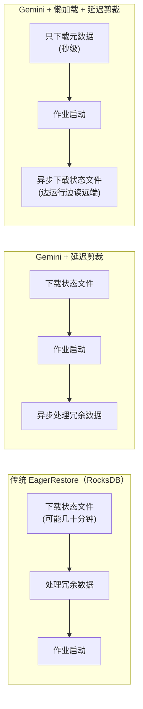

# Flink State 存算分离探索

## 来源
- [Flink 存储 _ 阿里云实时计算企业级状态存储引擎 Gemini 技术解读](../文章/done-Flink%20存储%20_%20阿里云实时计算企业级状态存储引擎%20Gemini%20技术解读.md)
- [Flink_state 的优化与 remote_state 的探索](../文章/done-Flink_state%20的优化与%20remote_state%20的探索.md)

## 核心问题
RocksDB 在大状态场景下有哪些结构性痛点？阿里（Gemini）和 B 站（Remote State）各自如何通过存算分离思路来解决？对社区用户有哪些可借鉴的方向？

## RocksDB 的结构性痛点

| 痛点 | 具体表现 | 根本原因 |
|---|---|---|
| Checkpoint 导致 CPU 尖峰 | 周期性 CPU 抖动，与 CP 周期强相关 | CP 触发 flush → cache miss + 文件整理频繁 |
| 扩缩容恢复慢 | 缩并发时可能需要几十分钟 | 需要遍历旧 DB 中的有效 KV 写入新 DB，大量 I/O |
| 强依赖本地磁盘 | 本地盘写满后作业无法运行，混部受限 | 嵌入式架构，状态必须落本地 |

**B 站数据**：4000+ Flink 任务，95% 是 SQL 类型，有上百个任务状态超过 500GB。大状态场景下：CPU 均值（压缩优化后）下降约 15%，峰值下降约 25%。

## 阿里云 Gemini 引擎（闭源，仅 VVR 版本）

### 核心设计差异

| 特性 | RocksDB | Gemini |
|---|---|---|
| Write Buffer 索引结构 | 排序索引（SkipList） | 哈希索引（中小状态性能优势显著） |
| 存算分离 | 不支持（全量在本地） | 支持（冷数据到远端分布式文件系统） |
| 状态恢复方式 | 同步下载全量文件后启动 | 懒加载（LazyRestore）：只下载元数据即可启动 |
| 扩缩容恢复 | 需遍历 KV 数据 | 延迟剪裁：元数据拼接快速启动，冗余数据异步清理 |
| KV 分离 | 不支持 | 支持（Join 成功率低 + 大 Value 场景受益） |

### LazyRestore 原理

基于原文描述重建

### Gemini 性能数据（阿里云 Nexmark 测试）

- 点查询（ValueGet/ListGet/MapGet）：吞吐约为 RocksDB 的 2-5 倍
- 扩并发断流时间：比 RocksDB 减少 47%；开懒加载后减少 94%
- 缩并发断流时间：比 RocksDB 减少 78%；开懒加载后减少 96%
- 开启懒加载+热更新后，128 并发扩缩容断流时间：579s → 13s（扩），420s → 11s（缩）
- KV 分离在 Q20 双流 Join 场景：吞吐提升 50%-70%+

**注意：Gemini 是阿里云 VVR 版本独有，不在 Apache Flink 社区版本中。**

### KV 分离适用场景

KV 分离适合：
- Join 成功率低（如风控、推荐场景，大量数据无法 Join 成功）
- Value 数据量大（Join 时 Key 查命中判断不需要加载 Value）

KV 分离不适合：
- 范围查询为主的场景（存在一定空间放大）

## B 站 Remote State 探索（自研方案）

### 问题驱动
- 离在线混部：在线机器本地盘小（100-200GB）、I/O 弱，无法承载大状态作业
- 大状态重启下载慢（500GB+ 需 5 分钟以上才能恢复平稳）
- 期望存算分离，计算节点无需本地 I/O 能力

### 整体方案

**替换 RocksDB 为 B 站内部 Taishan 分布式存储：**

| Flink 概念 | 对应 Taishan 概念 |
|---|---|
| KeyGroup | Shard |
| ColumnFamily（CF） | Table |
| 状态快照 | Taishan Snapshot |

- 重启/rescale：直接连接远端 Taishan 服务，无需下载文件
- Checkpoint：调用 Taishan snapshot 接口，秒级切换
- 冷启动：缓存为空，需要一个 TTL 周期才能填满全量 key 缓存

### 缓存架构

纯 Remote State 每次操作都走网络 RPC，延迟高。因此在 Flink 和 Taishan 之间加了缓存层：

| 缓存场景 | 效果 |
|---|---|
| 写缓存（内存攒批） | 上百倍减少写 RPC |
| 读缓存（key 少） | 命中率极高，几百上千倍提升 |
| 读缓存（稀疏 key，大量读 null） | 命中率低，是主要难点 |
| 读缓存（周期性业务，缓存定期失效） | 到周期末缓存失效，命中率暴跌，任务抖动 |

**解法**：支持 key 全量缓存配置（内存代价 + off-heap OHC 缓存），有效解决稀疏/缓存失效场景。

**灰度效果**：计算资源消耗降低约 30%，整体资源持平或略有升高（存储服务额外开销）。

## 社区用户可借鉴的方向

| 方向 | 社区 Flink 是否支持 | 参考实现 |
|---|---|---|
| 增量 Checkpoint | **是**（EmbeddedRocksDBStateBackend 默认支持） | `new EmbeddedRocksDBStateBackend(true)` |
| 本地恢复 | **是** | `execution.checkpointing.local-backup.enabled: true` |
| Changelog State Backend | **是**（实验性，1.15+） | 状态变更写日志，降低 CP 抖动 |
| KV 分离 | **否**（Gemini 专有） | 需要阿里云 VVR |
| 懒加载恢复 | **否**（Gemini 专有） | 需要阿里云 VVR |
| Remote State | **否**（B 站自研） | 需要自研 KeyedStateBackend 实现 |

## 判断准则

- **大状态 + 无特殊混部需求**：优先用 RocksDB + 参数调优（见 FlinkRocksDB深度调优.md）
- **使用阿里云实时计算 Flink 版**：Gemini 是默认后端，直接受益，无需额外配置
- **大状态 + 离在线混部 + 本地盘受限**：考虑 Remote State 方向，需自研或等待社区方案
- **扩缩容频繁 + 断流敏感**：Gemini LazyRestore 是目前最成熟的解法；社区可通过增大并行度 + 本地恢复来缓解

## 认知偏差

| 常见错误认知 | 正确理解 |
|---|---|
| 存算分离后 State 操作性能会更好 | 存算分离引入网络 RPC，无缓存时性能更差；必须配套缓存层才能追平或超越本地存储 |
| Gemini 是开源 Flink 的组件 | Gemini 是阿里云 VVR 版本专有，不在 Apache Flink 社区版中 |
| 远端 State 重启不需要下载文件，所以恢复一定快 | Remote State 冷启动时缓存为空，需要一个 TTL 周期才能恢复正常性能；稀疏 key 场景读缓存命中率低，可能导致任务抖动 |

## 待验证缺口
- Apache Flink 社区的 Changelog State Backend（1.15+）在生产中的稳定性和实际性能提升？
- 社区是否有类似 Gemini LazyRestore 的路线图？（FLIP 方向追踪）
- B 站 Remote State 方案中，Taishan 存储服务的可用性如何保障？State 不可用时 Flink 作业的降级策略？
