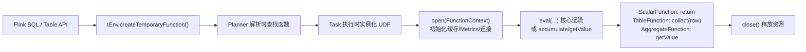

# UDF 自定义函数接入

> 验证版本：Flink 1.20.0

## 来源
- [史上最全Flink1.20.0 UDF 使用教程](../文章/done-史上最全Flink1.20.0 UDF 使用教程，1.6w字从0到1教你学会各种自定义 UDF 的使用.md)
- [Flink SQL 实战](../文章/done-Flink SQL 实战.md)

## 核心问题
Flink SQL 内置函数不满足业务时如何自定义扩展？三类 UDF（ScalarFunction / TableFunction / AggregateFunction）各自的继承方式、方法约定和注意事项分别是什么？生产环境如何为 UDF 加监控和缓存？

## 判断准则

### 函数类型选型

| UDF 类型 | 继承类 | 输入→输出 | 适用场景 |
|---|---|---|---|
| ScalarFunction (UDF) | `ScalarFunction` | 单/多行输入 → 单字段输出 | 字符串转换、类型转换、JSON 解析 |
| TableFunction (UDTF) | `TableFunction<T>` | 单行输入 → 多行输出 | 行展开、JSON 数组拆平 |
| AggregateFunction (UDAF) | `AggregateFunction<T, ACC>` | 多行输入 → 单行输出，需维护中间 ACC | 自定义聚合逻辑、移动平均 |

### 核心方法约定
- **ScalarFunction**：重写 `eval(...)` 方法，方法名不可改，参数/返回类型可定制
- **TableFunction**：重写 `eval(...)` 并调用 `collect(row)` 输出行；多字段输出必须用 `@FunctionHint` 注解声明 ROW 类型
- **AggregateFunction**：必须实现 `createAccumulator()` + `accumulate(ACC, ...)` + `getValue(ACC)`；可选实现 `merge(ACC, Iterable<ACC>)` 和 `resetAccumulator(ACC)`

### 注册与使用
```java
// 临时函数（当前 Session 有效）
tEnv.createTemporaryFunction("myFunc", MyScalarFunction.class);
tEnv.executeSql("SELECT myFunc(field) FROM t");
```

### 生命周期方法（进阶）
- `open(FunctionContext context)`：初始化资源（缓存、Metrics、连接池），在 TaskManager 启动时调用
- `close()`：释放资源
- Metrics 注册必须在 `open` 中通过 `context.getMetricGroup()` 完成

### 生产优化清单
| 优化点 | 实现方式 | 边界 |
|---|---|---|
| JSON 解析缓存 | 使用 Caffeine 在 `ScalarFunction` 内建本地 LRU 缓存 | 缓存仅 TaskManager 本地有效，30min + 1000条上限是示例值，需按业务调整 |
| Metrics 监控 | `open` 方法注册 Gauge/Counter，暴露解析耗时、异常次数 | 统计项必须声明为 `transient`，否则序列化报错 |
| 防止异常雪崩 | catch Exception 后指数退避打印日志（每 1/10/100...次打一次） | 不能静默吞 Exception，必须记录异常频次 |

### FunctionHint 多字段输出示例（UDTF）
```java
@FunctionHint(
    input = @DataTypeHint("STRING"),
    output = @DataTypeHint("ROW<col1 STRING, col2 INT>")
)
public class MyUDTF extends TableFunction<Row> {
    public void eval(String s) {
        collect(Row.of("value", 1));
    }
}
```

## 认知偏差
| 常见错误认知 | 正确理解 |
|---|---|
| eval 方法名可以随意改 | ScalarFunction/TableFunction 的入口方法名必须是 `eval`，Flink 通过反射查找 |
| UDAF 只需实现 accumulate 就够了 | 还必须实现 `createAccumulator()` 和 `getValue()`；分布式场景 `merge()` 也要实现 |
| TableFunction 返回多字段可以直接 collect(a, b, c) | 必须 collect(Row.of(...))，且需通过 `@FunctionHint` 声明 ROW 类型或重写 `getResultType()` |
| UDF 天然线程安全 | 每个 Task 有自己的函数实例，实例变量不跨 Task 共享，但 static 成员/缓存要注意并发安全 |
| 在 eval 方法里直接打 Logger | 高频调用下 Logger 会产生大量 String 拼接开销；应使用异常计数器降频打日志 |

## 架构/流程图



## 待验证缺口
- `@FunctionHint` 和 `getResultType()` 在 Flink 1.20 同时存在时的优先级
- `createTemporaryFunction` vs `createTemporarySystemFunction` 的作用域差异
- UDAF 在流式场景下 `resetAccumulator` 的实际触发时机
- Caffeine 缓存在 TaskManager OOM 时的行为（是否会被 GC 回收）

## 重新蒸馏补充（2026-06-18）

| 来源 | 认知增量 | 处理 |
|---|---|---|
| [[03_数据工程与数仓/0303_实时计算/030301_Flink/文章/done-基于 FFI 的 PyFlink 下一代 Python 运行时介绍]] | 补充该主题的生产案例、机制边界或排重样例。 | 重新判断后补入目标知识产物 |
