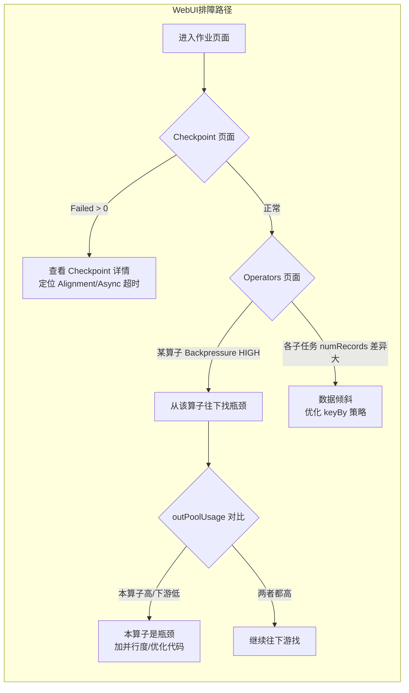

# Web UI 指标解读与排障切入点

## 来源
- [Flink Web UI详解【忍不住收藏系列】](../文章/done-Flink Web UI详解【忍不住收藏系列】.md)
- [Flink生产实时监控和预警配置解析](../文章/done-Flink生产实时监控和预警配置解析.md)
- [Flink技术实践-监控指标异常诊断与运维](../文章/done-Flink技术实践-监控指标异常诊断与运维.md)
- [Flink 性能调优实战](../文章/done-Flink 性能调优实战.md)

## 核心问题
Web UI 各页面和指标分别反映什么？拿到一个有问题的作业，应该按什么顺序看哪些指标？

## 判断准则

### Checkpoints 页面关键字段

| 字段 | 含义 | 异常阈值 |
|---|---|---|
| Triggered | 已触发检查点总数 | - |
| In Progress | 当前进行中检查点数 | 持续 > 1 说明上一个还没完成 |
| Completed | 成功完成总数 | - |
| Failed | 失败总数 | > 0 需关注 |
| End to End Duration | 端到端完成时长 | 超过 timeout（默认 10 分钟）则失败 |
| Checkpointed Data Size | 当次快照数据量 | 持续增长说明状态膨胀 |
| Checkpoint Type | aligned / unaligned | - |

### Operators/SubTask 页面关键指标

| 指标 | 含义 | 排障用途 |
|---|---|---|
| Backpressured | 算子受到反压的比例 | High = 下游拖慢了该算子 |
| Busy | 算子实际处理数据的忙碌度（max） | 接近 100% = CPU/处理能力瓶颈 |
| Idle | 算子等待输入的比例 | Idle 高但 Backpressure 也高 = 反压从更下游来 |
| numRecordsInPerSecond | 每秒输入记录数 | 各并发子任务差异大 = 数据倾斜 |
| numRecordsOutPerSecond | 每秒输出记录数 | - |
| outPoolUsage | 输出网络缓冲区使用率 | 接近 1.0 = 下游对该算子施压 |
| inPoolUsage | 输入网络缓冲区使用率 | 持续升高 = 本算子消费跟不上 |

### 反压定位规则（通过 outPoolUsage 精确定位）
- 某算子 `outPoolUsage` 很高，而其下游的 `inPoolUsage` 正常 → 瓶颈在**该算子自身**
- 某算子 `outPoolUsage` 很高，且下游 `inPoolUsage` 也很高 → 瓶颈在**更下游**
- 从 Sink 往 Source 方向逐级查看，第一个 Backpressure 为绿色/OK 的算子的**直接下游**就是瓶颈

### disableOperatorChaining 排障技巧
默认情况下多个算子会被 chain 在一起，导致无法单独观察每个算子的反压。当 group by/join 后无法定位具体反压位置时：
```java
env.disableOperatorChaining(); // 禁止算子链，每个算子独立显示
```
拆开后再从最上游往下数，找到第一个反压为绿色的算子，其下游即瓶颈。

### 本地调试开启 Web UI
```java
// 默认本地模式不开 Web UI，需要：
StreamExecutionEnvironment env =
    StreamExecutionEnvironment.createLocalEnvironmentWithWebUI(new Configuration());
```
同时 pom 需要添加 `flink-runtime-web` 依赖。on yarn 模式默认可查看 Web UI。

### Managed Memory 满了的原因
托管内存（Managed Memory）主要用于三个场景：
1. 批处理算法（排序、HashJoin）——从 MemoryManager 请求堆外内存
2. RocksDB StateBackend——Flink 预留空间但由 RocksDB 自行通过 JNI/malloc 分配，属于 OpaqueMemoryResource
3. PyFlink——Python 进程交互内存

RocksDB 的托管内存使用量可能超出 Flink 配置值（见 Shopify 案例：配置 5.9 GB 实际用了 6.74 GB），原因是 RocksDB 块缓存填满后继续占用。

## 认知偏差

| 常见错误认知 | 正确理解 |
|---|---|
| Backpressure 高的算子就是瓶颈 | Backpressure 高说明该算子被下游拖累，真正瓶颈是它的下游 |
| Busy 低就说明没问题 | Busy 低但 Backpressure 高，说明算子在等待下游消费，本身并不是瓶颈 |
| Web UI 足以替代外部监控系统 | Web UI 无告警、无历史趋势、无法大规模监控，只适合偶尔调试检查 |
| Kafka Lag 能直接反映 Flink 消费状态 | Flink 只在 Checkpoint 时提交 offset，Kafka Lag 图形是锯齿状，仅代表一段时间内的积压量 |
| Checkpoint Data Size 就是增量大小 | Flink 1.15 前对增量 Checkpoint 该字段只显示增量字节，需用 lastCheckpointFullSize 才能看完整大小 |

## 架构/流程图



## 待验证缺口
- Flink 1.17+ Backpressure 检测机制是否改为基于 mailbox 而不是线程栈采样，影响 Web UI 刷新延迟
- Buffer Debloating（`taskmanager.network.memory.buffer-debloat.enabled`）开启后对 inPoolUsage 指标的影响
