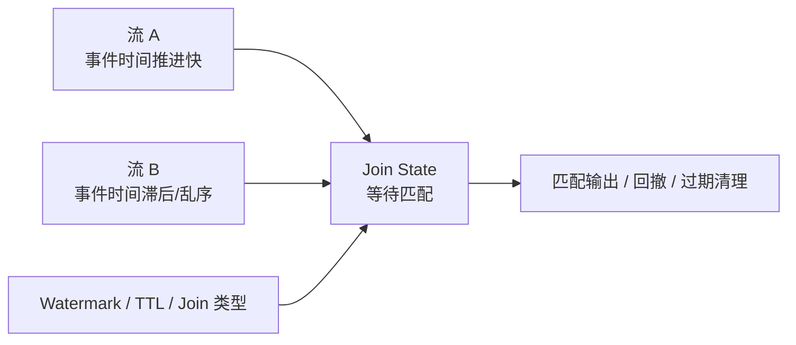

# Flink 双流 Join 状态膨胀与构建端选择

## 原文锚点

- 本地文件：[性能翻倍！Flink双流JOIN核心优化技巧揭秘，告别状态膨胀](../文章/性能翻倍！Flink双流JOIN核心优化技巧揭秘，告别状态膨胀.md)
- 原文链接：`https://mp.weixin.qq.com/s?__biz=MzU2MTg5ODU2NA==&mid=2247484010&idx=1&sn=ea59ab8523f9f69c13a71215e94c9372`
- 关键段落：文章用 Build Side / Probe Side 解释双流 Join 的状态膨胀，并提到 `BROADCAST`、`SHUFFLE_HASH` Hint。
- 关键图：无技术图。

## 图片处理

| 图片 | 类型 | 是否保留 | 理由 | 处理方式 |
|---|---|---|---|---|
| 无 | 无 | 不适用 | 文章没有技术图 | 用 Mermaid 重建状态等待关系 |

## 一句话结论

文章有启发，但需要校准：Flink 双流 Join 的状态膨胀不能只用传统 Hash Join 的 Build Side 思维解释，真正要看 Join 类型、时间边界、Watermark、State TTL 和下游回撤语义。

## 用户相关性判断

| 项 | 内容 |
|---|---|
| 用户当前认知层级 | Flink / Flink SQL：L2-L3 |
| 认知成熟度 | draft |
| 阅读投入建议 | 精读 |
| 阅读投入理由 | 能提醒状态膨胀问题，但缺少版本、执行计划、状态指标和完整复现实验 |
| 对用户的新信息 | 把 Join 性能问题和状态缓存、事件时间推进联系起来 |
| 问题指纹 | Flink + Join + Build Side/Watermark/State + 状态膨胀 + 不把流 Join 简化成传统 Hash Join |
| 排重判断 | 新建 |
| 置信度 | 中 |

## 认知校准点

| 校准点 | 文章观点/信息 | 与用户认知或价值观的关系 | 处理建议 |
|---|---|---|---|
| Build Side 类比有用但不完整 | 原文把流 Join 类比成构建哈希表和探测 | 这能帮助入门，但对 Flink 流语义过度简化 | 保留启发，补充 Join 类型和状态边界 |
| 状态膨胀不只是谁小谁先 | 原文口诀是“谁小谁先，谁早谁建” | 用户需要可复用准则，不能只记口诀 | 改写为“先确定 Join 语义和过期边界，再看 Hint” |
| `BROADCAST` 不等于免费 | 广播小表适合维表 | 广播会带来每个并发全量内存和网络开销 | 只用于足够小、变化可控的维表 |
| `SHUFFLE_HASH` 需要版本和计划验证 | 原文把 Hint 当成优化利器 | 实际是否生效要看 Flink 版本、Planner、Join 类型和执行计划 | 后续实践必须检查 explain plan 和状态指标 |

## 冲突点

| 冲突类型 | 具体表现 | 影响 | 处理 |
|---|---|---|---|
| 证据不足 | 标题说性能翻倍，但没有基线、数据量、版本和指标 | 不能沉淀为性能结论 | 只保留机制和待验证动作 |
| 标题降权 | “性能翻倍”“告别状态膨胀” | 容易夸大 Hint 效果 | 降权标题，只看机制 |
| 实践门槛不足 | 有 SQL 示例但无完整复现实验 | 不能直接判实践 | 降为精读 |

## 待吸收点

| 分级 | 内容 | 为什么值得吸收 | 后续动作 |
|---|---|---|---|
| 理解 | 双流 Join 状态膨胀来自等待匹配的数据无法及时清理 | 这是 Flink Join 生产问题核心 | 后续补状态指标和 TTL 配置 |
| 理解 | 事件时间和 Watermark 推进速度会影响匹配与清理 | 比单纯数据量更接近流处理本质 | 对比 Regular Join 和 Interval Join |
| 记住 | 小维表可以考虑 Broadcast，但要计算每个并发的内存复制成本 | 避免把广播当成默认优化 | 实践时看维表大小、更新频率、并发数 |
| 记住 | 两条大流 Join 优先先限制时间边界，再谈分区和构建端 | 控制状态上限比口诀更重要 | 优先考虑 Interval Join 或 State TTL |
| 了解 | `SHUFFLE_HASH` Hint 可表达分区和构建端倾向 | 可能作为调优工具 | 需要版本和 explain 验证 |

## 已知可跳过

| 内容 | 跳过理由 |
|---|---|
| Flink 可用于实时数仓、风控、用户行为分析 | 用户大概率已知 |
| Join 会消耗资源 | 基础常识 |
| 文章末尾推广内容 | 不进入知识点 |

## 实践门槛

| 门槛 | 判断 | 证据 |
|---|---|---|
| 可运行 | 部分 | 有 SQL Hint 示例，但没有完整 DDL、数据和版本 |
| 可验证 | 否 | 没有状态大小、吞吐、反压、延迟指标 |
| 可排障 | 部分 | 提到状态膨胀，但没有指标路径 |
| 可迁移 | 是 | 可迁移到实时数仓 Join 设计 |
| 结论 | 降为精读 | 需要另补最小实验才能实践 |

## 归类判断

| 项 | 内容 |
|---|---|
| 技术本体 | Flink SQL Join |
| 文章主问题 | 双流 Join 状态膨胀和 Hint 优化 |
| 使用场景 | 实时数仓、实时风控、行为流关联 |
| 关键词干扰 | JOIN、Hash、Broadcast 可能让人联想到数据库查询优化 |
| 最终归类 | 数据工程与数仓 / 实时计算 |
| 归类理由 | 主问题是有状态流计算，不是 OLAP 查询执行 |

## 技术定位

| 项 | 内容 |
|---|---|
| 技术类型 | 实时计算引擎模块 |
| 所属领域 | 数据工程与数仓 |
| 二级类目 | 实时计算 |
| 全局架构位置 | Flink SQL 流处理中的 Join 算子和状态管理 |
| 涉及模块 | Join、State、Watermark、Hint、Shuffle、维表 |
| 解决问题 | 控制双流 Join 的状态膨胀和资源消耗 |
| 原文局限 | 缺少 Join 类型区分、版本、执行计划、实验指标 |
| 我的结论 | 以后关注，作为 Flink Join 状态治理的校准点 |

## 跨域判断

| 问题 | 判断 |
|---|---|
| 它本体属于哪里 | 数据工程与数仓 / 实时计算 |
| 这篇文章为什么可能跨域 | Join 和 Hash 也属于数据库查询优化概念 |
| 当前文章主问题是否改变分类 | 不改变，重点是 Flink 流状态 |
| 应避免的误归类 | 不归到 OLAP 与数据库 / 查询优化 |

## 纵向理解

| 维度 | 判断 |
|---|---|
| 全局架构 | Source -> Flink SQL Planner -> Join 算子 -> State Backend -> Sink |
| 本文位置 | Join 算子的状态构建、等待匹配和 Hint 调优 |
| 核心机制 | 匹配前需要缓存对端数据，缓存边界由 Join 语义、时间和清理策略决定 |
| 使用链路 | 判断 Join 类型 -> 控制时间边界 -> 观察状态大小 -> 再考虑 Broadcast/Shuffle Hint |
| 前置条件 | 需要知道流大小、乱序程度、Watermark、TTL、下游是否支持回撤 |
| 边界 | 对无界 Regular Join，单靠构建端选择不能根治状态增长 |

## 横向对标

| 对标技术 | 实现方式 | 优势 | 劣势 | 适合场景 |
|---|---|---|---|---|
| Regular Join | 双流全量匹配，状态可能长期保留 | 语义直接 | 状态容易无限增长，Outer Join 有回撤 | 需要完整关联且能承受状态成本 |
| Interval Join | 限定时间区间匹配 | 状态可按时间过期 | 只适合有时间窗口边界的关联 | 日志流、行为流时间邻近关联 |
| Temporal Join | 按时间匹配维表历史版本 | 适合版本化维度 | 依赖版本语义 | 汇率、价格、维度历史 |
| Lookup Join | 查询外部维表 | 状态少，接入存储系统 | 外部存储延迟和吞吐成为瓶颈 | Redis/MySQL/HBase 维表关联 |
| Spark SQL Join | 批处理 Join 策略 | 批量优化成熟 | 不解决无界流状态问题 | 离线计算、批 SQL |

## 后续追查

- 关键词：Flink Regular Join、Interval Join、Temporal Join、Lookup Join、State TTL、Watermark、Join Hint。
- 相关技术：RocksDB State Backend、Checkpoint、反压、Doris/Paimon 下游一致性。
- 需要补读的文章：Flink SQL Join 官方文档、Flink 背压排查、Checkpoint 调优。
