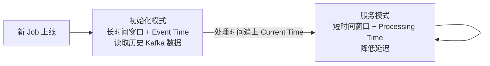
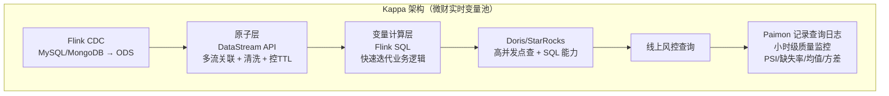

# Flink 实时特征与变量计算架构模式

## 来源
- [Airwallex 基于 Flink 打造实时风控系统](../文章/done-Airwallex 基于 Flink 打造实时风控系统.md)
- [微财基于Flink构造实时变量池](../文章/done-微财基于Flink构造实时变量池.md)

## 核心问题
金融风控/推荐类场景需要实时计算特征/变量，如何设计 Flink 架构才能同时满足：历史数据回溯初始化、快速迭代发布、多流关联状态可控？

## 判断准则

### Lambda vs Kappa 选型
| 决策点 | Lambda | Kappa |
|---|---|---|
| 适用场景 | 对批处理结果有强需求、允许数据有微小差异 | 需要百分百一致性；同一逻辑只维护一份代码 |
| 一致性保证 | 难以保证流批完全一致（UDF 行为差异、SQL 方言差异） | 依赖 Flink Exactly-Once 严格保证 |
| 开发成本 | 需维护两套系统（Flink + Spark/Hive） | 只需维护一套，但对 Flink 开发能力要求高 |
| 风控/金融场景 | 不推荐（微差异影响模型判断） | 推荐 |

### Kappa 架构的历史数据回溯问题（Airwallex 解法）

**问题**：新 Feature 上线时需要回溯数周历史数据初始化状态，无法直接用短窗口流处理。

**解决方案：双模式自动切换**



- 初始化阶段：使用大窗口 + Event Time，把流当批来处理历史数据
- 追上后：自动切换短窗口 + Processing Time，降低实时服务延迟
- 切换信号：通过标志文件或共享存储暴露当前状态，由 Flink Operator 调度切换

### Feature/变量幂等生成（高可用冗余部署关键）

**问题**：Feature Generation Job 出 bug 需要修复并重新计算，不能停服。

**冗余部署约定（Airwallex）**：
1. 使用 Feature Name 作为唯一标识
2. Feature Version 单调递增，写入时自动 Merge（新版本覆盖旧版本）
3. Inference 引擎始终消费最新版本数据
4. **发布要求**：Feature 必须向后兼容；不能向后兼容时换新名字

**发布流程**：
```
修复 bug → 推送新 DSL + Version+1 → 新 Job 进入 Catchup Mode（读历史数据重算）
→ 旧 Job 继续服务（降级状态）→ 新 Job 追上后下线旧 Job
```

### 多流关联状态膨胀解决方案（微财解法）

**问题**：Flink `connect` API 做多流关联时，每对流的 join 都需要独立维护状态，状态冗余且代码复杂。

**解决方案：Union + keyBy 替代 connect**

```java
// 不推荐：多路 connect，每对都有独立状态
stream1.connect(stream2).process(...)
       .connect(stream3).process(...)

// 推荐：统一打标签后 union，再 keyBy 进入同一个 ProcessFunction 管理
DataStream<Event> merged = stream1
    .map(e -> tag(e, "type1"))
    .union(stream2.map(e -> tag(e, "type2")))
    .union(stream3.map(e -> tag(e, "type3")));

merged.keyBy(Event::getId)
      .process(new MultiSourceStatefulProcess());  // 统一状态管理
```

效果：所有相关流共享同一个 State，状态不冗余；ProcessFunction 内按 tag 区分来源。

### 数据分层设计提升开发效率（微财解法）

**问题**：快速迭代的变量逻辑要求频繁修改 SQL，但 DataStream API 做数据清洗状态管理更精确。

**分层策略**：
- **原子层（DataStream API）**：多流关联、数据清洗、字段打宽；严格控制各数据源的 TTL，防止状态膨胀
- **变量计算层（Flink SQL）**：在打宽的宽表基础上做业务逻辑计算；SQL 变更无需修改底层状态，快速迭代

实际效果：整体开发效率提升约 30%（相比纯代码实时计算）。

### 模型-Feature 依赖管理（Airwallex）

**问题**：不同模型依赖不同 Feature，每个 Feature 对应独立 Flink Job，如何避免启动不必要的 Job？

**解法**：维护 Model → Feature → Job 的 Metadata 依赖链；部署新版模型时，反推所有依赖 Feature，只调度必要的 Job。

## 认知偏差
| 常见错误认知 | 正确理解 |
|---|---|
| Kappa 架构没法处理历史数据初始化 | 通过长窗口 + Event Time 的初始化模式，把流当批来回溯历史数据 |
| 多流关联必须用 connect API | Union + keyBy 可以用单一 ProcessFunction 管理多流状态，更简洁且状态不冗余 |
| 实时特征计算必须全用 DataStream API | 分层设计：原子层用 DataStream，计算层用 Flink SQL，可兼顾状态精确控制与快速迭代 |
| Feature 冗余部署会产生数据冲突 | 幂等版本管理（Version 单调递增 + Merge）确保冗余 Job 输出的数据不冲突 |

## 架构/流程图



## 待验证缺口
- Union + keyBy 方案在超大数量流（> 10 路）时的性能边界
- 初始化模式切换服务模式的时机判断（如何设置安全边界防止过早切换）
- 变量质量监控中 PSI 告警阈值的业务经验（通用参考值）

## 重新蒸馏补充（2026-06-18）

| 来源 | 认知增量 | 处理 |
|---|---|---|
| [[03_数据工程与数仓/0303_实时计算/030301_Flink/文章/done-Flink 流批一体在模型特征场景的使用]] | 补充该主题的生产案例、机制边界或排重样例。 | 重新判断后补入目标知识产物 |
