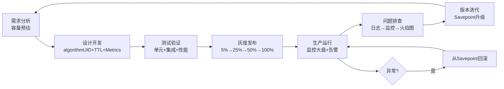

# Flink 生产最佳实践

## 来源
- [Flink 作业全生命周期管理——从开发到上线的完整实践](../文章/done-flink生产问题思考-Flink 作业全生命周期管理——从开发到上线的完整实践.md)
- [快手 Flink 的稳定性和功能性扩展](../文章/done-快手 Flink 的稳定性和功能性扩展.md)
- [汽车之家基于 Flink 的实时计算平台 3.0 建设实践](../文章/done-汽车之家基于 Flink 的实时计算平台 3.0 建设实践.md)
- [Airwallex 基于 Flink 打造实时风控系统](../文章/done-Airwallex 基于 Flink 打造实时风控系统.md)
- [微财基于Flink构造实时变量池](../文章/done-微财基于Flink构造实时变量池.md)

## 核心问题
生产 Flink 作业从开发到运维应该遵循哪些关键准则？哪些设计决策决定了作业的可维护性、可恢复性和稳定性？

## 判断准则

### 开发阶段强制项
| 准则 | 理由 | 边界 |
|---|---|---|
| 所有算子必须设置 uid | 保证状态兼容，Savepoint/Checkpoint 恢复依赖算子 uid | 未设置 uid 的作业升级时会因状态 key 变化导致恢复失败 |
| 状态必须设置 TTL | 防止状态无限增长；Flink 1.18+ 支持算子级细粒度 TTL | TTL 影响语义，需结合业务保留期，不能随意设小 |
| 所有异常必须 catch 并记录 | 未捕获异常会触发 TaskManager 失败，重启放大延迟 | 不能吞掉异常不记录，否则脏数据无法感知 |
| 关键算子添加自定义 Metrics | Counter/Gauge/Histogram 是问题定位的第一线索 | 避免在热路径中频繁创建 Metric 对象 |
| 单元测试覆盖核心逻辑（乱序、版本单调性） | 流数据乱序是常态，未测试乱序场景的作业上线必出问题 | MiniCluster 集成测试验证端到端语义 |

### 上线阶段关键决策
| 决策点 | 推荐做法 | 风险 |
|---|---|---|
| 版本管理 | 用 Savepoint 做作业版本快照；升级走"触发 Savepoint → 停旧作业 → 新版本 -s 启动"三步 | 跳过 Savepoint 直接重启会丢失窗口状态和 offset |
| 灰度发布 | 5% → 25% → 50% → 100%，每阶段观察 Checkpoint 成功率和反压 | 直接全量上线，出问题时回滚时间窗口窄 |
| 回滚预案 | 上线前保留前一个 Savepoint；新版本异常时直接从旧 Savepoint 启动旧 jar | 没有可用 Savepoint 时只能从 Checkpoint 恢复，可能有数据重复 |
| 监控大盘就绪 | 上线前验证 Prometheus 指标、Grafana 面板、告警规则均已生效 | 上线后才配监控相当于盲飞 |

### 日常运维关键指标与阈值
| 指标 | 告警阈值 | 含义 |
|---|---|---|
| Checkpoint 成功率 | < 99% | Checkpoint 频繁失败预示状态问题或背压积累 |
| 背压水平 | > 50% 持续 10 分钟 | 下游瓶颈或数据倾斜 |
| GC 时间 | > 10 秒/分钟 | 内存配置不足或状态过大 |
| RocksDB 缓存命中率 | < 80% | 状态访问频繁 miss，磁盘 IO 成为瓶颈 |
| 状态增长趋势 | predict_linear 7天后 > 10GB | 状态 TTL 未生效或业务量激增 |

### 问题排查 SOP（顺序不能乱）
1. 查告警 → 确认发生时间、影响范围、是否持续
2. 查日志 → JobManager 日志 → TaskManager 日志 → 错误堆栈
3. 查监控 → CPU/内存趋势 → GC → 背压指标 → Checkpoint 状态
4. 分析火焰图 → 找热点方法和等待线程
5. 定位根因 → 代码/配置/外部依赖
6. 制定方案 → 临时（恢复业务）+ 长期（彻底解决）
7. 灰度验证 → 全量上线

### 常见问题速查
| 现象 | 优先排查 | 解决方向 |
|---|---|---|
| 背压 100% | 下游算子 out rate 低 | 增加并行度、优化外部调用（Redis 替代慢 DB） |
| Checkpoint 超时 | 状态大 + 背压 | 开启非对齐 Checkpoint；调优 RocksDB |
| OOM | 内存不足或状态膨胀 | 增加 TM 内存；检查 TTL 是否生效 |
| 数据倾斜 | subtask 指标差异 | key 加盐；两阶段聚合；自定义分区 |
| TaskManager 失联 | 网络/磁盘/GC | 检查网络；增加心跳超时；排查 GC 日志 |

### 自动化运维能力（大规模平台必备）
- **作业分级**：P0 双 AZ 热备 / P1 冷备 / P2 普通 / P3 可抢占（资源紧张时低优作业让出资源）
- **自动迁移**：机器下线时自动触发 Savepoint → 在新机器恢复（避免人工介入）
- **弹性伸缩**：根据 Kafka 消费 lag + CPU 使用率自动调并行度；扩容时提前申请资源再切换，避免等待
- **故障归因自动化**：将运维经验沉淀为归因库，作业失败时自动匹配已知模式并推送根因

## 认知偏差
| 常见错误认知 | 正确理解 |
|---|---|
| 直接重启可以恢复作业 | 未使用 Savepoint 的重启会丢失窗口和聚合中间状态 |
| 资源按峰值静态配置即可 | 静态配置导致低峰期资源浪费；应使用弹性伸缩 |
| 上线后再配监控 | 监控必须上线前就绪，否则出问题无法发现 |
| 状态只要 Checkpoint 就够了 | 业务升级时 Checkpoint 不跨版本；Savepoint 才是版本迁移的工具 |
| 反压就是背压告警，处理背压只需加并行度 | 背压是症状，根因可能是外部 Sink 慢、数据倾斜、代码热点；盲目加并行度可能加重倾斜 |

## 架构/流程图

### 流批混部资源调度准则（大规模平台）
来源：B站 FFA 2023 实践

| 场景 | 决策 | 理由 |
|---|---|---|
| 流批共存调度器 | 流用默认调度器（K8s Default Scheduler），批用 Volcano | 流任务 Long Running，Container 申请频率低；批任务频繁申请 Container，共用调度器会阻塞流任务申请 |
| Shuffle 服务 | 批用 Apache Celeborn（Remote Shuffle）替代本地磁盘 | 计算存储解耦，避免流批磁盘争抢；TM 挂掉不丢 Shuffle 数据 |
| JVM 版本 | 升级到 JDK 17，开启 GC 内存返还 | JDK 12+ 支持 GC 向 OS 返还内存；B站测试集群内存节省超 15%，利于流批混部 |
| 错峰资源 | 批任务集中在夜间（2-6 点），利用流任务夜间低谷资源 | 整体集群利用率可达 70%+ |
| 混部保护阈值 | 流资源占用上限 80%，剩余可供批任务抢占 | 防止批任务挤垮流任务 |

### 弹性伸缩决策规则（快手/汽车之家实践）
- **扩容触发**：Kafka 消费 lag 增加 AND CPU 使用率低（IO 密集型任务）→ 增加并行度
- **缩容触发**：空闲 slot 存在 → 减少并行度，释放资源
- **CPU 维度**：CPU 使用率持续高 → 扩 CPU；使用率低 → 缩 CPU
- **内存维度**：内存使用率高 OR GC 频繁 → 扩内存
- **扩容实现要点**：提前申请新 Container → 切换 → 释放旧 Container（避免资源等待导致 slot 申请失败）

### 故障归因自动化要素
来源：快手 FFA 2022 实践

- **硬件故障难定位的原因**：磁盘坏道/内存错误/网卡异常导致作业卡顿但不彻底失败，指标异常但难以直接定位
- **应对四层**：
  1. 自动拉黑：作业维度和平台维度的机器黑名单
  2. 智能归因：监控算子异常（延迟/吞吐/快照指标明显异常），自动拉黑
  3. 人工快速识别：计算异常作业的共同机器，批量拉黑
  4. 实时故障指标库：持续积累已知 Case，新问题匹配后快速处理
- **作业性能诊断顺序**：宽泛检查（资源打满/数据倾斜）→ 找第一个有问题的 Task（看 Checkpoint 失败或反压递归追溯）→ 返回该 Task 的资源/线程信息

## 待验证缺口
- 不对齐 Checkpoint 在什么状态大小下性价比优于对齐 Checkpoint
- 弹性伸缩触发阈值（背压 > 70%、CPU < 20%）在不同作业类型下的适配性
- Savepoint 触发时间对生产 SLA 的实际影响范围
- Celeborn vs Flink 原生 Shuffle 在中小规模（< 100 台）的性价比临界点

## 重新蒸馏补充（2026-06-18）

| 来源 | 认知增量 | 处理 |
|---|---|---|
| [[03_数据工程与数仓/0303_实时计算/030301_Flink/文章/done-基于 Flink x TiDB，智慧芽打造实时分析新方案]] | 补充该主题的生产案例、机制边界或排重样例。 | 重新判断后补入目标知识产物 |
| [[03_数据工程与数仓/0303_实时计算/030301_Flink/文章/done-如何设计出高质量Flink系统]] | 补充该主题的生产案例、机制边界或排重样例。 | 重新判断后补入目标知识产物 |
