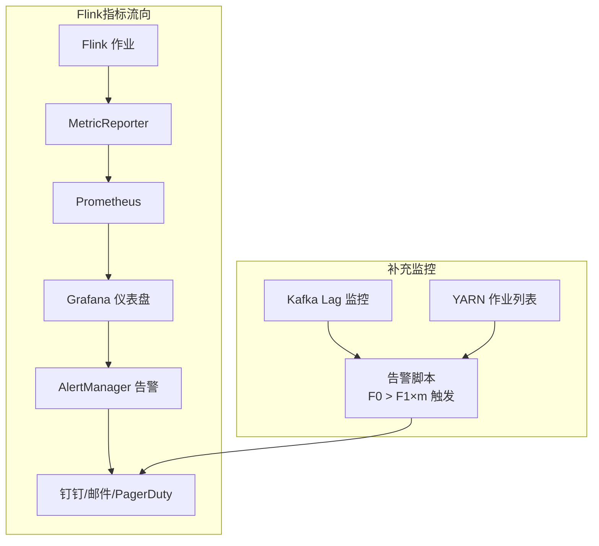

# 监控告警体系

## 来源
- [Flink技术实践-监控指标异常诊断与运维](../文章/done-Flink技术实践-监控指标异常诊断与运维.md)
- [Flink生产实时监控和预警配置解析](../文章/done-Flink生产实时监控和预警配置解析.md)
- [监控大型 Apache Flink 应用程序，第 1 部分：概念和持续监控!](../文章/done-监控大型 Apache Flink 应用程序，第 1 部分：概念和持续监控!.md)

## 核心问题
大规模 Flink 作业应该持续监控哪些指标？如何在故障发生前建立有效的告警体系？Web UI 能否替代外部监控系统？

## 判断准则

### 指标体系层级

| 层级 | 工具 | 适用场景 | 局限性 |
|---|---|---|---|
| 应用级自定义指标 | 代码埋点 + MetricReporter | 业务关键路径监控、SLA 管理 | 需要开发投入 |
| Flink 内置指标 | Prometheus/Grafana | 通用作业健康监控 | 覆盖场景有限 |
| 系统级指标 | Kubernetes/JVM metrics | 资源使用监控 | 无应用语义 |
| 日志 | ELK/日志平台 | 具体故障调试 | 不适合大规模持续监控 |
| Profiler | async-profiler/VisualVM | 性能瓶颈定位 | 开销大，不适合持续运行 |

**核心原则**：Web UI 只适合偶尔人工检查，严肃的生产监控必须通过 MetricReporter 导出到外部系统（Prometheus/Grafana 等）。

### 必监控指标清单（持续告警）

**作业健康类**
| 指标 | 告警条件 | 说明 |
|---|---|---|
| uptime | 突然归零或重启 | 作业是否在运行 |
| numRestarts | 持续增长 | 频繁重启是作业不稳定信号 |
| restartingTime | 高 | 恢复太慢影响延迟 SLA |

**Checkpoint 类**
| 指标 | 告警条件 | 说明 |
|---|---|---|
| numberOfFailedCheckpoints | > 0 | 失败次数超阈值立即告警 |
| lastCheckpointDuration | 接近 timeout | 建议告警阈值 = 均值 × 1.5 |
| lastCheckpointSize / lastCheckpointFullSize | 持续增长 | 状态膨胀征兆 |
| checkpointAlignmentTime | 异常高 | 通常由反压导致 Barrier 传播慢 |

注意：Flink 没有直接的"最后成功 Checkpoint 时间"指标，需通过 numberOfCompletedCheckpoints 最后一次增加的时间戳间接推算，或基于 Checkpoint 频率、连续失败次数设置告警。

**延迟类**
| 指标 | 告警条件 | 说明 |
|---|---|---|
| currentOutputWatermark | 与当前时间差距持续增大 | 事件时间偏差/滞后 |
| currentEmitEventTimeLag | 分钟级乃至小时级 | 数据处理延迟具象化 |
| records-lag-max（Kafka） | 持续增长 | Consumer 跟不上 Producer |
| millisBehindLatest（Kinesis） | 持续增长 | 同上，Kinesis 场景 |

**吞吐类**
| 指标 | 告警条件 | 说明 |
|---|---|---|
| numRecordsInPerSecond（Source） | 异常低或骤降 | 上游数据量异常 |
| numRecordsOutPerSecond（Sink） | 明显低于 Source | 产生积压 |

**资源类**
| 指标 | 告警条件 | 说明 |
|---|---|---|
| JVM Memory / container_memory_working_set_bytes | 接近 container_spec_memory_limit_bytes | 即将触发 OOM kill |
| TM CPU 使用率 | 长时间 > 80% | 资源不足或数据倾斜 |
| GC 时间占比 | > 5% | 内存压力过大 |

### 六类常见异常的诊断逻辑

| 异常类型 | 核心指标信号 | 定位路径 |
|---|---|---|
| 反压 | outPoolUsage 接近 1.0 / Backpressure HIGH | 从 Sink 往上找，比较 outPoolUsage 和下游 inPoolUsage |
| Checkpoint 超时 | lastCheckpointDuration 超 timeout | 看 Alignment Duration（反压）还是 Async Duration（状态过大）更长 |
| 数据倾斜 | 各子任务 numRecordsInPerSecond 差异悬殊 | 识别热 Key，采用打盐/两阶段聚合 |
| 资源错配 | TM CPU 全部高或全部低 | 排查 CPU 核数与 numberOfSlots 比例 |
| 稳定性风险 | numRestarts 持续累增 | 对照重启时间点看 JM/TM 日志 |
| 数据延迟 | currentEmitEventTimeLag 增长 | 上述五类问题的最终表现，需先找根因 |

### 告警设置建议（生产经验）
1. 优先在 Checkpoint 失败时而不是 Checkpoint 耗时延长时告警（减少误报）
2. Kafka Lag 告警需设置合理的预警倍数 m 和 Checkpoint 间隔 t：`F0 = lag/t`，当 `F0 > F1 × m` 时告警（F1 为 Flink 真实消费速度）
3. YARN 作业数量监控（`yarn application -list | grep "JobName" | wc -l`）与 Kafka Lag 综合判断：lag 正常但 YARN 查不到 → YARN 可能挂了，不要自动拉起
4. Flink 极限性能建议至少达到日常峰值的 2-3 倍，10 倍以上最佳

### 日常巡检清单（人工）
- 作业状态 RUNNING
- Checkpoint 成功率 100%
- 无持续红色/黄色反压
- JM/TM 资源在健康区间（CPU < 80%，内存有余量）
- 延迟指标符合 SLA
- 状态大小无异常增长
- numRestarts 无频繁增加

### 指标类型说明（Flink 原生）
- **Counter**：累积计数，如 numRecordsIn
- **Meter**：速率，如 numRecordsInPerSecond
- **Histogram**：分布统计，支持百分位数，适合延迟监控
- 自定义指标可通过继承 `RichFunction` 并调用 `getRuntimeContext().getMetricGroup()` 注册

## 认知偏差

| 常见错误认知 | 正确理解 |
|---|---|
| Web UI 就是监控系统 | Web UI 无告警、无历史、不适合大规模持续监控，必须通过 MetricReporter 导出到外部 |
| 禁用日志可以减小开销 | 日志对调试特定故障不可替代，不要为减小日志量而盲目禁用 |
| Kafka Lag 为零就说明 Flink 没问题 | 只在 Checkpoint 提交 offset，Lag 是锯齿状；且 Lag = 0 时仍可能有反压（消费速度恰好等于生产速度但没有冗余） |
| 自定义指标比内置指标更可靠 | 内置指标覆盖通用场景，自定义指标用于业务关键路径和特定 SLA 的精细监控，两者互补 |

## 架构/流程图

## 待验证缺口
- Flink 1.15 新增的 lastCheckpointFullSize 在各云厂商托管版本的可用情况
- currentOutputWatermark 在 Prometheus 中只有秒级精度，毫秒级延迟场景需要自定义直方图指标的具体实现方案
- 大规模作业（100+ 并发）Prometheus scrape 频率对 JobManager 的压力
