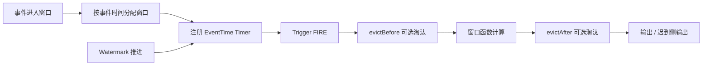

# Flink 窗口触发与状态淘汰边界

## 原文锚点

- 本地文件：[Flink 中的 EventTimeTrigger 和 ProcessingTimeTrigger 详解](<../文章/Flink 中的 EventTimeTrigger 和 ProcessingTimeTrigger 详解.md>)
- 本地文件：[白话Apache Flink FLIP-4 窗口清道夫升级：让数据淘汰更灵活](<../文章/白话Apache Flink FLIP-4 窗口清道夫升级：让数据淘汰更灵活.md>)
- 本地文件：[Flink高频问题-Watermark（水位线）是什么？如何处理乱序数据？](../文章/Flink高频问题-Watermark（水位线）是什么？如何处理乱序数据？.md)
- 原文链接：`http://mp.weixin.qq.com/s?__biz=MzIxMTE0ODU5NQ==&mid=2650248742&idx=1&sn=6c09219c8a18e4989812d568a91200b7`
- 原文链接：`http://mp.weixin.qq.com/s?__biz=Mzg2NTU4NzU4Mw==&mid=2247484458&idx=1&sn=8327d7a0b6cb5eb48bf63abbc1280cb6`
- 原文链接：`https://mp.weixin.qq.com/s?__biz=MzI3ODE4MjczNA==&mid=2651507919&idx=1&sn=657f6e9ea50ce28d8b5a00116be670e7`
- 关键段落：EventTimeTrigger 依赖 Watermark 推进；事件时间和处理时间 Timer 都进入优先队列；FLIP-4 引入 `evictBefore` 和 `evictAfter`；Watermark 在多输入算子处取最小值，并可配合迟到数据侧输出。
- 关键图：Watermark 示意图和窗口处理流程图在本地 Markdown 中没有图片链接；FLIP-4 文章只有文本流程块。

## 图片处理

| 图片 | 类型 | 是否保留 | 理由 | 处理方式 |
|---|---|---|---|---|
| Watermark 示意图 | 说明图 | 原图缺失 | 解释事件时间进度、窗口触发和迟到判断 | 标记缺失，Mermaid 重建 |
| Trigger Timer 队列 | 机制图 | 重建 | 原文源码说明 Timer 队列，但没有结构图 | Mermaid 重建 |
| Evictor 处理流程 | 流程图 | 重建 | 区分窗口状态淘汰和窗口函数过滤 | Mermaid 重建 |

## 一句话结论

Flink 窗口不是只看窗口大小：事件时间窗口依赖 Watermark 和 Timer 触发，Evictor 是窗口状态层面的淘汰机制，不能和窗口函数里的业务过滤混为一谈。

## 用户相关性判断

| 项 | 内容 |
|---|---|
| 用户当前认知层级 | Flink / Flink SQL：L2-L3 draft |
| 认知成熟度 | draft |
| 阅读投入建议 | 精读 |
| 阅读投入理由 | 这组文章补上实时计算类目缺失的窗口触发、迟到数据和窗口状态淘汰边界；代码和参数缺少完整运行环境，不能直接判实践 |
| 对用户的新信息 | EventTimeTrigger 是否触发取决于 Watermark 推进；Evictor 影响窗口状态本身，业务过滤只影响计算逻辑 |
| 问题指纹 | Flink + Window + Watermark/Timer/Evictor + 窗口触发与状态清理 + 乱序/迟到/状态成本边界 |
| 排重判断 | 新建；区别于 State TTL、SQL 大状态和 Join 状态膨胀，本文聚焦窗口生命周期 |
| 置信度 | 中 |

## 认知校准点

| 校准点 | 文章观点/信息 | 与用户认知或价值观的关系 | 处理建议 |
|---|---|---|---|
| 没有 Watermark，事件时间窗口不会按 EventTimeTrigger 正常触发 | EventTimeTrigger 在元素进入时注册事件时间 Timer，Watermark 推进后触发 `onEventTime` | 补充 Flink 时间语义边界 | 写入 Flink 窗口排重基线 |
| ProcessingTimeTrigger 更简单但可复现性更差 | 它依赖系统时间 Timer，而不是事件时间进度 | 纠偏：不能把低延迟等同于正确事件时间语义 | 生产指标窗口优先审查事件时间要求 |
| Evictor 不是窗口函数过滤 | Evictor 会在窗口管理层移除状态数据，窗口函数过滤只是计算时跳过 | 补充状态成本边界 | 对大窗口和异常值处理要先判断是否需要状态层淘汰 |
| Watermark 容忍乱序有准确性和延迟权衡 | 允许迟到越大，窗口等待和状态保留越久 | 符合用户重边界和工程代价偏好 | 不把允许迟到当成无成本兜底 |
| 原文对配置和版本缺少上下文 | Watermark 参数和 FLIP-4 行为没有给出明确 Flink 版本验证 | 需要降权，不直接复制生产配置 | 后续补官方文档和最小实验 |

## 冲突点

| 冲突类型 | 具体表现 | 影响 | 处理 |
|---|---|---|---|
| 图片缺失 | Watermark 示意图、窗口流程图只有文字或代码块 | 影响机制理解 | Mermaid 重建，后续回原文补图 |
| 证据不足 | 文章给出代码片段，但没有输入序列、输出结果和指标 | 不能判为实践 | 降为精读 |
| 版本边界 | FLIP-4 文章介绍接口变化，但没有核对当前版本状态 | 直接迁移存在风险 | 标为后续补证 |
| 排重边界 | Watermark 高频文偏基础，和 Trigger 文重叠 | 容易重复写入基础概念 | 只作为合并锚点，不单独成文 |

## 待吸收点

| 分级 | 内容 | 为什么值得吸收 | 后续动作 |
|---|---|---|---|
| 理解 | EventTimeTrigger 通过窗口最大时间注册事件时间 Timer，Watermark 推进时触发 | 解释窗口为什么不出结果或迟出结果 | 补一个 Watermark 不推进排障实验 |
| 理解 | 多输入算子的 Watermark 取各输入最小值 | 解释 Join 或多流窗口被慢流拖住 | 和 Flink Join 状态膨胀关联 |
| 理解 | Evictor 的 `evictBefore` 和 `evictAfter` 分别作用在窗口函数前后 | 影响状态保留、计算开销和业务结果 | 后续验证 Count/Delta/TimeEvictor 行为 |
| 记住 | Watermark、允许迟到、侧输出流共同决定迟到数据是等待、更新还是旁路处理 | 影响实时指标正确性 | 设计实时指标时先定义迟到数据策略 |
| 记住 | 窗口状态清理优先看业务语义，不能只为了省状态就提前淘汰 | 避免结果错误 | 与 State TTL 区分使用 |
| 实践 | 构造乱序事件流，对比 EventTimeTrigger、ProcessingTimeTrigger、allowed lateness 和 side output | 可验证窗口触发边界 | 待实验 |

## 已知可跳过

| 内容 | 跳过理由 |
|---|---|
| Flink 有滚动窗口、滑动窗口等基础类型 | 用户大概率已知 |
| Watermark 是处理乱序数据的常见机制 | 已有实时计算基础认知 |
| 传感器、交易等示例故事 | 只用于解释，不形成技术准则 |

## 实践门槛

| 门槛 | 判断 | 证据 |
|---|---|---|
| 可运行 | 部分 | 有 Trigger、Evictor、Watermark 代码片段 |
| 可验证 | 否 | 缺固定输入序列、窗口输出和迟到侧输出结果 |
| 可排障 | 部分 | 能解释 Watermark 不推进和迟到数据，但缺 Web UI/指标路径 |
| 可迁移 | 是 | 可迁移到实时指标、窗口聚合和多流 Join |
| 结论 | 降为精读 | 机制价值高，需另建实验才能实践 |

## 归类判断

| 项 | 内容 |
|---|---|
| 技术本体 | Flink 是有状态流处理和流批一体计算引擎 |
| 文章主问题 | 窗口何时触发、迟到数据如何判断、窗口状态如何淘汰 |
| 使用场景 | 实时聚合、乱序事件处理、异常数据剔除、窗口状态治理 |
| 关键词干扰 | FLIP、Trigger、Evictor、Watermark 可能被拆成源码或配置文章 |
| 最终归类 | 数据工程与数仓 / 实时计算 / Flink |
| 归类理由 | 主问题是 Flink 流式窗口语义，不是通用时间处理或业务过滤 |

## 技术定位

| 项 | 内容 |
|---|---|
| 技术类型 | 实时计算引擎模块 |
| 所属领域 | 数据工程与数仓 |
| 二级类目 | 实时计算 |
| 全局架构位置 | Source 时间戳抽取之后、窗口算子计算之前和状态管理之中 |
| 涉及模块 | Watermark、Trigger、Timer、Window State、Evictor、Side Output |
| 解决问题 | 控制无界流按时间边界产出结果，并处理乱序、迟到和窗口状态成本 |
| 原文局限 | 代码片段多，缺运行结果、版本边界和生产指标 |
| 我的结论 | 以后关注；作为 Flink 窗口和时间语义的基础排重入口 |

## 跨域判断

| 问题 | 判断 |
|---|---|
| 它本体属于哪里 | 数据工程与数仓 / 实时计算 / Flink |
| 这篇文章为什么可能跨域 | Watermark 和窗口也会出现在 Beam、Spark Streaming、Kafka Streams 中 |
| 当前文章主问题是否改变分类 | 不改变，文章围绕 Flink 窗口实现和 API |
| 应避免的误归类 | 不归入调度、OLAP 查询优化或通用 Java 定时器 |

## 纵向理解

| 维度 | 判断 |
|---|---|
| 全局架构 | Source 抽取时间戳 -> Watermark 生成传播 -> Window Assigner 分配窗口 -> Trigger 注册 Timer -> Window Function 计算 -> Evictor/迟到策略处理状态 |
| 本文位置 | 只讲窗口触发和状态淘汰，不讲状态后端和 Checkpoint 持久化 |
| 核心机制 | 事件时间 Timer 队列、处理时间 Timer 队列、Watermark 推进、Evictor 前后置淘汰 |
| 使用链路 | 定义事件时间字段 -> 选择 Watermark 策略 -> 设置窗口和 Trigger -> 判断 allowed lateness/side output -> 必要时配置 Evictor |
| 前置条件 | 事件时间字段可靠，乱序范围可估计，迟到数据处理策略明确 |
| 边界 | Watermark 过快会丢迟到数据，过慢会增加延迟和状态；Evictor 错用会改变业务结果 |

## 横向对标

| 对标技术 | 实现方式 | 优势 | 劣势 | 适合场景 |
|---|---|---|---|---|
| EventTimeTrigger | Watermark 推进触发事件时间 Timer | 结果贴近业务事件时间 | 依赖时间戳和 Watermark 正确性 | 订单、埋点、CDC 事件时间指标 |
| ProcessingTimeTrigger | 系统时间触发处理时间 Timer | 简单、低等待 | 乱序和重放时结果不稳定 | 低准确性要求的实时监控 |
| Window Evictor | 窗口函数前后移除窗口状态元素 | 可减少状态和复杂异常值影响 | 可能改变业务语义，增加开销 | 大窗口、异常值、质量控制 |
| 窗口函数内过滤 | 计算时跳过部分数据 | 逻辑简单 | 数据仍占状态，不能降低窗口状态 | 轻量业务过滤 |
| State TTL | 状态描述符级生命周期 | 适合 Keyed State 长期治理 | 不等同窗口边界 | 非窗口状态、Join、去重 |

## 后续追查

- 关键词：EventTimeTrigger、ProcessingTimeTrigger、InternalTimerService、WatermarkStrategy、allowed lateness、sideOutputLateData、Window Evictor、evictBefore、evictAfter。
- 相关技术：Flink State TTL、Flink SQL 窗口、Interval Join、反压、Checkpoint。
- 需要补读的文章：当前 Flink 官方窗口文档、Watermark idleness、多输入 Watermark、Evictor 当前版本行为。
