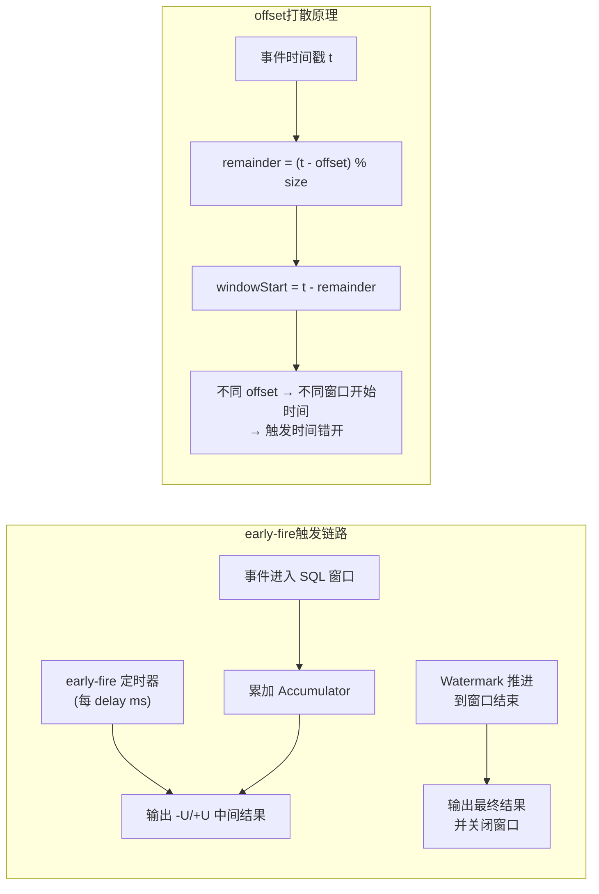

# 窗口高级特性：offset / early-fire / late-fire / 滑动实战

> 验证版本：Flink 1.15（early-fire 参数实测）

## 来源
- [Flink table 窗口聚合提前触发参数](../文章/done-Flink table 窗口聚合提前触发参数.md)
- [大数据flink面试系列-Flink窗口偏移的作用](../文章/done-大数据flink面试系列-Flink窗口偏移的作用.md)
- [Flinksql窗口都有哪些，使用案例技巧](../文章/done-Flinksql窗口都有哪些，使用案例技巧.md)
- [Flink实现运输公司车辆超速实时监测](../文章/done-Flink实现运输公司车辆超速实时监测.md)
- [如何实时统计最近 15 秒的商品销售额｜Flink-Learning 实战营](../文章/done-如何实时统计最近 15 秒的商品销售额｜Flink-Learning 实战营.md)

## 核心问题
Flink SQL 窗口默认只在窗口关闭时输出一次结果——1 天的窗口等到当天结束才触发，对实时业务毫无意义。同时，高并发场景下大量窗口对齐到同一时刻触发，造成 CPU/IO 毛刺（惊群效应）。这个知识点回答：如何让窗口提前输出中间结果？如何用 offset 打散窗口触发时间？滑动窗口实战中如何组合增量聚合与全量处理？

## 判断准则

### early-fire（提前触发）

| 参数 | 说明 | 边界 |
|---|---|---|
| `table.exec.emit.early-fire.enabled = true` | 开启提前触发 | 仅对旧版 Group Window 有效，**不支持 Window TVF**（TUMBLE/HOP/SESSION TVF 语法） |
| `table.exec.emit.early-fire.delay = 5000` | 提前触发间隔（毫秒） | `0` = 每条数据触发；`> 0` = 按间隔触发；`< 0` 非法 |
| 输出消息类型 | 第一次输出 `+I`，后续每次触发输出 `-U/+U` | 下游需支持 upsert 语义；写入 upsert-kafka 只有 `+U` |

```scala
val tabConf = tabEnv.getConfig
tabConf.set("table.exec.emit.early-fire.enabled", "true")
tabConf.set("table.exec.emit.early-fire.delay", "5000")
```

不支持的写法（Window TVF，运行报错）：
```sql
-- 以下写法开启 early-fire 会抛出 TableException
FROM TABLE(TUMBLE(TABLE user_log, DESCRIPTOR(ts), INTERVAL '1' MINUTES))
```

错误信息关键词：`Currently, window table function based aggregate doesn't support early-fire and late-fire configuration`

### offset（窗口偏移，打散惊群）

**核心公式**：
```java
// TimeWindow.java
long remainder = (timestamp - offset) % windowSize;
if (remainder < 0) remainder += windowSize;
long windowStart = timestamp - remainder;
```

**作用**：将全部窗口在同一整点触发，改变为不同时间触发，避免 CPU/RocksDB IO 峰值。

| 指标 | 无偏移 | 有偏移（30 秒，60 秒窗口） | 提升 |
|---|---|---|---|
| 同时触发窗口数 | 100% | 50% | ↓ 50% |
| CPU 峰值 | 100% | 60% | ↓ 40% |
| RocksDB 读 IOPS | 5000 | 2500 | ↓ 50% |
| 网络峰值 | 1 Gbps | 500 Mbps | ↓ 50% |

**推荐配置**：

| 窗口大小 | 推荐偏移 | 打散组数 |
|---|---|---|
| 60 秒 | 30 秒 | 2 组 |
| 120 秒 | 30 秒 | 4 组 |
| 300 秒 | 60 秒 | 5 组 |
| 600 秒 | 120 秒 | 5 组 |
| 3600 秒 | 900 秒 | 4 组 |

**动态 offset（按业务键哈希）**：
```java
// 按运单号哈希：0-59 秒随机偏移
long offset = Math.abs(billcode.hashCode()) % 60;
// 按并行度均分
long offset = Math.min(WINDOW_SIZE_SECONDS / env.getParallelism(), WINDOW_SIZE_SECONDS - 1);
```

**业务高峰自适应**：高峰时段（10:00-14:00）使用更大 offset（如 45 秒），闲时缩小（如 15 秒）。

### Flink SQL 窗口类型速查

| 类型 | 语法（旧版 Group Window） | 说明 |
|---|---|---|
| 滚动 | `TUMBLE(time_attr, interval)` | 无重叠，数据只属于一个窗口 |
| 滑动 | `HOP(time_attr, slide, size)` | 窗口有重叠，数据可属于多个窗口 |
| 会话 | `SESSION(time_attr, gap)` | 按空闲间隔分割，无固定大小 |
| Over Window（行） | `ROWS BETWEEN N PRECEDING AND CURRENT ROW` | 每行都有窗口，按行数回溯 |
| Over Window（范围） | `RANGE BETWEEN interval PRECEDING AND CURRENT ROW` | 每行都有窗口，相同时间戳同属一窗口 |

Over Window 注意：`ORDER BY` 后面必须是**单个时间列**（event-time 或 processing-time）。

### 滑动窗口实战（DataStream API）

```java
// 车辆超速检测：5 秒大小，2 秒滑动，事件时间
env.fromSource(source, watermarkStrategy, "cars")
   .keyBy(e -> e.carId)
   .window(SlidingEventTimeWindows.of(Time.seconds(5), Time.seconds(2)))
   .aggregate(new AvgSpeedAggFun(), new AvgSpeedProcessFun())
   .filter(e -> e.avgSpeed > 120.0)
   .addSink(myProducer);
```

增量聚合 `AggregateFunction`（`add` 逐条更新 accumulator）+ 全量处理 `ProcessWindowFunction`（访问窗口元数据如 `context.window().getStart()`）组合是实战标准模式。

WatermarkStrategy 示例：
```java
WatermarkStrategy.<String>forBoundedOutOfOrderness(Duration.ofSeconds(2))
    .withTimestampAssigner((s, l) -> Long.parseLong(s.split(",")[3]));
```

## 认知偏差

| 常见错误认知 | 正确理解 |
|---|---|
| Flink SQL 窗口不能像 DataStream 一样提前触发 | 旧版 Group Window 可通过 `table.exec.emit.early-fire.*` 配置提前触发 |
| Window TVF（新语法）也支持 early-fire | Window TVF 明确不支持 early-fire/late-fire，运行报错 |
| offset 会改变窗口大小或业务语义 | offset 只改变窗口对齐基准点，窗口大小和聚合逻辑不变，零业务侵入 |
| 设置 offset 后同一个 key 的数据会分到不同窗口 | 相同 key 的不同到达时间数据可能落入不同偏移窗口——这正是打散的目的，但需确保 offset 策略一致 |
| 滑动窗口中 `AggregateFunction` 足够，不需要 `ProcessWindowFunction` | `AggregateFunction` 无法访问窗口起止时间，需要窗口元数据时必须搭配 `ProcessWindowFunction` |

## 架构/流程图



## 待验证缺口
- `table.exec.emit.late-fire.*` 参数的具体行为（文章只提 early-fire）
- offset 在事件时间窗口与处理时间窗口中的行为差异
- Window TVF 是否有其他等效的提前触发方式（如 mini-batch？）
- 动态 offset（按 key 哈希）在 Flink SQL 中是否有等效实现

## 重新蒸馏补充（2026-06-18）

| 来源 | 认知增量 | 处理 |
|---|---|---|
| [[03_数据工程与数仓/0303_实时计算/030301_Flink/文章/done-Spring Boot 3.x + Flink 实现实时数据聚合与窗口操作]] | 补充该主题的生产案例、机制边界或排重样例。 | 重新判断后补入目标知识产物 |
