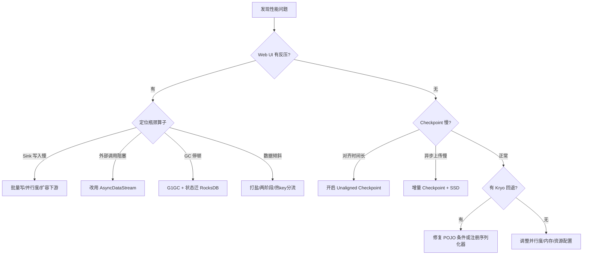

# 调优方法论

## 来源
- [Flink 性能调优实战](../文章/done-Flink 性能调优实战.md)
- [《Flink 性能调优保姆级教程：并行度怎么设？反压怎么查？这篇讲透了！》](../文章/done-《Flink 性能调优保姆级教程：并行度怎么设？反压怎么查？这篇讲透了！》.md)
- [深入Flink性能优化：从内存调优到SQL实践](../文章/done-深入Flink性能优化：从内存调优到SQL实践.md)
- [实践 _ Shopify 优化 Apache Flink 应用程序的 7 个技巧！](../文章/done-实践 _ Shopify 优化 Apache Flink 应用程序的 7 个技巧！.md)
- [宇宙厂Flink优化：实时榜单计算最佳实践](../文章/done-宇宙厂Flink优化：实时榜单计算最佳实践.md)
- [Apache Flink错误处理实战手册：2年生产环境调试经验总结](../文章/done-Apache Flink错误处理实战手册：2年生产环境调试经验总结.md)
- [Flink技术实践-监控指标异常诊断与运维](../文章/done-Flink技术实践-监控指标异常诊断与运维.md)

## 核心问题
面对一个有性能问题的 Flink 作业，应该按什么顺序排查？并行度、内存、序列化、Checkpoint 各应该怎么调？

## 判断准则

### 调优优先级（从高到低）

```
① 反压排查      ← 先确认瓶颈在哪个算子，再做其他优化
② 数据倾斜      ← keyBy 分配不均导致部分 Task 负载过高
③ Checkpoint 慢 ← 影响故障恢复与整体吞吐
④ 序列化优化    ← Kryo 回退可导致最高 75% 性能损失
⑤ 资源配置      ← 并行度、内存、CPU 配置
⑥ 代码层优化    ← 减少对象创建、不必要的状态
```

### 并行度设置原则

| 场景 | 规则 |
|---|---|
| Source 并行度 | 必须 ≤ Kafka 分区数（超出无收益） |
| 全局并行度公式 | 每秒数据量 / 单 Task 处理能力（经验估算） |
| CPU 密集型算子 | 适当提高，与 CPU 核数对应 |
| Sink 并行度 | 通常远高于 Source，因为 Sink 最容易产生反压 |
| 窗口算子 | 不需要太高（数据已按 key 路由，并行化不均等） |
| busyTimeMsPerSecond 接近 1s | 并行度不够，需加并行度 |

**四个生效层级（优先级从低到高）**：集群默认 → 提交时参数 → 算子级设置 → Chaining 继承

### 反压根因与对应解法

| 根因 | 解法 |
|---|---|
| Sink 写入慢（最常见，约 90%） | 批量写入（withBatchSize/withBatchIntervalMs）；提高 Sink 并行度；扩容下游系统 |
| 外部调用同步阻塞 | 改用 `AsyncDataStream.unorderedWait()` 异步 IO |
| 数据倾斜 | 热 key 加盐、两阶段聚合、热 key 单独处理链路 |
| GC 停顿 | 开启 G1GC + MaxGCPauseMillis=100；将大状态迁到 RocksDB（堆外） |
| Checkpoint 卡住 | 开启非对齐 Checkpoint；减小状态大小；提升存储 IO |
| 网络缓冲不足 | 调大 `taskmanager.memory.network.fraction` |

**反压定位步骤**：从 Sink 往上，找第一个 Backpressure 为 OK/LOW 的算子，其直接下游是瓶颈。

### 序列化优化（高价值，常被忽视）

Flink 序列化性能层级（从高到低）：
1. 内置类型（String/Long/Integer 等原生类型）
2. 数组类型
3. Tuple/Case Class 复合类型
4. **POJO 序列化器**（推荐，满足条件自动启用）
5. Avro/Protobuf
6. **Kryo 回退**（性能最低，可导致高达 75% 损失）

**POJO 满足条件**：public 类 + 无参构造函数 + 所有字段 public 或有 getter/setter + 字段类型也是 POJO 或基本类型

**Kryo 排查方法**：
```java
// 强制 fail-fast，一启动就暴露 Kryo 问题
env.getConfig().disableGenericTypes();
```
关注启动日志中 `TypeExtractor` 的 INFO 级输出，常见触发原因：
- `Class cannot be used as a POJO type` → 字段不符合规范
- `missing a default constructor` → 缺无参构造
- `contains generic type parameters` → 泛型类型信息缺失
- Scala BigDecimal → 改用 Java BigDecimal
- Scala ADT（sealed trait + case object）→ 改用 Scala Enum

Shopify 实测：修复所有 Kryo 回退后吞吐提升 20%。

### Checkpoint 调优

| 问题阶段 | 指标信号 | 解法 |
|---|---|---|
| Alignment 超长 | checkpointAlignmentTime 高 | 先解决反压；若仍超时，启用 Unaligned Checkpoint |
| Async Upload 慢 | Async Duration 长 + Data Size 大 | 开启增量 Checkpoint；提升存储 IO；考虑原生快照 |
| 存储后端慢 | 持续超时，与状态大小无关 | 检查 HDFS/S3 连接、权限、网络 |

```java
// 常用配置组合
env.enableCheckpointing(120_000);                         // 2 分钟间隔
config.setCheckpointTimeout(180_000);                     // 3 分钟超时
config.setMinPauseBetweenCheckpoints(60_000);             // 两次间隔至少 1 分钟
config.enableUnalignedCheckpoints();                      // 反压时 Barrier 不等待对齐
config.setTolerableCheckpointFailureNumber(5);            // 容忍少量失败
env.setStateBackend(new EmbeddedRocksDBStateBackend(true)); // RocksDB 增量 Checkpoint
```

### 内存配置（TaskManager）

```yaml
# flink-conf.yaml 推荐分配比例
taskmanager.memory.process.size: 8g
taskmanager.memory.task.heap.size: 2g          # 用户代码 Heap
taskmanager.memory.managed.fraction: 0.4       # 托管内存（RocksDB/排序）
taskmanager.memory.network.fraction: 0.1       # 网络缓冲区
taskmanager.memory.framework.heap.size: 256m   # Flink 框架 Heap
taskmanager.numberOfTaskSlots: 2               # 建议 1~2 个 Slot/TM
```

**RocksDB 专项调优**：
```yaml
state.backend.rocksdb.writebuffer.size: 128mb      # 减少刷盘次数
state.backend.rocksdb.writebuffer.count: 3
state.backend.rocksdb.block.cache-size: 256mb      # 提升读性能
state.backend.rocksdb.localdir: /ssd/flink/rocksdb # 必须用 SSD
```

Shopify 生产案例：状态超过 8 TB 的作业，从 NFS 换 SSD 后处理速度提升约 10 倍。

**RocksDB 内存超限问题**（Shopify 案例）：
作业运行 1 小时以上后任务管理器被 Kubernetes OOM kill，原因是 RocksDB 块缓存填满导致实际内存超出配置值。
解法：通过 `RocksDBOptionsFactory` 禁用块缓存，或启用 RocksDB Native Metrics 提前观察。

### 数据倾斜解法

| 方法 | 代码思路 | 适用场景 |
|---|---|---|
| 两阶段聚合（打盐） | key 加随机后缀局部聚合 → 去后缀全局聚合 | Group 聚合场景 |
| LocalGlobal（Flink SQL） | 开启 Mini-Batch，先本地聚合再 shuffle | SQL 作业 |
| 热 key 单独链路 | 识别热 key，走不同 Sink 避免 keyBy | 已知热 key 场景 |
| 广播小表 | 大表 join 小表时广播 | Join 场景 |

```java
// 两阶段聚合代码结构
DataStream<Tuple2<String, Long>> localAgg = stream
    .map(r -> Tuple2.of(r.getKey() + "_" + (int)(Math.random() * 8), 1L))
    .keyBy(t -> t.f0)
    .reduce((a, b) -> Tuple2.of(a.f0, a.f1 + b.f1));

DataStream<Tuple2<String, Long>> globalAgg = localAgg
    .map(t -> Tuple2.of(t.f0.substring(0, t.f0.lastIndexOf("_")), t.f1))
    .keyBy(t -> t.f0)
    .reduce((a, b) -> Tuple2.of(a.f0, a.f1 + b.f1));
```

### 算子链调优
```java
stream.map(heavyMapper).disableChaining();    // 独立瓶颈算子，避免链内堵塞
stream.map(m1).startNewChain().map(m2);       // 强制新链
env.disableOperatorChaining();                // 全局拆链（仅调试，生产不推荐）
```

### 网络缓冲区调优（延迟 vs 吞吐权衡）
```yaml
execution.buffer-timeout: 100ms    # 默认 100ms，降低 → 减少延迟；升高 → 提升吞吐
taskmanager.network.memory.buffers-per-channel: 2
taskmanager.network.memory.floating-buffers-per-gate: 8
```

### Savepoint 迁移陷阱（算子 UID 管理）
- 更换 Kafka Connector API（FlinkKafkaConsumer → KafkaSource）时，若保留相同 UID，旧状态会被错误复制，导致 `_metadata` 文件指数增长（10 分区 → 每次 Checkpoint 翻倍），最终超出 Akka RPC 64MB 帧限制或 JM OOM
- 解法：修改 UID（如 `kafka-source-v2`）并在启动时加 `--allow-non-restored-state`
- 最佳实践：UID 包含版本号；每次 API 升级前评估状态兼容性

### Flink SQL TopN 调优（Rank 算法选择）
Flink 内部有三种 Rank 算法，性能依次降低：
1. **AppendRank**：仅支持纯插入的静态数据
2. **UpdateFastRank**：支持更新，但要求 OVER 分区键包含于 UPSERT 键，且排序字段单调
3. **RetractRank**：支持所有查询，但存储所有输入数据，状态最大

优化方向：
- 避免输出 rownum（前端排序展示），减少因排名变动触发的级联更新
- 增大 TopN Cache：`table.exec.rank.topn-cache-size: 200000`，公式 `cache_hit = cache_size × parallelism / top_n / partition_key_num`

### 调优 Checklist

| 检查项 | 目标值 |
|---|---|
| 反压状态（Web UI Backpressure） | 全部 OK |
| 各 Task 记录数均衡度 | 各子任务数量相近（< 2x 差异） |
| Checkpoint 耗时 | < 作业间隔的 50% |
| GC 时间占比 | < 5% |
| 网络缓冲使用率 inPoolUsage | < 80% |
| CPU 利用率 | 60%~80%（留有余量） |
| 状态大小趋势 | 无持续增长 |

## 认知偏差

| 常见错误认知 | 正确理解 |
|---|---|
| 遇到反压就加 Source 并行度 | 加 Source 并行度只会让数据堆积更快，应先定位瓶颈再针对性加该算子并行度 |
| 并行度越高越好 | 超出 Kafka 分区数后 Source 并行度无收益；网络 shuffle 增多反而可能降低性能 |
| Checkpoint 失败就一定要增大 timeout | 先看是 Alignment 问题（反压）还是 Async 问题（状态大），timeout 只是最后手段 |
| POJO 性能差不多 | Kryo vs POJO 性能差距高达 75%，不是"差不多"而是量级差距 |
| RocksDB 内存只占托管内存配置量 | RocksDB 块缓存可能超出配置，需要用 jemalloc + jeprof 实际测量 |
| 动态类加载无害 | 应用模式下，每次重启重新加载用户代码，Metaspace 可能泄漏，建议通过 classpath 禁用动态加载 |

## 架构/流程图



## 待验证缺口
- Buffer Debloating（自动调节网络缓冲区大小，1.14+ 引入）在高吞吐和低延迟之间的实际表现
- Shopify 禁用 RocksDB 块缓存后对 Compaction 和 Read 性能的长期影响
- UpdateFastRank 在窗口内 TopN 场景下与 AppendRank 的性能对比数据
