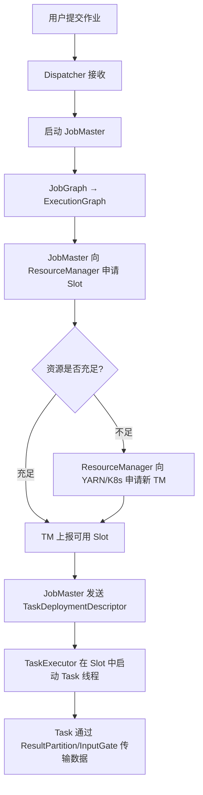

# 运行模型与资源管理

## 来源
- [大数据flink面试系列-Flink 的 Task 调度原理是什么？如何实现负载均衡？](../文章/done-大数据flink面试系列-Flink%20的%20Task%20调度原理是什么？如何实现负载均衡？.md)
- [自适应批作业调度器：为 Flink 批作业自动推导并行度](../文章/done-自适应批作业调度器：为%20Flink%20批作业自动推导并行度.md)

## 核心问题
Flink 作业如何从用户代码变成在 TaskManager 上运行的物理任务？并行度、Slot、算子链三者关系是什么？

## 判断准则

### 多级图转换（提交到执行）

```
用户代码 → StreamGraph → JobGraph → ExecutionGraph → 物理部署
```

| 层级 | 名称 | 作用 |
|---|---|---|
| 逻辑图 | JobGraph | 算子间依赖关系，含算子链合并后的 JobVertex |
| 物理图 | ExecutionGraph | 按并行度拆分为 ExecutionVertex，每个对应一个可部署 Task |
| 部署层 | Physical Execution | Task 实际运行在 TM 的 Slot 中，通过网络连接传输数据 |

**关键角色**：
- **Dispatcher**：接收作业请求，为每个作业启动 JobMaster
- **JobMaster**：每作业一个，负责 JobGraph→ExecutionGraph 转换和全生命周期调度
- **ResourceManager**：管理集群 Slot 资源，支持 YARN/K8s/Standalone
- **TaskExecutor**（在 TM 上）：接收 TaskDeploymentDescriptor，在 Slot 中启动 Task 线程

### Slot 机制

- Slot 是 TM 的资源分片，对应一部分 CPU + 内存
- **默认 Slot 共享**：不同算子链的 Task 可共享同一 Slot，提高利用率
- 每个 TM 的 Slot 数通过 `taskmanager.numberOfTaskSlots` 配置
- 推荐：总并行度 ≈ 总 Slot 数

### 算子链（Operator Chain）

将上下游算子合并为一个 Task（如 Source→Map→Filter），减少线程切换和网络传输。

**禁止链合并的场景**：
```java
stream.map(...).disableChaining().filter(...);  // 禁止与前后算子链合并
```

### 负载均衡策略

| 策略 | 说明 |
|---|---|
| Round-Robin | Task 轮询分配到不同 TM 的 Slot |
| 数据局部性优先 | LOCAL > LOCAL_HOST > REMOTE |
| 负载感知 | 监控 TM CPU/内存，避免将 Task 部署到资源紧张节点 |
| 弹性扩缩容 | YARN/K8s 模式下动态申请/释放 TM |

### 自适应批作业调度器（Adaptive Batch Scheduler）

> 版本：Flink 1.15+

**解决问题**：批作业并行度调优繁琐，数据量每日变化，中间算子数据量难以预判。

**核心机制**：
1. 上游执行节点完成后，收集产出数据量（`numBytesProduced`）
2. `VertexParallelismDecider` 根据「期望每并发处理数据量 V」计算并行度
3. 并行度调整为最接近的 2 的幂（避免数据倾斜）
4. 动态构建 ExecutionGraph（从空图开始，随调度逐步追加节点）

**子分区动态映射**（关键设计）：
- 静态图：下游并行度决定上游子分区数
- 动态图：上游按**下游最大并行度**产出子分区，下游确定并行度后再映射消费范围
- 公式：第 k 个下游执行节点消费 `[k*P/N, (k+1)*P/N)` 范围的子分区

**启用配置**：
```yaml
jobmanager.scheduler: AdaptiveBatch
execution.batch-shuffle-mode: ALL-EXCHANGES-BLOCKING
parallelism.default: -1
table.exec.resource.default-parallelism: -1  # SQL 作业
```

**限制**：目前仅支持 `ALL-EXCHANGES-BLOCKING` shuffle 模式（即 Blocking Shuffle）

## 认知偏差

| 常见错误认知 | 正确理解 |
|---|---|
| 并行度越高性能越好 | 过高并行度导致任务部署和 shuffle 开销增大，应与数据量成正比 |
| Slot 数等于 TM 数 | 一个 TM 可配置多个 Slot（`taskmanager.numberOfTaskSlots`），总 Slot = TM 数 × 每 TM Slot 数 |
| 算子链合并后单算子并行度仍可单独设置 | 算子链合并为一个 Task，链内所有算子使用相同并行度 |
| 自适应批调度器对所有作业都有效 | 仅对 `parallelism=-1` 的算子推导并行度，且需要 Blocking Shuffle 模式 |
| 自适应批调度器适合流作业 | 自适应批调度器（AdaptiveBatch）专为批作业设计，流作业有单独的 AdaptiveScheduler |

## 架构/流程图



## 待验证缺口
- 自适应批调度器的 `maxBroadcastRatio=0.5` 硬编码限制何时会被改为可配置
- 流作业的 AdaptiveScheduler（用于流的自适应扩缩容）与批的 AdaptiveBatch 的区别
