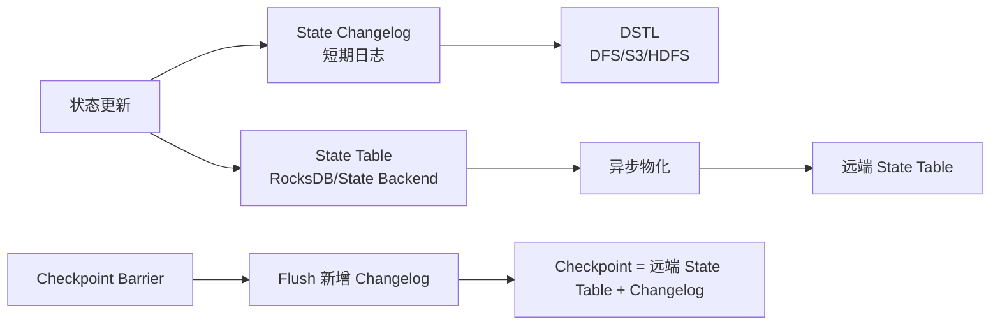
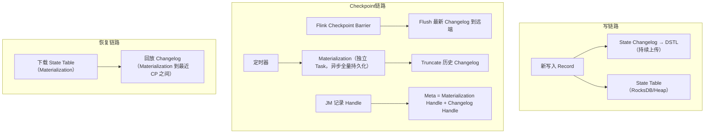

# Flink 通用增量 Checkpoint

> 验证版本：Flink 1.16（Production Ready）

## 来源

- [Flink 1.15 新功能架构解析：高效稳定的通用增量 Checkpoint](<../文章/done-Flink 1.15 新功能架构解析：高效稳定的通用增量 Checkpoint.md>)
- [基于 Log 的通用增量 Checkpoint](<../文章/done-基于 Log 的通用增量 Checkpoint.md>)

## 图片处理

| 图片 | 类型 | 是否保留 | 理由 | 处理方式 |
|---|---|---|---|---|
| Checkpoint 延迟与 Changelog 架构图 | 架构图/流程图 | 原图缺失 | 理解 State Table、Changelog、Materialization 的关系非常关键 | 标记原图缺失，用 Mermaid 重建简化图 |

## 一句话结论

这篇文章值得精读，它把 Flink Checkpoint 优化从“少上传状态文件”推进到“状态变化先写 Changelog、状态表异步物化”的 WAL 类思路。

## 用户相关性判断

| 项 | 内容 |
|---|---|
| 用户当前认知层级 | Flink / Flink SQL L2-L3 draft |
| 认知成熟度 | draft |
| 阅读投入建议 | 精读 |
| 阅读投入理由 | 能补 Checkpoint 机制和大状态稳定性，但基于 Flink 1.15 MVP，实践前需查当前版本 |
| 对用户的新信息 | Changelog State Backend 用空间、网络和恢复重放成本换取更短、更稳定的 Checkpoint 完成时间 |
| 问题指纹 | Flink + Checkpoint + State Changelog/DSTL/Materialization + 大状态容错稳定性 + 空间/恢复成本边界 |
| 排重判断 | 新建 |
| 置信度 | 高 |

## 认知校准点

| 校准点 | 文章观点/信息 | 与用户认知或价值观的关系 | 处理建议 |
|---|---|---|---|
| 增量 Checkpoint 不等于一定稳定 | RocksDB compaction 会产生大文件，仍可能拖慢上传 | 纠偏：不能只看“增量”标签 | 写入 Flink index |
| Changelog 类似 WAL | 状态更新双写 State Table 和 State Changelog | 补充：帮助用数据库经验理解 Flink 状态容错 | 作为记住点 |
| 快 Checkpoint 有代价 | 额外网络 IO、持久存储、内存和恢复重放 | 符合重工程代价价值观 | 选型时必须看状态访问模式 |
| 版本时效明显 | 文章说 1.15 是 MVP，1.16 会完善 | 待验证：不能直接当当前生产建议 | 后续查官方文档 |

## 冲突点

| 冲突类型 | 具体表现 | 影响 | 处理 |
|---|---|---|---|
| 图片缺失 | 图 1-4 均缺失 | 机制理解受影响 | Mermaid 简化重建 |
| 版本时效 | Flink 1.15 新功能文章 | 可能和当前版本实现不同 | 标记 draft |
| 证据范围 | Benchmark 有配置，但工作负载有限 | 不能泛化所有状态作业 | 标为待验证 |

## 待吸收点

| 分级 | 内容 | 为什么值得吸收 | 后续动作 |
|---|---|---|---|
| 理解 | Checkpoint 时间受 barrier 流动和状态持久化共同影响 | 区分反压问题和状态上传问题 | 和反压知识点关联 |
| 理解 | State Changelog 把状态变化持续写入短期持久日志 | 是新机制核心 | 写入 Flink index |
| 记住 | Changelog 是空间换时间，可能增加恢复重放成本 | 影响生产选型 | 后续补官方配置 |
| 记住 | 状态访问模式决定收益：窗口类 workload 可能写放大很高 | 防止无脑开启 | 待实验 |
| 实践 | 对比开启/关闭 changelog 的 checkpoint duration、size、restore time | 可验证收益边界 | 待实验 |

## 已知可跳过

| 内容 | 跳过理由 |
|---|---|
| Flink 需要 Checkpoint 做容错 | 已知基础 |
| Benchmark 表格细节 | 没有原表数据，不直接沉淀性能数字 |

## 实践门槛

| 门槛 | 判断 | 证据 |
|---|---|---|
| 可运行 | 部分 | 有 `flink-conf.yaml` 参数 |
| 可验证 | 部分 | 有 Benchmark 配置，但无本地数据和作业 |
| 可排障 | 部分 | 解释影响因素，但缺日志指标路径 |
| 可迁移 | 是 | 可用于大状态作业 Checkpoint 优化判断 |
| 结论 | 降为精读 | 实验需单独搭建 |

## 归类判断

| 项 | 内容 |
|---|---|
| 技术本体 | Flink 是有状态流处理引擎 |
| 文章主问题 | 如何用 State Changelog 提升 Checkpoint 完成稳定性 |
| 使用场景 | 大状态作业、Transactional Sink、端到端低延迟流处理 |
| 关键词干扰 | RocksDB、DFS、S3、WAL |
| 最终归类 | 数据工程与数仓 / 实时计算 / Flink |
| 归类理由 | 主问题是 Flink 状态和容错，不是存储引擎或对象存储 |

## 纵向理解

| 维度 | 判断 |
|---|---|
| 全局架构 | 算子状态、State Backend、Checkpoint Barrier、远端存储、恢复流程共同构成容错 |
| 本文位置 | 只讲 Checkpoint 状态持久化优化 |
| 核心机制 | State Changelog、DSTL、Materialization、Checkpoint flush |
| 使用链路 | 状态更新双写 -> Changelog 持续上传 -> State Table 异步物化 -> Checkpoint 只 flush 新增 Changelog |
| 前置条件 | 大状态、Checkpoint 抖动明显、外部存储可承受额外写入 |
| 边界 | 不解决算子慢、数据倾斜和下游 Sink 慢造成的反压 |

## Mermaid 重建



## 横向对标

| 对标技术 | 实现方式 | 优势 | 劣势 | 适合场景 |
|---|---|---|---|---|
| 全量 Checkpoint | 每次持久化完整状态 | 简单 | 大状态慢 | 小状态或低频容错 |
| RocksDB Incremental Checkpoint | 上传新增 SST 文件 | 节省状态上传 | Compaction 会产生大文件和长尾 | RocksDB 大状态常规优化 |
| Changelog Incremental Checkpoint | 状态更新写日志，状态表异步物化 | Checkpoint 完成更快更稳定 | 空间、网络、恢复重放成本 | 大状态、低延迟、Checkpoint 抖动 |
| Unaligned Checkpoint | 缓解反压下 barrier 对齐 | 解决 barrier 流动慢 | 不直接减少状态持久化成本 | 反压明显场景 |

## 后续追查

- 关键词：Changelog State Backend、DSTL、Materialization、Checkpoint duration、Unaligned Checkpoint、Buffer Debloating。
- 相关技术：RocksDB State Backend、Flink 反压、Flink Exactly Once。
- 需要补读的文章：当前 Flink 官方 Changelog State Backend 文档、大状态作业调优、Checkpoint 失败排查。

---

## 补充：Changelog 机制详解与实测数据（来自 Flink Forward Asia 2022）

### Checkpoint 优化版本演进

| 版本 | 功能 | 解决的 Metrics 阶段 |
|---|---|---|
| 0.9 | 异步快照算法（Barrier + 同步/异步分阶段） | 奠基 |
| 1.0 | RocksDB StateBackend | 大状态稳定性 |
| 1.3 | RocksDB Incremental Checkpoint | 异步阶段：减少上传量 |
| 1.11/1.13 | Unaligned Checkpoint（1.13 Production Ready） | 同步阶段：消除 Barrier 对齐等待 |
| 1.14 | Buffer Debloating | 同步阶段：动态缩小 Network Buffer，加快 Barrier 流动 |
| 1.15/1.16 | Changelog State Backend（1.16 Production Ready） | 异步阶段：消除 Compaction 引起的长尾 |

### RocksDB Incremental Checkpoint 的根本缺陷

RocksDB 增量 Checkpoint 不能保证稳定的原因：

1. Checkpoint 同步阶段会强制 Flush MemTable，可能触发多层 Level Compaction（L0 层默认每4个 Checkpoint 触发一次 Compaction）
2. Compaction 产生大量新文件需要重新上传，导致异步耗时周期性突增
3. 大规模作业中多 Task 同时触发 Compaction，进一步争用 CPU 和网络带宽
4. 端到端耗时取决于最慢那条链路，任何一个 Task 的长尾都拖慢整体

### Changelog 与 WAL 的类比

Changelog 机制完整对应数据库的 Checkpoint + WAL 模式：

| DB 概念 | Flink Changelog 对应 |
|---|---|
| DB 内存数据结构 | State Table（如 RocksDB） |
| WAL（顺序追加日志） | State Changelog（Append-only Log） |
| WAL 存储介质 | DSTL（DFS/S3/HDFS） |
| 定期 Checkpoint（全量快照） | Materialization（定时持久化 State Table） |
| Checkpoint 后 Truncate WAL | Materialization 后 Truncate Changelog |

关键设计：Materialization 触发与 Flink Checkpoint 解耦。每个 Task 独立定时触发 Materialization，不参与 Flink Checkpoint 的同步控制，因此 Compaction 不再影响 Checkpoint 耗时。

### Changelog Checkpoint 的三条操作链路


（基于原文描述重建）

### 实测 Benchmark 数据（Value State，Flink 1.16）

**实验 A：Checkpoint 稳定性与性能**

| 状态大小 | RocksDB CP p99 耗时 | Changelog CP p99 耗时 | 空间放大倍数 |
|---|---|---|---|
| 100 MB（全内存） | ~8 秒 | ~1 秒 | 约 2 倍（内存状态 Merge 少） |
| 1.2 GB（落盘） | ~20 秒 | ~1 秒 | 约 1.2 倍 |

关键结论：RocksDB 的 CP duration 与 Checkpoint 周期相关（L0 每4个 CP 触发一次 Compaction），而 Changelog 持续上传增量，耗时稳定。

**实验 B：Failover 恢复性能**

| 配置 | 额外恢复开销 |
|---|---|
| Changelog（不开 Local Recovery） | 比 RocksDB 多约 40% |
| Changelog + Local Recovery | 与 RocksDB 接近，差异可忽略 |

恢复额外开销来源：下载 Changelog + 回放 Changelog。开启 Local Recovery 后下载时间消失，只剩回放开销。

**实验 C：极限 TPS（反压场景）**

| 配置 | TPS 影响 |
|---|---|
| 开启 Changelog（双写） | 极限 TPS 下降约 10%~20% |
| 开启 Changelog + Local Recovery（三写） | 额外再下降约 5% |

注意：影响的是极限 TPS，日常运行的 TPS per core 实际可能更高（CP 更稳定，回追更少）。

### 开启 Changelog 的 4 个核心配置参数

```yaml
# 1. 启用 Changelog
state.backend.changelog.enabled: true

# 2. Materialization 间隔（控制空间放大）
state.backend.changelog.periodic-materialize.interval: 3min

# 3. Changelog 存储介质（目前仅支持 Filesystem）
state.backend.changelog.storage: filesystem

# 4. Changelog DFS 存储路径（Filesystem 模式必填）
dstl.dfs.base-path: hdfs://your-cluster/flink-changelog/
```

### Changelog 三个已知问题与规划

1. **空间放大**：无 Merge 机制，Truncate 前持续增长；规划：Changelog Merge / Remote Apply
2. **恢复重放开销**：规划通过 Remote Apply（远端预合并）减少回放量
3. **双写性能开销**：FLINK-30345 已有优化，生产前检查所用版本是否包含该优化

### 选型边界：何时开 Changelog

| 场景 | 建议 |
|---|---|
| 大状态（GB 级）+ Checkpoint 频繁抖动 | 优先考虑开启 |
| Transactional Sink（依赖 CP 完成时间） | 收益明显，推荐 |
| 状态较小（内存可装）+ 写入模式有大量覆盖更新 | 空间放大可能 2 倍，权衡 |
| 窗口类 Workload（大量历史状态被替换） | 写放大高，谨慎 |
| 频繁触发 Failover 且未开 Local Recovery | 恢复代价 +40%，需评估 |
