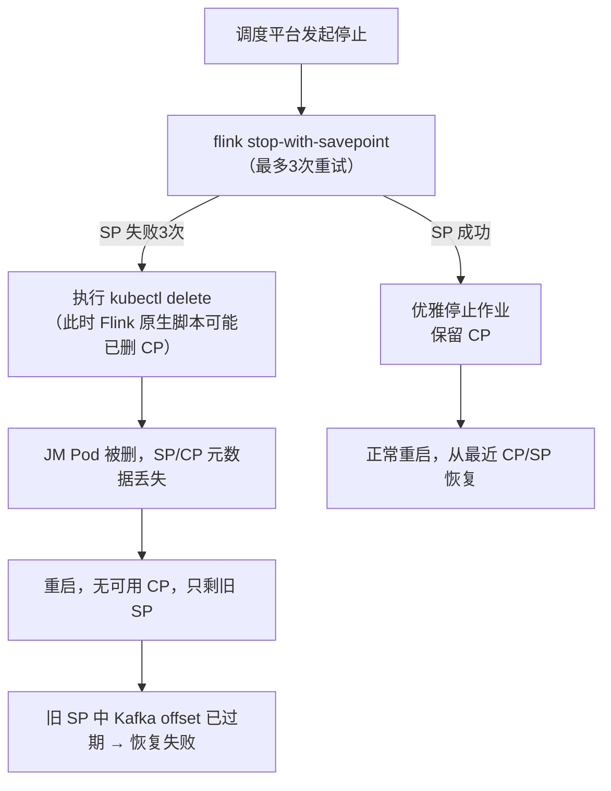

# 重启异常与状态丢失排障

> 验证版本：Flink 1.14.6（on native K8s，Application 模式）

## 来源
- [Flink生产问题排障-作业重启异常](<../文章/done-Flink生产问题排障-作业重启异常.md>)

## 核心问题
这个知识点解决三个判断困惑：
1. 作业重启后立即失败，根因是状态数据丢失还是配置错误？
2. `stop-with-savepoint` 是否可靠？脚本执行失败的哪个步骤会造成不可逆的状态丢失？
3. Checkpoint 连续失败的常见根因分类，以及如何通过日志信号快速定位阶段？

## 判断准则

### CP 失败根因分类（按排查优先级）

| 根因类型 | 判断信号 | 对应处理方向 |
|---|---|---|
| 背压（最常见） | Barrier Start Delay 高、Alignment Duration 长、上游输入队列满 | 先降反压再看 CP；考虑 Unaligned Checkpoint |
| 资源不足 | TaskManager OOM/GC 告警、磁盘 IO 饱和、CPU 利用率峰值 | 扩容或调整并行度 |
| 状态过大 | Checkpointed Data Size 持续增长、异步阶段耗时长 | 开启 Incremental/Changelog CP；检查 State TTL |
| 外部依赖故障 | HDFS/S3 错误日志、Kafka/Hive 连接超时 | 检查存储侧监控 |
| 配置不合理 | CP 间隔 < CP 耗时（导致 CP 叠加）、超时时间过短 | 调大 `execution.checkpointing.timeout` 和 `min-pause-between-checkpoints` |
| 网络抖动 | 周期性失败且集中在同一时段 | 对比网络监控和 CP 失败时间点 |

### stop-with-savepoint 的非原子性风险（Flink 1.14.6）

Flink 原生 stop 脚本执行顺序：

```
1. 触发 Savepoint 操作
2. 删除 Checkpoint 数据（异步，无事务保障）
3. 优雅停止作业
```

危险窗口：**Savepoint 触发失败（步骤1失败）但 Checkpoint 数据已被删除（步骤2已执行）** → 此后无最近可用的恢复点。

调度平台叠加风险：若平台有"3次重试后强制 kubectl delete"逻辑，在 SP 三次失败后强制删除 Pod，JM 无法完成 SavepointDispose，状态更难追踪。

### 作业重启后快速失败的排查链路

```
1. 查暂停日志
   └── JM 侧：stop-with-savepoint 是否成功？CP 失败原因？
   └── 是否触发了 kubectl delete（强制停止信号）？

2. 查启动日志
   └── 从哪个 SP/CP 恢复？
   └── 恢复是否报错（如 Kafka offset 过期、状态不兼容）？

3. 查 CP/SP 列表
   └── 最新 CP 是否存在？（若 stop 时 CP 被删，只剩旧 SP）
   └── SP 与 CP 时间差是多大（决定数据回追量）？

4. 根因定位
   └── CP 失败 + 脚本非原子删除 = 状态丢失
   └── Kafka offset 过期 = SP 过旧，需从最早可用位点消费
```

## 认知偏差

| 常见错误认知 | 正确理解 |
|---|---|
| `stop-with-savepoint` 是安全的停止方式，失败了也不影响 CP | Flink 1.14.6 的脚本中删除 CP 与触发 SP 是异步且无事务，SP 失败时 CP 可能已被删 |
| 作业重启失败说明代码有 bug | 重启失败可能是状态丢失（没有可用 CP/SP）或恢复点太旧（Kafka offset 已过期），是运维问题不是代码问题 |
| CP 连续失败只要重试就能恢复 | 连续 CP 失败是作业不健康的信号，需要先排查根因（背压/资源/状态/网络），不应只依赖重试 |
| K8s Application 模式比 Session 模式更安全 | Application 模式下 JM 和 TM 都在 Pod 里，kubectl delete 会直接删除 JM，SP 元数据可能未持久化就消失 |

## 架构/流程图


（基于原文描述重建）

## 解决方案：防御性停止与告警

**停止前备份策略**

```bash
# 1. 调用 stop 脚本前，先手工备份最近成功 CP 的元数据路径
# 2. 停止操作后验证 SP 文件确实存在于 DFS，再清理旧 CP
# 3. 判断作业是否彻底停止时，要同时检查 JM Deployment 和 TM Pod 状态，
#    不能只看 Flink REST API 的 Job Status
```

**必须配置的监控告警（生产最低基线）**

| 告警项 | 阈值建议 | 触发含义 |
|---|---|---|
| CP 连续失败次数 | >= 3 次 | 作业健康度下降，需人工介入 |
| 作业重启次数 | 15min 内 >= 2 次 | 可能进入重启风暴 |
| 数据消费延迟 | > 业务 SLA 阈值 | 作业追不上数据 |

## 待验证缺口
- Flink 1.15+ 是否修复了 stop-with-savepoint 的非原子性问题（需查 FLINK-XXXXX）
- K8s 模式下 JM HA 配置是否能防止 kubectl delete 导致 SP 元数据丢失
- Checkpoint 被删后能否通过 DFS 文件目录手动恢复元数据（取决于 CompletedCheckpointStore 类型）
