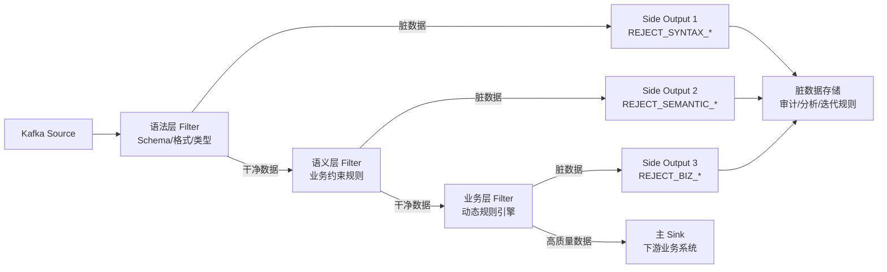

# 实时流脏数据治理

## 来源
- [Flink技术实践-实时流中的脏数据治理](../文章/done-Flink技术实践-实时流中的脏数据治理.md)

## 核心问题
实时流中如何在数据流入时就治理脏数据？批处理的"事后清洗"为什么在实时场景失效？如何设计既纯净又可追溯的清洗架构？

## 判断准则

### 脏数据分类体系

| 脏数据类型 | 典型特征 | 识别方法 |
|---|---|---|
| 格式错误 | JSON/CSV 解析失败、字段类型不匹配 | Schema 校验、解析异常捕获 |
| 数据缺失 | 关键字段为空、必填字段缺失 | 非空校验、默认值填充检测 |
| 逻辑异常 | 订单金额为负、年龄超过 150 岁 | 业务规则校验、范围约束 |
| 恶意数据 | 注入攻击、数据篡改 | 签名验证、血缘追踪 |

### 四步治理架构

**第一步：接入预防（源头拦截）**
- 位置：Source 算子或紧接 Source 之后的 Map/FlatMap
- 职责：Schema 校验 + 语法解析异常捕获
- 原则：格式错误直接隔离，避免进入后续复杂计算链路

**第二步：分层过滤（递进式质量保障）**

| 过滤层 | 校验内容 | 特点 |
|---|---|---|
| 语法层 Filter #1 | 格式校验、类型转换、编码检测 | 误杀率低、吞吐高，第一道防线 |
| 语义层 Filter #2 | 业务逻辑约束（如 `total_amount > discount_amount`、`0 < age < 150`） | 依赖业务规则 |
| 业务层 Filter #3 | 动态规则引擎，支持热更新 | 适合促销期间动态调整阈值 |

**第三步：侧输出隔离（Side Output）**
- 主输出：只输出高质量数据，保障下游纯净
- 侧输出：每条脏数据附带拒绝原因标签（如 `REJECT_SYNTAX_JSON`、`REJECT_SEMANTIC_NEGATIVE`），路由到独立存储（Kafka topic / 专用 Hive 分区）
- 核心优势：不丢弃脏数据，完整保留审计链路；与传统"写入同一 Sink 污染下游"方案彻底切割

**第四步：可观测闭环**

| 监控指标 | 建议告警阈值 |
|---|---|
| 脏数据率 | > 0.1% |
| 解析失败率 | > 0.05% |
| 规则校验失败数 | 连续 10 分钟 > 100 条 |
| 数据延迟 | > 5s |

运营节奏：
- 每日：生成脏数据报告，分析高频问题
- 每周：迭代校验规则，覆盖新发现的脏数据模式
- 每月：全链路压力测试，验证治理效果

### 与批清洗的本质区别

| 维度 | 批清洗（T+1 ETL） | 实时流清洗 |
|---|---|---|
| 视野 | 全量数据可回溯 | 只能看滑动窗口内数据 |
| 统计能力 | 全局统计，统一处理 | 只能基于局部上下文判断 |
| 处理时机 | 事后清洗 | 流入即治理 |
| 适用场景 | 复杂数据质量问题 | 格式/语法/业务规则校验 |

核心结论：**实时流清洗不是"批清洗的快进版"，而是"流水线质检"**，不能等数据落库再处理。

## 认知偏差

| 常见错误认知 | 正确理解 |
|---|---|
| 脏数据直接丢弃最简单 | 丢弃导致信息不可追溯，无法审计，应用 Side Output 隔离 |
| 一层过滤就够了 | 不同脏数据类型需要不同处理成本，分层过滤可以在高误杀率的业务层校验前用廉价的语法层过滤掉大部分 |
| 实时清洗可以像批清洗一样做全量校验 | 流处理无法回溯，只能在有限时间窗口内判断，复杂的跨流关联校验有边界 |
| 规则写死在代码里就行 | 促销活动、业务规则变更需要动态热更新，应使用可配置的规则引擎 |

## 架构/流程图

## 待验证缺口
- 业务层动态规则引擎的具体实现（Drools / 自定义 CEP / 配置中心热更新）与 Flink 状态管理的集成方式
- 对恶意数据（签名验证、血缘追踪）的具体实现方案，文章仅提概念
- 脏数据率告警阈值（0.1%）的行业基准依据

## 重新蒸馏补充（2026-06-18）

| 来源 | 认知增量 | 处理 |
|---|---|---|
| [[03_数据工程与数仓/0303_实时计算/030301_Flink/文章/done-Flink 实践 _ Flink 替换 Logstash 解决日志收集丢失问题]] | 补充该主题的生产案例、机制边界或排重样例。 | 重新判断后补入目标知识产物 |
