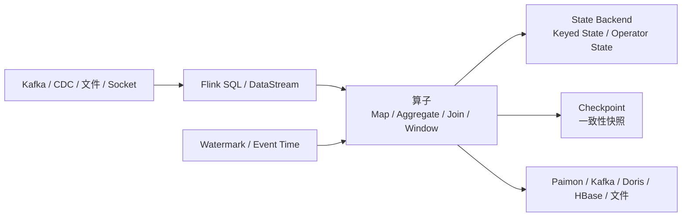

# Flink
## 知识点入口

- 本模块先看宏观流程，再看文章：[知识地图](030301_核心知识点/知识地图.md)。
- 新文章必须先归入流程节点，再判断是补充、冲突、不同层次还是降权。
- `文章/` 只保留原文锚点，长期知识必须沉淀到 `030301_核心知识点/`。

## 技术定位

| 项 | 内容 |
|---|---|
| 技术名 | Apache Flink |
| 一级类目 | 数据工程与数仓 |
| 二级类目 | 实时计算 |
| 技术本体 | 面向有状态流处理和流批一体计算的分布式计算引擎 |
| 全局架构位置 | 位于消息/CDC 源和湖仓/OLAP/消息下游之间，承担实时加工、状态维护、窗口、Join 和一致性输出 |
| 主要使用者 | 实时数仓工程师、数据平台工程师、数据开发 |
| 主要产出 | Flink 作业、Flink SQL、状态、Checkpoint、实时宽表、实时指标 |

## 官方锚点

- 官网：[Apache Flink](https://flink.apache.org/)
- GitHub：[apache/flink](https://github.com/apache/flink)
- 官方文档：[Flink Documentation](https://nightlies.apache.org/flink/flink-docs-stable/)
- 本地补充：Flink SQL Join 总览（本地锚点缺失：`../../../../wiki/concepts/flink-sql-join.md`）

## 架构图

## 核心模块

| 模块 | 职责 | 重点问题 |
|---|---|---|
| 时间语义 | 处理事件时间、处理时间、水位线 | 乱序、迟到、窗口关闭 |
| 窗口与触发 | 按时间或计数边界切分无界流并触发计算 | Watermark、Trigger、Timer、Evictor、迟到侧输出 |
| KeyGroup | 管理 Keyed State 的逻辑分片和扩缩容映射 | `maxParallelism`、状态迁移、Savepoint 恢复 |
| 状态管理 | 保存 Join、聚合、去重等中间状态 | 状态膨胀、TTL、State Backend、RocksDB、本地恢复 |
| 状态生命周期 | 控制状态何时过期、何时可见、何时物理清理 | State TTL、业务正确性、Checkpoint 大小、清理延迟 |
| Checkpoint | 提供故障恢复和一致性基础 | 超时、反压、对齐、端到端 Exactly Once |
| Join | 流流、流维、时间版本关联 | 状态边界、回撤、下游兼容 |
| Connector | 对接源端和下游 | 语义一致性、吞吐、Schema 演进 |
| SQL 提交与治理 | 将 Flink SQL 脚本从开发产物变成可提交、可校验、可版本管理的生产作业 | SQL Client、SQL Gateway、Application Mode、Multi-Statement、CI/CD |

## 横向对标

| 对标技术 | 对标点 | Flink 优势 | Flink 劣势 | 使用判断 |
|---|---|---|---|---|
| Spark Structured Streaming | 流批计算 | Flink 更偏原生流处理和低延迟状态计算 | Spark 批生态和离线任务更强 | 低延迟有状态流优先 Flink，复杂批处理优先 Spark |
| Kafka Streams | 流处理 | Flink 更适合大规模平台化和 SQL | Kafka Streams 更轻量，贴近 Kafka 应用 | 平台级实时数仓用 Flink，应用内轻流处理看 Kafka Streams |
| Beam | 流批抽象 | Beam 抽象统一 | 实际运行依赖后端，运维链路更复杂 | 多后端抽象看 Beam，生产引擎能力看 Flink |
| Paimon | 实时湖仓表格式 | Flink 负责计算，Paimon 负责表状态和增量存储 | Flink 不替代表格式 | Flink 写 Paimon 是计算+存储组合 |

## 已沉淀核心知识点

| 主题 | 文件 | 问题指纹 | 解决什么问题 | 认知增量 |
|---|---|---|---|---|
| 双流 Join 状态膨胀与构建端选择 | [Flink双流Join状态膨胀与构建端选择](030301_核心知识点/Flink双流Join状态膨胀与构建端选择.md) | Flink + Join + Build Side/Watermark/State + 状态膨胀 + 不把流 Join 简化成传统 Hash Join | 判断 Flink Join 状态为什么膨胀以及 Hint 的使用边界 | 把“谁小谁先”校准为“状态边界、时间语义和 Join 类型共同决定” |
| KeyGroup 状态分配与扩缩容 | [FlinkKeyGroup状态分配与扩缩容](030301_核心知识点/FlinkKeyGroup状态分配与扩缩容.md) | Flink + 状态管理 + KeyGroup/maxParallelism/范围分配 + 扩缩容状态迁移 + 固定 KeyGroup 边界 | 解释 Flink 如何以 KeyGroup 为单位管理状态并支持扩缩容 | 并行度变化不是状态分片根源，`maxParallelism` 才是 KeyGroup 总数锚点 |
| 状态后端选型 | [Flink状态后端选型](030301_核心知识点/Flink状态后端选型.md) | Flink + State Backend + 内存/文件系统/RocksDB + 状态规模选型 + 性能与可靠性边界 | 判断不同状态后端如何影响延迟、Checkpoint、恢复和状态规模 | 状态后端选型是性能、可靠性、扩展性和运维成本权衡，不是单个参数选择 |
| State TTL 状态生命周期治理 | [FlinkStateTTL状态生命周期治理](030301_核心知识点/FlinkStateTTL状态生命周期治理.md) | Flink + State TTL + UpdateType/StateVisibility/Cleanup Strategy + 状态生命周期治理 + 正确性与资源边界 | 判断 TTL 如何影响状态可见性、物理清理、Checkpoint 和业务正确性 | TTL 是业务语义和资源治理的共同边界，不是通用瘦身参数 |
| 窗口触发与状态淘汰边界 | [Flink窗口触发与状态淘汰边界](030301_核心知识点/Flink窗口触发与状态淘汰边界.md) | Flink + Window + Watermark/Timer/Evictor + 窗口触发与状态清理 + 乱序/迟到/状态成本边界 | 判断窗口何时触发、迟到数据如何处理、Evictor 与业务过滤如何区分 | 窗口不是只看窗口大小，事件时间进度、Timer 和状态淘汰共同决定正确性 |
| Flink SQL 大状态作业调优 | [FlinkSQL大状态作业调优](030301_核心知识点/FlinkSQL大状态作业调优.md) | Flink SQL + 状态算子 + ChangelogNormalize/SinkUpsertMaterializer/TTL/mini-batch/Join 顺序 + 大状态反压调优 | 建立 Flink SQL 大状态作业的诊断顺序和状态算子来源判断 | 大状态调优要先看执行计划和状态语义，不能先堆资源或盲目缩短 TTL |
| Flink SQL 脚本化提交与 Application 模式适配 | [FlinkSQL脚本化提交与Application模式适配](030301_核心知识点/FlinkSQL脚本化提交与Application模式适配.md) | Flink SQL + Multi-Statement 脚本 + SQL Gateway 内部链路 + Application Mode + 作业提交治理 + 1.20/2.x 版本边界 | 判断 Flink SQL 如何从交互式开发走向文件化、版本化、可校验和生产提交 | “像 Hive 一样用 Flink SQL”的核心是作业治理，不是简单按分号拆 SQL |
| 通用增量 Checkpoint | [Flink通用增量Checkpoint](030301_核心知识点/Flink通用增量Checkpoint.md) | Flink + Checkpoint + State Changelog/DSTL/Materialization + 大状态容错稳定性 + 空间/恢复成本边界 | 判断 Changelog State Backend 为什么能降低 Checkpoint 完成时间，以及代价是什么 | 增量 Checkpoint 不是免费优化，本质是用空间、网络和恢复重放成本换稳定性 |
| Checkpoint 完整链路与 Savepoint 边界 | [FlinkCheckpoint完整链路与Savepoint边界](030301_核心知识点/FlinkCheckpoint完整链路与Savepoint边界.md) | Flink + Checkpoint + Barrier/Coordinator/StateBackend/CheckpointStorage/Savepoint + 故障恢复与生命周期边界 | 将 Checkpoint 拆成触发、对齐、快照、持久化、ACK、完成和恢复阶段 | Checkpoint 排障要按阶段定位，Savepoint 是计划维护和迁移边界 |
| 反压排查入口 | [Flink反压排查入口](030301_核心知识点/Flink反压排查入口.md) | Flink + Backpressure + Buffer/Watermark/Checkpoint/下游瓶颈 + 实时作业排障入口 + 指标边界 | 建立 Flink 反压的基础排查路径 | 反压是下游瓶颈向上游传播的保护机制，会影响 Watermark 和 Checkpoint |

## 后续追查

- 关键词：Regular Join、Interval Join、Temporal Join、Lookup Join、KeyGroup、maxParallelism、State Backend、State TTL、`table.exec.state.ttl`、ChangelogNormalize、SinkUpsertMaterializer、Watermark、EventTimeTrigger、Window Evictor、Checkpoint、Checkpoint Barrier、Savepoint、Backpressure、Changelog State Backend、SQL Gateway、Application Mode、Multi-Statement SQL、StatementSet。
- 待读资料：Flink Join 官方文档、Flink 背压深度排查、Checkpoint 失败排查、当前版本 State Backend、State TTL、Flink SQL 执行计划、Changelog State Backend 文档、Flink 2.x SQL Gateway 脚本部署文档、`flink-sql-bootstrap` README 和源码。
- 待补实验：构造两条乱序流，对比 Regular Join 和 Interval Join 的状态增长与输出语义；构造乱序事件流验证 EventTimeTrigger、allowed lateness、side output 和 Evictor；构造慢 Sink 观察反压、Watermark 和 Checkpoint duration；按 alignment、snapshot、upload、ack 拆解一次 Checkpoint；用不同并行度从 Savepoint 恢复观察 KeyGroup 迁移；对比内存类状态后端、RocksDB 和 Changelog 的 checkpoint/restore 指标；构造 Keyed State 小作业验证不同 `UpdateType` 和 `StateVisibility`；保存一个 Flink SQL 作业的执行计划、状态大小、Checkpoint duration、反压指标，再验证 TTL、mini-batch 和 Join 顺序的效果；用 datagen/print 构造最小 Flink SQL 脚本，验证 Multi-Statement、`STATEMENT SET`、UDF/Catalog/Connector 依赖在 Application Mode 下的提交和校验链路。
