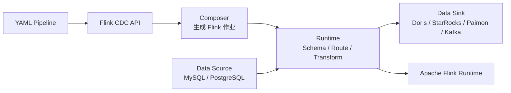

# Flink CDC 3.0 数据集成架构

## 原文锚点

- 本地文件：[Flink CDC 3.0 新一代实时数据集成框架](<../文章/Flink CDC 3.0 新一代实时数据集成框架.md>)
- 原文链接：http://mp.weixin.qq.com/s?__biz=Mzg5NDY3NzIwMA==&mid=2247512113&idx=1&sn=6998255d45d478e38ef1353d76854e2a
- 官方锚点：[Flink CDC Introduction](https://nightlies.apache.org/flink/flink-cdc-docs-stable/docs/get-started/introduction/)
- 关键段落：API、Connect、Composer、Runtime 四层架构，YAML Pipeline，Schema Evolution，整库同步，Route。
- 关键图：原文多次提到“如下图”，本地 Markdown 无图片链接。

## 图片处理

| 图片 | 类型 | 是否保留 | 理由 | 处理方式 |
|---|---|---|---|---|
| Flink CDC 3.0 架构图 | 架构图 | 原图缺失 | 四层架构是文章核心 | Mermaid 重建 |
| YAML 示例图 | 配置图 | 原图缺失 | 可用官方 YAML 概念替代 | 不保留原图 |

## 一句话结论

这篇文章适合精读，但要降权发布解读口吻；它的核心价值是把 Flink CDC 从 Source Connector 校准为面向数据集成的 Pipeline 框架。

## 用户相关性判断

| 项 | 内容 |
|---|---|
| 用户当前认知层级 | Flink CDC / 实时计算 L2 draft |
| 认知成熟度 | draft |
| 阅读投入建议 | 精读 |
| 阅读投入理由 | 补 Flink CDC 3.0 之后的纵向架构；但缺生产失败路径和当前版本差异 |
| 对用户的新信息 | API/Connect/Composer/Runtime 四层说明了为什么 3.x 不只是连接器升级 |
| 问题指纹 | Flink CDC + Pipeline Framework + API/Connect/Composer/Runtime + YAML/Schema Evolution/Route + 数据集成框架边界 |
| 排重判断 | 新建 |
| 置信度 | 高 |

## 认知校准点

| 校准点 | 文章观点/信息 | 与用户认知或价值观的关系 | 处理建议 |
|---|---|---|---|
| 3.x 是 Pipeline 框架化 | 用户用 YAML 描述数据同步，底层生成 Flink 作业 | 纠偏：不再只当 Flink SQL Source | 更新 Flink CDC index |
| Schema Evolution 是数据集成能力 | 读到新表或 DDL 后同步目标端结构 | 补整库同步关键模块 | 后续找生产文章验证 |
| Route 解决分库分表归并 | 通过规则把多源表路由到目标表 | 补横向边界 | 与 ETL 建模区分 |
| 发布文缺失败案例 | 没讲 DDL 冲突、下游不兼容、状态恢复 | 符合用户反标题党偏好 | 降为精读，不判实践 |

## 冲突点

| 冲突类型 | 具体表现 | 影响 | 处理 |
|---|---|---|---|
| 图片缺失 | 关键架构图和配置图缺失 | 影响四层架构理解 | Mermaid 重建 |
| 版本时效 | 文章讲 3.0，官方当前稳定文档已到 3.6.0 | 直接照搬可能过时 | 以官方文档为后续锚点 |
| 证据不足 | 没有生产指标、失败恢复和一致性验证 | 不能指导选型 | 只吸收架构 |
| 营销背景 | 结尾有面试辅导推广 | 无技术价值 | 跳过 |

## 待吸收点

| 分级 | 内容 | 为什么值得吸收 | 后续动作 |
|---|---|---|---|
| 理解 | API 层面向用户暴露 YAML Pipeline | 说明产品形态从代码连接器转向声明式同步 | 写入 index |
| 理解 | Connect 层封装 Source/Sink，连接外部系统 | 明确连接器边界 | 与 Doris/StarRocks/Paimon Sink 对标 |
| 理解 | Composer 将同步任务翻译为 Flink DataStream 作业 | 解释 Pipeline 与 Flink Runtime 的关系 | 作为纵向模块 |
| 理解 | Runtime 针对数据同步实现 Schema、Route、Transform 等算子 | 是 3.x 的核心增量 | 后续查源码/官方 |
| 记住 | 整库同步不是只多表读取，还要处理建表、DDL、路由和下游语义 | 防止低估生产复杂度 | 后续找实践文 |

## 已知可跳过

| 内容 | 跳过理由 |
|---|---|
| CDC 支持 MySQL/PostgreSQL/Oracle 等基础介绍 | 已在 Flink CDC 概览覆盖 |
| “降低运维成本”泛化说法 | 缺基线和失败案例 |
| 面试推广 | 无沉淀价值 |

## 实践门槛

| 门槛 | 判断 | 证据 |
|---|---|---|
| 可运行 | 否 | 原文 YAML 图缺失，未给完整配置 |
| 可验证 | 否 | 缺输入、输出和验收指标 |
| 可排障 | 否 | 未给失败模式 |
| 可迁移 | 是 | 架构判断可迁移到整库同步选型 |
| 结论 | 降为精读 | 架构可吸收，实践需官方 quickstart |

## 归类判断

| 项 | 内容 |
|---|---|
| 技术本体 | Flink CDC 是数据集成框架 |
| 文章主问题 | Flink CDC 3.0 的 Pipeline 架构和核心能力 |
| 使用场景 | 多表/整库同步、Schema 演进、分库分表路由 |
| 关键词干扰 | Flink、实时计算、发布公告 |
| 最终归类 | 数据工程与数仓 / 实时计算 / Flink CDC |
| 归类理由 | 主问题是数据同步框架，不是 Flink 状态计算 |

## 技术定位

| 项 | 内容 |
|---|---|
| 技术类型 | 数据集成框架 |
| 所属领域 | 数据工程与数仓 |
| 二级类目 | 实时计算 |
| 全局架构位置 | 业务数据库和下游湖仓/OLAP/消息系统之间 |
| 涉及模块 | API、Connect、Composer、Runtime、Schema Evolution、Route |
| 解决问题 | 用声明式 Pipeline 管理全库、多表和 DDL 同步 |
| 原文局限 | 缺当前版本、失败模式和可运行配置 |
| 我的结论 | 以后关注，补官方和生产实践 |

## 纵向理解

| 维度 | 判断 |
|---|---|
| 全局架构 | YAML Pipeline -> API -> Composer -> Flink DataStream Job -> Runtime 算子 -> Source/Sink |
| 本文位置 | 讲框架分层，不讲 MySQL snapshot/binlog 细节 |
| 核心机制 | 声明式同步、连接器封装、作业生成、Schema 演进、Route 规则 |
| 使用链路 | 写 YAML -> 提交 CLI -> 生成作业 -> 捕获事件 -> 转换/路由/建表 -> 写下游 |
| 前置条件 | Flink 集群、连接器、源端权限、目标端建表和 DDL 支持 |
| 边界 | 不自动解决源端压力、DDL 冲突、下游一致性和历史回补策略 |

## Mermaid 重建

## 横向对标

| 对标技术 | 实现方式 | 优势 | 劣势 | 适合场景 |
|---|---|---|---|---|
| Flink CDC Pipeline | YAML + Flink 作业生成 | 贴近 Flink 生态和整库同步 | 依赖 Flink 运维和连接器能力 | CDC 到湖仓/OLAP |
| Debezium + Kafka Connect | Connector 配置和 Kafka 事件流 | CDC 生态成熟 | 下游同步还要再编排 | Kafka 中心化 CDC |
| SeaTunnel | 多源多端同步引擎 | 数据集成面更宽 | CDC/Flink 生态需比较 | 批流多源同步 |
| DataX | 批式离线同步 | 简单稳定 | 不适合低延迟增量和 DDL | 离线全量/分区同步 |

## 后续追查

- 关键词：Flink CDC Pipeline、Schema Evolution、Route、Transform、Composer、Data Source、Data Sink。
- 相关技术：Debezium、SeaTunnel、DataX、Paimon、Doris、StarRocks。
- 需要补读的文章：Flink CDC 3.6 官方 Pipeline 文档、MySQL to Doris/StarRocks quickstart、Schema Evolution 限制。
