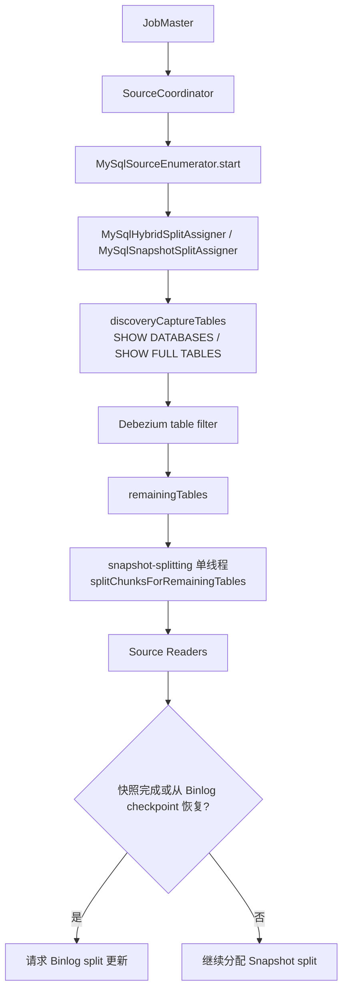

# Flink CDC MySQL Source Enumerator 表发现与全增量切换

## 原文锚点

- 本地文件：[flink-cdc 3.4.0笔记 MySqlSourceEnumerator是如何发现需要处理的数据库表的](<../文章/done-flink-cdc 3.4.0笔记 MySqlSourceEnumerator是如何发现需要处理的数据库表的.md>)
- 原文链接：https://mp.weixin.qq.com/s?__biz=Mzk0NjYzNzI5Mw==&mid=2247484943&idx=1&sn=7cf2e1647a7ce9070a2d659da6f10b7d
- 关键段落：JobMaster 创建 SourceCoordinator、`MySqlSourceEnumerator#start`、`discoveryCaptureTables`、`TableDiscoveryUtils#listTables`、动态表扫描条件、removed/newlyAddedTables、`MySqlSnapshotSplitAssigner#startAsynchronouslySplit`。
- 关键图：正文提到条件表达式和状态流转图，本地 Markdown 无图片。

## 图片处理

| 图片 | 类型 | 是否保留 | 理由 | 处理方式 |
|---|---|---|---|---|
| 新增表检测条件图 | 说明图 | 原图缺失 | 影响动态表扫描边界理解 | Mermaid 重建 |
| `assignerStatus` 状态流转图 | 状态图 | 原图缺失 | 影响全量/增量切换理解 | Mermaid 重建 |

## 一句话结论

这篇文章值得精读：它把 Flink CDC 的全量/增量切换从“配置项”推进到 Source Coordinator 和 Split Assigner 的控制面，能解释表发现、新增表处理和恢复边界。

## 用户相关性判断

| 项 | 内容 |
|---|---|
| 用户当前认知层级 | Flink CDC / 实时计算 L2-L3 draft |
| 认知成熟度 | draft |
| 阅读投入建议 | 精读 |
| 阅读投入理由 | 能补现有 Flink CDC 知识点缺失的内部控制面，但原文缺完整源码上下文、版本差异和失败案例 |
| 对用户的新信息 | MySQL Source 先由 Enumerator/Assigner 发现表、维护表状态并切分快照，Binlog 阶段不是 Reader 自己“自然开始” |
| 问题指纹 | Flink CDC + MySQL Source Enumerator + table discovery/split assigner/assignerStatus + 全量快照到 Binlog 切换 + 表发现边界 |
| 排重判断 | 新建；与 3.x 架构笔记不重复，属于 Source 内部机制 |
| 置信度 | 中 |

## 认知校准点

| 校准点 | 文章观点/信息 | 与用户认知或价值观的关系 | 处理建议 |
|---|---|---|---|
| Enumerator 是 Source 控制面 | JobMaster/SourceCoordinator 调用 `MySqlSourceEnumerator#start` 管理分片分配 | 补纵向模块 | 写入 Flink CDC index |
| 表发现不是只读配置 | 会执行 `SHOW DATABASES` 和 `SHOW FULL TABLES ... BASE TABLE`，再由 Debezium table filter 过滤 | 补源端权限和扫描边界 | 后续验证大库权限和耗时 |
| Binlog 阶段有条件 | 快照完成或从 Binlog 阶段 checkpoint 恢复时，才需要请求 Binlog split 更新 | 补全量/增量切换机制 | 作为恢复判断点 |
| 动态新增表有状态条件 | 启用动态表扫描、非纯快照模式、已完成或绕过快照阶段才检测新增表 | 防止误以为所有新增表自动捕获 | 写入 Schema/表演进边界 |
| 删除表要清理内部状态 | removed tables 会清理 assignedSplits、splitFinishedOffsets、tableSchemas、remainingSplits 等 | 补失败恢复和状态边界 | 后续看 DDL/表删除实际行为 |

## 冲突点

| 冲突类型 | 具体表现 | 影响 | 处理 |
|---|---|---|---|
| 图片缺失 | 条件表达式和状态流转图缺失 | 影响机制理解 | Mermaid 重建 |
| 版本时效 | 文章标题限定 Flink CDC 3.4.0 | 当前版本可能有实现差异 | 后续官方/源码补证 |
| 证据不足 | 只有源码路径和 SQL 示例，缺运行日志、异常路径、恢复实验 | 不能直接作为排障 SOP | 降为精读 |
| 低层源码偏窄 | 只讲 MySQL Source Enumerator，不讲 Pipeline/Sink | 容易把局部当整体 | 明确本文位置 |

## 待吸收点

| 分级 | 内容 | 为什么值得吸收 | 后续动作 |
|---|---|---|---|
| 理解 | SourceCoordinator 启动 Enumerator，Enumerator 初始化 SplitAssigner | 补 Flink CDC Source 控制面 | 写入技术 index |
| 理解 | 表发现 SQL 会扫数据库和 BASE TABLE，再经过 Debezium filter | 影响权限、性能和配置预期 | 后续验证大实例表发现 |
| 理解 | 新增表通过 currentCapturedTables 与 previousCapturedTables 求差集 | 是动态表捕获的核心 | 追查配置开关和限制 |
| 记住 | 全量/增量切换由 split 状态和 checkpoint 共同决定，不只是 `startupOptions` | 影响恢复和断点续跑 | 写入排重准则 |
| 实践 | 构造新增表、删除表、快照中断恢复和 Binlog 阶段恢复实验 | 能验证表发现边界 | 后续实验 |

## 已知可跳过

| 内容 | 跳过理由 |
|---|---|
| JobMaster/SourceCoordinator 的 Flink 基础生命周期 | 用户不需要重复学习 Flink 入门 |
| `SHOW DATABASES` 示例输出本身 | 只是说明 SQL 形态 |
| 没有异常和版本差异的源码路径罗列 | 需要结合源码/官方后续补证 |

## 实践门槛

| 门槛 | 判断 | 证据 |
|---|---|---|
| 可运行 | 否 | 没有完整作业配置和复现实验 |
| 可验证 | 否 | 缺日志、状态快照、Reader 分配结果和新增表验证 |
| 可排障 | 部分 | 有源码入口和状态名，但缺失败信号 |
| 可迁移 | 是 | 可迁移到 Flink CDC 表发现和恢复边界判断 |
| 结论 | 降为精读 | 适合作为机制理解，不作为实践 SOP |

## 归类判断

| 项 | 内容 |
|---|---|
| 技术本体 | Flink CDC MySQL Source 内部控制面 |
| 文章主问题 | MySqlSourceEnumerator 如何发现需要处理的数据库表，并驱动快照分片和新增表处理 |
| 使用场景 | MySQL CDC 整库/多表同步、动态新增表、从 checkpoint 恢复 |
| 关键词干扰 | Flink 源码、JobMaster、SourceCoordinator |
| 最终归类 | 数据工程与数仓 / 实时计算 / Flink CDC |
| 归类理由 | 主问题是 CDC Source 如何采集和分配数据，不是通用 Flink 调度架构 |

## 技术定位

| 项 | 内容 |
|---|---|
| 技术类型 | 源码机制笔记 |
| 所属领域 | 数据工程与数仓 |
| 二级类目 | 实时计算 |
| 全局架构位置 | MySQL Source 的 Coordinator/Enumerator 层 |
| 涉及模块 | SourceCoordinator、MySqlSourceEnumerator、MySqlSnapshotSplitAssigner、TableDiscoveryUtils |
| 解决问题 | 解释表发现、快照分片、动态新增表和 Binlog 阶段切换的控制流程 |
| 原文局限 | 缺版本对比、源码上下文和失败恢复实验 |
| 我的结论 | 需要记住，用于补 Flink CDC 全量/增量切换缺口 |

## 纵向理解

| 维度 | 判断 |
|---|---|
| 全局架构 | JobMaster -> SourceCoordinator -> Enumerator -> SplitAssigner -> SourceReader -> Snapshot/Binlog split |
| 本文位置 | 只讲 MySQL Source 表发现和 split 分配，不讲 Sink、Schema Evolution 或下游一致性 |
| 核心机制 | 表发现 SQL、Debezium filter、remainingTables、assignedSplits、assignerStatus、snapshot-splitting |
| 使用链路 | 提交任务 -> Enumerator 启动 -> 发现表 -> 切分快照 -> 分配 Reader -> 快照完成 -> Binlog split |
| 前置条件 | 源库权限可执行库表发现 SQL，表过滤配置正确，checkpoint 状态可恢复 |
| 边界 | 不直接解决无主键表、DDL 兼容、下游幂等和 Sink 事务 |

## 横向对标

| 对标技术 | 实现方式 | 优势 | 劣势 | 适合场景 |
|---|---|---|---|---|
| Flink CDC MySQL Enumerator | Coordinator 分配 Snapshot/Binlog split | 与 Flink Source 架构集成，能并行快照 | 实现细节和版本相关 | Flink CDC 多表同步 |
| Debezium Connector | Kafka Connect 任务管理 offset 和表配置 | CDC 生态成熟 | 下游编排需要额外组件 | Kafka 中心化 CDC |
| SeaTunnel MySQL-CDC | 配置化 Source 订阅表 | 多源多端统一 | 内部表发现和恢复需另查 | 数据集成平台同步 |

## 后续追查

- 关键词：MySqlSourceEnumerator、MySqlSnapshotSplitAssigner、TableDiscoveryUtils、captureNewlyAddedTables、assignerStatus、Binlog split。
- 相关技术：Flink Source API、Debezium table filter、Flink CDC Pipeline、Checkpoint。
- 需要补读的文章：Flink CDC MySQL Source 当前源码、动态新增表官方限制、无主键表和表删除的恢复行为。

