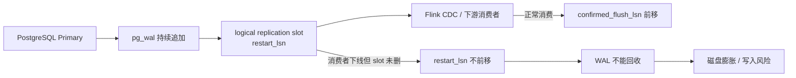

# Flink CDC PostgreSQL 复制槽 WAL 膨胀排障

## 原文锚点

- 本地文件：[Flink CDC 线上事故，悄悄吃掉了 12 TB 磁盘](<../文章/Flink CDC 线上事故，悄悄吃掉了 12 TB 磁盘.md>)
- 原文链接：https://mp.weixin.qq.com/s?__biz=MzYyMzMzNzk0MQ==&mid=2247483988&idx=1&sn=a76b2a1ab282a86166c94e4ab217de73
- 官方锚点：[PostgreSQL Replication Slots](https://www.postgresql.org/docs/current/warm-standby.html#STREAMING-REPLICATION-SLOTS)、[pg_replication_slots](https://www.postgresql.org/docs/current/view-pg-replication-slots.html)
- 关键段落：PostgreSQL WAL 暴涨、`pg_replication_slots`、`restart_lsn`、`active=false`、`pg_drop_replication_slot`、`max_slot_wal_keep_size`。
- 关键图：原文无技术图，机制可重建。

## 图片处理

| 图片 | 类型 | 是否保留 | 理由 | 处理方式 |
|---|---|---|---|---|
| 复制槽保留 WAL 机制 | 说明图 | 重建 | 文章主问题是复制槽如何阻止 WAL 清理 | Mermaid 重建 |

## 一句话结论

这篇文章值得精读，接近实践候选：它把 Flink CDC 的 PostgreSQL 源端风险校准为“复制槽生命周期治理”问题，而不是普通磁盘告警。

## 用户相关性判断

| 项 | 内容 |
|---|---|
| 用户当前认知层级 | Flink CDC / 实时计算 L2-L3 draft |
| 认知成熟度 | draft |
| 阅读投入建议 | 精读 |
| 阅读投入理由 | 有明确现象、诊断 SQL、处理步骤和长期预防，但缺真实版本、完整日志、审批流程和压测验证 |
| 对用户的新信息 | CDC 下线不是只停 Flink 任务，还必须清理或监控 PostgreSQL logical replication slot |
| 问题指纹 | Flink CDC + PostgreSQL Source + logical replication slot/restart_lsn/max_slot_wal_keep_size + WAL 膨胀 + 下线治理和源端排障 |
| 排重判断 | 新建 |
| 置信度 | 高 |

## 认知校准点

| 校准点 | 文章观点/信息 | 与用户认知或价值观的关系 | 处理建议 |
|---|---|---|---|
| CDC 任务是数据库复制拓扑成员 | PostgreSQL 通过复制槽保留 WAL，消费者不消费时 `restart_lsn` 不前移 | 补充 Flink CDC 源端协议边界 | 写入 Flink CDC index |
| 下线流程必须覆盖源端资源 | 停 Flink 任务不等于清理复制槽 | 纠偏“任务停了就结束”的运维认知 | 进入下线 checklist |
| 最老槽决定全局保留地板 | 一个老 slot 可能导致大量 WAL 无法回收 | 补排障优先级 | 先找最老 `restart_lsn` |
| 参数是取舍不是万能兜底 | `max_slot_wal_keep_size` 可限制 WAL 保留，但可能导致下游丢数据 | 避免把配置当无成本修复 | 写明容量和丢数风险 |

## 冲突点

| 冲突类型 | 具体表现 | 影响 | 处理 |
|---|---|---|---|
| 原目录冲突 | 原文在 raws/big-data，脚本粗分到实时计算 | 容易把问题看成 Flink 运行问题 | 重路由到实时计算 / Flink CDC |
| 证据不足 | 数字很具体，但缺 PostgreSQL/030302_Flink CDC 版本、日志和变更审批记录 | 不能直接当通用 SOP | 保留机制和检查项，不沉淀具体阈值为标准 |
| 实践门槛不足 | 有 SQL 和处理动作，但无复现环境 | 不能判为实践 | 降为精读 |
| 类比表达偏多 | 食堂打饭类比方便理解但不适合作为工程结论 | 可能弱化机制 | 只保留 `restart_lsn` 和 WAL 保留机制 |

## 待吸收点

| 分级 | 内容 | 为什么值得吸收 | 后续动作 |
|---|---|---|---|
| 理解 | PostgreSQL replication slot 是 CDC 消费位点，`restart_lsn` 决定仍需保留的 WAL 下界 | 能解释 WAL 膨胀的根因 | 补到 CDC 源端模块 |
| 理解 | 排查入口是 `pg_replication_slots`，重点看 `active`、`restart_lsn`、`confirmed_flush_lsn`、lag size | 形成可执行排障路径 | 后续做 SQL 模板 |
| 记住 | CDC 任务下线必须同时处理源端复制槽、目标端表和调度配置 | 影响长期运维准则 | 写入下线 checklist |
| 记住 | `max_slot_wal_keep_size` 是磁盘保护阀，不是无损恢复方案 | 避免错误兜底 | 配置前确认可接受数据丢失窗口 |
| 实践 | 构造 PostgreSQL logical slot 不消费场景，观察 WAL 保留和清理 | 可验证源端故障 | 待实验 |

## 已知可跳过

| 内容 | 跳过理由 |
|---|---|
| 大量事故渲染和类比 | 不影响工程判断 |
| 具体 12 TB、125 天、500 GB 阈值 | 缺业务写入量、版本和容量基线，只能作为案例 |
| 公众号引导语 | 无知识价值 |

## 实践门槛

| 门槛 | 判断 | 证据 |
|---|---|---|
| 可运行 | 部分 | 有 SQL，但无完整 PostgreSQL/030302_Flink CDC 环境 |
| 可验证 | 部分 | 可用 WAL lag 和磁盘变化验证，但原文无复现数据 |
| 可排障 | 是 | 有 `pg_replication_slots`、删除 slot、checkpoint 路径 |
| 可迁移 | 是 | 可迁移到 Flink CDC PostgreSQL 源端治理 |
| 结论 | 降为精读 | 缺版本、审批和复现环境 |

## 归类判断

| 项 | 内容 |
|---|---|
| 技术本体 | Flink CDC 读取 PostgreSQL 逻辑复制日志 |
| 文章主问题 | CDC 任务下线后遗留复制槽导致 WAL 膨胀 |
| 使用场景 | PostgreSQL -> Flink CDC -> 下游同步 |
| 关键词干扰 | 磁盘、Flink、事故、运维都可能误导到资源运维或实时计算 |
| 最终归类 | 数据工程与数仓 / 实时计算 / Flink CDC |
| 归类理由 | 主问题是 CDC 源端复制位点和同步任务生命周期，不是 Flink 计算逻辑 |

## 技术定位

| 项 | 内容 |
|---|---|
| 技术类型 | 生产排障案例 |
| 所属领域 | 数据工程与数仓 |
| 二级类目 | 实时计算 |
| 全局架构位置 | 数据库日志捕获层 |
| 涉及模块 | PostgreSQL replication slot、WAL、Flink CDC Source、任务下线 |
| 解决问题 | 防止 CDC 消费位点遗留导致源库 WAL 无上限保留 |
| 原文局限 | 缺官方版本核对和完整故障证据链 |
| 我的结论 | 以后关注，作为 Flink CDC 源端治理核心故障 |

## 纵向理解

| 维度 | 判断 |
|---|---|
| 全局架构 | PostgreSQL WAL -> logical replication slot -> Flink CDC Source -> 下游 Sink |
| 本文位置 | 只讲 PostgreSQL 源端 slot 生命周期，不讲下游一致性 |
| 核心机制 | 复制槽保存消费位点，防止 WAL 在消费者确认前被删除 |
| 使用链路 | 查询 slot -> 评估 lag -> 确认任务下线 -> 删除 slot -> 触发/等待 checkpoint -> 观察磁盘 |
| 前置条件 | 明确 slot 对应任务、业务下线审批、可接受丢弃未消费 WAL |
| 边界 | 不能在下游临时故障或仍需恢复消费时直接删 slot |

## 横向对标

| 对标技术 | 实现方式 | 优势 | 劣势 | 适合场景 |
|---|---|---|---|---|
| PostgreSQL replication slot | 源库保存消费位点并保留 WAL | 可保证消费者断连后继续追数据 | 遗留 slot 会撑爆 WAL | PostgreSQL CDC |
| MySQL binlog + server_id | 复制连接身份 + binlog 位点 | 生态成熟，Flink CDC 常见 | 身份冲突或 binlog 清理也会断流 | MySQL CDC |
| Kafka offset | 消费组位点在 Kafka 侧 | 位点治理独立于源库 | 不负责源库日志保留 | 消息队列消费 |

## 后续追查

- 关键词：PostgreSQL replication slot、`pg_replication_slots`、`restart_lsn`、`max_slot_wal_keep_size`、Flink CDC PostgreSQL Source。
- 相关技术：MySQL `server-id`、Debezium PostgreSQL connector、CDC 下线 checklist。
- 需要补读的文章：Flink CDC PostgreSQL Connector 官方文档、PostgreSQL replication slot 监控、Debezium slot lifecycle。

