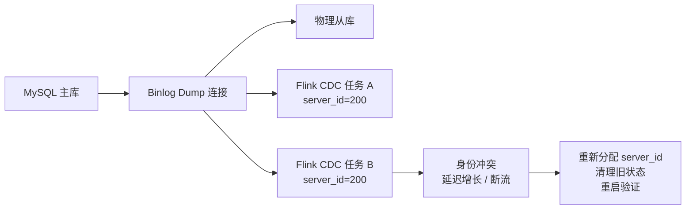

# Flink CDC Server ID 冲突排障

## 原文锚点

- 本地文件：[大数据运维：Flink CDC任务 “server_id 冲突”的故障处理（生产环境）](<../文章/done-大数据运维：Flink CDC任务 “server_id 冲突”的故障处理（生产环境）.md>)
- 原文链接：https://mp.weixin.qq.com/s?__biz=MzAxMTYxMDY3Mw==&mid=2247488226&idx=1&sn=70274eda7a99386b2765e8d7110938cc
- 官方锚点：[Flink CDC MySQL Pipeline Connector](https://nightlies.apache.org/flink/flink-cdc-docs-stable/docs/connectors/pipeline-connectors/mysql/)
- 关键段落：Flink CDC 本质是 MySQL 逻辑从库、`server_id`/`server_uuid` 唯一性、`SHOW PROCESSLIST`、清理旧 Checkpoint 状态、下游验证。
- 关键图：无技术图。

## 图片处理

| 图片 | 类型 | 是否保留 | 理由 | 处理方式 |
|---|---|---|---|---|
| 无 | 无图 | 不适用 | 排障链路可用文字和 Mermaid 表达 | Mermaid 重建 |

## 一句话结论

这篇文章值得精读，接近实践候选：它把 Flink CDC 的一个生产故障校准为“逻辑从库身份冲突 + 状态恢复残留”的组合问题。

## 用户相关性判断

| 项 | 内容 |
|---|---|
| 用户当前认知层级 | Flink CDC / 实时计算 L2 draft |
| 认知成熟度 | draft |
| 阅读投入建议 | 精读 |
| 阅读投入理由 | 有故障背景、排查命令、修复和验证路径；但缺完整日志、版本和复现环境，暂不判实践 |
| 对用户的新信息 | CDC 任务要当 MySQL 复制拓扑的一员管理，`server_id` 是生产台账，不是随手配置 |
| 问题指纹 | Flink CDC + MySQL Source + server_id/server_uuid + binlog 逻辑从库身份冲突 + 延迟增长和断流排障 |
| 排重判断 | 新建 |
| 置信度 | 高 |

## 认知校准点

| 校准点 | 文章观点/信息 | 与用户认知或价值观的关系 | 处理建议 |
|---|---|---|---|
| Flink CDC 是逻辑从库 | MySQL 主库用 `server_id`/`server_uuid` 区分物理从库和 CDC 任务 | 补充数据集成的上游协议边界 | 写入 Flink CDC index |
| 延迟增长可能不是下游慢 | 本案例业务延迟持续增长，根因是 binlog 同步身份冲突 | 纠偏：不能只看 Sink 或 Flink 资源 | 写入排障路径 |
| 改配置不一定生效 | 旧 Checkpoint 里可能保留历史身份和 offset | 补充状态恢复风险 | 记住“配置 + 状态”一起检查 |
| server_id 要台账化 | 多 CDC 任务、物理从库共用同一个 MySQL 主库时必须统一规划 | 工程治理点 | 后续补数据集成规范 |

## 冲突点

| 冲突类型 | 具体表现 | 影响 | 处理 |
|---|---|---|---|
| 实践证据不足 | 有命令和修复步骤，但无完整报错日志、版本、任务配置和恢复前后指标 | 不能直接作为可复现实验 | 降为精读，保留待实验 |
| 参数名时效 | 文章使用 Debezium 风格配置，当前 Flink CDC Pipeline 中常见 `server-id` 范围配置 | 复制配置可能失效 | 官方文档校准 |
| 风险未完全展开 | 删除 Checkpoint 会影响 offset 和一致性 | 生产操作风险 | 标为需谨慎审批 |

## 待吸收点

| 分级 | 内容 | 为什么值得吸收 | 后续动作 |
|---|---|---|---|
| 理解 | MySQL CDC 任务在源端表现为 binlog dump 从库连接 | 解释为什么身份冲突会阻断同步 | 写入实时计算/030302_Flink CDC排障 |
| 理解 | `SHOW PROCESSLIST` 可确认主库上所有 binlog dump 连接 | 排查冲突源的入口 | 后续做排障 SOP |
| 记住 | `server_id` 必须在同一 MySQL 主库复制拓扑内唯一 | 影响所有 MySQL CDC 任务 | 建立台账规则 |
| 记住 | 改 `server_id` 后要确认状态恢复是否仍复用旧配置 | 避免修复无效 | 关联 Checkpoint/Savepoint |
| 实践 | 构造两个 MySQL CDC 任务使用相同 `server-id`，观察报错、延迟和恢复流程 | 可验证 | 待实验 |

## 已知可跳过

| 内容 | 跳过理由 |
|---|---|
| 点赞关注、公众号推广 | 无沉淀价值 |
| “唯一性”口号 | 需要落到台账、配置、状态和验证 |

## 实践门槛

| 门槛 | 判断 | 证据 |
|---|---|---|
| 可运行 | 部分 | 有 MySQL 命令和配置项 |
| 可验证 | 部分 | 有日志、连接、下游同步三个验证方向 |
| 可排障 | 是 | 有冲突源排查和恢复链路 |
| 可迁移 | 是 | 可迁移到 MySQL -> StarRocks/Doris/Paimon 等 CDC 链路 |
| 结论 | 降为精读 | 缺版本和完整复现实验 |

## 归类判断

| 项 | 内容 |
|---|---|
| 技术本体 | Flink CDC 是数据集成/CDC 工具 |
| 文章主问题 | MySQL CDC 任务 `server_id` 冲突如何排查和恢复 |
| 使用场景 | MySQL -> StarRocks/Doris/Kafka/Paimon 等实时同步 |
| 关键词干扰 | Flink、运维、StarRocks |
| 最终归类 | 数据工程与数仓 / 实时计算 / Flink CDC |
| 归类理由 | 主问题是 CDC 源端复制身份和同步链路恢复，不是 Flink 计算调优或 StarRocks 查询 |

## 技术定位

| 项 | 内容 |
|---|---|
| 技术类型 | 生产排障 |
| 所属领域 | 数据工程与数仓 |
| 二级类目 | 实时计算 |
| 全局架构位置 | MySQL binlog -> Flink CDC Source -> 下游 Sink |
| 涉及模块 | MySQL Source、Debezium、Checkpoint、下游写入 |
| 解决问题 | CDC 任务因复制身份冲突导致延迟增长或断流 |
| 原文局限 | 缺版本、完整日志和一致性恢复策略 |
| 我的结论 | 需要记住，后续可实践 |

## 纵向理解

| 维度 | 判断 |
|---|---|
| 全局架构 | MySQL 主库维护物理/逻辑从库连接，Flink CDC 作为逻辑从库读取 binlog |
| 本文位置 | 只讲 MySQL Source 连接身份冲突，不讲全增量切换和 Schema 演进 |
| 核心机制 | `server_id` 唯一、`server_uuid` 唯一、Checkpoint 状态恢复、binlog dump 连接验证 |
| 使用链路 | 查主库连接 -> 查物理从库和其他 CDC 配置 -> 分配唯一 ID -> 清理/迁移状态 -> 重启验证 |
| 前置条件 | 有 MySQL 权限、Flink 作业配置、Checkpoint 路径、下游验证口径 |
| 边界 | 不解决 MySQL 权限、binlog retention、网络、下游反压和 DDL 兼容问题 |

## Mermaid 重建

## 横向对标

| 对标问题 | 实现方式 | 优势 | 劣势 | 适合场景 |
|---|---|---|---|---|
| `server_id` 冲突 | 查 MySQL binlog dump 连接和 CDC 配置 | 根因明确 | 需要跨团队台账 | MySQL CDC 多任务 |
| offset 过期 | 查 binlog retention 和 checkpoint offset | 能解释断点恢复失败 | 恢复可能需要重做快照 | 长停机任务 |
| 下游反压 | 看 Flink backpressure 和 Sink 指标 | 定位写入瓶颈 | 容易误判为源端问题 | Sink 慢 |
| DDL 不兼容 | 查 Schema Evolution 和下游表结构 | 避免结构漂移 | 依赖目标端能力 | 整库同步 |

## 后续追查

- 关键词：Flink CDC MySQL `server-id`、Debezium `database.server.id`、binlog dump、Checkpoint、server_uuid。
- 相关技术：MySQL replication、Flink CDC Pipeline、StarRocks/Doris/Paimon Sink。
- 需要补读的文章：Flink CDC MySQL 官方连接器文档、Flink CDC FAQ、MySQL 复制 server_id 规范。

