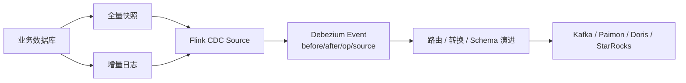

# Flink CDC 概览与数据集成边界

## 原文锚点

- 本地文件：[Flink CDC的概览和使用](<../文章/done-Flink CDC的概览和使用.md>)
- 原文链接：http://mp.weixin.qq.com/s?__biz=MzkwODYwNjExMA==&mid=2247483976&idx=1&sn=e0b27fcb81526918faa5a84a6136c5e0&chksm=c0c62db9f7b1a4af30aea32b77eaa8bedbfa628124a5befe131567e25cc7b1a6beb14548d8ed&mpshare=1&scene=24&srcid=1222Fpc39ui5ofN34R6Bhocx&sharer_shareinfo=9fc41d9ec280d422e3b2ce0c01bace20&sharer_shareinfo_first=9fc41d9ec280d422e3b2ce0c01bace20#rd
- 关键段落：CDC 定义、Flink CDC 定位、1.x/2.x/3.x 演进、MySQL 示例、Debezium 事件格式。
- 关键图：无技术图。

## 图片处理

| 图片 | 类型 | 是否保留 | 理由 | 处理方式 |
|---|---|---|---|---|
| 无 | 无图 | 不适用 | 可用流程图表达链路 | Mermaid 重建 |

## 一句话结论

这篇文章适合精读，但要重路由：Flink CDC 的主问题是数据变更捕获和同步入口，不是 Flink 状态计算本身。

## 用户相关性判断

| 项 | 内容 |
|---|---|
| 用户当前认知层级 | 数据集成 L2 draft；Flink L2-L3 draft |
| 认知成熟度 | draft |
| 阅读投入建议 | 精读 |
| 阅读投入理由 | 能建立 Flink CDC 的入口定位和版本演进，但示例偏旧，实践前需按当前 Apache Flink CDC 文档校准 |
| 对用户的新信息 | Flink CDC 已从早期 Source Connector 集合演进为流式数据集成工具，不能只当 Flink SQL 的一个连接器看 |
| 问题指纹 | Flink CDC + CDC Source/Pipeline + 全量快照/增量日志/版本演进 + 数据集成入口 + 不等同于 Flink 计算引擎 |
| 排重判断 | 新建 |
| 置信度 | 高 |

## 认知校准点

| 校准点 | 文章观点/信息 | 与用户认知或价值观的关系 | 处理建议 |
|---|---|---|---|
| Flink CDC 的本体是数据集成 | 它捕获数据库变更并同步下游，不是通用流计算机制 | 纠偏分类边界 | 新建实时计算/030302_Flink CDC |
| 1.x/2.x/3.x 的核心差异在生产可用性 | 1.x 锁表，全增量切换有问题；2.x 引入无锁算法；3.x 转向 Data Integration Engine | 补演进边界 | 写入 index |
| Debezium 事件格式是理解 CDC 的基础 | before/after/source/op/ts_ms 体现变更语义和位点 | 补横向机制 | 与 Debezium 对标 |
| 示例不能直接当当前最佳实践 | 文中使用 Flink 1.16.3、Flink CDC 2.4.2，当前项目已迁移到 Apache Flink CDC | 版本时效风险 | 后续查官方 |

## 冲突点

| 冲突类型 | 具体表现 | 影响 | 处理 |
|---|---|---|---|
| 关键词误导 | 标题含 Flink，容易归入实时计算 | 会混淆采集和计算职责 | 重路由到实时计算 / Flink CDC |
| 版本时效 | 示例依赖 Flink CDC 2.4.2 和旧 GitHub 地址 | 实践风险 | 标记需查当前 Apache 文档 |
| 实践判定偏宽 | 有 Docker、DDL、代码，但缺验证输出、恢复、DDL、故障 case | 不能直接判实践 | 降为精读 |

## 待吸收点

| 分级 | 内容 | 为什么值得吸收 | 后续动作 |
|---|---|---|---|
| 理解 | CDC 捕获 insert/update/delete 变更，是实时数仓入口 | 明确技术本体 | 写入实时计算/030302_Flink CDC index |
| 理解 | Flink CDC 2.x 解决全增量切换锁表问题，3.x 转向数据集成引擎 | 判断版本差异 | 后续补当前文档 |
| 记住 | Flink CDC 是采集同步工具，Flink 是计算引擎，二者不能混为一类 | 防止分类误差 | 作为归类规则 |
| 记住 | Debezium 事件里的 `before/after/op/source` 是 CDC 语义核心 | 影响下游 Upsert/删除处理 | 与 Paimon/Doris 同步关联 |
| 实践 | 验证 MySQL 全量 -> 增量 -> DDL 变化 -> Checkpoint 恢复链路 | 可形成数据集成实验 | 待实验 |

## 已知可跳过

| 内容 | 跳过理由 |
|---|---|
| CDC 是 Change Data Capture | 基础定义，略过即可 |
| Java 项目搭建细节 | 示例偏旧，实践前查当前文档 |
| “生产 case”外链 | 没有本地内容，不沉淀 |

## 实践门槛

| 门槛 | 判断 | 证据 |
|---|---|---|
| 可运行 | 部分 | 有 Docker、MySQL DDL、Java 示例 |
| 可验证 | 否 | 缺期望输出、更新/删除/恢复验证 |
| 可排障 | 否 | 缺权限、位点、锁、Checkpoint、DDL 失败路径 |
| 可迁移 | 是 | 思路可迁移到数据集成链路 |
| 结论 | 降为精读 | 当前示例不足以直接实践 |

## 归类判断

| 项 | 内容 |
|---|---|
| 技术本体 | Flink CDC 是基于 Flink 的数据集成/CDC 工具 |
| 文章主问题 | 如何理解 Flink CDC 的定位、版本演进和基本使用 |
| 使用场景 | MySQL/PostgreSQL/Oracle 等数据库变更同步到下游 |
| 关键词干扰 | Flink、实时计算、Debezium、Java 示例 |
| 最终归类 | 数据工程与数仓 / 实时计算 / Flink CDC |
| 归类理由 | 主问题是数据采集和同步，不是 Flink 计算状态、窗口或 Join |

## 纵向理解

| 维度 | 判断 |
|---|---|
| 全局架构 | 业务数据库 -> 全量快照/增量日志 -> Flink CDC -> 转换/路由/Schema 演进 -> 下游系统 |
| 本文位置 | 只讲概览和基本使用，不讲生产一致性细节 |
| 核心机制 | Debezium 事件、Source Connector、全量/增量演进、Data Integration Engine 定位 |
| 使用链路 | 配置源库权限 -> 创建 CDC Source -> 开启 Checkpoint -> 写入下游 -> 验证 insert/update/delete/DDL |
| 前置条件 | 数据库日志开启、权限正确、下游支持 Upsert/Delete、Checkpoint 可用 |
| 边界 | 不解决下游建模、OLAP 查询优化和 Flink SQL 状态膨胀 |

## Mermaid 重建

## 横向对标

| 对标技术 | 实现方式 | 优势 | 劣势 | 适合场景 |
|---|---|---|---|---|
| Flink CDC | Flink Source/Pipeline 捕获数据库变更 | 贴近 Flink 和实时湖仓链路 | 版本和下游一致性要细查 | 实时数仓入口 |
| Debezium | Kafka Connect 生态 CDC | 数据库日志捕获能力成熟 | 与 Flink 计算链路需要集成 | Kafka 中心化 CDC |
| Canal | MySQL binlog 订阅 | 轻量，MySQL 场景常见 | 多源、Schema、下游生态弱 | MySQL 增量订阅 |
| DataX | 批式同步 | 简单稳定 | 低延迟增量弱 | 离线全量/分区同步 |
| SeaTunnel | 多源多端数据集成 | 场景覆盖广 | CDC 与 Flink 生态需比较 | 批流一体集成平台 |

## 后续追查

- 关键词：Apache Flink CDC、full database synchronization、schema evolution、Debezium event、StartupOptions、Checkpoint。
- 相关技术：Debezium、SeaTunnel、DataX、Paimon、Doris、StarRocks、Kafka。
- 需要补读的文章：Flink CDC 全增量切换、Flink CDC 3.x Pipeline、MySQL -> Paimon/Doris/StarRocks 生产实践。

## 重新蒸馏补充（2026-06-18）

| 来源 | 认知增量 | 处理 |
|---|---|---|
| [[03_数据工程与数仓/0303_实时计算/030302_Flink CDC/文章/done-Flinkcdc和Canal哪个性能更好，你测试对比了吗？你会选择用哪个？]] | 补充该主题的生产案例、机制边界或排重样例。 | 重新判断后补入目标知识产物 |
