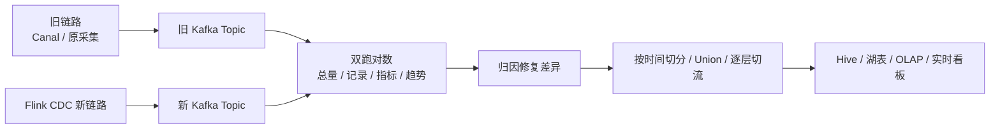

# Flink CDC 生产切换与双跑对数边界

## 原文锚点

- 本地文件：[Flink CDC 在货拉拉的落地与实践](<../文章/done-Flink CDC 在货拉拉的落地与实践.md>)
- 相关原文：[官宣｜阿里巴巴捐赠的 Flink CDC 项目正式加入 Apache 基金会](<../文章/done-官宣｜阿里巴巴捐赠的 Flink CDC 项目正式加入 Apache 基金会.md>)
- 原文链接：本地原文 front matter 中的微信公众号链接。
- 关键段落：稳定性、兼容性、数据一致性四类挑战；Kafka 中间层降低 MySQL 重复连接；Canal 兼容和同主键分区有序；双采集、Union 切流、多层对数；延迟、恢复、Kafka 存储量收益。
- 关键图：正文多次提到“如下图/从上图”，本地 Markdown 无图片。

## 图片处理

| 图片 | 类型 | 是否保留 | 理由 | 处理方式 |
|---|---|---|---|---|
| 整体能力构建图 | 架构图 | 原图缺失 | 说明平台化能力边界 | Mermaid 重建 |
| 链路切换和对数流程图 | 流程图 | 原图缺失 | 是文章最有价值的生产方法 | Mermaid 重建 |
| Meetup/官宣配图 | 活动/资讯图 | 删除 | 不影响机制理解 | 不进入知识点 |

## 一句话结论

这篇文章值得精读：Flink CDC 生产落地的关键不是“延迟下降”这个结果，而是 Kafka 中间层、协议兼容、监控指标、双跑对数和逐层切流组成的迁移控制面。

## 用户相关性判断

| 项 | 内容 |
|---|---|
| 用户当前认知层级 | Flink CDC / 实时计算 L2-L3 draft |
| 认知成熟度 | draft |
| 阅读投入建议 | 精读 |
| 阅读投入理由 | 能补生产切换、兼容旧链路、对数验证和监控指标；但收益数字缺完整基线，不能直接泛化 |
| 对用户的新信息 | CDC 链路替换要先构建双跑和对数，而不是一次性替换 Source；Kafka 中间层可降低多个下游直接连 MySQL 的压力 |
| 问题指纹 | Flink CDC + 生产迁移 + Kafka 中间层/Canal 兼容/双跑对数/监控指标 + 链路切换边界 + 最终一致性验证 |
| 排重判断 | 新建；Meetup 和 Apache 官宣只作为相关原文或排重材料 |
| 置信度 | 中 |

## 认知校准点

| 校准点 | 文章观点/信息 | 与用户认知或价值观的关系 | 处理建议 |
|---|---|---|---|
| 生产切换先验证一致性 | 货拉拉通过双采集、逐层对数和差异归因降低切换风险 | 补工程落地边界 | 写入 CDC 迁移准则 |
| Kafka 中间层是减压和解耦手段 | 多个任务使用同一 MySQL 表时，用 Kafka 转发减少重复 binlog 连接 | 补架构位置 | 与直接 Sink OLAP 区分 |
| 协议兼容比“跑通新链路”更重要 | 兼容 Canal 功能，同主键 Hash 到 Kafka 同分区保障有序 | 补下游兼容边界 | 写入 Kafka Sink 注意点 |
| 监控要下沉到 Debezium/Flink 指标 | 上报 NumberOfDisconnects、等待队列、事件数等指标 | 补排障入口 | 后续做监控清单 |
| 收益数字要降权 | 延迟下降、存储量下降等缺完整基线、样本和环境 | 符合反标题党偏好 | 只作为案例，不作为通用承诺 |

## 冲突点

| 冲突类型 | 具体表现 | 影响 | 处理 |
|---|---|---|---|
| 图片缺失 | 能力构建、切换流程、收益对比图缺失 | 影响方法复用 | Mermaid 重建主流程 |
| 证据不足 | 延迟下降 80%、存储下降 20%-60% 缺版本、任务规模、基线 | 易误导选型收益 | 降权为案例 |
| 资讯混杂 | Apache 官宣和社区资讯有路线图信息 | 不宜单独建核心笔记 | 合并为相关原文和排重结论 |
| 关键词误导 | 文中有实时计算、湖仓、Paimon/Iceberg | 容易偏到实时计算或湖仓表格式 | 按 CDC 生产迁移归数据集成 |

## 待吸收点

| 分级 | 内容 | 为什么值得吸收 | 后续动作 |
|---|---|---|---|
| 理解 | CDC 平台化能力包含应用层、平台适配、数据架构和稳定性 | 避免把 Flink CDC 当单作业工具 | 更新 Flink CDC index |
| 理解 | Kafka 作为中间层能减少 MySQL 重复连接，下游消费 Topic 构建统一视图 | 解释整库同步平台化模式 | 与 CDC2Kafka 笔记关联 |
| 理解 | Canal 到 Flink CDC 迁移要兼容协议和分区有序 | 影响无感切换 | 后续验证格式兼容 |
| 记住 | 切换链路必须双跑、对数、归因、修复，再逐层切流 | 可复用迁移准则 | 写入实时计算/030302_Flink CDC实践清单 |
| 实践 | 设计一套旧链路 vs Flink CDC 的对账表：总量、主键集合、字段 hash、指标差异率、延迟分布 | 可迁移到用户数仓验证 | 后续实验 |

## 已知可跳过

| 内容 | 跳过理由 |
|---|---|
| 业务公司介绍和社区活动信息 | 背景，不影响技术判断 |
| Flink CDC 社区宣传和活动日程 | 资讯价值高于长期沉淀 |
| 未给基线的收益数字 | 只能作为案例信号 |
| Apache 捐赠流程细节 | 只保留“官方子项目/新定位”作为排重信息 |

## 实践门槛

| 门槛 | 判断 | 证据 |
|---|---|---|
| 可运行 | 否 | 原文没有完整配置和任务模板 |
| 可验证 | 部分 | 有双跑对数、差异率、延迟对比等方法，但缺指标定义细节 |
| 可排障 | 部分 | 有 Debezium/Flink 指标方向，缺日志和告警阈值 |
| 可迁移 | 是 | 切换控制面可迁移到数据集成链路 |
| 结论 | 降为精读 | 方法值得吸收，但不能直接实践复现 |

## 归类判断

| 项 | 内容 |
|---|---|
| 技术本体 | Flink CDC 数据集成链路 |
| 文章主问题 | 如何把已有采集链路生产迁移到 Flink CDC，并保障最终一致性和稳定性 |
| 使用场景 | Canal/旧采集链路切换、MySQL -> Kafka、整库同步、实时看板和下游加工 |
| 关键词干扰 | 实时计算、Paimon、Iceberg、社区路线图 |
| 最终归类 | 数据工程与数仓 / 实时计算 / Flink CDC |
| 归类理由 | 主问题是 CDC 数据采集链路的生产切换和验证，不是 Flink 算子开发或湖表存储 |

## 技术定位

| 项 | 内容 |
|---|---|
| 技术类型 | 生产实践案例 |
| 所属领域 | 数据工程与数仓 |
| 二级类目 | 实时计算 |
| 全局架构位置 | 源库采集层到 Kafka 中间层、下游实时/离线消费之间 |
| 涉及模块 | Flink CDC Source、Kafka Topic、Canal 协议兼容、监控指标、双跑对数 |
| 解决问题 | 在生产中替换旧 CDC 链路，同时控制源库压力、下游兼容和数据一致性风险 |
| 原文局限 | 缺完整配置、指标口径、版本和失败案例细节 |
| 我的结论 | 需要记住迁移方法；收益数字只作为案例，不作为选型承诺 |

## 纵向理解

| 维度 | 判断 |
|---|---|
| 全局架构 | MySQL -> Flink CDC -> Kafka 中间层 -> Flink ETL/湖表/Hive/OLAP/看板 |
| 本文位置 | 讲生产平台化和链路切换，不讲 Source 内部切分或 Sink 事务 |
| 核心机制 | Kafka 解耦、协议兼容、同主键分区有序、双采集、逐层对数、指标监控 |
| 使用链路 | 新旧链路双跑 -> 统一格式 -> 对账差异 -> 修复 -> 时间切分/Union -> 逐层切流 |
| 前置条件 | 有旧链路基线、对账口径、Kafka 中间层、监控指标、业务验收标准 |
| 边界 | 不自动解决 DDL、历史回补、无主键、跨库事务和下游幂等 |

## 横向对标

| 对标技术 | 实现方式 | 优势 | 劣势 | 适合场景 |
|---|---|---|---|---|
| Flink CDC -> Kafka 中间层 | CDC 采集后统一写 Topic，下游订阅 | 降低源库连接压力，利于多下游 | 增加 Kafka 运维和事件格式治理 | 平台化采集 |
| 直接 Flink CDC -> OLAP/湖表 | Source 直接写下游 | 链路短，延迟低 | 多下游复用和切换困难 | 单目标同步 |
| Canal 旧链路 | MySQL binlog 订阅 | 生态成熟，已有业务兼容 | 多源和 Flink 生态弱 | 存量系统 |
| Debezium + Kafka Connect | Connector 中心化 CDC | Kafka Connect 生态成熟 | 与 Flink SQL/ETL 结合需额外编排 | Kafka 中心化平台 |

## 后续追查

- 关键词：Flink CDC production migration、Canal compatible protocol、CDC double run、data reconciliation、NumberOfDisconnects、Kafka partition by primary key。
- 相关技术：Kafka、Canal、Debezium、Paimon、Iceberg、Flink Metrics。
- 需要补读的文章：Flink CDC 生产监控指标、CDC 对账方案、Canal 格式兼容、Flink CDC 到 Kafka 当前文档。

## 重新蒸馏补充（2026-06-18）

| 来源 | 认知增量 | 处理 |
|---|---|---|
| [[03_数据工程与数仓/0303_实时计算/030302_Flink CDC/文章/done-Flink CDC 导入表数据过亿，咋个整？]] | 补充该主题的生产案例、机制边界或排重样例。 | 重新判断后补入目标知识产物 |
| [[03_数据工程与数仓/0303_实时计算/030302_Flink CDC/文章/done-Flink CDC实现数据增量备份到ClickHouse实战]] | 补充该主题的生产案例、机制边界或排重样例。 | 重新判断后补入目标知识产物 |
