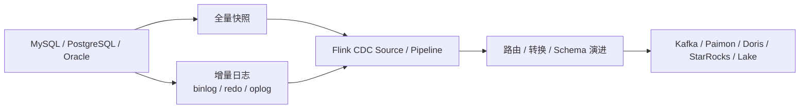

# Flink CDC
## 知识点入口

- 本模块先看宏观流程，再看文章：[知识地图](030302_知识地图.md)。
- 本次从数据集成迁移到实时计算的范围已吸收到当前目录规则和流程总览。
- 新文章必须先归入流程节点，再判断是补充、冲突、不同层次还是降权。
- `文章/` 只保留原文锚点，长期知识必须沉淀到 `030302_核心知识点/` 下的主题文件。

## 技术定位

| 项 | 内容 |
|---|---|
| 技术名 | Apache Flink CDC |
| 一级类目 | 数据工程与数仓 |
| 二级类目 | 实时计算 |
| 技术本体 | 基于 Flink 的实时 CDC 与流式数据集成工具，用于捕获数据库变更并同步到下游系统 |
| 全局架构位置 | 位于业务数据库和 Kafka/Paimon/Doris/StarRocks/湖仓之间，承担实时接入采集、全量快照、增量日志、Schema 变化和同步 Pipeline |
| 主要使用者 | 实时数仓工程师、数据集成工程师、数据平台工程师 |
| 主要产出 | CDC Source、同步 Pipeline、变更事件、下游表或消息 |

## 官方锚点

- 官网/文档：[Apache Flink CDC Documentation](https://nightlies.apache.org/flink/flink-cdc-docs-stable/docs/get-started/introduction/)
- GitHub：[apache/flink-cdc](https://github.com/apache/flink-cdc)
- 旧项目锚点：[ververica/flink-cdc-connectors](https://github.com/ververica/flink-cdc-connectors)

## 架构图

## 核心模块

| 模块 | 职责 | 重点问题 |
|---|---|---|
| Source Connector | 捕获数据库快照和日志 | 全增量一致性、锁、位点、权限 |
| Pipeline/YAML API | 声明式同步链路 | 整库同步、路由、转换、Schema 演进 |
| Composer | 将 Pipeline 配置翻译为 Flink 作业 | 作业生成、运行时配置、版本兼容 |
| Runtime | 执行数据同步专用逻辑 | Schema Evolution、Route、Transform、状态恢复 |
| SQL API | 在 Flink SQL 中使用 CDC 表 | 与计算逻辑耦合，状态和一致性 |
| DataStream API | 自定义 CDC 处理 | 灵活但维护成本高 |
| Sink 集成 | 写入 Kafka、湖仓和 OLAP | Exactly Once、幂等、主键和 Schema |

## 上下游

| 方向 | 对象 | 关系 |
|---|---|---|
| 上游 | MySQL、PostgreSQL、Oracle、MongoDB 等 | 捕获快照和变更日志 |
| 下游 | Kafka、Paimon、Iceberg、Doris、StarRocks、Hudi | 承接变更事件或同步表 |
| 依赖 | Flink、Debezium/数据库日志能力、Checkpoint、权限配置 | 决定一致性和恢复能力 |

## 横向对标

| 对标技术 | 对标点 | Flink CDC 优势 | Flink CDC 劣势 | 使用判断 |
|---|---|---|---|---|
| Debezium | 数据库日志捕获 | Flink CDC 更贴近 Flink 计算和同步 Pipeline | Debezium 生态独立，Kafka Connect 成熟 | Flink 链路用 Flink CDC，Kafka Connect 体系看 Debezium |
| SeaTunnel | 数据集成 | SeaTunnel 更通用多源多端 | Flink CDC 在 CDC + Flink 生态更直接 | 批流多源集成看 SeaTunnel，CDC 到 Flink 看 Flink CDC |
| DataX | 离线同步 | 简单稳定 | 不适合低延迟增量 | 离线批同步 |
| Canal | MySQL binlog 订阅 | MySQL 场景成熟 | 多源和 Flink 生态弱 | 轻量 MySQL 增量订阅 |

## 已沉淀核心知识点

| 主题 | 文件 | 问题指纹 | 解决什么问题 | 认知增量 |
|---|---|---|---|---|
| Flink CDC 概览与实时 CDC 边界 | [FlinkCDC概览与数据集成边界](030302_核心知识点/FlinkCDC概览与数据集成边界.md) | Flink CDC + CDC Source/Pipeline + 全量快照/增量日志/版本演进 + 实时接入入口 + 不等同于 Flink 通用计算引擎 | 判断 Flink CDC 在实时链路中到底承担采集同步还是计算加工 | Flink CDC 的本体已经从 Source Connector 扩展到 Data Integration Engine；本知识库按用户要求归入实时计算下的 CDC 子模块 |
| Flink CDC 3.0 数据集成架构 | [FlinkCDC3数据集成架构](030302_核心知识点/FlinkCDC3数据集成架构.md) | Flink CDC + Pipeline Framework + API/Connect/Composer/Runtime + YAML/Schema Evolution/Route + 数据集成框架边界 | 判断 Flink CDC 3.x 为什么是 Pipeline 框架化，而不只是连接器升级 | API/Connect/Composer/Runtime 四层说明了 Flink CDC 3.x 的数据集成本体 |
| Flink CDC 版本演进与 Pipeline 连接器边界 | [FlinkCDC版本演进与Pipeline连接器边界](030302_核心知识点/FlinkCDC版本演进与Pipeline连接器边界.md) | Flink CDC + 3.x 版本线 + Pipeline Connector + JDK/Flink 兼容 + 版本发布边界 | 判断 3.4/3.5/3.6 文章哪些能变成当前工程结论 | 发布公告只进入版本和连接器边界，不把新特性列表直接当生产能力 |
| Flink CDC Server ID 冲突排障 | [FlinkCDCServerID冲突排障](030302_核心知识点/FlinkCDCServerID冲突排障.md) | Flink CDC + MySQL Source + server_id/server_uuid + binlog 逻辑从库身份冲突 + 延迟增长和断流排障 | 排查 MySQL CDC 任务因复制身份冲突导致延迟增长或断流 | CDC 任务要当 MySQL 复制拓扑的一员管理，`server_id` 是生产台账 |
| Flink CDC PostgreSQL 复制槽 WAL 膨胀排障 | [FlinkCDCPostgreSQL复制槽WAL膨胀排障](030302_核心知识点/FlinkCDCPostgreSQL复制槽WAL膨胀排障.md) | Flink CDC + PostgreSQL Source + logical replication slot/restart_lsn/max_slot_wal_keep_size + WAL 膨胀 + 下线治理 | 判断 CDC 下线后源端复制槽为什么会撑爆 WAL | CDC 任务生命周期必须覆盖源端日志位点和复制槽资源 |
| Flink CDC 整库同步 Doris 链路边界 | [FlinkCDC整库同步Doris链路边界](030302_核心知识点/FlinkCDC整库同步Doris链路边界.md) | Flink CDC + MySQL-to-Doris Pipeline + YAML Source/Sink/server-id/auto create table + 整库同步链路边界 | 判断 MySQL -> Doris 应归数据集成还是 OLAP 查询 | 下游是 Doris 不代表文章主问题就是 OLAP，Doris Sink 语义仍需验证 |
| Flink CDC 到 Kafka 与 StarRocks 下游一致性边界 | [FlinkCDC到Kafka与StarRocks下游一致性边界](030302_核心知识点/FlinkCDC到Kafka与StarRocks下游一致性边界.md) | Flink CDC + Kafka/StarRocks Sink + Debezium event/key.fields/__op/schema cache + 下游一致性 | 判断 CDC 写 Kafka/StarRocks 时哪些因素决定更新删除正确性 | 主键分区、事件格式、目标 Schema、无主键表和恢复边界比“写入成功”更关键 |
| Flink CDC 事件模型与变更语义 | [FlinkCDC事件模型与变更语义](030302_核心知识点/FlinkCDC事件模型与变更语义.md) | Flink CDC + DataChangeEvent/SchemaChangeEvent + before/after/op/source 位点 + 事件语义 + 下游正确消费边界 | 判断一条 CDC 事件如何表达数据变更、Schema 变更和源端位点 | CDC 事件不是普通 JSON，必须把操作类型、表标识、前后镜像和日志位点当作一致性契约 |
| Flink CDC MySQL Source Enumerator 表发现与全增量切换 | [FlinkCDCMySQLSourceEnumerator表发现与全增量切换](030302_核心知识点/FlinkCDCMySQLSourceEnumerator表发现与全增量切换.md) | Flink CDC + MySQL Source Enumerator + table discovery/split assigner/assignerStatus + 全量快照到 Binlog 切换 | 判断 MySQL Source 如何发现表、切分快照并进入 Binlog 阶段 | 全量/增量切换是 Enumerator 和 SplitAssigner 的控制面问题，不只是配置项 |
| Flink CDC 生产切换与双跑对数边界 | [FlinkCDC生产切换与双跑对数边界](030302_核心知识点/FlinkCDC生产切换与双跑对数边界.md) | Flink CDC + 生产迁移 + Kafka 中间层/Canal 兼容/双跑对数/监控指标 + 链路切换边界 | 判断旧 CDC 链路迁移到 Flink CDC 时如何控风险 | 生产切换要双跑、对数、归因、修复和逐层切流，收益数字不能直接泛化 |

## 后续追查

- 关键词：Flink CDC、CDC Pipeline、Composer、Runtime、MySqlSourceEnumerator、Snapshot Split、Binlog Split、schema evolution、Route、Debezium、server-id、key.fields、Stream Load。
- 待读资料：Flink CDC 官方文档、全增量切换、整库同步、Schema 演进、MySQL Source `server-id`、MySQL Source Enumerator、MySQL -> Kafka/Paimon/Doris/StarRocks。
- 待补实验：用 MySQL 示例库跑 CDC 到 Kafka/Paimon/StarRocks，验证全量快照、增量事件、DDL 变化、无主键表、任务重启恢复、同主键 Kafka 分区有序和 Sink 幂等。
