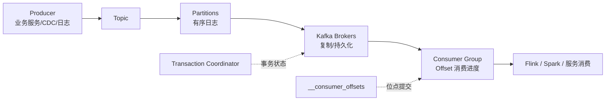

# Kafka
## 知识点入口

- 本模块先看宏观流程，再看文章：[知识地图](030304_核心知识点/知识地图.md)。
- 新文章必须先归入流程节点，再判断是补充、冲突、不同层次还是降权。
- `文章/` 只保留原文锚点，长期知识必须沉淀到 `030304_核心知识点/`。

## 技术定位

| 项 | 内容 |
|---|---|
| 技术名 | Apache Kafka |
| 一级类目 | 数据工程与数仓 |
| 二级类目 | 实时计算 |
| 技术本体 | 分布式事件流平台，用于高吞吐消息写入、持久化、订阅消费和流式链路解耦 |
| 全局架构位置 | 位于生产系统、CDC、日志采集和 Flink/Spark/Doris/StarRocks 等下游之间，承担实时数据总线 |
| 主要使用者 | 数据平台工程师、后端工程师、实时计算工程师、运维 |
| 主要产出 | Topic、Partition、Consumer Group、Offset、事务消息、流式输入输出 |

## 官方锚点

- 官网：[Apache Kafka](https://kafka.apache.org/)
- GitHub：[apache/kafka](https://github.com/apache/kafka)
- 官方文档：[Kafka Documentation](https://kafka.apache.org/documentation/)

## 架构图

## 核心模块

| 模块 | 职责 | 重点问题 |
|---|---|---|
| Producer | 发送消息到 Topic/Partition | 幂等、批量、acks、重试、分区策略 |
| Broker | 存储日志、复制副本、处理读写请求 | 吞吐、磁盘、网络、ISR、分区数量 |
| Topic/Partition | 消息组织和并行度单位 | 分区数、顺序性、热点分区 |
| Consumer Group | 多实例并行消费 | Lag、Rebalance、Offset、处理能力 |
| Transaction Coordinator | 管理事务状态和事务标记 | Exactly Once、事务开销、隔离级别 |
| 监控与运维 | 观测吞吐、延迟、Lag 和资源 | 告警阈值、扩缩容、故障恢复 |

## 上下游

| 方向 | 对象 | 关系 |
|---|---|---|
| 上游 | 业务服务、MySQL Binlog、日志采集、Flink CDC | 生产消息 |
| 下游 | Flink、Spark Streaming、Doris、StarRocks、服务消费者 | 消费消息并继续加工或服务化 |
| 依赖 | ZooKeeper/KRaft、磁盘、网络、监控系统 | 保证元数据、存储和稳定性 |

## 横向对标

| 对标技术 | 对标点 | Kafka 优势 | Kafka 劣势 | 使用判断 |
|---|---|---|---|---|
| RocketMQ | 分布式消息和事务消息 | Kafka 在日志流、生态和大数据链路中更强 | 业务消息特性和延迟模型需对比 | 大数据实时链路优先 Kafka，业务交易消息压测 RocketMQ |
| Pulsar | 分布式消息和流平台 | Kafka 生态成熟、运维经验多 | 存储计算分离和多租户能力需看 Pulsar | 多租户和云原生弹性强需求可评估 Pulsar |
| Flink 状态/队列 | 流式处理中的缓冲与状态 | Kafka 是外部持久消息总线 | 不做复杂状态计算 | 解耦和回放用 Kafka，状态计算用 Flink |
| 数据库 Binlog | 变更事件源 | Kafka 可持久化、订阅、削峰 | 引入额外链路和一致性问题 | 多下游实时消费时需要 Kafka |

## 已沉淀核心知识点

| 主题 | 文件 | 问题指纹 | 解决什么问题 | 认知增量 |
|---|---|---|---|---|
| 消费滞后定位与治理 | [Kafka消费滞后定位与治理](030304_核心知识点/Kafka消费滞后定位与治理.md) | Kafka + Consumer Group + Lag + 处理能力/分区/外部依赖/背压 + 实时延迟治理 | 解释 Kafka 消费滞后如何判断、排查和缓解 | Lag 是生产与消费速率差的结果，扩容受分区数和下游能力约束 |
| 分区策略与 Flink 写入边界 | [Kafka分区策略与Flink写入Kafka分区边界](030304_核心知识点/Kafka分区策略与Flink写入Kafka分区边界.md) | Kafka + Producer Partitioner + key/sticky/round-robin/Flink sink parallelism + 分区分布与顺序性 + 吞吐/热点/版本边界 | 判断消息如何落到 Kafka 分区，以及 Flink 写 Kafka 时并行度和分区数如何影响分布 | 分区策略不是只为均匀，它同时约束 batch、顺序性、热点和消费并行上限 |
| Exactly Once 语义 | [KafkaExactlyOnce语义与事务消息](030304_核心知识点/KafkaExactlyOnce语义与事务消息.md) | Kafka + 幂等生产者/事务协调器/LSO/txnindex + 流处理端到端一致性 + 性能边界 | 解释 Kafka EOS 的实现边界和限制 | Exactly Once 不是业务全局事务，只在特定 Kafka 流处理链路内成立 |
| Consumer Rebalance | [KafkaConsumerRebalance机制](030304_核心知识点/KafkaConsumerRebalance机制.md) | Kafka + Consumer Group + Rebalance/Coordinator/Generation/Assignor + 分区所有权迁移 + 消费暂停与 Offset 异常 | 解释消费者组如何重新分配分区，以及为什么会造成暂停和 Offset 异常 | Rebalance 是协议和状态迁移，不只是扩缩容动作 |

## 后续追查

- 关键词：Consumer Lag、Rebalance、Offset、DefaultPartitioner、Sticky Partitioner、RoundRobinPartitioner、Flink KafkaSink、LSO、Transaction Coordinator、Idempotent Producer、ISR、CooperativeStickyAssignor。
- 待读资料：Kafka cooperative rebalance、Kafka Controller/KRaft、Kafka 存储日志、Kafka 与 Flink Checkpoint 的一致性。
- 待补实验：构造一个 Producer -> Kafka -> Consumer 的 Lag 压测，验证分区数、消费者数、批处理和外部依赖对 Lag 的影响；用固定输入对比 key hash、sticky、round robin 和 Flink 新旧 sink 的分区输出。
