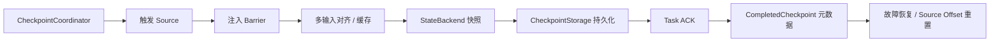

# Flink Checkpoint 完整链路与 Savepoint 边界

## 原文锚点

- 本地文件：[Flink Checkpoint 完整过程技术解析（附源码）](../文章/Flink Checkpoint 完整过程技术解析（附源码）.md)
- 本地文件：[白话Apache Flink FLIP-47 拍照还是截图：统一 Flink 的两种_留影_方式](../文章/白话Apache Flink FLIP-47 拍照还是截图：统一 Flink 的两种_留影_方式.md)
- 原文链接：`https://mp.weixin.qq.com/s?__biz=Mzg5Mzg3MzkwNA==&mid=2247491827&idx=1&sn=e19f1b9dba31224ef6efa5372a2e95ee`
- 原文链接：`https://mp.weixin.qq.com/s?__biz=Mzg2NTU4NzU4Mw==&mid=2247484804&idx=1&sn=371814e60988926a2f82e7160649802b`
- 关键段落：CheckpointCoordinator 触发、Barrier 注入和对齐、StateBackend 快照、CheckpointStorage 持久化、ACK 和 CompletedCheckpoint；Savepoint 与 Checkpoint 在生命周期、格式、升级和迁移能力上的差异。
- 关键图：原文多为文字流程和表格，没有可用技术图片。

## 图片处理

| 图片 | 类型 | 是否保留 | 理由 | 处理方式 |
|---|---|---|---|---|
| Checkpoint 生命周期 | 流程图 | 重建 | 触发、对齐、快照、持久化、ACK、完成是排障主线 | Mermaid 重建 |
| Checkpoint/Savepoint 对比 | 对比图 | 重建 | 解释故障恢复与计划维护的边界 | 表格保留，Mermaid 简化 |

## 一句话结论

这组文章把 Checkpoint 从“状态会定期保存”补全为一条可排障链路：触发、Barrier 对齐、状态快照、远端持久化、ACK、元数据完成和恢复，每个阶段都有不同的失败信号。

## 用户相关性判断

| 项 | 内容 |
|---|---|
| 用户当前认知层级 | Flink / Flink SQL：L2-L3 draft |
| 认知成熟度 | draft |
| 阅读投入建议 | 精读 |
| 阅读投入理由 | 现有知识点已覆盖通用增量 Checkpoint，但缺完整生命周期和 Savepoint 边界；原文有版本和个别语义表述待校准 |
| 对用户的新信息 | Checkpoint 耗时要拆成 Barrier 对齐、状态快照、远端持久化和元数据确认，不应只看总 duration |
| 问题指纹 | Flink + Checkpoint + Barrier/Coordinator/StateBackend/CheckpointStorage/Savepoint + 故障恢复与生命周期边界 + 生产排障链路 |
| 排重判断 | 新建；与“通用增量 Checkpoint”互补，后者聚焦 Changelog 优化，本文聚焦完整链路和 Savepoint 边界 |
| 置信度 | 中 |

## 认知校准点

| 校准点 | 文章观点/信息 | 与用户认知或价值观的关系 | 处理建议 |
|---|---|---|---|
| Checkpoint 是分阶段链路，不是单一开关 | 触发、对齐、快照、持久化、ACK、完成各有瓶颈 | 补充生产排障拆解框架 | 写入 Flink index |
| StateBackend 和 CheckpointStorage 职责不同 | 前者管运行时状态，后者管远端持久化 | 纠偏：不要把状态后端和快照存储混为一谈 | 和状态后端选型互相引用 |
| Barrier 对齐耗时常指向背压或数据倾斜 | 多输入算子要等同一 checkpoint id 的 Barrier | 补充反压与 Checkpoint 的连接 | 排障时先看 alignment，再看 snapshot |
| Savepoint 是计划内操作边界 | 用于升级、迁移、并行度调整和长期保留，不等同自动故障恢复 | 补充生命周期边界 | 生产变更前要明确用 Checkpoint 还是 Savepoint |
| 原文对 Unaligned 和语义的表述需要校准 | 原文把不对齐和 At-Least-Once 关系写得过于简化 | 与用户反泛化价值观冲突 | 本轮不写成最终准则，标后续补证 |

## 冲突点

| 冲突类型 | 具体表现 | 影响 | 处理 |
|---|---|---|---|
| 证据不足 | 调优建议缺具体作业、状态大小、存储吞吐和版本 | 不能直接迁移参数 | 只保留排障维度 |
| 版本边界 | 文中提到 Flink 1.13+ 解耦、FLIP-47 社区状态和“最新版本”关系 | 当前版本状态未本地验证 | 标后续补证 |
| 语义简化 | Unaligned Checkpoint、Exactly-Once、Sink 幂等关系被压缩表达 | 容易误导一致性选型 | 作为冲突点，不沉淀为结论 |
| 图片缺失 | 没有可复用架构图 | 影响链路理解 | Mermaid 重建 |

## 待吸收点

| 分级 | 内容 | 为什么值得吸收 | 后续动作 |
|---|---|---|---|
| 理解 | CheckpointCoordinator 是触发、聚合 ACK 和完成元数据的控制面 | 定位 JobManager 侧瓶颈和失败 | 后续补 Web UI/日志信号 |
| 理解 | Barrier 对齐负责切出一致性边界，慢输入会拖住多输入算子 | 解释 Checkpoint 超时和反压耦合 | 与反压知识点关联 |
| 理解 | StateBackend 负责本地状态快照，CheckpointStorage 负责远端持久化 | 解释为什么 RocksDB、HDFS/S3 会影响不同阶段 | 拆分监控指标 |
| 记住 | Checkpoint duration 要拆成 alignment、snapshot、upload/persist、ack/metadata | 可复用排障准则 | 写入后续追查 |
| 记住 | Checkpoint 用于自动故障恢复，Savepoint 用于计划维护和可迁移恢复 | 影响上线、升级、回滚流程 | 建变更 SOP 时引用 |
| 实践 | 对一个大状态作业记录 alignment duration、checkpointed data size、upload 耗时和 restore time | 可形成验证闭环 | 待实验 |

## 已知可跳过

| 内容 | 跳过理由 |
|---|---|
| Flink 需要 Checkpoint 才能容错 | 已有基础认知 |
| 文章开头营销和推荐阅读 | 不进入知识点 |
| 无环境的“最佳实践参数” | 不能直接作为生产准则 |

## 实践门槛

| 门槛 | 判断 | 证据 |
|---|---|---|
| 可运行 | 否 | 原文是机制解析，没有完整可运行作业 |
| 可验证 | 部分 | 有阶段拆解和参数方向，但缺输入、输出和指标样例 |
| 可排障 | 部分 | 有故障类型和阶段定位，但缺真实日志、Web UI 指标和阈值 |
| 可迁移 | 是 | 可迁移到 Flink 大状态、反压、Kafka Source/Sink 作业 |
| 结论 | 降为精读 | 可作为排障框架，不是直接实践手册 |

## 归类判断

| 项 | 内容 |
|---|---|
| 技术本体 | Flink 是有状态流处理和流批一体计算引擎 |
| 文章主问题 | Checkpoint 如何完成一致性快照、如何恢复、与 Savepoint 如何区分 |
| 使用场景 | 大状态作业、端到端一致性、生产故障恢复、版本升级和计划维护 |
| 关键词干扰 | 源码、HDFS/S3、RocksDB、FLIP 可能让人误归到存储或源码泛读 |
| 最终归类 | 数据工程与数仓 / 实时计算 / Flink |
| 归类理由 | 主问题是 Flink 容错机制和状态快照，不是外部存储或通用备份 |

## 技术定位

| 项 | 内容 |
|---|---|
| 技术类型 | 实时计算引擎容错模块 |
| 所属领域 | 数据工程与数仓 |
| 二级类目 | 实时计算 |
| 全局架构位置 | Source、算子状态、StateBackend、CheckpointStorage、JobManager 元数据之间 |
| 涉及模块 | CheckpointCoordinator、Barrier、StateBackend、CheckpointStorage、CompletedCheckpointStore、Savepoint |
| 解决问题 | 在持续流处理中保存一致性状态，并在失败或计划变更时恢复 |
| 原文局限 | 部分语义和版本状态需要官方补证；缺真实指标 |
| 我的结论 | 以后关注；作为 Checkpoint 排障和变更边界入口 |

## 跨域判断

| 问题 | 判断 |
|---|---|
| 它本体属于哪里 | 数据工程与数仓 / 实时计算 / Flink |
| 这篇文章为什么可能跨域 | RocksDB、HDFS/S3、数据库备份类比可能引向存储系统 |
| 当前文章主问题是否改变分类 | 不改变，核心是 Flink 运行时状态快照 |
| 应避免的误归类 | 不归入湖仓表格式、对象存储或通用备份工具 |

## 纵向理解

| 维度 | 判断 |
|---|---|
| 全局架构 | CheckpointCoordinator 触发 Source -> Barrier 随流传播 -> 多输入对齐 -> StateBackend 快照 -> CheckpointStorage 持久化 -> ACK -> CompletedCheckpoint -> 恢复状态和 Source Offset |
| 本文位置 | 讲容错快照全链路和 Savepoint 概念边界，不深入 Changelog State Backend 内部 |
| 核心机制 | 异步屏障快照、Barrier 对齐、StateHandle、CompletedCheckpoint 元数据、恢复点选择 |
| 使用链路 | 配置 Checkpoint -> 监控各阶段耗时 -> 识别 alignment/snapshot/upload 瓶颈 -> 故障时从最近成功快照恢复 -> 计划变更时使用 Savepoint |
| 前置条件 | 可重放 Source、可靠远端存储、状态后端配置、Connector 一致性能力 |
| 边界 | Checkpoint 不自动解决下游非幂等写入、业务全局事务和错误 Watermark 语义 |

## 横向对标

| 对标技术 | 实现方式 | 优势 | 劣势 | 适合场景 |
|---|---|---|---|---|
| Aligned Checkpoint | 等所有输入 Barrier 对齐后快照 | 一致性边界清晰 | 背压下对齐时间长 | 默认精确状态快照 |
| Unaligned Checkpoint | 将在途数据也纳入快照，绕过长时间对齐 | 缓解背压下超时 | 快照更大，恢复和语义需按版本补证 | 长期背压场景 |
| RocksDB Incremental Checkpoint | 复用 SST 增量文件 | 降低大状态上传量 | compaction 可能制造长尾 | RocksDB 大状态 |
| Changelog State Backend | 状态变更写日志，状态表异步物化 | 降低 checkpoint 抖动 | 恢复重放和额外存储成本 | 低延迟大状态 |
| Savepoint | 用户触发、长期保留、用于升级迁移 | 操作边界清晰，可计划恢复 | 需要用户管理和验证兼容性 | 升级、改并行度、回滚 |

## 后续追查

- 关键词：CheckpointCoordinator、Checkpoint Barrier、alignment duration、CheckpointStorage、StateHandle、CompletedCheckpoint、Savepoint、Unaligned Checkpoint。
- 相关技术：Flink 反压、State Backend、Changelog State Backend、Kafka Source/Sink Exactly Once。
- 需要补读的文章：当前 Flink 官方 Checkpoint/Savepoint 文档、Unaligned Checkpoint 语义、Checkpoint Web UI 指标解释、Connector 两阶段提交。
