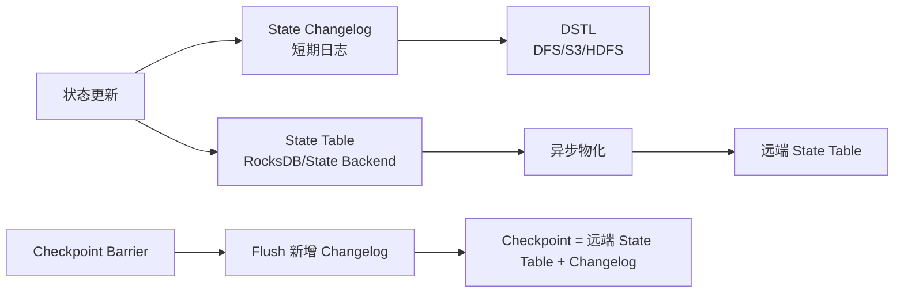

# Flink 通用增量 Checkpoint

## 原文锚点

- 本地文件：[Flink 1.15 新功能架构解析：高效稳定的通用增量 Checkpoint](../文章/Flink 1.15 新功能架构解析：高效稳定的通用增量 Checkpoint.md)
- 原文链接：http://mp.weixin.qq.com/s?__biz=MzUyMDA4OTY3MQ==&mid=2247506833&idx=1&sn=8dfadffde8c630243e671d1bdc4c5530
- 关键段落：概述、State Changelog、DSTL、RocksDB + DFS 架构、Benchmark、结论。
- 关键图：原文提到图 1-4，本地 Markdown 无图。

## 图片处理

| 图片 | 类型 | 是否保留 | 理由 | 处理方式 |
|---|---|---|---|---|
| Checkpoint 延迟与 Changelog 架构图 | 架构图/流程图 | 原图缺失 | 理解 State Table、Changelog、Materialization 的关系非常关键 | 标记原图缺失，用 Mermaid 重建简化图 |

## 一句话结论

这篇文章值得精读，它把 Flink Checkpoint 优化从“少上传状态文件”推进到“状态变化先写 Changelog、状态表异步物化”的 WAL 类思路。

## 用户相关性判断

| 项 | 内容 |
|---|---|
| 用户当前认知层级 | Flink / Flink SQL L2-L3 draft |
| 认知成熟度 | draft |
| 阅读投入建议 | 精读 |
| 阅读投入理由 | 能补 Checkpoint 机制和大状态稳定性，但基于 Flink 1.15 MVP，实践前需查当前版本 |
| 对用户的新信息 | Changelog State Backend 用空间、网络和恢复重放成本换取更短、更稳定的 Checkpoint 完成时间 |
| 问题指纹 | Flink + Checkpoint + State Changelog/DSTL/Materialization + 大状态容错稳定性 + 空间/恢复成本边界 |
| 排重判断 | 新建 |
| 置信度 | 高 |

## 认知校准点

| 校准点 | 文章观点/信息 | 与用户认知或价值观的关系 | 处理建议 |
|---|---|---|---|
| 增量 Checkpoint 不等于一定稳定 | RocksDB compaction 会产生大文件，仍可能拖慢上传 | 纠偏：不能只看“增量”标签 | 写入 Flink index |
| Changelog 类似 WAL | 状态更新双写 State Table 和 State Changelog | 补充：帮助用数据库经验理解 Flink 状态容错 | 作为记住点 |
| 快 Checkpoint 有代价 | 额外网络 IO、持久存储、内存和恢复重放 | 符合重工程代价价值观 | 选型时必须看状态访问模式 |
| 版本时效明显 | 文章说 1.15 是 MVP，1.16 会完善 | 待验证：不能直接当当前生产建议 | 后续查官方文档 |

## 冲突点

| 冲突类型 | 具体表现 | 影响 | 处理 |
|---|---|---|---|
| 图片缺失 | 图 1-4 均缺失 | 机制理解受影响 | Mermaid 简化重建 |
| 版本时效 | Flink 1.15 新功能文章 | 可能和当前版本实现不同 | 标记 draft |
| 证据范围 | Benchmark 有配置，但工作负载有限 | 不能泛化所有状态作业 | 标为待验证 |

## 待吸收点

| 分级 | 内容 | 为什么值得吸收 | 后续动作 |
|---|---|---|---|
| 理解 | Checkpoint 时间受 barrier 流动和状态持久化共同影响 | 区分反压问题和状态上传问题 | 和反压知识点关联 |
| 理解 | State Changelog 把状态变化持续写入短期持久日志 | 是新机制核心 | 写入 Flink index |
| 记住 | Changelog 是空间换时间，可能增加恢复重放成本 | 影响生产选型 | 后续补官方配置 |
| 记住 | 状态访问模式决定收益：窗口类 workload 可能写放大很高 | 防止无脑开启 | 待实验 |
| 实践 | 对比开启/关闭 changelog 的 checkpoint duration、size、restore time | 可验证收益边界 | 待实验 |

## 已知可跳过

| 内容 | 跳过理由 |
|---|---|
| Flink 需要 Checkpoint 做容错 | 已知基础 |
| Benchmark 表格细节 | 没有原表数据，不直接沉淀性能数字 |

## 实践门槛

| 门槛 | 判断 | 证据 |
|---|---|---|
| 可运行 | 部分 | 有 `flink-conf.yaml` 参数 |
| 可验证 | 部分 | 有 Benchmark 配置，但无本地数据和作业 |
| 可排障 | 部分 | 解释影响因素，但缺日志指标路径 |
| 可迁移 | 是 | 可用于大状态作业 Checkpoint 优化判断 |
| 结论 | 降为精读 | 实验需单独搭建 |

## 归类判断

| 项 | 内容 |
|---|---|
| 技术本体 | Flink 是有状态流处理引擎 |
| 文章主问题 | 如何用 State Changelog 提升 Checkpoint 完成稳定性 |
| 使用场景 | 大状态作业、Transactional Sink、端到端低延迟流处理 |
| 关键词干扰 | RocksDB、DFS、S3、WAL |
| 最终归类 | 数据工程与数仓 / 实时计算 / Flink |
| 归类理由 | 主问题是 Flink 状态和容错，不是存储引擎或对象存储 |

## 纵向理解

| 维度 | 判断 |
|---|---|
| 全局架构 | 算子状态、State Backend、Checkpoint Barrier、远端存储、恢复流程共同构成容错 |
| 本文位置 | 只讲 Checkpoint 状态持久化优化 |
| 核心机制 | State Changelog、DSTL、Materialization、Checkpoint flush |
| 使用链路 | 状态更新双写 -> Changelog 持续上传 -> State Table 异步物化 -> Checkpoint 只 flush 新增 Changelog |
| 前置条件 | 大状态、Checkpoint 抖动明显、外部存储可承受额外写入 |
| 边界 | 不解决算子慢、数据倾斜和下游 Sink 慢造成的反压 |

## Mermaid 重建

## 横向对标

| 对标技术 | 实现方式 | 优势 | 劣势 | 适合场景 |
|---|---|---|---|---|
| 全量 Checkpoint | 每次持久化完整状态 | 简单 | 大状态慢 | 小状态或低频容错 |
| RocksDB Incremental Checkpoint | 上传新增 SST 文件 | 节省状态上传 | Compaction 会产生大文件和长尾 | RocksDB 大状态常规优化 |
| Changelog Incremental Checkpoint | 状态更新写日志，状态表异步物化 | Checkpoint 完成更快更稳定 | 空间、网络、恢复重放成本 | 大状态、低延迟、Checkpoint 抖动 |
| Unaligned Checkpoint | 缓解反压下 barrier 对齐 | 解决 barrier 流动慢 | 不直接减少状态持久化成本 | 反压明显场景 |

## 后续追查

- 关键词：Changelog State Backend、DSTL、Materialization、Checkpoint duration、Unaligned Checkpoint、Buffer Debloating。
- 相关技术：RocksDB State Backend、Flink 反压、Flink Exactly Once。
- 需要补读的文章：当前 Flink 官方 Changelog State Backend 文档、大状态作业调优、Checkpoint 失败排查。
