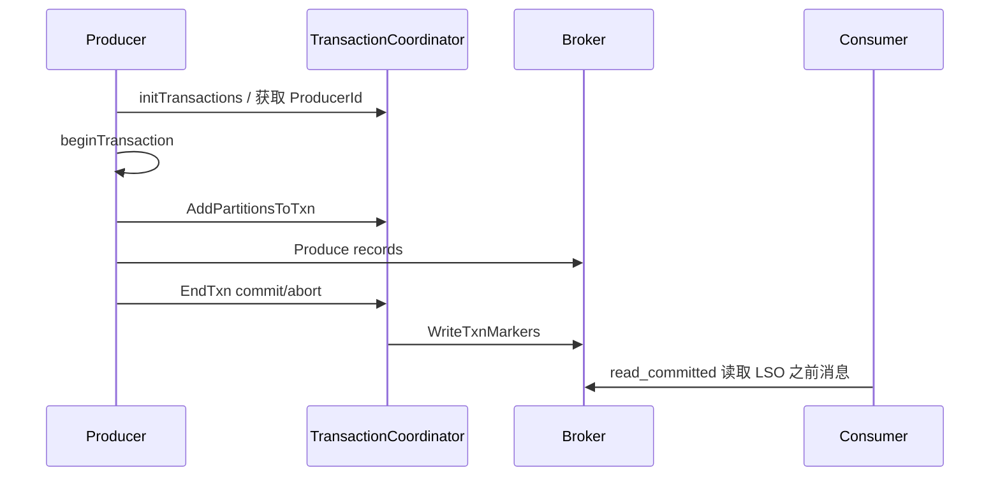

# Kafka Exactly Once 语义与事务消息

## 原文锚点

- 本地文件：[原理剖析_ Kafka Exactly Once 语义实现原理：幂等性与事务消息](../文章/原理剖析_ Kafka Exactly Once 语义实现原理：幂等性与事务消息.md)
- 原文链接：http://mp.weixin.qq.com/s?__biz=MzIzNzgyMjYxOQ==&mid=2247491090&idx=1&sn=198d14f85a12260e98e8556cec21a5d1
- 关键段落：生产者幂等性、事务初始化、消息发送、事务提交与回滚、消费可见性、事务限制。
- 关键图：原文提到事务流程图和事务消息图，但 Markdown 无图。

## 图片处理

| 图片 | 类型 | 是否保留 | 理由 | 处理方式 |
|---|---|---|---|---|
| Kafka 事务流程图 | 流程图 | 原图缺失 | 帮助理解 Producer、TransactionCoordinator、Broker 的状态流转 | 标记原图缺失，用 Mermaid 简化重建 |
| 事务消息可见性图 | 说明图 | 原图缺失 | 帮助理解 LSO 和回滚消息过滤 | 标记原图缺失，后续回原文查看 |

## 一句话结论

这篇文章适合精读，它能把 Kafka Exactly Once 从口号校准为“幂等生产者 + 事务协调器 + 位点提交纳入事务 + read_committed 可见性”的受限语义。

## 用户相关性判断

| 项 | 内容 |
|---|---|
| 用户当前认知层级 | Kafka L2 draft |
| 认知成熟度 | draft |
| 阅读投入建议 | 精读 |
| 阅读投入理由 | 机制解释有价值，但缺本地实验和版本验证，不判实践 |
| 对用户的新信息 | Kafka EOS 不等于业务全局 Exactly Once，也不等于跨系统事务 |
| 问题指纹 | Kafka + 幂等生产者/事务协调器/LSO/txnindex + 流处理端到端一致性 + 性能边界 |
| 排重判断 | 新建 |
| 置信度 | 高 |

## 认知校准点

| 校准点 | 文章观点/信息 | 与用户认知或价值观的关系 | 处理建议 |
|---|---|---|---|
| Exactly Once 有边界 | 只在特定 Kafka 流处理链路里成立 | 纠偏：不能理解成任意业务链路不重不丢 | 写入 Kafka index |
| 幂等只解决发送侧局部问题 | Producer 幂等依赖 ProducerId、Epoch、Sequence，约束在分区维度 | 补充：幂等不等于事务 | 区分 idempotent producer 和 transaction |
| 位点提交也是消息 | Offset 提交抽象成写内部 Topic，才能纳入事务 | 补充：这是消费与生产原子化的关键 | 作为记住点 |
| 性能代价明显 | TransactionCoordinator、额外 RPC、事务状态写入、LSO 可见性都会增加延迟 | 符合重工程代价价值观 | 选型时必须压测 |

## 冲突点

| 冲突类型 | 具体表现 | 影响 | 处理 |
|---|---|---|---|
| 图片缺失 | 原文提到“上图”“如下图”，本地 Markdown 无图 | 影响理解事务流程和 LSO | 标记原图缺失，Mermaid 简化重建 |
| 标题可能放大 | Exactly Once 容易被理解成全局精确一次 | 误导架构选型 | 明确边界和限制 |
| 证据不足 | 没有性能压测和版本差异 | 不能直接决定开启事务 | 标为待验证 |

## 待吸收点

| 分级 | 内容 | 为什么值得吸收 | 后续动作 |
|---|---|---|---|
| 理解 | 单分区发送幂等由 ProducerId、Epoch、Sequence 保证 | 是 Kafka EOS 的底座 | 后续补 producer 参数 |
| 理解 | 多分区原子写入由 TransactionCoordinator 管理事务状态 | 解释事务消息如何跨分区 | 追查 `__transaction_state` |
| 记住 | 位点提交纳入事务后，消费上游和写下游才能形成流处理事务语义 | 这是 EOS 的核心 | 写入 Kafka index |
| 记住 | `read_committed` 依赖 LSO 和回滚事务索引过滤不可见消息 | 决定消费侧延迟和可见性 | 后续补实验 |
| 实践 | 构造 input topic -> process -> output topic 的事务 demo | 能验证重复消费、回滚和 read_committed 行为 | 后续实验 |

## 已知可跳过

| 内容 | 跳过理由 |
|---|---|
| 分布式系统需要一致性 | 背景常识 |
| Kafka 可用于流处理 DAG | 已知基础 |
| ACID 概念定义 | 只需关注 Kafka 的受限实现 |

## 实践门槛

| 门槛 | 判断 | 证据 |
|---|---|---|
| 可运行 | 部分 | 有 API 调用片段 |
| 可验证 | 否 | 没有完整 demo、输入输出和故障注入 |
| 可排障 | 部分 | 解释内部 Topic、LSO、txnindex，但缺排障命令 |
| 可迁移 | 是 | 可迁移到 Kafka 流处理一致性设计 |
| 结论 | 降为精读 | 机制足够，但实践证据不足 |

## 归类判断

| 项 | 内容 |
|---|---|
| 技术本体 | Kafka 是实时消息日志平台 |
| 文章主问题 | Kafka 如何实现 Exactly Once 语义 |
| 使用场景 | 消费上游 Topic，处理后写入下游 Topic 的流处理链路 |
| 关键词干扰 | Spark Streaming、MySQL Binlog、事务 ACID |
| 最终归类 | 数据工程与数仓 / 实时计算 / Kafka |
| 归类理由 | 主问题是 Kafka 消息语义，不是 Spark 或数据库事务 |

## 纵向理解

| 维度 | 判断 |
|---|---|
| 全局架构 | Producer、Broker、TransactionCoordinator、内部事务状态 Topic、Consumer 共同实现 EOS |
| 本文位置 | 主要讲 Kafka 事务和消费可见性 |
| 核心机制 | 幂等序列号、事务状态机、事务标记、LSO、回滚索引 |
| 使用链路 | 初始化事务 -> 开始事务 -> 发送消息/提交位点 -> 提交或回滚 -> read_committed 消费 |
| 前置条件 | 同一 Kafka 集群内、正确配置 transactional.id、开启幂等和读已提交 |
| 边界 | 不支持任意业务系统跨库事务，性能和延迟有代价 |

## Mermaid 重建

## 横向对标

| 对标技术 | 实现方式 | 优势 | 劣势 | 适合场景 |
|---|---|---|---|---|
| Kafka 幂等生产者 | 序列号去重 | 开销小，防重复发送 | 只解决发送侧局部问题 | 单生产者单分区重试 |
| Kafka 事务 | TransactionCoordinator 管理多分区写入和位点提交 | 可实现 Kafka 内流处理 EOS | RPC 和延迟开销，边界严格 | Kafka -> Kafka 流处理 |
| Flink Checkpoint + Kafka | Checkpoint 协调 Source/Sink 状态 | 更适合流计算端到端一致性 | 依赖 Connector 和外部系统能力 | Flink 实时任务 |
| 数据库事务 | 数据库内部日志和锁/版本机制 | 强事务语义成熟 | 不适合替代消息流事务 | OLTP 数据变更 |

## 后续追查

- 关键词：enable.idempotence、transactional.id、TransactionCoordinator、LSO、read_committed、__transaction_state、txnindex。
- 相关技术：Flink KafkaSource/KafkaSink Exactly Once、Kafka Rebalance、Outbox Pattern。
- 需要补读的文章：Kafka 事务参数实测、Flink 与 Kafka EOS 配置、Kafka 事务性能压测。
