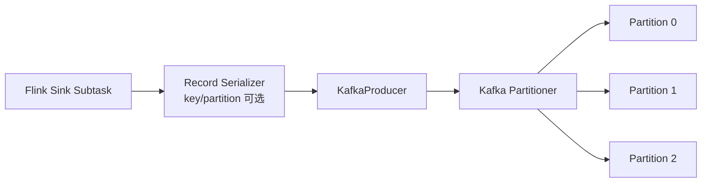

# Kafka 分区策略与 Flink 写入 Kafka 分区边界

## 原文锚点

- 本地文件：[Kafka生产者的3种分区策略](../文章/Kafka生产者的3种分区策略.md)
- 本地文件：[Flink sink 到 kafka，并行度与分区的关系](../文章/Flink sink 到 kafka，并行度与分区的关系.md)
- 原文链接：`http://mp.weixin.qq.com/s?__biz=Mzg4ODY1NTcxNg==&mid=2247493592&idx=1&sn=4a4f536b21f1b6b1d506dd1bdfa07e80`
- 原文链接：`http://mp.weixin.qq.com/s?__biz=MzI3MjAxNDYwOA==&mid=2247484843&idx=1&sn=43aa05890302d58180003b41e51858bd`
- 关键段落：DefaultPartitioner 对指定 partition、key、无 key 的处理；Sticky Partitioner 通过填满 batch 改善吞吐和延迟；UniformStickyPartitioner 和 RoundRobinPartitioner 的差异；Flink 1.15 KafkaSink 与旧 FlinkKafkaProducer 默认分区行为差异。
- 关键图：Kafka producer batch 图和测试流图在本地 Markdown 中没有图片链接；测试结果以文本输出为主。

## 图片处理

| 图片 | 类型 | 是否保留 | 理由 | 处理方式 |
|---|---|---|---|---|
| ProducerBatch 分区示意 | 机制图 | 原图缺失 | 说明 sticky 分区为什么改善小流量 batch 填充 | 标记缺失，Mermaid 重建 |
| Flink sink 测试流图 | 流程图 | 原图缺失 | 说明 Flink 并行度与 Kafka 分区不是简单一一映射 | Mermaid 重建 |

## 一句话结论

Kafka 分区策略决定吞吐、顺序性、热点和 Flink 写入分布；Flink sink 并行度不等于 Kafka 分区数，是否指定 key、partitioner 和使用新旧 connector API 会改变数据落分区方式。

## 用户相关性判断

| 项 | 内容 |
|---|---|
| 用户当前认知层级 | Kafka：L2 draft；Flink + Kafka 链路：L2-L3 draft |
| 认知成熟度 | draft |
| 阅读投入建议 | 精读 |
| 阅读投入理由 | 能补实时计算类目缺失的 Kafka 分区策略和 Flink 写 Kafka 边界；Flink 测试有版本限定，需按当前 connector 复验 |
| 对用户的新信息 | 无 key 时默认 sticky 策略优先改善 batch 填充；旧 FlinkKafkaProducer 默认可把一个并行子任务固定到一个分区，新 KafkaSink 更依赖 Kafka 客户端分区器 |
| 问题指纹 | Kafka + Producer Partitioner + key/sticky/round-robin/Flink sink parallelism + 分区分布与顺序性 + 吞吐/热点/版本边界 |
| 排重判断 | 新建；区别于 Kafka Lag、Rebalance、Exactly Once，本文聚焦生产者分区和 Flink 写出 |
| 置信度 | 中 |

## 认知校准点

| 校准点 | 文章观点/信息 | 与用户认知或价值观的关系 | 处理建议 |
|---|---|---|---|
| 分区策略不是只为“均匀” | Sticky Partitioner 会优先填满一个 batch，再换分区 | 纠偏：吞吐和延迟可能优先于严格均匀 | 设计 Topic 时同时看 batch、key 和热点 |
| key 会改变分区语义 | DefaultPartitioner 有 key 时按 key hash 取模 | 补充顺序性边界 | 需要同 key 有序时不能随意用 uniform sticky |
| Flink sink 并行度不是分区数映射 | 新 KafkaSink 未指定分区时交给 Kafka 客户端，旧 FlinkKafkaProducer 默认按 `parallelInstanceId % partitions` | 纠偏：不能凭并行度推断分区分布 | 排障时看 connector 版本和 serializer/partitioner |
| 版本边界很强 | Flink 文中是 1.15.0、Kafka client 2.8.1 | 防止把局部测试当通用结论 | 后续按当前版本复验 |
| 分区策略会影响 Lag 和 Rebalance | 热点分区会限制消费并行度，分区扩容会影响后续分配和顺序 | 与 Kafka Lag/Rebalance 知识点连接 | 写入 Kafka index |

## 冲突点

| 冲突类型 | 具体表现 | 影响 | 处理 |
|---|---|---|---|
| 版本边界 | Flink sink 文章限定 Flink 1.15.0 和 kafka-client 2.8.1 | 当前版本 connector 行为可能不同 | 标后续补证 |
| 证据不足 | Kafka 分区策略文章解释机制，但没有压测数据 | 不能沉淀为性能收益结论 | 只保留机制 |
| 图片缺失 | Producer batch 和任务流图未本地化 | 影响直观理解 | Mermaid 重建 |
| 实践门槛不足 | Flink sink 有测试片段和输出，但缺完整工程配置和复现实验数据 | 不能直接判实践 | 降为精读 |

## 待吸收点

| 分级 | 内容 | 为什么值得吸收 | 后续动作 |
|---|---|---|---|
| 理解 | DefaultPartitioner 优先级：指定 partition 优先，其次 key hash，最后无 key sticky | 是分区排查的第一判断 | 写入 Kafka index |
| 理解 | Sticky 分区通过让无 key 消息集中填满 batch，减少小 batch 延迟 | 解释为什么默认不总是轮询均分 | 后续用 producer 指标验证 batch 效果 |
| 理解 | UniformStickyPartitioner 忽略 key，RoundRobinPartitioner 尽量轮询均分 | 影响顺序性和均衡性权衡 | 选型时先确认是否需要 key 有序 |
| 记住 | Kafka 分区数决定消费并行上限，但生产者分区策略决定热点和顺序性 | 连接生产和消费容量规划 | 与 Lag 知识点互相引用 |
| 记住 | Flink 写 Kafka 时要同时看 sink 并行度、connector API、key serializer、custom partitioner 和目标 topic 分区数 | 防止误判写入倾斜 | 排障时保留这五项配置 |
| 实践 | 用固定输入对比 key hash、sticky、round robin 和 Flink 新旧 sink 的分区输出 | 可形成最小实验 | 待实验 |

## 已知可跳过

| 内容 | 跳过理由 |
|---|---|
| Kafka Topic 由多个 Partition 组成 | 用户大概率已知 |
| 公众号引导、社群和福利内容 | 不进入知识点 |
| 没有上下文的“默认策略更好” | 需要按顺序性、吞吐和热点判断 |

## 实践门槛

| 门槛 | 判断 | 证据 |
|---|---|---|
| 可运行 | 部分 | Flink sink 文章有测试程序片段，但依赖缺失的 `Common.getProp`、topic 和集群 |
| 可验证 | 部分 | 有多个并行度/分区组合输出，但缺可复现实验脚本 |
| 可排障 | 部分 | 能解释分区倾斜来源，但缺 producer 指标和 broker 端观测 |
| 可迁移 | 是 | 可迁移到实时链路写 Kafka、Topic 容量规划和热点排查 |
| 结论 | 降为精读 | 需要补完整实验才能判实践 |

## 归类判断

| 项 | 内容 |
|---|---|
| 技术本体 | Kafka 是实时消息日志平台；Flink Kafka Sink 是实时计算下游 connector |
| 文章主问题 | Producer 如何选择分区，以及 Flink 写 Kafka 时并行度和分区如何对应 |
| 使用场景 | Flink 作业写 Kafka、消息顺序性、Topic 热点、消费并行规划 |
| 关键词干扰 | Flink、并行度、connector 可能让文章被归到 Flink 运行时 |
| 最终归类 | 数据工程与数仓 / 实时计算 / Kafka |
| 归类理由 | 主问题是 Kafka Topic 分区选择和写入分布，Flink 是使用场景 |

## 技术定位

| 项 | 内容 |
|---|---|
| 技术类型 | 消息队列生产者机制与实时计算 Connector 边界 |
| 所属领域 | 数据工程与数仓 |
| 二级类目 | 实时计算 |
| 全局架构位置 | Flink Sink 或业务 Producer 到 Kafka Topic/Partition 的写入层 |
| 涉及模块 | Producer、Partitioner、ProducerBatch、Topic/Partition、Flink KafkaSink、FlinkKafkaProducer |
| 解决问题 | 控制消息落分区、顺序性、吞吐、热点和 Flink 写出分布 |
| 原文局限 | 缺当前版本补证和完整压测指标 |
| 我的结论 | 以后关注；作为 Kafka 分区策略和 Flink 写出排重入口 |

## 跨域判断

| 问题 | 判断 |
|---|---|
| 它本体属于哪里 | Kafka 分区策略属于实时计算里的消息总线；Flink sink 是使用场景 |
| 这篇文章为什么可能跨域 | Flink 并行度和 connector 行为会抢走分类焦点 |
| 当前文章主问题是否改变分类 | 不改变，核心是写入 Kafka 分区分布 |
| 应避免的误归类 | 不归到 Flink 状态、Checkpoint 或调度编排 |

## 纵向理解

| 维度 | 判断 |
|---|---|
| 全局架构 | Flink/业务 Producer -> Serializer 生成 key/value/partition -> KafkaProducer batch -> Partitioner -> Topic Partition -> Broker -> Consumer Group |
| 本文位置 | 只讲写入分区选择，不讲 broker 存储、ISR、Consumer Rebalance 和事务提交 |
| 核心机制 | partition 优先、key hash、sticky batch、round robin、新旧 Flink Kafka connector 分区器差异 |
| 使用链路 | 确认是否有 key -> 确认 partitioner -> 确认 sink 并行度和 topic 分区数 -> 观察分区写入速率 -> 判断热点和顺序性 |
| 前置条件 | Topic 分区数稳定，key 设计明确，Flink connector 版本和 Kafka client 版本明确 |
| 边界 | 增加分区不自动解决 key 热点；无 key sticky 不保证严格均匀；旧 connector 行为不能直接套到新 connector |

## 横向对标

| 对标技术 | 实现方式 | 优势 | 劣势 | 适合场景 |
|---|---|---|---|---|
| DefaultPartitioner + key | key hash 到分区 | 同 key 有序，语义稳定 | 热 key 会制造热点 | 订单、用户、设备维度有序 |
| DefaultPartitioner 无 key sticky | 无 key 消息集中填 batch 后换分区 | 改善 batch 和吞吐 | 短期不均匀 | 无顺序要求、高吞吐写入 |
| UniformStickyPartitioner | 不管 key 统一 sticky | batch 效率高 | 破坏 key 分区语义 | 不依赖 key 有序的日志流 |
| RoundRobinPartitioner | 轮询分区 | 分布更均匀 | batch 效率和顺序性可能受影响 | 均衡优先、无 key 顺序 |
| FlinkKafkaProducer 旧默认 | subtask id 对分区取模 | 分布可预测 | 分区数大于并行度会空闲 | 老 connector 作业 |
| Flink KafkaSink 新 API | 默认交给 KafkaProducer 分区器 | 跟随 Kafka 客户端能力 | 版本和配置更关键 | 新版 Flink 作业 |

## 后续追查

- 关键词：DefaultPartitioner、Sticky Partitioner、UniformStickyPartitioner、RoundRobinPartitioner、partitioner.class、Flink KafkaSink、FlinkKafkaProducer、ProducerBatch。
- 相关技术：Kafka Lag、Consumer Rebalance、Kafka Exactly Once、Flink KafkaSource/KafkaSink。
- 需要补读的文章：当前 Kafka producer 分区器文档、当前 Flink Kafka connector 文档、Kafka key 设计和热点分区排查。
