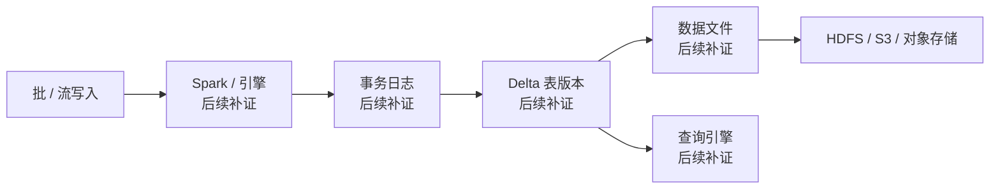

# Delta Lake
## 知识点入口

- 本模块先看宏观流程，再看文章：[知识地图](030501_核心知识点/知识地图.md)。
- 新文章必须先归入流程节点，再判断是补充、冲突、不同层次还是降权。
- `文章/` 只保留原文锚点，长期知识必须沉淀到 `030501_核心知识点/`。

## 技术定位

| 项 | 内容 |
|---|---|
| 技术名 | Delta Lake |
| 一级类目 | 数据工程与数仓 |
| 二级类目 | 湖仓表格式 |
| 技术本体 | 开放湖仓表格式之一，围绕事务日志、表版本、Schema 演进、批流统一和 Spark 生态集成提供数据湖表语义 |
| 全局架构位置 | 位于对象存储/HDFS 之上、Spark/查询引擎之下，承担湖表事务日志和版本管理；本轮只作待补入口 |
| 主要使用者 | 湖仓平台工程师、Spark 数据开发、数据平台工程师 |
| 主要产出 | Delta 表、事务日志、表版本、数据文件、变更数据；本轮未从本地文章正式沉淀 |

## 官方锚点

- 官网：后续补证
- GitHub：后续补证
- 官方文档：后续补证
- 架构文档：后续补证

## 架构图

## 核心模块

| 模块 | 职责 | 重点问题 |
|---|---|---|
| 事务日志 | 后续补证 | 与 Iceberg Snapshot/Manifest、Hudi Timeline、Paimon Snapshot 的差异 |
| 表版本 | 后续补证 | 时间旅行、回滚、保留策略 |
| Schema 演进 | 后续补证 | 默认值、列变更、兼容性边界 |
| 批流统一 | 后续补证 | Spark Structured Streaming 边界 |
| 删除/更新能力 | 后续补证 | 与 Iceberg v3 删除向量、Hudi MOR、Paimon LSM 对比 |

## 上下游

| 方向 | 对象 | 关系 |
|---|---|---|
| 上游 | 后续补证 | 本轮文章来源无本地 Delta Lake 原文 |
| 下游 | 后续补证 | 本轮不做正式判断 |
| 依赖 | 后续补证 | 后续需补官方与本地文章证据 |

## 横向对标

| 对标技术 | 对标点 | Delta Lake 优势 | Delta Lake 劣势 | 使用判断 |
|---|---|---|---|---|
| Iceberg | 开放湖仓表格式、多引擎互操作 | 后续补证 | 后续补证 | 后续补证 |
| Hudi | 更新、增量、湖上事务 | 后续补证 | 后续补证 | 后续补证 |
| Paimon | Flink 实时湖仓、主键更新 | 后续补证 | 后续补证 | 后续补证 |
| Hive 表 | 离线数仓表 | 后续补证 | 后续补证 | 后续补证 |

## 已沉淀核心知识点

| 主题 | 文件 | 问题指纹 | 解决什么问题 | 认知增量 |
|---|---|---|---|---|
| 暂无 | 暂无 | 本轮文章来源未发现 Delta Lake 本地原文 | 不做正式沉淀 | 后续补证 |

## 后续追查

- 关键词：Delta Lake transaction log、time travel、change data feed、schema evolution、deletion vector、UniForm。
- 待读资料：本地 Delta Lake 原文、官方文档、GitHub、与 Iceberg/Hudi/Paimon 对比资料。
- 待补实验：后续有本地资料后，再验证 Spark 写入、时间旅行、变更数据和跨引擎读取边界。
