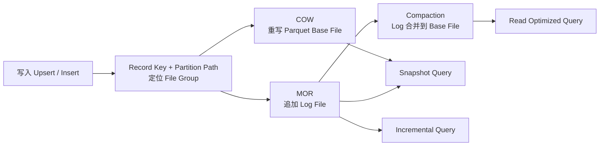

# Hudi Timeline、索引与 COW/MOR 表类型

## 原文锚点

- 本地文件：[Hudi 核心知识点详解（万字长文）](<../文章/done-Hudi 核心知识点详解（万字长文）.md>)
- 原文链接：`http://mp.weixin.qq.com/s?__biz=Mzk0NDI0NDg1OA==&mid=2247502895&idx=1&sn=2ab645758e8e92da49fe773e022b4073&chksm=c3251d3af452942c4306d2bd8abc75ae0dd006346be39ec32462799e8fb715f9f2d59050b307`
- 关键段落：Hudi 功能、`.hoodie` 文件、Timeline、Index、Snapshot/Incremental/Read Optimized Query、COW/MOR、Upsert/Insert 写流程。
- 关键图：正文提到“事实表的典型更新模式”和 MOR 读写图，但本地 Markdown 没有图片链接。

## 图片处理

| 图片 | 类型 | 是否保留 | 理由 | 处理方式 |
|---|---|---|---|---|
| 事实表典型更新模式 | 说明图 | 原图缺失 | 说明 Bloom/范围裁剪适合最新分区和长尾更新 | 原图缺失，需要回原文查看 |
| MOR 读写方式图 | 流程图 | 重建 | COW/MOR 是 Hudi 读写代价的核心边界 | 基于原文描述用 Mermaid 重建 |

## 一句话结论

这篇文章适合精读，但要压缩入门背景；真正有价值的是把 Hudi 理解为 `Timeline + Index + COW/MOR + 查询类型` 组合出的湖上更新与增量表格式。

## 用户相关性判断

| 项 | 内容 |
|---|---|
| 用户当前认知层级 | 湖仓表格式 L2 draft；Hudi 约 L1-L2 |
| 认知成熟度 | draft |
| 阅读投入建议 | 精读 |
| 阅读投入理由 | 能补 Hudi 表格式本体、写入/查询机制和与 Hive 表的差异，但入门背景和旧版本信息需降权 |
| 对用户的新信息 | Hudi 的核心不是“又一个数据湖”，而是用 Timeline 管版本、用索引定位记录、用 COW/MOR 调节读写放大 |
| 问题指纹 | Hudi + Timeline/Index/COW/MOR + 更新/增量/查询类型 + 准实时湖表 + 表格式边界 |
| 排重判断 | 新建 |
| 置信度 | 中 |

## 认知校准点

| 校准点 | 文章观点/信息 | 与用户认知或价值观的关系 | 处理建议 |
|---|---|---|---|
| Hudi 不是计算引擎 | 原文明确 Hudi 不分析数据，需要 Spark/Flink/Hive 等引擎 | 补充技术本体边界 | 在技术定位中固定为表格式和数据管理层 |
| Hudi 的更新能力来自索引和文件组织 | Record Key + Partition Path 定位 File Group，COW/MOR 决定更新落点 | 补机制边界 | 后续排重按 Timeline、Index、COW/MOR 拆 |
| COW/MOR 不是优劣二选一 | COW 写放大高、读简单；MOR 写轻、读合并和 Compaction 成本高 | 纠偏“实时更新就选 MOR”的简单结论 | 选型时同时看写入频率、查询新鲜度、Compaction 能力 |
| 文章版本较旧 | 原文提到 0.10.1、0.7.0 等版本线索 | 防版本污染 | 只沉淀机制，不把版本状态当当前事实 |

## 冲突点

| 冲突类型 | 具体表现 | 影响 | 处理 |
|---|---|---|---|
| 图片缺失 | 正文有图 1、MOR 读写图描述，但 Markdown 无图 | 机制理解不完整 | 标记原图缺失，并重建 COW/MOR 简图 |
| 证据不足 | “最新版本”“分钟级”等描述缺当前版本补证 | 容易形成过时结论 | 标记后续补证 |
| 已知基础偏多 | 数据湖/数仓区别占比较高 | 消耗注意力 | 压缩为已知可跳过 |

## 待吸收点

| 分级 | 内容 | 为什么值得吸收 | 后续动作 |
|---|---|---|---|
| 理解 | Timeline 由 Instant Action、Instant Time、State 组成，承载 commit、clean、compaction 等操作 | 这是 Hudi 快照、回滚和增量查询的纵向入口 | 补官方 Timeline 文档 |
| 理解 | Index 将记录键定位到 File Group；Bloom、Simple、HBase 等索引适配不同更新模式 | 解释 Upsert 为什么不全表扫描 | 后续按事实表、事件表、维表三类验证 |
| 理解 | Snapshot、Incremental、Read Optimized 三类查询对应不同新鲜度和性能权衡 | 能防止把“能查最新”和“查得快”混为一谈 | 与 Iceberg/Paimon 增量读对标 |
| 记住 | COW 适合写少读多；MOR 适合写频繁但要承担读时合并和 Compaction 运维 | 选型准则可复用 | 写入 Hudi index |
| 实践 | 用一张主键表分别建 COW/MOR，比较 Upsert 写入、Snapshot 读、Compaction 后 Read Optimized 读 | 能验证读写放大和时效边界 | 作为后续实验 |

## 已知可跳过

| 内容 | 跳过理由 |
|---|---|
| 数据湖和数据仓库的基础区别 | 用户更需要表格式机制、边界和对标 |
| Hudi 名称来源、社区历史 | 对选型和工程落地帮助有限 |
| 文章末尾推荐阅读和推广内容 | 不进入知识点 |

## 实践门槛

| 门槛 | 判断 | 证据 |
|---|---|---|
| 可运行 | 部分 | 有概念和流程，但缺完整最小环境 |
| 可验证 | 否 | 没有输入数据、版本矩阵、指标和执行结果 |
| 可排障 | 部分 | 提到小文件、Compaction、索引策略，但没有日志信号 |
| 可迁移 | 是 | 可迁移到湖仓更新表选型 |
| 结论 | 降为精读 | 机制值得沉淀，实践需重新设计最小实验 |

## 归类判断

| 项 | 内容 |
|---|---|
| 技术本体 | Apache Hudi 湖仓表格式 |
| 文章主问题 | Hudi 如何通过 Timeline、索引、COW/MOR 提供更新、删除和增量查询 |
| 使用场景 | 数据湖更新、准实时数仓、CDC 入湖、增量处理 |
| 关键词干扰 | Spark、Flink、Hive、数据湖基础定义可能误导到计算引擎或离线数仓 |
| 最终归类 | 数据工程与数仓 / 湖仓表格式 / Hudi |
| 归类理由 | 文章主问题是表格式内部机制，不是 Flink/Spark 作业开发 |

## 技术定位

| 项 | 内容 |
|---|---|
| 技术类型 | 技术 / 表格式 |
| 所属领域 | 数据工程与数仓 |
| 二级类目 | 湖仓表格式 |
| 全局架构位置 | 存储层之上、计算引擎之下的表管理层 |
| 涉及模块 | Timeline、Index、COW、MOR、Query Type、Compaction |
| 解决问题 | 在文件湖上提供更新、删除、事务、增量查询和历史版本 |
| 原文局限 | 版本旧、图片缺失、实践指标不足 |
| 我的结论 | 以后关注，作为 Hudi 本体认知入口 |

## 纵向理解

| 维度 | 判断 |
|---|---|
| 全局架构 | Source -> Spark/Flink 写入 -> Hudi Timeline/Index/File Group -> HDFS/对象存储 -> 查询引擎 |
| 本文位置 | 覆盖 Hudi 表格式本体和基础读写路径，不覆盖生产治理全链路 |
| 核心机制 | Timeline 管版本，Index 定位记录，COW/MOR 控制读写放大，Query Type 暴露不同读取语义 |
| 使用链路 | 定义主键/分区/表类型 -> 写入 upsert/insert -> 生成 commit 和文件版本 -> snapshot/incremental/read optimized 查询 |
| 前置条件 | 稳定主键、合理分区、存储系统、Spark/Flink/Hive 版本适配、Compaction 资源 |
| 边界 | 不直接解决高并发 OLAP 查询、调度治理、语义层和实时消息传递 |

## 横向对标

| 对标技术 | 实现方式 | 优势 | 劣势 | 适合场景 |
|---|---|---|---|---|
| Hive 表 | 分区目录 + ORC/Parquet + Metastore | 简单成熟 | 更新、事务和增量弱 | T+1 离线数仓 |
| Iceberg | Snapshot + Manifest + 开放规范 | 跨引擎生态强 | 更新/增量机制需看引擎支持 | 多引擎开放湖仓 |
| Paimon | LSM + Snapshot + Changelog | Flink 实时更新链路强 | 生态边界需验证 | Flink 实时湖仓 |
| Delta Lake | Transaction Log + Spark 生态 | Spark 批流集成强 | 开放互操作需看实现 | Spark/Databricks 主链路 |

## 后续追查

- 关键词：Hudi Timeline、Hudi COW MOR、Hudi Incremental Query、Hudi Index、Hudi Compaction。
- 相关技术：Iceberg、Paimon、Delta Lake、Hive、Flink CDC。
- 需要补读的文章：Hudi 官方 Timeline、Index、Table Types、Query Types、Flink Writer 文档。
