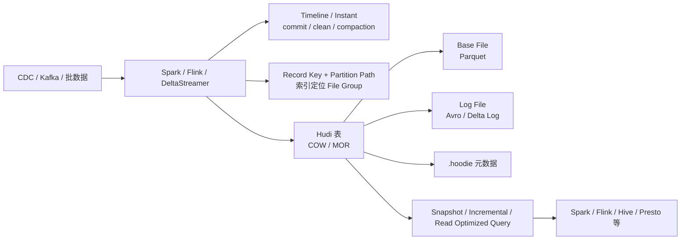

# Hudi
## 知识点入口

- 本模块先看宏观流程，再看文章：[知识地图](030502_知识地图.md)。
- 新文章必须先归入流程节点，再判断是补充、冲突、不同层次还是降权。
- `文章/` 只保留原文锚点，长期知识必须沉淀到 `030502_核心知识点/` 下的主题文件。

## 技术定位

| 项 | 内容 |
|---|---|
| 技术名 | Apache Hudi |
| 一级类目 | 数据工程与数仓 |
| 二级类目 | 湖仓表格式 |
| 技术本体 | 面向数据湖更新、删除、增量查询和事务写入的开放表格式 |
| 全局架构位置 | 位于 HDFS/对象存储之上、Spark/Flink/Hive/Presto 等引擎之下，负责表级时间线、索引、文件组、写入事务和增量语义 |
| 主要使用者 | 数据平台工程师、实时/准实时数仓工程师、湖仓平台工程师 |
| 主要产出 | Hudi 表、Timeline、Instant、File Group、File Slice、Base File、Log File、增量变更流 |

## 官方锚点

- 官网：后续补证
- GitHub：后续补证
- 官方文档：后续补证
- 架构文档：后续补证

## 架构图

## 核心模块

| 模块 | 职责 | 重点问题 |
|---|---|---|
| Timeline / Instant | 记录表上的提交、清理、压缩、回滚、保存点 | 快照隔离、增量读取、失败回滚、保留策略 |
| COW / MOR | 两类存储组织方式 | 写放大、读放大、Compaction 成本、延迟边界 |
| File Group / File Slice | 将同一文件组的 base file 和 log file 组织成版本切片 | 更新定位、读时合并、小文件和版本膨胀 |
| Index | 将 Record Key + Partition Path 映射到文件位置 | Upsert 性能、全局/非全局索引、Bloom/HBase/Simple 选型 |
| Payload | 自定义同主键数据的合并、去重、过滤和列级更新逻辑 | 宽表拼接、乱序覆盖、业务语义侵入 |
| Table Services | Compaction、Clustering、Clean 等表服务 | 异步化、并发冲突、资源成本、历史可回溯 |

## 上下游

| 方向 | 对象 | 关系 |
|---|---|---|
| 上游 | Kafka、数据库 CDC、批量文件、Spark/Flink 作业 | 写入 Hudi 表，生成提交和文件版本 |
| 下游 | Spark、Flink、Hive、Presto、Trino、OLAP 出仓链路 | 读取快照、读优化视图或增量变更 |
| 依赖 | HDFS/对象存储、Catalog/Hive Metastore、执行引擎 | 存储数据文件、元数据和执行写入/查询 |

## 横向对标

| 对标技术 | 对标点 | Hudi 优势 | Hudi 劣势 | 使用判断 |
|---|---|---|---|---|
| Iceberg | 快照、事务、Schema 演进、多引擎湖表 | Hudi 在更新、增量和索引语义上更突出 | Iceberg 跨引擎生态和开放规范声量更强 | 多引擎开放湖表优先看 Iceberg；频繁更新/增量优先评估 Hudi |
| Paimon | 流批一体、更新、增量消费 | Hudi 历史湖上更新场景积累较多 | Paimon 与 Flink 实时链路结合更紧 | 已有 Spark/Hudi 生态可延续；Flink 新实时链路可评估 Paimon |
| Delta Lake | 事务日志、Spark 生态、批流统一 | Hudi 更强调增量查询、索引和 MOR/COW 选择 | Delta 与 Spark/Databricks 生态绑定更深 | Spark/Databricks 主导链路看 Delta；开源增量湖表看 Hudi/Iceberg |
| Hive 表 | 离线数仓表、分区、批 SQL | Hudi 补足更新、删除、快照和增量能力 | 复杂度、运维和版本适配成本更高 | 纯 T+1 批表继续 Hive；有 CDC/Upsert/增量消费再引入 Hudi |

## 已沉淀核心知识点

| 主题 | 文件 | 问题指纹 | 解决什么问题 | 认知增量 |
|---|---|---|---|---|
| Hudi 表格式本体 | [Hudi Timeline、索引与 COW/MOR 表类型](<030502_核心知识点/Hudi Timeline、索引与 COW-MOR 表类型.md>) | Hudi + Timeline/Index/COW/MOR + 更新/增量/查询类型 + 准实时湖表 + 表格式边界 | Hudi 为什么能在文件湖上提供 upsert、delete、incremental query | 把 Hudi 从“数据湖三剑客”校准为 Timeline + 索引 + COW/MOR 的更新表格式 |
| Hudi 多流拼接 | [Hudi Payload 多流拼接与并发写边界](<030502_核心知识点/Hudi Payload 多流拼接与并发写边界.md>) | Hudi + Payload/MOR/OCC + 多流宽表拼接 + 降低 Flink 状态但增加表服务复杂度 | 用存储层合并部分列替代 Flink 长状态多流 Join 的边界 | 把“存储层 Join”校准为定制 Payload + 多写并发 + 乱序处理的工程方案 |
| Hudi 版本演进与表服务边界 | [Hudi版本演进与表服务边界](030502_核心知识点/Hudi版本演进与表服务边界.md) | Hudi + 1.x 版本 + Timeline/索引/表服务 + 引擎兼容 | 判断版本文章中哪些变化会影响生产治理 | Hudi 生产价值在 Timeline、索引、表服务和增量消费闭环 |

## 后续追查

- 关键词：Hudi Timeline、Instant、COW、MOR、Incremental Query、Payload、Marker、Early Conflict Detection。
- 待读资料：官方 Timeline、索引、COW/MOR、Flink 集成、Payload、并发控制文档。
- 待补实验：同一 CDC 流分别写 COW/MOR，验证快照查询、增量查询、Compaction 延迟和小文件变化。
