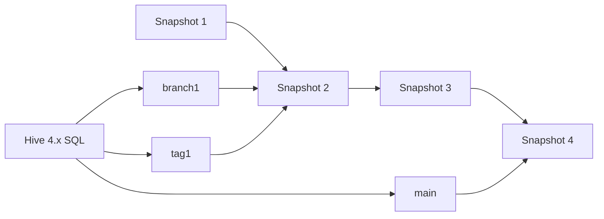

# Iceberg 快照分支标签与 Hive 接入边界

## 原文锚点

- 本地文件：[Hive 实践 | Apache Hive 4.x与Iceberg分支和标签](<../文章/done-Hive 实践 _ Apache Hive 4.x与Iceberg分支和标签.md>)
- 原文链接：`http://mp.weixin.qq.com/s?__biz=MzU5OTQ1MDEzMA==&mid=2247492122&idx=1&sn=39f36da681b71d0235490aa745ce30a9`
- 关键段落：创建 Iceberg 表、查询 history、创建 branch/tag、refs 元数据表、写入分支、查询分支、fast-forward、cherry-pick、drop branch/tag。
- 关键图：无技术图。

## 图片处理

| 图片 | 类型 | 是否保留 | 理由 | 处理方式 |
|---|---|---|---|---|
| 无 | 无 | 不适用 | 文章以 SQL 操作说明快照引用 | 用 Mermaid 重建快照引用关系 |

## 一句话结论

这篇文章适合精读但不应直接照搬环境：它的价值是说明 Iceberg 的 Branch/Tag 是快照引用和生命周期管理能力，而不是完整替代 Git 工作流或通用数据发布系统。

## 用户相关性判断

| 项 | 内容 |
|---|---|
| 用户当前认知层级 | Iceberg L1-L2 draft；Hive L3-L4 draft |
| 认知成熟度 | draft |
| 阅读投入建议 | 精读 |
| 阅读投入理由 | 能补 Iceberg 快照生命周期、命名引用和 Hive 接入边界，但环境是 Hive 4.0.0-beta-2-SNAPSHOT，版本风险高 |
| 对用户的新信息 | Iceberg 的 branch/tag 是对 Snapshot 的命名引用，可单独保留和查询 |
| 问题指纹 | Iceberg + Snapshot refs + Branch/Tag + 快照生命周期 + Hive 4.x 接入边界 |
| 排重判断 | 新建 |
| 置信度 | 中 |

## 认知校准点

| 校准点 | 文章观点/信息 | 与用户认知或价值观的关系 | 处理建议 |
|---|---|---|---|
| Branch/Tag 本质是快照引用 | 分支指向快照谱系头部，标签引用某个快照状态 | 补快照生命周期边界 | 不把它理解成完整代码分支模型 |
| Hive 是访问入口，不是 Iceberg 本体 | 文章用 Hive SQL 操作 Iceberg 表 | 防分类误导 | 归 Iceberg，Hive 作为引擎/接口 |
| 版本状态不能当当前事实 | 原文明确是 Hive 4.0.0-beta-2-SNAPSHOT 开发环境 | 防版本污染 | 所有语法需后续补证 |
| Cherry-pick 限制暴露接口边界 | 原文称只支持主分支 cherry-pick commits | 补局限 | 记录为待验证，不写成稳定规则 |

## 冲突点

| 冲突类型 | 具体表现 | 影响 | 处理 |
|---|---|---|---|
| 证据不足 | 基于 beta snapshot 环境，非稳定发布 | 复制 SQL 风险高 | 降为精读，官方补证后实践 |
| 关键词误导 | 标题以 Hive 实践开头 | 容易归到离线数仓/Hive | 重路由到湖仓表格式 / Iceberg |
| 实践门槛不足 | 有 SQL 但没有完整验收输出 | 不能直接判实践 | 记录待实验 |

## 待吸收点

| 分级 | 内容 | 为什么值得吸收 | 后续动作 |
|---|---|---|---|
| 理解 | `history` 表可列出快照，`refs` 元数据表可列出分支/标签 | 是快照治理入口 | 后续补官方元数据表文档 |
| 理解 | Branch 可写入、更新、删除，并可 fast-forward | 说明 Iceberg 不只是时间旅行，也能承载独立快照线 | 验证不同引擎支持 |
| 理解 | Tag 主要用于固定某个快照状态供查询和保留 | 适合审计、月末版本、回滚锚点 | 与 Paimon Tag 对比 |
| 记住 | Branch/Tag 是快照引用能力，价值在数据版本治理，不在替代调度或发布流程 | 可复用准则 | 写入 Iceberg index |
| 实践 | 用本地小表创建多个快照，验证 branch/tag 查询和 drop 行为 | 可验证快照引用语义 | 待官方版本补证后做 |

## 已知可跳过

| 内容 | 跳过理由 |
|---|---|
| Docker 环境创建外链 | 本轮不联网，且版本需要后续补证 |
| 示例 snapshot id 和时间戳 | 每次运行不同，不作为知识点 |
| 逐条 SQL 语法细节 | 实践前查官方当前版本 |

## 实践门槛

| 门槛 | 判断 | 证据 |
|---|---|---|
| 可运行 | 部分 | 有 SQL 操作步骤 |
| 可验证 | 部分 | 可通过 history/refs 查询验证，但原文未给完整输出 |
| 可排障 | 否 | 缺错误场景、兼容矩阵和回滚路径 |
| 可迁移 | 是 | 可迁移到湖表快照治理 |
| 结论 | 降为精读 | 版本和引擎支持需补证 |

## 归类判断

| 项 | 内容 |
|---|---|
| 技术本体 | Apache Iceberg 快照引用能力 |
| 文章主问题 | 如何在 Hive 中操作 Iceberg Branch/Tag |
| 使用场景 | 数据版本治理、实验分支、审计快照、历史回滚 |
| 关键词干扰 | Hive 4.x、SQL 实践 |
| 最终归类 | 数据工程与数仓 / 湖仓表格式 / Iceberg |
| 归类理由 | 主体是 Iceberg 表快照生命周期，不是 Hive 表机制 |

## 技术定位

| 项 | 内容 |
|---|---|
| 技术类型 | 技术机制 / 实践片段 |
| 所属领域 | 数据工程与数仓 |
| 二级类目 | 湖仓表格式 |
| 全局架构位置 | Iceberg 表元数据层的快照引用和生命周期管理 |
| 涉及模块 | Snapshot、Branch、Tag、history、refs、Hive SQL |
| 解决问题 | 让历史快照可命名、可查询、可保留、可推进或删除 |
| 原文局限 | 基于开发快照版本，缺兼容矩阵 |
| 我的结论 | 以后关注，作为 Iceberg 快照治理入口 |

## 纵向理解

| 维度 | 判断 |
|---|---|
| 全局架构 | Hive SQL -> Iceberg Catalog/Metadata -> Snapshot refs -> Data Files |
| 本文位置 | Iceberg 快照引用，不覆盖写入事务、删除向量和查询优化 |
| 核心机制 | Branch/Tag 指向 Snapshot，拥有独立保留生命周期 |
| 使用链路 | 生成快照 -> 查询 history -> 创建 branch/tag -> 在命名引用上读写或保留 |
| 前置条件 | Iceberg 表格式版本、Hive 4.x 支持、Catalog 支持、快照保留策略 |
| 边界 | 不直接解决权限审批、发布流程、数据质量校验和跨引擎兼容 |

## 横向对标

| 对标技术 | 实现方式 | 优势 | 劣势 | 适合场景 |
|---|---|---|---|---|
| Hive 分区备份 | 复制分区或目录 | 简单 | 成本高，版本语义弱 | 小表临时备份 |
| Iceberg Branch/Tag | 命名快照引用 | 元数据化、生命周期清晰 | 引擎支持需补证 | 审计、实验、发布前冻结 |
| Paimon Tag | 固化快照 | 与 Paimon 快照保留联动 | 生态边界需验证 | Paimon 表关键版本保留 |
| Delta Time Travel | 事务日志版本查询 | Spark 生态成熟 | 多引擎边界需看实现 | Spark/Delta 历史查询 |

## 后续追查

- 关键词：Iceberg branch、tag、refs、history、fast-forward、cherry-pick。
- 相关技术：Hive 4.x、Spark Iceberg、Paimon Tag、Delta Time Travel。
- 需要补读的文章：Iceberg 官方 Branching and Tagging、Hive Iceberg 支持矩阵、Catalog 支持说明。
