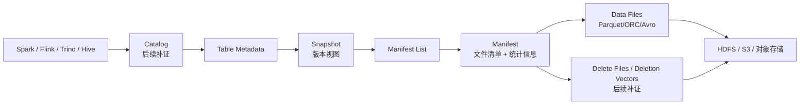

# Iceberg
## 知识点入口

- 本模块先看宏观流程，再看文章：[知识地图](030503_知识地图.md)。
- 新文章必须先归入流程节点，再判断是补充、冲突、不同层次还是降权。
- `文章/` 只保留原文锚点，长期知识必须沉淀到 `030503_核心知识点/` 下的主题文件。

## 技术定位

| 项 | 内容 |
|---|---|
| 技术名 | Apache Iceberg |
| 一级类目 | 数据工程与数仓 |
| 二级类目 | 湖仓表格式 |
| 技术本体 | 面向大规模分析数据集的开放湖仓表格式，重点解决快照、事务、Schema/分区演进、多引擎互操作和元数据规划 |
| 全局架构位置 | 位于对象存储/HDFS 之上、Spark/Flink/Trino/Hive/DuckDB 等引擎之下，负责表元数据、快照、Manifest 和数据文件引用 |
| 主要使用者 | 湖仓平台工程师、数据平台工程师、分析平台工程师 |
| 主要产出 | Iceberg 表、Snapshot、Manifest List、Manifest、Data File、Delete File、Branch/Tag 等元数据引用 |

## 官方锚点

- 官网：后续补证
- GitHub：后续补证
- 官方文档：后续补证
- 架构文档：后续补证

## 架构图

## 核心模块

| 模块 | 职责 | 重点问题 |
|---|---|---|
| Catalog | 定位表元数据和协调提交 | Hive Catalog、REST Catalog、治理和权限边界 |
| Snapshot | 记录某一时刻表状态 | 时间旅行、分支/标签、回滚、快照保留 |
| Manifest / Manifest List | 记录数据文件、删除文件和统计信息 | 查询规划、文件裁剪、元数据规模 |
| Schema / Partition Evolution | 支持表结构和分区策略演进 | 不重写数据的演进边界、引擎兼容 |
| Row-level Delete / Deletion Vector | 支撑行级删除和更新能力 | 读放大、小文件、删除向量成熟度 |
| Branch / Tag | 命名快照引用和独立生命周期 | 实验分支、审计版本、保留策略 |

## 上下游

| 方向 | 对象 | 关系 |
|---|---|---|
| 上游 | Spark/Flink 写入、CDC/批数据、数据湖文件 | 创建快照和文件清单 |
| 下游 | Trino/Hive/Spark/DuckDB/OLAP 平台 | 读取快照、做文件裁剪和查询 |
| 依赖 | Catalog、对象存储/HDFS、计算引擎 | 负责元数据定位、文件存储和提交执行 |

## 横向对标

| 对标技术 | 对标点 | Iceberg 优势 | Iceberg 劣势 | 使用判断 |
|---|---|---|---|---|
| Paimon | 湖仓表格式、快照、增量、更新 | Iceberg 跨引擎和开放生态更强 | Flink 实时更新链路通常要具体评估 | 多引擎开放湖仓优先看 Iceberg；Flink 实时状态表优先评估 Paimon |
| Hudi | 湖上更新、增量、表服务 | Iceberg 元数据规划和规范化生态强 | Hudi 在更新/增量历史场景更专注 | 更新密集和增量管道看 Hudi；通用开放湖表看 Iceberg |
| Delta Lake | 事务日志、Spark 批流生态 | Iceberg 开放互操作和多厂商支持突出 | Delta 在 Spark/Databricks 生态更深 | 跨厂商多引擎看 Iceberg；Spark/Databricks 主链路看 Delta |
| Hive 表 | 分区目录和 Metastore | Iceberg 补足快照、演进、事务和元数据裁剪 | 存量 Hive 门槛更低 | 存量离线表继续 Hive，有多引擎和演进需求再引入 Iceberg |

## 已沉淀核心知识点

| 主题 | 文件 | 问题指纹 | 解决什么问题 | 认知增量 |
|---|---|---|---|---|
| 快照分支与标签 | [Iceberg 快照分支标签与 Hive 接入边界](<030503_核心知识点/Iceberg 快照分支标签与 Hive 接入边界.md>) | Iceberg + Snapshot refs + Branch/Tag + 快照生命周期 + Hive 4.x 接入边界 | 如何把快照版本变成可命名、可保留、可查询的引用 | 分支/标签是快照生命周期管理，不是 Git 式完整开发流 |
| v3 行级能力 | [Iceberg v3 删除向量与行级血缘边界](<030503_核心知识点/Iceberg v3 删除向量与行级血缘边界.md>) | Iceberg + v3 + Deletion Vector/Row Lineage/Variant + 行级更新/CDC + 生态宣传降权 | v3 为什么会影响更新、CDC 和半结构化数据处理 | 把“标准本身”降权为“强生态信号，仍需引擎实现补证” |
| 查询加速平台 | [Iceberg 查询加速与平台化边界](<030503_核心知识点/Iceberg 查询加速与平台化边界.md>) | Iceberg + Manifest/统计/索引/Cube/平台优化 + 秒级查询 + 不替代 OLAP 出口 | Iceberg 表格式和平台侧优化如何共同支撑秒级查询 | 查询加速很多来自排序、索引、Cube、缓存和调度服务，不是 Iceberg 单独完成 |
| 生态扩展与实时存储边界 | [Iceberg生态扩展与实时存储边界](030503_核心知识点/Iceberg生态扩展与实时存储边界.md) | Iceberg + Dinky/Mooncake/平台实践 + 标准本体 vs 外部增强 | 区分 Iceberg 标准能力、开发平台和实时存储扩展 | 秒级响应和实时能力往往来自外部系统或平台优化 |

## 后续追查

- 关键词：Iceberg Snapshot、Manifest、Branch、Tag、Deletion Vector、Row Lineage、Variant、Partition Evolution。
- 待读资料：官方表规范、分支/标签、v3 规范、Hive/Spark/Flink/Trino 支持矩阵。
- 待补实验：创建 Iceberg 表，验证快照、Branch/Tag、Schema 演进、删除文件/删除向量和 Trino 文件裁剪效果。
