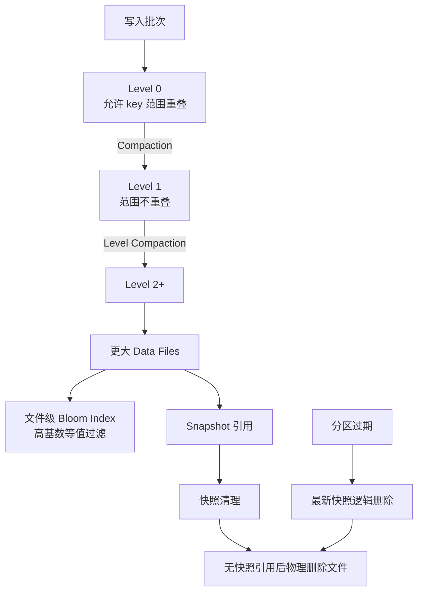

# Paimon LSM、Bloom 与生命周期治理

## 原文锚点

- 本地文件 1：[Paimon Bloom索引深度解析：从38s到1.5s的性能飞跃与生产最佳实践](<../文章/done-Paimon Bloom索引深度解析：从38s到1.5s的性能飞跃与生产最佳实践.md>)
- 本地文件 2：[美团面试：Paimon LSM-Tree 分层机制是怎么样的？](<../文章/done-美团面试：Paimon LSM-Tree 分层机制是怎么样的？.md>)
- 本地文件 3：[腾讯面试：Paimon自动分区清理与快照清理机制是怎么样的？哪个先清理？](../文章/done-腾讯面试：Paimon自动分区清理与快照清理机制是怎么样的？哪个先清理？.md)
- 本地文件 4：[Apache Paimon 1.3 核心亮点总结](<../文章/done-Apache Paimon 1.3 核心亮点总结.md>)
- 本地文件 5：[Apache Paimon核心配置参数详解（二）](<../文章/done-Apache Paimon核心配置参数详解（二）.md>)
- 原文链接：见各本地文件 front matter。
- 关键段落：Bloom 索引工作流和适用场景；LSM 分层、Level0、Compaction、Snapshot/Manifest；快照清理、分区清理依赖；Paimon 1.3 Row Tracking、Data Evolution、Incremental Clustering；Bucket/Changelog/保留参数。
- 关键图：LSM 和清理文章提到“如图”，但本地 Markdown 无图片链接。

## 图片处理

| 图片 | 类型 | 是否保留 | 理由 | 处理方式 |
|---|---|---|---|---|
| Paimon LSM 分层图 | 说明图 | 原图缺失 | 解释 Level0 到多层 Compaction | 基于正文描述重建 |
| 快照/分区清理关系图 | 流程图 | 重建 | 解释逻辑过期和物理删除依赖 | 基于正文描述重建 |

## 一句话结论

这组文章适合合并精读：Paimon 的生产边界不只在“能写入”，更在 LSM/Compaction 控制读写放大、Bloom 控制文件裁剪、快照和分区清理控制存储生命周期。

## 用户相关性判断

| 项 | 内容 |
|---|---|
| 用户当前认知层级 | Paimon L2 draft |
| 认知成熟度 | draft |
| 阅读投入建议 | 精读 |
| 阅读投入理由 | 能补 Paimon 主键表/追加表背后的读写放大、查询加速和生命周期治理边界 |
| 对用户的新信息 | Bloom 只影响性能不影响正确性；分区物理删除依赖快照清理；Paimon 1.3 的 Row Tracking/Data Evolution/Incremental Clustering 说明追加表能力在增强 |
| 问题指纹 | Paimon + LSM/Bloom/Snapshot/Partition/Changelog + Compaction/清理/查询裁剪 + 生产运维边界 |
| 排重判断 | 合并沉淀五篇原文 |
| 置信度 | 中 |

## 认知校准点

| 校准点 | 文章观点/信息 | 与用户认知或价值观的关系 | 处理建议 |
|---|---|---|---|
| Bloom 性能数字需要降权 | 38s 到 1.5s、25 倍提升缺完整可复现环境，且文中规模表述有不一致 | 防无基线性能结论 | 只保留适用条件和验证方法 |
| Bloom 不改变正确性 | 误判只会多读文件，行级精确过滤仍保证结果 | 补机制边界 | 记住“影响性能不影响结果” |
| LSM 的价值伴随读写放大 | Level0 快写、下层排序、Compaction 控制文件和版本 | 补失败场景 | 实践必须监控 Compaction、小文件、读放大 |
| 分区清理依赖快照清理 | 过期分区先逻辑删除，仍被未过期快照引用时不能物理删除 | 纠偏“分区到期就删文件” | 生命周期参数要联动配置 |
| 版本/参数类文章需补证 | Paimon 1.3 和参数默认值来自本地文章 | 防版本污染 | 官方补证前只作候选规则 |

## 冲突点

| 冲突类型 | 具体表现 | 影响 | 处理 |
|---|---|---|---|
| 原目录冲突 | 多篇 Paimon 文章在 `09_其他`、`08_职业与管理` 或 raws | 可能漏归 | 重路由到湖仓表格式 / Paimon |
| 标题降权 | “性能飞跃”“面试”类标题 | 容易夸大或碎片化 | 合并为生产边界主题 |
| 证据不足 | 性能、默认值、版本支持未本轮联网补证 | 不能直接当生产配置 | 标记后续补证 |
| 图片缺失 | LSM 和清理机制文章提到图但无图 | 影响机制理解 | Mermaid 重建简图 |

## 待吸收点

| 分级 | 内容 | 为什么值得吸收 | 后续动作 |
|---|---|---|---|
| 理解 | LSM Level0 允许 key 范围重叠以换写入吞吐，下层通过 Compaction 形成更有序、更大的文件 | 解释 Paimon 主键表更新性能来源 | 后续补官方 Compaction 文档 |
| 理解 | Bloom 是文件级列索引，适合高基数等值查询，需结合分区过滤 | 是 Paimon + OLAP 外表查询的关键优化 | 设计 EXPLAIN 验证 |
| 理解 | 快照清理删除旧 snapshot 元数据和不再引用的数据文件；分区清理先逻辑过期，物理删除等待快照不再引用 | 生命周期治理核心 | 写入 Paimon 运维准则 |
| 理解 | `changelog-producer` 的 none/input/full-compaction/lookup 对实时性、准确性和写入成本有不同取舍 | 与已有 Merge/Changelog 笔记联动 | 后续补官方版本限制 |
| 记住 | Bloom 不适合低基数列、范围查询、模糊查询和频繁更新列 | 可直接指导索引创建 | 作为排重和实践门槛 |
| 记住 | `snapshot.time-retained`、分区保留、changelog 保留、Tag 要一起看，否则会误删历史或阻碍物理回收 | 生产运维准则 | 加入 Paimon index |
| 实践 | 对同一 Paimon 表增加 Bloom、调整 bucket/compaction/快照保留，观察扫描文件数、延迟、存储和快照数量 | 可验证生产边界 | 后续实验 |

## 已知可跳过

| 内容 | 跳过理由 |
|---|---|
| Bloom 基础数学介绍 | 用户需要 Paimon 文件级索引边界，不需要通用 Bloom 教程 |
| 面试题和星球推广内容 | 不进入核心知识点 |
| 未补证的默认值和版本号 | 只作候选，不能直接复制 |

## 实践门槛

| 门槛 | 判断 | 证据 |
|---|---|---|
| 可运行 | 部分 | 有 ALTER TABLE、CALL、建表参数片段 |
| 可验证 | 是 | 可用 EXPLAIN、扫描文件数、IO、快照数量、分区文件变化验证 |
| 可排障 | 是 | 包含 Bloom 不生效、低基数负收益、快照阻碍物理删除、桶/Compaction 参数风险 |
| 可迁移 | 是 | 可迁移到 Paimon 查询加速和生命周期治理 |
| 结论 | 精读 | 机制和失败模式可沉淀，参数需官方补证 |

## 归类判断

| 项 | 内容 |
|---|---|
| 技术本体 | Apache Paimon 表格式的 LSM、索引、快照、分区和 Changelog 治理 |
| 文章主问题 | Paimon 如何控制读写放大、文件裁剪和数据生命周期 |
| 使用场景 | 主键表更新、OLAP 外表查询加速、历史数据保留、快照/分区清理 |
| 关键词干扰 | StarRocks、面试、运维、Paimon 1.3 发布 |
| 最终归类 | 数据工程与数仓 / 湖仓表格式 / Paimon |
| 归类理由 | 主体是 Paimon 表内部机制和运维参数，OLAP/面试只是场景或包装 |

## 技术定位

| 项 | 内容 |
|---|---|
| 技术类型 | 技术机制 / 运维实践 |
| 所属领域 | 数据工程与数仓 |
| 二级类目 | 湖仓表格式 |
| 全局架构位置 | Paimon 表格式内部的存储组织、索引和生命周期管理层 |
| 涉及模块 | LSM、Compaction、Bloom Index、Snapshot、Manifest、Partition Expiration、Changelog Retention、Tag |
| 解决问题 | 写入吞吐、查询裁剪、读写放大、历史版本和存储成本之间的平衡 |
| 原文局限 | 多篇文章碎片化，性能和默认值需官方补证 |
| 我的结论 | 以后关注，作为 Paimon 生产运维边界入口 |

## 纵向理解

| 维度 | 判断 |
|---|---|
| 全局架构 | Flink/Spark 写入 -> Paimon LSM/Data Files -> Snapshot/Manifest -> Bloom/统计裁剪 -> 查询引擎/清理作业 |
| 本文位置 | Paimon 存储组织、索引和生命周期，不覆盖完整 CDC 接入 |
| 核心机制 | LSM 负责写入和更新组织，Bloom 负责文件级过滤，快照/分区清理负责物理文件生命周期 |
| 使用链路 | 建表时选 bucket/索引/保留策略 -> 写入和 compaction -> 查询验证索引 -> 定期清理和监控 |
| 前置条件 | 稳定分区字段、高基数过滤列、合理桶数、Compaction 资源、查询引擎可下推 |
| 边界 | Bloom 不能优化范围/低基数/模糊查询；快照保留太长会阻碍物理回收；清理太激进会影响时间旅行和增量消费 |

## 横向对标

| 对标技术 | 实现方式 | 优势 | 劣势 | 适合场景 |
|---|---|---|---|---|
| Hive 分区表 | 分区裁剪 + 文件扫描 | 简单成熟 | 缺快照/更新/增量和文件级索引治理 | 离线批表 |
| Iceberg | Snapshot/Manifest + 统计信息/删除文件 | 跨引擎生态强 | 高频更新和实时链路需看实现 | 多引擎开放湖表 |
| Hudi | Timeline + Index + COW/MOR | 更新和增量成熟 | 表服务和并发复杂 | 湖上更新和增量管道 |
| Paimon | LSM + Snapshot + Bloom/Changelog | Flink 实时更新、文件裁剪和状态表能力强 | Compaction、桶和保留参数运维要求高 | 实时湖仓主键表、状态表、准实时查询 |

## 后续追查

- 关键词：Paimon LSM、num-sorted-run.compaction-trigger、Bloom Index、file-index.bloom-filter、expire_snapshots、expire_partitions、changelog-producer、Incremental Clustering。
- 相关技术：StarRocks Paimon 外表、Trino、Iceberg Manifest、Hudi Index、Paimon Tag。
- 需要补读的文章：Paimon 官方 Compaction、File Index、Snapshot Expiration、Partition Expiration、Changelog Producer、Paimon 1.3 release notes。
