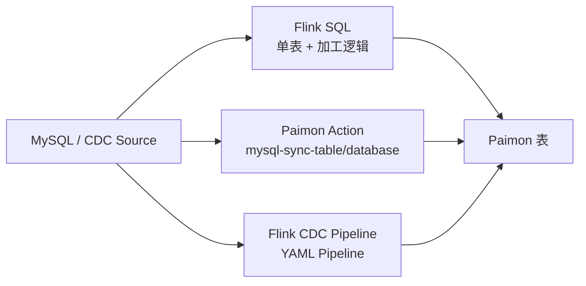

# Paimon CDC 同步方案选型

## 原文锚点

- 本地文件：[Flink CDC 写入 Paimon：三种同步方案怎么选？（含 SQL / Action / Pipeline 实战）](<../文章/Flink CDC 写入 Paimon：三种同步方案怎么选？（含 SQL _ Action _ Pipeline 实战）.md>)
- 原文链接：https://mp.weixin.qq.com/s?__biz=MzUyNjc2MjYzNA==&mid=2247487625&idx=1&sn=c1e2afaec1aa3aadfb0708a4caf8e26b
- 官方锚点：[Apache Paimon Docs](https://paimon.apache.org/docs/master/)、[Apache Flink CDC Documentation](https://nightlies.apache.org/flink/flink-cdc-docs-stable/docs/get-started/introduction/)
- 关键段落：Flink SQL、Paimon Action CDC Ingestion、Flink CDC Pipeline 三种方式；Schema Evolution；整库同步；小文件、Checkpoint、OOM。
- 关键图：原文无图，选型表可保留为文字。

## 图片处理

| 图片 | 类型 | 是否保留 | 理由 | 处理方式 |
|---|---|---|---|---|
| 三种同步方式对比 | 对比图 | 重建 | 对选型有直接价值 | Mermaid 重建 |

## 一句话结论

这篇文章值得精读但不能照抄配置：真正价值是区分 Paimon CDC 接入的三条路线，而不是把所有“实战参数”当当前最佳实践。

## 用户相关性判断

| 项 | 内容 |
|---|---|
| 用户当前认知层级 | Paimon / 湖仓表格式 L2 draft；Flink CDC / 数据集成 L2-L3 draft |
| 认知成熟度 | draft |
| 阅读投入建议 | 精读 |
| 阅读投入理由 | 能补 CDC 到 Paimon 的选型边界和 Schema 演进限制，但原文版本、Jar 名称和参数需要官方复核 |
| 对用户的新信息 | Flink SQL、Paimon Action、Flink CDC Pipeline 是三种不同治理模型，不只是三种写法 |
| 问题指纹 | Paimon + CDC Ingestion + Flink SQL/Paimon Action/030302_Flink CDC Pipeline + Schema Evolution/整库同步 + 接入方式选型边界 |
| 排重判断 | 新建 |
| 置信度 | 中 |

## 认知校准点

| 校准点 | 文章观点/信息 | 与用户认知或价值观的关系 | 处理建议 |
|---|---|---|---|
| 三种方式对应不同治理模型 | SQL 偏灵活加工，Action 偏 Paimon 官方整库同步，Pipeline 偏 Flink CDC 数据集成 | 补横向对标 | 写入 Paimon index |
| Schema Evolution 不是无限支持 | 加列较友好，删列、改主键、改分区通常高风险 | 补生产边界 | 保留为待验证 |
| “推荐新版 Pipeline”不能脱离版本 | 原文使用 0.9/3.1 等版本线索，当前路径需官方校准 | 防版本污染 | 不沉淀具体命令为稳定准则 |
| Paimon 不是 Kafka 替代品 | CDC 写入 Paimon 产出的是湖仓表状态和增量语义 | 避免横向误判 | 与 Kafka、Doris 区分 |

## 冲突点

| 冲突类型 | 具体表现 | 影响 | 处理 |
|---|---|---|---|
| 原目录冲突 | 原文在 raws/big-data，脚本粗分到实时计算 | 容易归到 Flink，而主问题是 Paimon 接入方式 | 重路由到湖仓表格式 / Paimon |
| 版本时效 | Paimon Action jar、Flink CDC Pipeline CLI 参数随版本变化 | 复制命令风险高 | 官方文档复核后实践 |
| 证据不足 | 参数建议没有数据量、延迟、文件数、Checkpoint 指标 | 不能直接当调优规则 | 只保留问题类型 |
| 实践信号偏宽 | 有代码和命令，但没有完整输入输出和验收 | 不能判实践 | 降为精读 |

## 待吸收点

| 分级 | 内容 | 为什么值得吸收 | 后续动作 |
|---|---|---|---|
| 理解 | Flink SQL 适合单表、强加工逻辑、静态 Schema | 明确灵活性与维护成本 | 写入 Paimon index |
| 理解 | Paimon Action 适合整库同步、自动建表、Paimon 侧治理 | 区分表格式自带 ingestion 能力 | 后续查官方命令 |
| 理解 | Flink CDC Pipeline 适合 CDC 3.x 声明式链路，统一 Source/Sink/Schema | 与 Flink CDC 数据集成框架衔接 | 更新 Flink CDC 后续追查 |
| 记住 | CDC 到 Paimon 的核心风险是 Schema 演进、主键/分区变更、小文件、Checkpoint 和延迟 | 能指导排重和阅读 | 作为后续文章筛选准则 |
| 实践 | 用同一张 MySQL 表分别跑 SQL、Action、Pipeline，比较新增列、延迟、小文件和恢复 | 能验证选型 | 待实验 |

## 已知可跳过

| 内容 | 跳过理由 |
|---|---|
| 前置推广链接 | 无知识价值 |
| 通用建 Catalog/建表语法 | 需要时查官方文档 |
| 没有基线的调参清单 | 不能当稳定规则 |

## 实践门槛

| 门槛 | 判断 | 证据 |
|---|---|---|
| 可运行 | 部分 | 有命令和配置片段 |
| 可验证 | 否 | 没有输入数据、预期结果、延迟和文件数验收 |
| 可排障 | 部分 | 有慢全量、Checkpoint、小文件、OOM、Schema 问题清单 |
| 可迁移 | 是 | 可迁移到实时湖仓 CDC 链路选型 |
| 结论 | 降为精读 | 参数和版本需官方复核 |

## 归类判断

| 项 | 内容 |
|---|---|
| 技术本体 | Apache Paimon 表格式及 CDC ingestion |
| 文章主问题 | MySQL/030302_Flink CDC 写入 Paimon 时如何选择接入方式 |
| 使用场景 | 实时湖仓 ODS/状态表同步 |
| 关键词干扰 | Flink CDC、实战、Pipeline 可能误导到实时计算或数据集成 |
| 最终归类 | 数据工程与数仓 / 湖仓表格式 / Paimon |
| 归类理由 | 文章最终产出和选型对象是 Paimon 表接入方式，Flink CDC 是上游同步手段 |

## 技术定位

| 项 | 内容 |
|---|---|
| 技术类型 | 选型与实践案例 |
| 所属领域 | 数据工程与数仓 |
| 二级类目 | 湖仓表格式 |
| 全局架构位置 | CDC 源到 Paimon 湖仓表的写入层 |
| 涉及模块 | Flink SQL、Paimon Action、Flink CDC Pipeline、Schema Evolution、Compaction |
| 解决问题 | 如何在单表加工、整库同步、声明式 Pipeline 之间选型 |
| 原文局限 | 命令版本和调优参数缺官方校准与指标基线 |
| 我的结论 | 以后关注，作为 Paimon CDC 接入选型入口 |

## 纵向理解

| 维度 | 判断 |
|---|---|
| 全局架构 | MySQL -> CDC Source/Action/Pipeline -> Paimon 表 -> Flink/Spark/Trino/Doris 等读取 |
| 本文位置 | 只讲写入接入方式，不完整覆盖 Paimon 存储、快照和查询 |
| 核心机制 | 接入方式决定 Schema 管理、整库同步、加工灵活度和运维责任边界 |
| 使用链路 | 定义源端 -> 定义目标 Paimon 表或规则 -> 提交 Flink/Paimon 作业 -> 监控 Checkpoint、小文件、Schema |
| 前置条件 | 源表主键、CDC 权限、Flink 环境、Paimon Catalog、下游读取语义 |
| 边界 | 删除列、改主键、改分区、无主键大表、强加工逻辑都需要单独评估 |

## 横向对标

| 对标技术 | 实现方式 | 优势 | 劣势 | 适合场景 |
|---|---|---|---|---|
| Flink SQL | 手写 Source/Sink DDL 和 SQL | 加工灵活，易嵌入逻辑 | 静态 Schema，逐表维护 | 单表同步、需要过滤/派生字段 |
| Paimon Action | Paimon 提供同步 Action | 整库同步和自动建表友好 | 灵活加工弱，依赖 Paimon 版本 | ODS 整库入湖 |
| Flink CDC Pipeline | YAML 声明 Source/Sink/Route | 与 CDC 3.x 框架统一 | 版本和连接器成熟度要核实 | 新链路、声明式数据集成 |
| Kafka + Flink 写 Paimon | 先入 Kafka 再加工写入 | 解耦源端和下游 | 链路长，语义和成本更复杂 | 多消费者、缓冲需求强 |

## 后续追查

- 关键词：Paimon CDC Ingestion、mysql-sync-table、mysql-sync-database、Flink CDC Pipeline Paimon Sink、Schema Evolution。
- 相关技术：Flink CDC、Debezium、Kafka、Doris、StarRocks、Iceberg。
- 需要补读的文章：Paimon 官方 CDC Ingestion 文档、Flink CDC Pipeline Sink 文档、Paimon Schema Evolution 限制。

