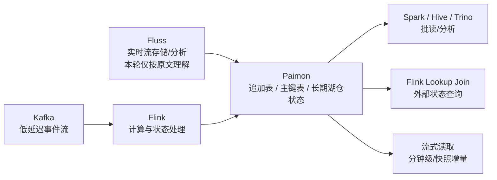

# Paimon 追加表与外部状态边界

## 原文锚点

- 本地文件 1：[代替Kafka? Paimon追加表真的可以](<../文章/代替Kafka_ Paimon追加表真的可以.md>)
- 本地文件 2：[揭秘Fluss、Kafka、Paimon 的联系和区别](<../文章/揭秘Fluss、Kafka、Paimon 的联系和区别.md>)
- 本地文件 3：[Flink+Paimon实时数据湖仓实践分享](../文章/Flink+Paimon实时数据湖仓实践分享.md)
- 原文链接 1：`http://mp.weixin.qq.com/s?__biz=Mzg5Mzg3MzkwNA==&mid=2247490431&idx=1&sn=d54ddce6542da78253911ba352e84516`
- 原文链接 2：`http://mp.weixin.qq.com/s?__biz=Mzg2NjY0MDM5Nw==&mid=2247484710&idx=1&sn=85183bd7e9583fe4184c4e4b17fc92a6`
- 原文链接 3：`http://mp.weixin.qq.com/s?__biz=MzAxNDEwNjk5OQ==&mid=2650537293&idx=1&sn=ede5c6caa63bf7e12aae1b83e706442a`
- 关键段落：追加表流式读取、Bucketed Append、水印和有界流；Fluss/Kafka/Paimon 定位差异；Paimon 作为 Flink 外部状态和 Lookup 维表的两个案例及故障。
- 关键图：三篇本地 Markdown 均无可保留技术图。

## 图片处理

| 图片 | 类型 | 是否保留 | 理由 | 处理方式 |
|---|---|---|---|---|
| 无 | 无 | 不适用 | 文章主要以文字、SQL 和案例说明 | 用 Mermaid 重建边界关系 |

## 一句话结论

这组三篇文章值得合并精读：Paimon 可以承担低成本、长期、可批读的湖仓状态和准实时队列式读取，但不能直接替代 Kafka 的低延迟消息传递，也不能无成本替代 Flink 内部状态。

## 用户相关性判断

| 项 | 内容 |
|---|---|
| 用户当前认知层级 | Paimon L2 draft；Flink 状态/CDC L2-L3 draft |
| 认知成熟度 | draft |
| 阅读投入建议 | 精读 |
| 阅读投入理由 | 能补 Paimon 与 Kafka/Fluss/Flink State 的横向边界，并提供 LookupJoin 和分桶失败场景 |
| 对用户的新信息 | Paimon 追加表的“队列式流读”是分钟级、表快照/增量语义；Paimon 外部状态要受 bucket key、分区读取和 Lookup 初始化影响 |
| 问题指纹 | Paimon + Append/Lookup/External State + 流式读写/分桶/水印 + Kafka/Fluss/Flink State 边界 |
| 排重判断 | 合并沉淀三篇原文 |
| 置信度 | 中 |

## 认知校准点

| 校准点 | 文章观点/信息 | 与用户认知或价值观的关系 | 处理建议 |
|---|---|---|---|
| “代替 Kafka”必须降权 | 原文承认 Paimon 延迟以分钟为单位，Kafka 仍适合低延迟解耦 | 纠偏标题党 | 改写为“特定分析链路可减少 Kafka 作为长期缓冲的使用” |
| 追加表不等于主键更新表 | Append table 无主键，不能直接接收 changelog/upsert | 补技术本体边界 | 与主键表、Merge Engine 分开排重 |
| Fluss/Paimon/Kafka 是不同层 | Kafka 管事件传递，Fluss 偏实时流存储/分析，Paimon 偏长期湖仓表状态 | 横向对标补缺 | 不做谁取代谁的结论 |
| Paimon 外部状态有失败门槛 | LookupJoin 卡住、桶过大、join key 不完整覆盖 bucket key、非分区表清理困难 | 补失败场景 | 写入实践门槛和后续实验 |

## 冲突点

| 冲突类型 | 具体表现 | 影响 | 处理 |
|---|---|---|---|
| 标题降权 | “代替 Kafka”过强 | 误导选型 | 降权为边界案例 |
| 关键词误导 | Fluss、Kafka、Flink State、LookupJoin 抢分类 | 容易归到实时计算/消息队列 | 按 Paimon 表状态归湖仓表格式 |
| 证据不足 | Fluss 定位来自单篇观点，未做官方补证 | 不能作为稳定事实 | 标记后续补证 |
| 实践门槛 | Flink+Paimon 案例有版本、平台和参数依赖 | 不能直接复用 | 只沉淀失败模式和判断准则 |

## 待吸收点

| 分级 | 内容 | 为什么值得吸收 | 后续动作 |
|---|---|---|---|
| 理解 | Paimon Append table 可流式写入/读取，但默认无严格全局顺序；桶内可按写入顺序消费 | 解释“队列式读取”的真实边界 | 与 Kafka topic/partition 对比 |
| 理解 | Bucketed Append 能用 bucket-key 约束同桶顺序，并在批查询中减少 shuffle | 连接流读和批读优化 | 验证 Spark bucketing 行为 |
| 理解 | Paimon 作为 Flink 外部状态能绕开长状态 TTL 和无状态重启问题 | 对用户实时链路有实践价值 | 与 Flink State/RocksDB 和 Hudi Payload 对标 |
| 记住 | LookupJoin 的 join key 必须覆盖 bucket key，否则无法高效定位桶，可能初始化慢或失败 | 直接影响生产排障 | 加入 Paimon 实践门槛 |
| 记住 | 非分区主键表的数据清理不能只靠分区过期；删除和 compaction 可能产生冲突 | 补生命周期边界 | 与快照/分区清理笔记联动 |
| 实践 | 用一张 Append 表验证 scan.mode、bucket-key、watermark 和有界流行为 | 可验证 Paimon 是否适合队列式读 | 后续实验 |

## 已知可跳过

| 内容 | 跳过理由 |
|---|---|
| 开源项目推广、加群和课程内容 | 无技术价值 |
| Kafka/Fluss/Paimon 的拟人比喻 | 可帮助入门，但不进入长期知识点 |
| 业务案例中大量字段命名 | 只保留主键、bucket、merge-engine、changelog 和失败模式 |

## 实践门槛

| 门槛 | 判断 | 证据 |
|---|---|---|
| 可运行 | 部分 | 有 Append 表、Paimon 维表和 Flink SQL 片段 |
| 可验证 | 部分 | 有 LookupJoin 初始化、桶大小、TM 内存等现象，但缺完整指标 |
| 可排障 | 是 | 提供桶过大、join key 不覆盖 bucket key、TM 堆内存不足、非分区表清理冲突 |
| 可迁移 | 是 | 可迁移到实时湖仓外部状态和准实时队列式读场景 |
| 结论 | 精读 | 可以沉淀边界和失败场景；实践需重建最小实验 |

## 归类判断

| 项 | 内容 |
|---|---|
| 技术本体 | Apache Paimon 追加表、主键表和 Flink 集成 |
| 文章主问题 | Paimon 在消息队列、实时流存储和 Flink 外部状态之间的边界 |
| 使用场景 | 准实时湖仓、长期状态表、Flink Lookup 维表、低成本历史状态 |
| 关键词干扰 | Kafka、Fluss、Flink、实时标签、Hologres、ODPS |
| 最终归类 | 数据工程与数仓 / 湖仓表格式 / Paimon |
| 归类理由 | 文章最终讨论的是 Paimon 表类型和状态承载边界 |

## 技术定位

| 项 | 内容 |
|---|---|
| 技术类型 | 技术机制 / 实践案例 |
| 所属领域 | 数据工程与数仓 |
| 二级类目 | 湖仓表格式 |
| 全局架构位置 | Flink 计算和下游批/流读取之间的湖仓表状态层 |
| 涉及模块 | Append table、Bucket、Bucket key、Watermark、LookupJoin、Merge Engine、Changelog Producer |
| 解决问题 | 让部分状态和长期历史从 Flink 内部状态或 Kafka 长保留中迁移到湖仓表 |
| 原文局限 | 标题夸张、Fluss 缺补证、案例依赖平台环境 |
| 我的结论 | 以后关注，作为 Paimon 横向边界和实践失败模式入口 |

## 纵向理解

| 维度 | 判断 |
|---|---|
| 全局架构 | Kafka/CDC/业务流 -> Flink -> Paimon Append/主键表 -> Flink Lookup/批读/流读/OLAP 出口 |
| 本文位置 | Paimon 外部状态和追加表，不覆盖完整 LSM/Compaction |
| 核心机制 | 追加表提供低成本准实时流读，主键表提供状态更新，bucket key 决定定位和并行 |
| 使用链路 | 定义表类型和 bucket -> Flink 写入 -> 流式/批式读取或 LookupJoin -> 监控初始化、延迟、文件和内存 |
| 前置条件 | 合理主键、bucket key、桶大小、表保留策略、Flink 内存和 LookupJoin 策略 |
| 边界 | 低延迟事件流仍选 Kafka；复杂实时计算仍在 Flink；高并发服务化查询仍看 OLAP |

## 横向对标

| 对标技术 | 实现方式 | 优势 | 劣势 | 适合场景 |
|---|---|---|---|---|
| Kafka | Topic/Partition 事件日志 | 毫秒级传递、解耦强、生态成熟 | 长期表状态和历史批读弱 | 事件流、削峰、低延迟多消费者 |
| Flink State/RocksDB | 算子内部状态 | 实时性强、语义紧贴计算 | 状态大、恢复慢、TTL 难 | 短到中周期实时计算状态 |
| Fluss | 原文描述为实时流存储/分析 | 短期实时分析与更新 | 本轮未补官方证据 | 后续补证 |
| Paimon | 湖仓表 + 快照/增量/批流读 | 成本低、长期状态、可批读 | 延迟和 Lookup/Compaction 运维边界 | 准实时状态表、长期历史、批流一体 |

## 后续追查

- 关键词：Paimon Append Table、Bucketed Append、scan.mode、scan.bounded.watermark、Flink Lookup Join、bucket-key。
- 相关技术：Kafka、Fluss、Flink State、Hudi Payload、Paimon Changelog Producer。
- 需要补读的文章：Paimon 官方 Append Table、Flink Lookup Join、Fluss 官方定位、Paimon dedicated compaction。
