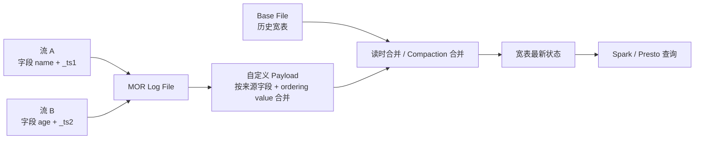

# Hudi Payload 多流拼接与并发写边界

## 原文锚点

- 本地文件：[万字长文：基于Apache Hudi + Flink多流拼接(大宽表)最佳实践](../文章/万字长文：基于Apache Hudi + Flink多流拼接%28大宽表%29最佳实践.md)
- 原文链接：`http://mp.weixin.qq.com/s?__biz=MzIyMzQ0NjA0MQ==&mid=2247490026&idx=1&sn=15b15480af127977422873492554198e`
- 关键段落：背景中的维表 Join/多流 Join 状态挑战；并发控制；marker；早期冲突检测；Payload；多流拼接过程；效果收益。
- 关键图：正文多次提到图 1、图 3、实现原理图，但本地 Markdown 无图片链接。

## 图片处理

| 图片 | 类型 | 是否保留 | 理由 | 处理方式 |
|---|---|---|---|---|
| Marker / 早期冲突检测流程 | 流程图 | 原图缺失 | 解释多写入失败前置检测 | 原图缺失，需要回原文查看 |
| 多流 LogFile 与 BaseFile 合并图 | 流程图 | 重建 | 是多流拼接核心机制 | 基于正文描述重建 |

## 一句话结论

这篇文章值得精读但不能直接照搬：它展示了用 Hudi Payload 把多流 Join 从 Flink 状态转移到存储层的可能性，同时暴露了多写并发、乱序、Compaction 和定制 Payload 的高实践门槛。

## 用户相关性判断

| 项 | 内容 |
|---|---|
| 用户当前认知层级 | Hudi L1-L2 draft；Flink 多流 Join L2-L3 draft |
| 认知成熟度 | draft |
| 阅读投入建议 | 精读 |
| 阅读投入理由 | 能补失败场景和边界：长 TTL 多流 Join、维表缓存不准、Flink 状态膨胀，可用 Hudi MOR + Payload 缓解 |
| 对用户的新信息 | Payload 不只是去重参数，而是可承载列级合并、乱序控制和多源宽表拼接的业务语义层 |
| 问题指纹 | Hudi + Payload/MOR/OCC + 多流宽表拼接 + 降低 Flink 状态但增加表服务复杂度 |
| 排重判断 | 新建 |
| 置信度 | 中 |

## 认知校准点

| 校准点 | 文章观点/信息 | 与用户认知或价值观的关系 | 处理建议 |
|---|---|---|---|
| 存储层拼接不是免费 Join | 原文把多流拼接放到 Hudi Payload 和 MOR 读时合并 | 补边界，避免把 Hudi 当 Join 引擎 | 记录为特定宽表场景方案，不泛化 |
| Payload 会把业务语义写进表格式 | 通过 `precombine` 和 `combineAndGetUpdateValue` 决定字段级更新 | 工程代价高，影响长期维护 | 实践前要求版本、测试和回滚方案 |
| OCC 晚检测会浪费资源 | 原文强调冲突在写完后检测会导致大作业重跑 | 补失败场景 | 后续重点追查 marker、heartbeat、early conflict detection |
| 性能收益有场景依赖 | 文中给出几十 TB 查询 40%-200%+ 提升，但依赖宽表预合并 | 证据需降权 | 不写成 Hudi 通用性能结论 |

## 冲突点

| 冲突类型 | 具体表现 | 影响 | 处理 |
|---|---|---|---|
| 图片缺失 | 多处“如下图/图 3”但 Markdown 无图 | 多流合并链路不直观 | 标原图缺失并重建简图 |
| 实践门槛偏高 | 文中有大量参数和内部增强，如 Multiple ordering value、lock less multiple writers | 不能直接迁移 | 降为精读，后续需官方/版本补证 |
| 证据不足 | 性能收益缺完整环境、数据分布和版本信息 | 容易误读为通用收益 | 只保留场景化结论 |

## 待吸收点

| 分级 | 内容 | 为什么值得吸收 | 后续动作 |
|---|---|---|---|
| 理解 | 维表 Join 和多流 Join 的根因是状态 TTL、缓存更新、Checkpoint/Restore 压力 | 能识别何时需要外部化状态或存储层合并 | 与 Paimon 外部状态文章对标 |
| 理解 | Hudi Payload 的 `preCombine` 处理同批次同 key，`combineAndGetUpdateValue` 处理新旧值合并 | 是多流拼接的机制核心 | 补官方 Payload 文档 |
| 理解 | 多流拼接时，同 key 不同来源不应互相覆盖，而应按来源字段部分更新 | 避免旧数据覆盖新数据、列更新不完整 | 作为宽表建模风险清单 |
| 记住 | 存储层宽表拼接适合“多源字段补齐”，不适合任意复杂 Join | 会影响后续选型 | 写入 Hudi index |
| 实践 | 设计两条 Flink 流写同一 Hudi MOR 表，用自定义 Payload 验证乱序字段合并 | 可验证但成本较高 | 后续只在真实需求下实践 |

## 已知可跳过

| 内容 | 跳过理由 |
|---|---|
| 大量 Maven/DDL 参数片段 | 缺版本补证，直接复制风险高 |
| RDBMS/NoSQL 并发控制背景 | 只需保留对 OCC 的校准 |
| 推广和参考链接列表 | 不进入知识点 |

## 实践门槛

| 门槛 | 判断 | 证据 |
|---|---|---|
| 可运行 | 部分 | 有 DDL、Payload 类名和参数片段 |
| 可验证 | 部分 | 有业务收益，但缺可复现输入输出 |
| 可排障 | 部分 | 提到 marker、early conflict、compaction，但缺日志信号 |
| 可迁移 | 中 | 只适合字段补齐型宽表，不适合任意 Join |
| 结论 | 降为精读 | 实践依赖定制 Payload、并发写和版本补证 |

## 归类判断

| 项 | 内容 |
|---|---|
| 技术本体 | Apache Hudi 表格式的 Payload、MOR 和并发写机制 |
| 文章主问题 | 如何用 Hudi 在存储层拼接多流宽表，降低 Flink 状态压力 |
| 使用场景 | 实时 DWS 宽表、多流字段补齐、长时间间隔事件关联 |
| 关键词干扰 | Flink、多流 Join、Spark 查询容易误导到实时计算或 OLAP |
| 最终归类 | 数据工程与数仓 / 湖仓表格式 / Hudi |
| 归类理由 | 主问题是 Hudi 表格式内的合并语义和并发写，不是 Flink Join 教程 |

## 技术定位

| 项 | 内容 |
|---|---|
| 技术类型 | 实践案例 / 表格式高级机制 |
| 所属领域 | 数据工程与数仓 |
| 二级类目 | 湖仓表格式 |
| 全局架构位置 | Flink 多流写入和 Spark/Presto 查询之间的湖仓表状态层 |
| 涉及模块 | MOR、Payload、Timeline、Marker、OCC、Compaction、Clean |
| 解决问题 | 长状态多流 Join 和维表缓存不一致时，如何把字段合并下沉到湖表 |
| 原文局限 | 依赖内部增强和旧版本片段，图片缺失，收益证据场景化 |
| 我的结论 | 以后关注，作为 Hudi 复杂宽表机制案例 |

## 纵向理解

| 维度 | 判断 |
|---|---|
| 全局架构 | 多条 Flink 流 -> Hudi MOR Log -> 自定义 Payload 合并 -> Base File / Compaction -> 查询引擎 |
| 本文位置 | Hudi 写入合并语义和表服务，不覆盖完整湖仓治理 |
| 核心机制 | Payload 控制同 key 记录如何合并，OCC/marker 控制多写事务风险 |
| 使用链路 | 定义 MOR 表和 Payload -> 多 Job 写入 -> Log/Base 合并 -> 查询宽表 |
| 前置条件 | 稳定主键、来源字段边界、ordering value、并发写配置、Compaction 资源 |
| 边界 | 不适合任意 Join、不适合无明确字段归属的数据、不适合缺少排障能力的团队直接上生产 |

## 横向对标

| 对标技术 | 实现方式 | 优势 | 劣势 | 适合场景 |
|---|---|---|---|---|
| Flink Regular Join | 在 Flink 状态中保留多流数据 | 实时性强 | 状态大、TTL 难、恢复慢 | 短周期、状态可控 Join |
| 维表缓存 Join | 外部维表缓存/数据库查询 | 实现直观 | 缓存更新不准，QPS 压力大 | 维度稳定、低延迟查询 |
| Paimon Partial Update | 主键表字段级更新 | Flink 链路紧，配置相对表格式化 | 仍需验证乱序和下游 changelog | Flink 实时湖仓宽表 |
| Hudi Payload | 自定义合并逻辑 | 语义灵活，可处理多源字段补齐 | 定制代码和并发写成本高 | 特定宽表拼接、复杂更新语义 |

## 后续追查

- 关键词：Hudi Payload、preCombine、combineAndGetUpdateValue、Hudi MOR、Hudi OCC、Marker、Early Conflict Detection。
- 相关技术：Flink Join、Paimon Partial Update、Paimon Merge Engine、Iceberg Row Lineage。
- 需要补读的文章：Hudi Payload 官方文档、Hudi concurrency control、Hudi Flink writer、多写和 compaction 限制。
