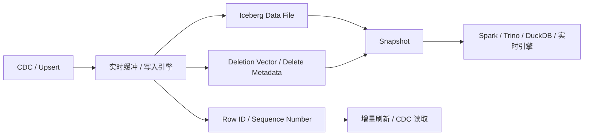

# Iceberg v3 删除向量与行级血缘边界

## 原文锚点

- 本地文件 1：[为什么 Iceberg v3 是数据湖仓的"iPhone 时刻"？](../文章/为什么 Iceberg v3 是数据湖仓的_iPhone 时刻_？.md)
- 本地文件 2：[Mooncake: 基于 Apache Iceberg 构建的实时存储引擎](../文章/Mooncake_ 基于 Apache Iceberg 构建的实时存储引擎.md)
- 原文链接 1：`https://mp.weixin.qq.com/s?__biz=MzA5MTc0NTMwNQ==&mid=2650742287&idx=1&sn=b37cd515af8f34754ac1674a6601bda8`
- 原文链接 2：`https://mp.weixin.qq.com/s?__biz=MzA5MTc0NTMwNQ==&mid=2650742043&idx=1&sn=089f37429370e6b498baa69424380e83`
- 关键段落：删除向量、行级血缘、VARIANT、默认列值、纳秒时间戳；Moonlink 的 Arrow 缓冲区、位置删除日志、删除向量、索引和联合读取。
- 关键图：无图。

## 图片处理

| 图片 | 类型 | 是否保留 | 理由 | 处理方式 |
|---|---|---|---|---|
| 无 | 无 | 不适用 | 两篇文章以机制文字说明为主 | 用 Mermaid 重建行级更新链路 |

## 一句话结论

这组文章值得精读，核心增量是 Iceberg 正在把行级更新、CDC 和半结构化数据能力推进到表格式层；但“标准本身”“iPhone 时刻”属于强宣传表达，必须等引擎实现和版本补证。

## 用户相关性判断

| 项 | 内容 |
|---|---|
| 用户当前认知层级 | Iceberg L1-L2 draft；湖仓表格式 L2 draft |
| 认知成熟度 | draft |
| 阅读投入建议 | 精读 |
| 阅读投入理由 | 能补 Iceberg v3 的关键能力边界，以及 Mooncake 这类实时引擎如何弥补 Iceberg 本体实时不足 |
| 对用户的新信息 | 删除向量和行级血缘把“行变化”推近表格式元数据层，Mooncake 则说明实时能力仍常由外部存储引擎增强 |
| 问题指纹 | Iceberg + v3 + Deletion Vector/Row Lineage/Variant + 行级更新/CDC + 生态宣传降权 |
| 排重判断 | 合并沉淀两篇原文 |
| 置信度 | 中 |

## 认知校准点

| 校准点 | 文章观点/信息 | 与用户认知或价值观的关系 | 处理建议 |
|---|---|---|---|
| v3 是能力补齐，不等于所有引擎已成熟 | 原文把 Iceberg v3 称为“标准本身” | 标题/观点需降权 | 记录为生态信号，后续查支持矩阵 |
| 删除向量降低行级删除读写代价 | 以位图记录已删除行，减少小删除文件 | 补 Iceberg 更新机制 | 与 Hudi MOR/Paimon LSM 对比 |
| 行级血缘让 CDC 变成表属性 | Row ID 和 Sequence Number 记录行生命周期和版本 | 补增量语义边界 | 后续验证实际引擎暴露方式 |
| Mooncake 说明实时能力不是 Iceberg 单独完成 | Moonlink 用 Arrow 缓冲、索引、WAL、联合读取补实时写查 | 纠偏“表格式替代实时数据库” | 把 Mooncake 归为 Iceberg 生态实时存储引擎，不归为 Iceberg 本体 |

## 冲突点

| 冲突类型 | 具体表现 | 影响 | 处理 |
|---|---|---|---|
| 标题降权 | “iPhone 时刻”“标准本身”宣传性强 | 易过度投入 | 只保留机制和生态信号 |
| 证据不足 | 性能数字和厂商支持来自文章转述，未本轮联网补证 | 不能当当前事实 | 官网/GitHub/厂商状态后续补证 |
| 关键词误导 | Mooncake 具备实时查询、索引、HTAP 表达 | 可能误把实时引擎能力当 Iceberg 本体 | 明确区分本体和生态扩展 |

## 待吸收点

| 分级 | 内容 | 为什么值得吸收 | 后续动作 |
|---|---|---|---|
| 理解 | Deletion Vector 用紧凑位图记录数据文件中的删除行 | 解释行级更新为何不必总是重写文件 | 与 Hudi COW/MOR、Paimon LSM 对比 |
| 理解 | Row Lineage 通过 Row ID 和 Sequence Number 描述行生命周期和变更版本 | 是 CDC、增量刷新和审计的表格式基础 | 补 Iceberg v3 规范 |
| 理解 | VARIANT、默认列值、纳秒时间戳分别补半结构化、Schema 演进和高精度时间边界 | 影响日志、AI trace、IoT 等数据入湖策略 | 后续查引擎支持 |
| 记住 | 实时查询能力常需要额外的缓冲、索引、缓存和优化服务，不应归功于 Iceberg 表格式本身 | 防选型误判 | 写入 Iceberg index |
| 实践 | 验证同一表在不同引擎对 v3 特性的读写支持 | 直接影响能否落地 | 后续补证后实验 |

## 已知可跳过

| 内容 | 跳过理由 |
|---|---|
| 厂商站队叙事 | 只能作为生态信号，不能替代技术验证 |
| “格式之战结束”类结论 | 过度概括，缺版本和组织场景 |
| AI/HTAP 愿景描述 | 不改变当前湖仓表格式边界 |

## 实践门槛

| 门槛 | 判断 | 证据 |
|---|---|---|
| 可运行 | 否 | 没有本地可运行环境和具体版本 |
| 可验证 | 部分 | 有 SQL 概念和架构描述，但无本地输出 |
| 可排障 | 否 | 缺错误模式和日志信号 |
| 可迁移 | 是 | 可迁移到湖表更新、CDC、半结构化数据入湖判断 |
| 结论 | 降为精读 | 待官方与引擎支持补证后实践 |

## 归类判断

| 项 | 内容 |
|---|---|
| 技术本体 | Apache Iceberg v3 表格式能力及生态实时扩展 |
| 文章主问题 | Iceberg v3 如何补齐行级更新、CDC、半结构化和实时查询能力缺口 |
| 使用场景 | 行级更新、CDC 入湖、物化视图增量刷新、半结构化日志/trace 入湖 |
| 关键词干扰 | Mooncake、Postgres、DuckDB、HTAP、AI |
| 最终归类 | 数据工程与数仓 / 湖仓表格式 / Iceberg |
| 归类理由 | 主体是 Iceberg 表格式能力边界，Mooncake 是生态扩展案例 |

## 技术定位

| 项 | 内容 |
|---|---|
| 技术类型 | 技术机制 / 生态趋势 |
| 所属领域 | 数据工程与数仓 |
| 二级类目 | 湖仓表格式 |
| 全局架构位置 | Iceberg 表元数据和行级变更语义层，外加生态实时存储引擎 |
| 涉及模块 | Deletion Vector、Row Lineage、VARIANT、Default Value、Timestamp NS、Index、Buffer |
| 解决问题 | 降低行级更新读写代价，让变更识别和半结构化数据更接近表格式能力 |
| 原文局限 | 宣传性强、缺当前官方补证、Mooncake 与 Iceberg 本体边界需拆分 |
| 我的结论 | 以后关注，优先追查官方规范和引擎支持矩阵 |

## 纵向理解

| 维度 | 判断 |
|---|---|
| 全局架构 | 写入引擎/实时扩展 -> Iceberg 快照/删除向量/行级血缘 -> 对象存储 -> 查询引擎 |
| 本文位置 | v3 行级和半结构化能力，不覆盖完整 Catalog、治理和权限 |
| 核心机制 | 删除向量减少删除文件读放大，行级血缘记录行变更，实时引擎用缓冲/索引补低延迟 |
| 使用链路 | 写入行变更 -> 维护删除向量和行标识 -> 快照提交或联合读取 -> 下游增量消费/查询 |
| 前置条件 | format version、引擎支持、Catalog 支持、删除向量实现、查询引擎读取能力 |
| 边界 | 不直接替代 Kafka、OLAP 引擎、搜索引擎或完整 HTAP 数据库 |

## 横向对标

| 对标技术 | 实现方式 | 优势 | 劣势 | 适合场景 |
|---|---|---|---|---|
| Hudi MOR | Log File + Compaction + Payload | 更新和增量历史场景成熟 | 复杂度和表服务成本高 | 湖上更新、增量管道 |
| Paimon LSM | 主键表 LSM + Changelog | Flink 实时更新强 | 多引擎生态需验证 | Flink 流批湖仓 |
| Delta Lake DV | Delta 生态删除向量 | Spark/Databricks 支持强 | 开放互操作边界需看 UniForm 等实现 | Spark 主链路行级更新 |
| Iceberg v3 DV/Row Lineage | 表格式规范行级能力 | 跨引擎开放潜力大 | 当前实现和兼容性需补证 | 多引擎 CDC、增量刷新、审计 |

## 后续追查

- 关键词：Iceberg v3、Deletion Vector、Row Lineage、Variant、Puffin、Mooncake、Moonlink。
- 相关技术：Hudi MOR、Paimon LSM、Delta Lake Deletion Vector、Flink CDC、Trino。
- 需要补读的文章：Iceberg v3 官方规范、各引擎 v3 支持矩阵、Mooncake/Moonlink 官方文档。
